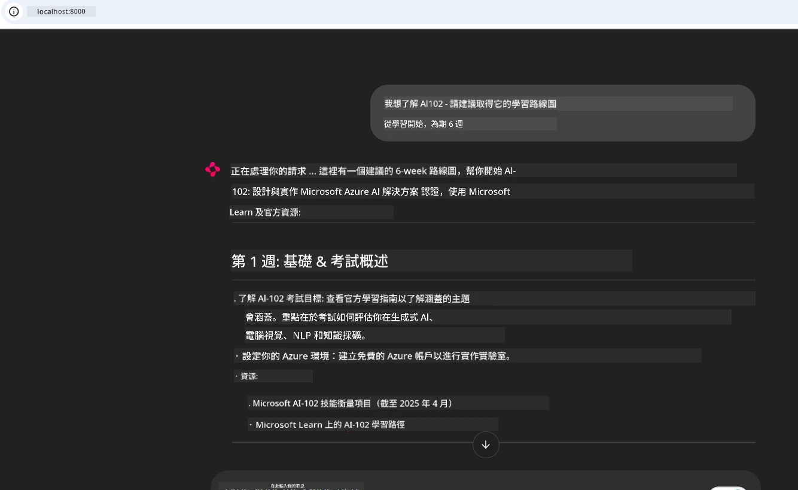
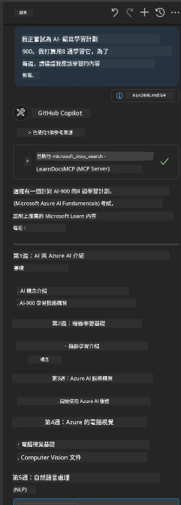

# 案例研究：從客戶端連接到 Microsoft Learn Docs MCP 伺服器

你是否曾經在文檔網站、Stack Overflow 和無數搜尋引擎分頁之間忙碌，試圖解決程式碼中的問題？也許你有第二個螢幕專門擺放文件，或者不停地在 IDE 和瀏覽器之間切換。會不會更好，如果你可以將文件直接帶入你的工作流程——整合到你的應用程式、IDE，甚至你自己的客製化工具中？在本案例研究中，我們將探討如何從你自己的客戶端應用程式直接連接到 Microsoft Learn Docs MCP 伺服器，達成這一目標。

## 概述

現代開發不僅僅是編寫程式碼——更是關於在正確的時間找到正確的資訊。文件隨處可見，但它卻很少出現在你最需要的地方：你的工具和工作流程內。通過將文件檢索直接整合到你的應用程式中，你可以節省時間、減少情境切換，提高生產力。本節將展示如何將客戶端連接到 Microsoft Learn Docs MCP 伺服器，讓你可以即時存取具上下文感知的文件，無需離開你的應用。

我們將一步步示範如何建立連線、發送請求，以及高效處理串流回應。這種方法不僅簡化你的工作流程，也為構建更智慧、更有用的開發者工具打開大門。

## 學習目標

我們為何要這麼做？因為最佳的開發者體驗是能消除摩擦的體驗。想像一下這樣的世界：你的程式碼編輯器、聊天機器人或網頁應用可以即時回答文件問題，並使用 Microsoft Learn 的最新內容。讀完本章後，你將會：

- 了解文件用 MCP 伺服器和客戶端通訊的基礎
- 實作一個命令列或網頁應用，連接到 Microsoft Learn Docs MCP 伺服器
- 使用串流 HTTP 客戶端即時取得文件
- 在應用程式中記錄並解析文件回應

你將看到這些技能如何幫助你建置不僅是被動反應，而是真正互動且具上下文感知的工具。

## 情境 1 - 使用 MCP 即時取得文件

本情境示範如何將客戶端連接 Microsoft Learn Docs MCP 伺服器，讓你能在不離開應用的情況下即時取得具上下文感知的文件。

讓我們實作看看。你的任務是撰寫一個應用，連接 Microsoft Learn Docs MCP 伺服器、呼叫 `microsoft_docs_search` 工具，並將串流回應記錄到命令列。

### 為何選擇這種方式？
因為它是構建更進階整合的基礎——無論你想驅動聊天機器人、IDE 擴充功能，或是網頁儀表板。

你可以在本案例研究的 [`solution`](./solution/README.md) 資料夾中找到此情境的程式碼與詳細指示。步驟包含：
- 使用官方 MCP SDK 及可串流 HTTP 客戶端建立連線
- 呼叫 `microsoft_docs_search` 工具，並以查詢參數取得文件
- 實作適當的記錄與錯誤處理
- 建立互動式命令列介面，讓使用者可輸入多個查詢

此情境展示如何：
- 連接至 Docs MCP 伺服器
- 發送查詢
- 解析與輸出結果

執行解決方案可能長這樣：

```
Prompt> What is Azure Key Vault?
Answer> Azure Key Vault is a cloud service for securely storing and accessing secrets. ...
```

以下為簡化範例。完整程式碼與說明可參考 solution 資料夾。

<details>
<summary>Python</summary>

```python
import asyncio
from mcp.client.streamable_http import streamablehttp_client
from mcp import ClientSession

async def main():
    async with streamablehttp_client("https://learn.microsoft.com/api/mcp") as (read_stream, write_stream, _):
        async with ClientSession(read_stream, write_stream) as session:
            await session.initialize()
            result = await session.call_tool("microsoft_docs_search", {"query": "Azure Functions best practices"})
            print(result.content)

if __name__ == "__main__":
    asyncio.run(main())
```

- 完整實作與日誌紀錄請參閱 [`scenario1.py`](../../../../09-CaseStudy/docs-mcp/solution/python/scenario1.py)。
- 安裝與使用說明見同一資料夾下的 [`README.md`](./solution/python/README.md)。
</details>


## 情境 2 - 使用 MCP 創建互動式學習計畫生成網頁應用

本情境將示範如何將 Docs MCP 整合進網頁開發專案。目標是讓使用者直接從網頁介面搜尋 Microsoft Learn 文件，令文件資源在你的應用或網站中即時可用。

你將學會如何：
- 建置網頁應用
- 連接 Docs MCP 伺服器
- 處理使用者輸入並展示結果

以下是解決方案執行示意：

```
User> I want to learn about AI102 - so suggest the roadmap to get it started from learn for 6 weeks

Assistant> Here’s a detailed 6-week roadmap to start your preparation for the AI-102: Designing and Implementing a Microsoft Azure AI Solution certification, using official Microsoft resources and focusing on exam skills areas:

---
## Week 1: Introduction & Fundamentals
- **Understand the Exam**: Review the [AI-102 exam skills outline](https://learn.microsoft.com/en-us/credentials/certifications/exams/ai-102/).
- **Set up Azure**: Sign up for a free Azure account if you don't have one.
- **Learning Path**: [Introduction to Azure AI services](https://learn.microsoft.com/en-us/training/modules/intro-to-azure-ai/)
- **Focus**: Get familiar with Azure portal, AI capabilities, and necessary tools.

....more weeks of the roadmap...

Let me know if you want module-specific recommendations or need more customized weekly tasks!
```

以下為簡化範例。完整程式碼與說明可參考 solution 資料夾。



<details>
<summary>Python (Chainlit)</summary>

Chainlit 是打造對話式 AI 網頁應用的框架，方便創建可呼叫 MCP 工具並即時展示結果的互動聊天機器人和助手。非常適合快速原型開發與使用者友好介面。

```python
import chainlit as cl
import requests

MCP_URL = "https://learn.microsoft.com/api/mcp"

@cl.on_message
def handle_message(message):
    query = {"question": message}
    response = requests.post(MCP_URL, json=query)
    if response.ok:
        result = response.json()
        cl.Message(content=result.get("answer", "No answer found.")).send()
    else:
        cl.Message(content="Error: " + response.text).send()
```

- 完整實作請見 [`scenario2.py`](../../../../09-CaseStudy/docs-mcp/solution/python/scenario2.py)。
- 安裝與執行說明見 [`README.md`](./solution/python/README.md)。
</details>


## 情境 3：在 VS Code 編輯器中使用 MCP 伺服器查看文件

如果你想在 VS Code 內直接取得 Microsoft Learn Docs（而不是切換瀏覽器分頁），可以在編輯器中使用 MCP 伺服器。這讓你能夠：
- 在 VS Code 內搜尋和閱讀文件，無需離開編寫程式的環境
- 直接在 README 或教學檔案中引用文件與插入連結
- 將 GitHub Copilot 與 MCP 共同運用，打造順暢的 AI 驅動文件工作流程

**你將學到如何：**
- 在工作區根目錄加入有效的 `.vscode/mcp.json` 檔案（如下範例）
- 在 VS Code 中打開 MCP 面板或使用指令面板搜尋並插入文件
- 在編輯 markdown 檔案時直接引用文件
- 結合 GitHub Copilot 強化生產力

以下為 VS Code 中 MCP 伺服器設定範例：

```json
{
  "servers": {
    "LearnDocsMCP": {
      "url": "https://learn.microsoft.com/api/mcp"
    }
  }
}
```

</details>

> 詳細操作說明、截圖及逐步指南請參考 [`README.md`](./solution/scenario3/README.md)。



此方式非常適合編寫技術課程、撰寫文件或經常需要參考的程式開發者。

## 主要結論

將文件直接整合到你的工具中，不僅是便利，更是生產力的變革。透過從你的客戶端連接到 Microsoft Learn Docs MCP 伺服器，你可以：

- 消除程式碼與文件之間的情境切換
- 實時取得最新、具上下文感知的文件
- 建構更智慧、互動式的開發者工具

這些技能將助你打造不僅高效，且使用愉快的解決方案。

## 進階資源

欲深入了解，請參考以下官方資源：

- [Microsoft Learn Docs MCP Server (GitHub)](https://github.com/MicrosoftDocs/mcp)
- [開始使用 Azure MCP Server (mcp-python)](https://learn.microsoft.com/en-us/azure/developer/azure-mcp-server/get-started#create-the-python-app)
- [什麼是 Azure MCP Server？](https://learn.microsoft.com/en-us/azure/developer/azure-mcp-server/)
- [Model Context Protocol (MCP) 介紹](https://modelcontextprotocol.io/introduction)
- [從 MCP 伺服器新增插件 (Python)](https://learn.microsoft.com/en-us/semantic-kernel/concepts/plugins/adding-mcp-plugins)

## 下一步

- 回到：[Case Studies Overview](../README.md)
- 繼續前往：[Module 10: Streamlining AI Workflows with AI Toolkit](../../10-StreamliningAIWorkflowsBuildingAnMCPServerWithAIToolkit/README.md)

---

<!-- CO-OP TRANSLATOR DISCLAIMER START -->
**免責聲明**：
此文件乃使用 AI 翻譯服務 [Co-op Translator](https://github.com/Azure/co-op-translator) 所翻譯。雖然我們力求準確，但請注意自動翻譯可能包含錯誤或不準確之處。原文件之原文版本應視為權威來源。對於重要資訊，建議採用專業人工翻譯。我們對因使用此翻譯所引起之任何誤解或錯誤詮釋不承擔任何責任。
<!-- CO-OP TRANSLATOR DISCLAIMER END -->