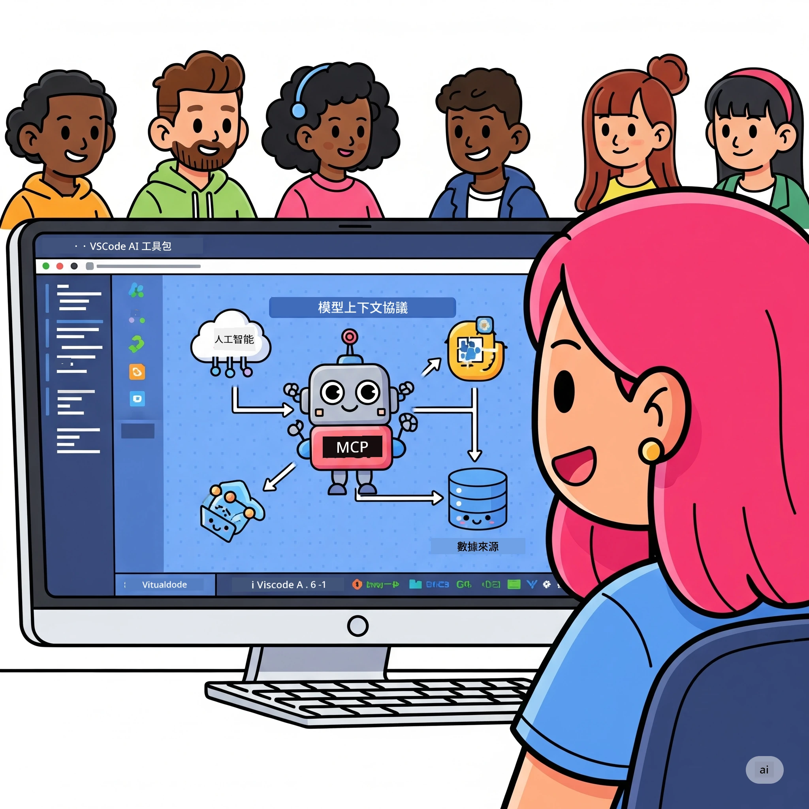
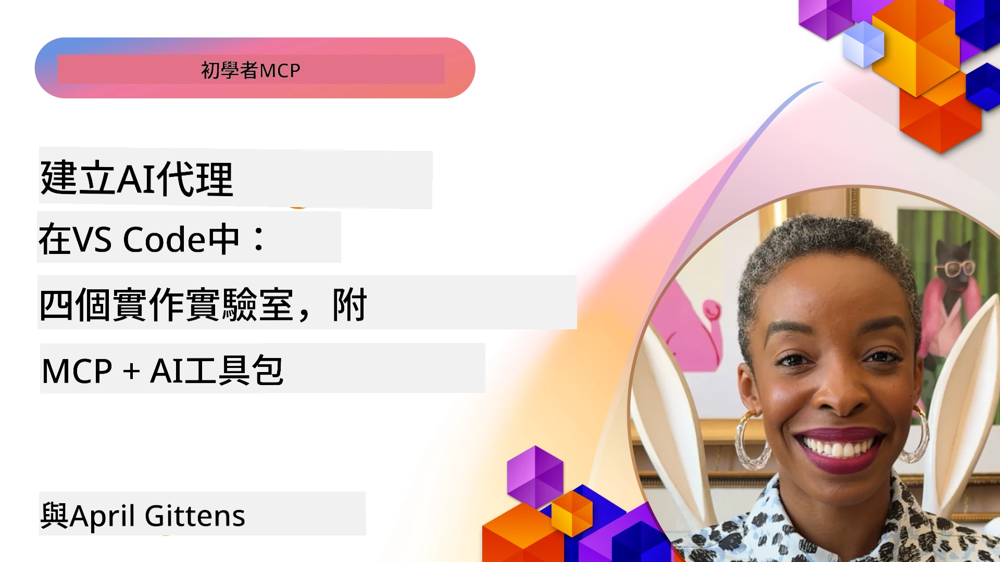

# 簡化 AI 工作流程：使用 AI Toolkit 建立 MCP 伺服器

## 🎯 概述

_(點擊上方圖片觀看本課程影片)_

歡迎來到 **Model Context Protocol (MCP) 工作坊**！這個深入的實作工作坊結合兩項尖端技術，顛覆 AI 應用程式開發：

- **🔗 Model Context Protocol (MCP)**：無縫 AI 工具整合的開放標準
- **🛠️ Visual Studio Code AI Toolkit (AITK)**：微軟強大的 AI 開發擴充套件

### 🎓 你將學會什麼

完成此工作坊後，你將精通構建智能應用程式，將 AI 模型與真實工具和服務橋接。從自動化測試到客製化 API 集成，你將掌握解決複雜商業挑戰的實用技能。

## 🏗️ 技術棧

### 🔌 Model Context Protocol (MCP)

MCP 是 AI 的 **「USB-C」** — 一個連接 AI 模型與外部工具及資料來源的通用標準。

**✨ 主要特點：**

- 🔄 **標準化整合**：AI 與工具連接的通用介面
- 🏛️ **彈性架構**：支援本地及遠端伺服器，透過 stdio/SSE 傳輸
- 🧰 **豐富生態系**：工具、提示與資源集中於一協議
- 🔒 **企業級準備**：內建安全性與可靠性

**🎯 MCP 的重要性：**
就像 USB-C 終結了纜線混亂，MCP 簡化了 AI 整合流程。一個協議，無限可能。

### 🤖 Visual Studio Code AI Toolkit (AITK)

微軟旗艦 AI 開發擴充套件，將 VS Code 轉化成 AI 開發重鎮。

**🚀 核心功能：**

- 📦 **模型目錄**：存取 Azure AI、GitHub、Hugging Face、Ollama 模型
- ⚡ **本地推論**：ONNX 優化的 CPU/GPU/NPU 執行
- 🏗️ **代理建構器**：具 MCP 整合的視覺化 AI 代理開發
- 🎭 **多模態支援**：文字、視覺與結構化輸出

**💡 開發優勢：**

- 零設定模型部署
- 視覺化提示工程
- 即時測試遊樂場
- 無縫 MCP 伺服器整合

## 📚 學習歷程

### [🚀 模組 1：AI Toolkit 基礎知識](./lab1/README.md)

**時長**：15 分鐘

- 🛠️ 安裝並設定 VS Code 的 AI Toolkit
- 🗂️ 探索模型目錄（100+ GitHub、ONNX、OpenAI、Anthropic、Google 模型）
- 🎮 掌握即時模型測試的互動遊樂場
- 🤖 使用代理建構器建立第一個 AI 代理
- 📊 使用內建指標（F1、相關度、相似度、一致性）評估模型效能
- ⚡ 學習批次處理及多模態能力

**🎯 學習成果**：建立功能完整的 AI 代理，全面理解 AITK 功能

### [🌐 模組 2：MCP 與 AI Toolkit 基礎](./lab2/README.md)

**時長**：20 分鐘

- 🧠 精通 Model Context Protocol (MCP) 架構與概念
- 🌐 探索微軟的 MCP 伺服器生態系
- 🤖 使用 Playwright MCP 伺服器構建瀏覽器自動化代理
- 🔧 將 MCP 伺服器整合至 AI Toolkit 代理建構器
- 📊 配置並測試代理中的 MCP 工具
- 🚀 匯出並部署具 MCP 功能的 AI 代理至生產環境

**🎯 學習成果**：部署結合外部工具的強大 AI 代理

### [🔧 模組 3：使用 AI Toolkit 進階 MCP 開發](./lab3/README.md)

**時長**：20 分鐘

- 💻 使用 AI Toolkit 建立自訂 MCP 伺服器
- 🐍 設定並使用最新 MCP Python SDK (v1.9.3)
- 🔍 設置並使用 MCP Inspector 進行除錯
- 🛠️ 建立具專業除錯流程的天氣 MCP 伺服器
- 🧪 在代理建構器及 Inspector 環境除錯 MCP 伺服器

**🎯 學習成果**：使用現代工具開發並除錯自訂 MCP 伺服器

### [🐙 模組 4：實務 MCP 開發 - 自訂 GitHub Clone 伺服器](./lab4/README.md)

**時長**：30 分鐘

- 🏗️ 建立真實的 GitHub Clone MCP 伺服器，支援開發工作流程
- 🔄 實作智能倉庫複製，包含驗證與錯誤處理
- 📁 創建智能目錄管理與 VS Code 整合
- 🤖 使用 GitHub Copilot 代理模式與自訂 MCP 工具搭配
- 🛡️ 應用生產級可靠性與跨平台相容性

**🎯 學習成果**：部署符合生產需求並優化真實開發流程的 MCP 伺服器

## 💡 真實應用與影響

### 🏢 企業使用案例

#### 🔄 DevOps 自動化

轉變你的開發工作流程，導入智能自動化：

- **智能倉庫管理**：AI 驅動的程式碼審查及合併決策
- **智慧 CI/CD**：基於程式碼變更的自動化流水線最佳化
- **議題優先分派**：自動缺陷分類與指派

#### 🧪 品質保證革新

提升測試流程，導入 AI 自動化：

- **智能測試產生**：自動生成全面測試套件
- **視覺回歸測試**：AI 支援的 UI 變化檢測
- **效能監控**：主動問題偵測與解決

#### 📊 資料管線智慧化

建立更聰明的資料處理工作流程：

- **自適應 ETL 流程**：自我優化資料轉換
- **異常檢測**：即時資料品質監控
- **智慧路由**：智能資料流管理

#### 🎧 客戶體驗提升

創造卓越的客戶互動：

- **情境感知支援**：具備存取客戶歷史的 AI 代理
- **主動問題解決**：預測式客服
- **多通道整合**：跨平台統一 AI 體驗

## 🛠️ 先決條件與環境設置

### 💻 系統需求

| 元件 | 要求 | 備註 |
|-----------|-------------|-------|
| **作業系統** | Windows 10+、macOS 10.15+、Linux | 任何現代作業系統 |
| **Visual Studio Code** | 最新穩定版 | AITK 必須 |
| **Node.js** | v18.0+ 和 npm | MCP 伺服器開發必備 |
| **Python** | 3.10+ | 用於 Python MCP 伺服器（選用） |
| **記憶體** | 最低 8GB RAM | 建議本地模型用 16GB |

### 🔧 開發環境

#### 推薦 VS Code 擴充套件

- **AI Toolkit** (ms-windows-ai-studio.windows-ai-studio)
- **Python** (ms-python.python)
- **Python 除錯器** (ms-python.debugpy)
- **GitHub Copilot** (GitHub.copilot) - 選用但推薦

#### 選用工具

- **uv**：現代 Python 套件管理工具
- **MCP Inspector**：MCP 伺服器視覺化除錯工具
- **Playwright**：網頁自動化範例工具

## 🎖️ 學習成果與認證路徑

### 🏆 技能掌握清單

完成此工作坊後，你將達到以下精通程度：

#### 🎯 核心技能

- [ ] **MCP 協議掌握**：深入理解架構及實作模式
- [ ] **AITK 運用**：專家級 AI Toolkit 快速開發能力
- [ ] **自訂伺服器開發**：建立、部署及維護生產級 MCP 伺服器
- [ ] **工具整合精湛**：將 AI 無縫接入現有開發工作流程
- [ ] **問題解決應用**：將所學應用於實際商業挑戰

#### 🔧 技術能力

- [ ] 設定及配置 VS Code 中的 AI Toolkit
- [ ] 設計並實作自訂 MCP 伺服器
- [ ] 將 GitHub 模型整合入 MCP 架構
- [ ] 利用 Playwright 建立自動化測試流程
- [ ] 部署生產用 AI 代理
- [ ] 除錯及優化 MCP 伺服器效能

#### 🚀 進階能力

- [ ] 架構企業級 AI 整合方案
- [ ] 實施 AI 應用安全最佳實務
- [ ] 設計可擴展 MCP 伺服器架構
- [ ] 為特定領域創建自訂工具鏈
- [ ] 指導他人進行 AI 原生開發

## 📖 額外資源

- [MCP 規範 (2025-11-25)](https://spec.modelcontextprotocol.io/specification/2025-11-25/)
- [AI Toolkit GitHub 倉庫](https://github.com/microsoft/vscode-ai-toolkit)
- [MCP 伺服器範例集合](https://github.com/modelcontextprotocol/servers)
- [最佳實務指南](https://modelcontextprotocol.io/docs/best-practices)
- [OWASP MCP 十大](https://microsoft.github.io/mcp-azure-security-guide/mcp/) - 安全最佳實務

---

**🚀 準備好徹底改變你的 AI 開發流程了嗎？**

讓我們一起透過 MCP 與 AI Toolkit，打造智能應用程式的未來！

## 接下來

繼續至：[模組 11：MCP 伺服器實作實驗](../11-MCPServerHandsOnLabs/README.md)

---

<!-- CO-OP TRANSLATOR DISCLAIMER START -->
**免責聲明**：  
本文件由 AI 翻譯服務 [Co-op Translator](https://github.com/Azure/co-op-translator) 進行翻譯。雖然我們致力於提供準確的翻譯，但請注意，自動翻譯可能包含錯誤或不準確之處。原文文件（以其母語撰寫）應視為權威來源。對於關鍵資訊，建議採用專業人工翻譯。我們不對因使用本翻譯而產生的任何誤解或誤釋承擔責任。
<!-- CO-OP TRANSLATOR DISCLAIMER END -->