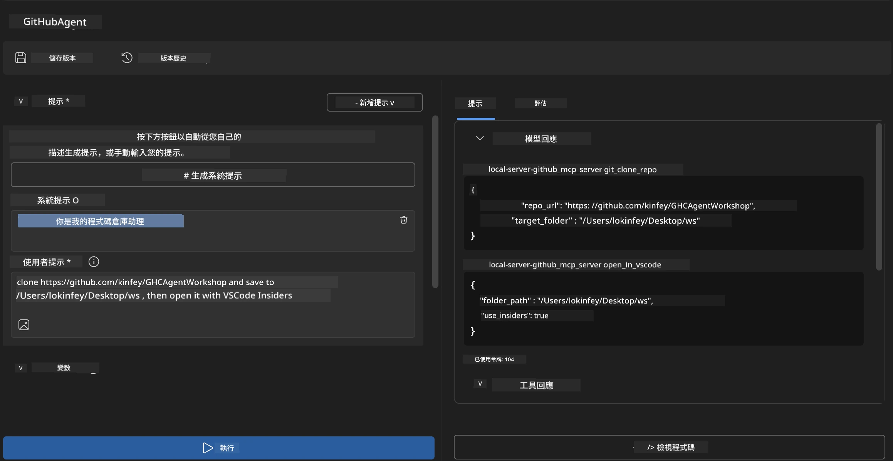
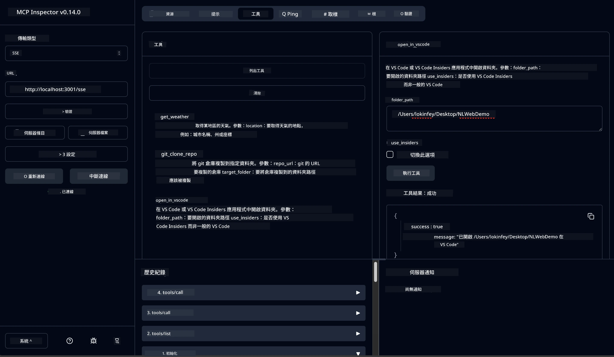

# 🐙 模組 4：實務 MCP 開發 - 自訂 GitHub 克隆伺服器


> **⚡ 快速開始：** 在短短 30 分鐘內打造一個生產等級的 MCP 伺服器，自動化 GitHub 倉庫克隆與 VS Code 集成！

## 🎯 學習目標

完成此實驗後，您將能夠：

- ✅ 建立適用於真實開發流程的自訂 MCP 伺服器
- ✅ 透過 MCP 實作 GitHub 倉庫克隆功能
- ✅ 將自訂 MCP 伺服器與 VS Code 和 Agent Builder 集成
- ✅ 使用 GitHub Copilot Agent Mode 搭配自訂 MCP 工具
- ✅ 在生產環境中測試與部署自訂 MCP 伺服器

## 📋 前置條件

- 完成實驗 1-3（MCP 基礎與進階開發）
- GitHub Copilot 訂閱（[可免費註冊](https://github.com/github-copilot/signup)）
- 安裝具備 AI Toolkit 與 GitHub Copilot 擴充功能的 VS Code
- 安裝並設定 Git CLI

## 🏗️ 專案概述

### **真實開發挑戰**
身為開發者，我們經常使用 GitHub 來克隆倉庫，並在 VS Code 或 VS Code Insiders 中開啟。此手動流程通常包含：
1. 開啟終端機/命令提示字元
2. 切換到目標目錄
3. 執行 `git clone` 指令
4. 在克隆的目錄中開啟 VS Code

**我們的 MCP 解決方案將這流程簡化成一條智慧指令！**

### **您將打造的東西**
一個 **GitHub 克隆 MCP 伺服器**（`git_mcp_server`），具備：

| 功能 | 說明 | 優點 |
|---------|-------------|---------|
| 🔄 **智慧倉庫克隆** | 帶驗證的 GitHub 倉庫克隆 | 自動錯誤檢查 |
| 📁 **智慧目錄管理** | 安全檢查與建立目錄 | 防止覆寫 |
| 🚀 **跨平台 VS Code 集成** | 在 VS Code/Insiders 開啟專案 | 流程無縫切換 |
| 🛡️ **強韌錯誤處理** | 處理網路、權限與路徑問題 | 生產等級可靠性 |

---

## 📖 逐步實作指南

### 第 1 步：於 Agent Builder 建立 GitHub Agent

1. **用 AI Toolkit 擴充功能啟動 Agent Builder**
2. **建立新代理**，並套用以下設定：
   ```
   Agent Name: GitHubAgent
   ```

3. **初始化自訂 MCP 伺服器：**
   - 前往 **工具** → **新增工具** → **MCP 伺服器**
   - 選擇 **「建立新的 MCP 伺服器」**
   - 選擇 **Python 範本** 以取得最大彈性
   - **伺服器名稱：** `git_mcp_server`

### 第 2 步：設定 GitHub Copilot Agent 模式

1. **在 VS Code 開啟 GitHub Copilot**（Ctrl/Cmd + Shift + P → 「GitHub Copilot: Open」）
2. **在 Copilot 介面選擇代理模型**
3. **選擇 Claude 3.7 模型**，加強推理能力
4. **啟用 MCP 集成** 以使用工具

> **💡 專業提示：** Claude 3.7 對開發工作流與錯誤處理模式有更優秀的理解。

### 第 3 步：實作 MCP 伺服器核心功能

**使用以下精確提示與 GitHub Copilot Agent 模式：**

```
Create two MCP tools with the following comprehensive requirements:

🔧 TOOL A: clone_repository
Requirements:
- Clone any GitHub repository to a specified local folder
- Return the absolute path of the successfully cloned project
- Implement comprehensive validation:
  ✓ Check if target directory already exists (return error if exists)
  ✓ Validate GitHub URL format (https://github.com/user/repo)
  ✓ Verify git command availability (prompt installation if missing)
  ✓ Handle network connectivity issues
  ✓ Provide clear error messages for all failure scenarios

🚀 TOOL B: open_in_vscode
Requirements:
- Open specified folder in VS Code or VS Code Insiders
- Cross-platform compatibility (Windows/Linux/macOS)
- Use direct application launch (not terminal commands)
- Auto-detect available VS Code installations
- Handle cases where VS Code is not installed
- Provide user-friendly error messages

Additional Requirements:
- Follow MCP 1.9.3 best practices
- Include proper type hints and documentation
- Implement logging for debugging purposes
- Add input validation for all parameters
- Include comprehensive error handling
```

### 第 4 步：測試您的 MCP 伺服器

#### 4a. 在 Agent Builder 中測試

1. **啟動 Agent Builder 的除錯設定**
2. **使用此系統提示配置您的代理：**

```
SYSTEM_PROMPT:
You are my intelligent coding repository assistant. You help developers efficiently clone GitHub repositories and set up their development environment. Always provide clear feedback about operations and handle errors gracefully.
```

3. **以真實使用場景測試：**

```
USER_PROMPT EXAMPLES:

Scenario : Basic Clone and Open
"Clone {Your GitHub Repo link such as https://github.com/kinfey/GHCAgentWorkshop
 } and save to {The global path you specify}, then open it with VS Code Insiders"
```



**預期結果：**
- ✅ 成功克隆並顯示路徑確認
- ✅ 自動啟動 VS Code
- ✅ 無效情況顯示清晰錯誤訊息
- ✅ 正確處理邊界案例

#### 4b. 在 MCP Inspector 中測試




---


**🎉 恭喜！** 您已成功建立一個實用並且生產可用的 MCP 伺服器，解決真實的開發工作流程問題。您的自訂 GitHub 克隆伺服器展示了 MCP 自動化及提升開發者生產力的強大威力。

### 🏆 成就解鎖：
- ✅ **MCP 開發者** - 創建自訂 MCP 伺服器
- ✅ **流程自動化者** - 簡化開發流程  
- ✅ **整合專家** - 連結多種開發工具
- ✅ **生產準備** - 建置可部署方案

---

## 🎓 工作坊完成：您與 Model Context Protocol 的旅程

**親愛的工作坊參與者，**

恭喜您完成 Model Context Protocol 工作坊的所有四個模組！您已從理解 AI Toolkit 基礎概念，成長到構建生產等級的 MCP 伺服器，有效解決真實開發挑戰。

### 🚀 您的學習路徑回顧：

**[模組 1](../lab1/README.md)：** 您開始探討 AI Toolkit 基礎、模型測試與建立您的第一個 AI 代理。

**[模組 2](../lab2/README.md)：** 您學習 MCP 架構、結合 Playwright MCP，並建置第一個瀏覽器自動化代理。

**[模組 3](../lab3/README.md)：** 您進階到自訂 MCP 伺服器開發，完成天氣 MCP 伺服器並精通除錯工具。

**[模組 4](../lab4/README.md)：** 您運用所學打造實務性的 GitHub 倉庫工作流程自動化工具。

### 🌟 您的專業技能：

- ✅ **AI Toolkit 生態系統**：模型、代理及整合模式
- ✅ **MCP 架構**：客戶端-服務器設計、通訊協定與安全
- ✅ **開發工具**：從 Playground、Inspector 到生產部署
- ✅ **自訂開發**：建立、測試及部署您的 MCP 伺服器
- ✅ **實務應用**：利用 AI 解決真實工作流程挑戰

### 🔮 您接下來的步驟：

1. **打造自己的 MCP 伺服器**：應用這些技能自動化您的獨特工作流程
2. **加入 MCP 社群**：分享您的作品並向他人學習
3. **探索進階整合**：將 MCP 伺服器連結企業系統
4. **貢獻開源專案**：協助改進 MCP 工具與文件

請記得，這個工作坊只是個開始。Model Context Protocol 生態系統持續快速演進，而您已經準備好站在 AI 驅動開發工具前沿。

**感謝您的參與與學習熱忱！**

我們希望本工作坊激發您的靈感，改變您在開發旅程中如何打造並與 AI 工具互動。

**祝程式設計愉快！**

---

## 下一步

恭喜您完成模組 10 的所有實驗！

- 返回：[模組 10 總覽](../README.md)
- 繼續：[模組 11：MCP 伺服器實作實驗](../../11-MCPServerHandsOnLabs/README.md)

---

<!-- CO-OP TRANSLATOR DISCLAIMER START -->
**免責聲明**：  
此文件使用 AI 翻譯服務 [Co-op Translator](https://github.com/Azure/co-op-translator) 進行翻譯。雖然我們致力於確保準確性，但請注意自動翻譯可能包含錯誤或不準確之處。原始文件的母語版本應被視為權威來源。對於重要資訊，建議採用專業人工翻譯。使用本翻譯所引致的任何誤解或誤譯，本公司概不負責。
<!-- CO-OP TRANSLATOR DISCLAIMER END -->