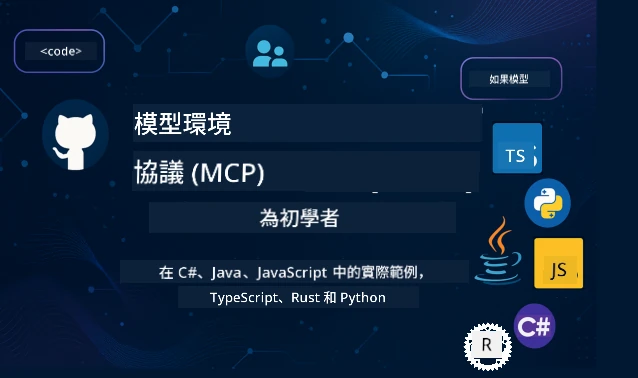

 

[](https://GitHub.com/microsoft/mcp-for-beginners/graphs/contributors)
[](https://GitHub.com/microsoft/mcp-for-beginners/issues)
[](https://GitHub.com/microsoft/mcp-for-beginners/pulls)
[](http://makeapullrequest.com)

[](https://GitHub.com/microsoft/mcp-for-beginners/watchers)
[](https://GitHub.com/microsoft/mcp-for-beginners/fork)
[](https://GitHub.com/microsoft/mcp-for-beginners/stargazers)


[](https://discord.gg/nTYy5BXMWG)

跟隨以下步驟開始使用這些資源：
1. **Fork 存儲庫**：點擊 [](https://GitHub.com/microsoft/mcp-for-beginners/fork)
2. **Clone 存儲庫**： `git clone https://github.com/microsoft/mcp-for-beginners.git`
3. **加入** [](https://discord.gg/nTYy5BXMWG)


### 🌐 多語言支援

#### 透過 GitHub Action 支援（自動化且永遠保持最新）

<!-- CO-OP TRANSLATOR LANGUAGES TABLE START -->
[Arabic](../ar/README.md) | [Bengali](../bn/README.md) | [Bulgarian](../bg/README.md) | [Burmese (Myanmar)](../my/README.md) | [Chinese (Simplified)](../zh-CN/README.md) | [Chinese (Traditional, Hong Kong)](./README.md) | [Chinese (Traditional, Macau)](../zh-MO/README.md) | [Chinese (Traditional, Taiwan)](../zh-TW/README.md) | [Croatian](../hr/README.md) | [Czech](../cs/README.md) | [Danish](../da/README.md) | [Dutch](../nl/README.md) | [Estonian](../et/README.md) | [Finnish](../fi/README.md) | [French](../fr/README.md) | [German](../de/README.md) | [Greek](../el/README.md) | [Hebrew](../he/README.md) | [Hindi](../hi/README.md) | [Hungarian](../hu/README.md) | [Indonesian](../id/README.md) | [Italian](../it/README.md) | [Japanese](../ja/README.md) | [Kannada](../kn/README.md) | [Korean](../ko/README.md) | [Lithuanian](../lt/README.md) | [Malay](../ms/README.md) | [Malayalam](../ml/README.md) | [Marathi](../mr/README.md) | [Nepali](../ne/README.md) | [Nigerian Pidgin](../pcm/README.md) | [Norwegian](../no/README.md) | [Persian (Farsi)](../fa/README.md) | [Polish](../pl/README.md) | [Portuguese (Brazil)](../pt-BR/README.md) | [Portuguese (Portugal)](../pt-PT/README.md) | [Punjabi (Gurmukhi)](../pa/README.md) | [Romanian](../ro/README.md) | [Russian](../ru/README.md) | [Serbian (Cyrillic)](../sr/README.md) | [Slovak](../sk/README.md) | [Slovenian](../sl/README.md) | [Spanish](../es/README.md) | [Swahili](../sw/README.md) | [Swedish](../sv/README.md) | [Tagalog (Filipino)](../tl/README.md) | [Tamil](../ta/README.md) | [Telugu](../te/README.md) | [Thai](../th/README.md) | [Turkish](../tr/README.md) | [Ukrainian](../uk/README.md) | [Urdu](../ur/README.md) | [Vietnamese](../vi/README.md)

> **偏好本機 Clone？**
>
> 此存儲庫包含 50 種以上語言翻譯，顯著增加下載大小。若要不含翻譯地 Clone，請使用稀疏檢出：
>
> **Bash / macOS / Linux:**
> ```bash
> git clone --filter=blob:none --sparse https://github.com/microsoft/mcp-for-beginners.git
> cd mcp-for-beginners
> git sparse-checkout set --no-cone '/*' '!translations' '!translated_images'
> ```
>
> **CMD (Windows):**
> ```cmd
> git clone --filter=blob:none --sparse https://github.com/microsoft/mcp-for-beginners.git
> cd mcp-for-beginners
> git sparse-checkout set --no-cone "/*" "!translations" "!translated_images"
> ```
>
> 這樣你就能快速下載完成課程所需的所有內容。
<!-- CO-OP TRANSLATOR LANGUAGES TABLE END -->

# 🚀 Model Context Protocol (MCP) 初學者課程

## **透過 C#、Java、JavaScript、Rust、Python 和 TypeScript 實作範例學習 MCP**

## 🧠 Model Context Protocol 課程總覽
歡迎開始你的 Model Context Protocol 之旅！若你曾好奇 AI 應用程式如何與不同工具及服務溝通，現在就將發現正在改變開發者建構智慧系統方式的優雅解決方案。

把 MCP 想像成 AI 應用的通用譯員 — 就像 USB 埠讓你將任何裝置接入電腦，MCP 讓 AI 模型能以標準化方式連接任何工具或服務。無論你是在打造你的第一個聊天機械人，還是在處理複雜 AI 工作流程，了解 MCP 將讓你能創造更強大、更靈活的應用程式。

本課程專為你的學習旅程設計，循序漸進、耐心細緻。我們會從你已理解的簡單概念開始，並透過你最喜愛的程式語言進行實作練習，逐步提升專業能力。每一步都附有清晰說明、實務範例以及大量鼓勵。

完成此旅程後，你將有信心建立自己的 MCP 伺服器，將其整合入熱門的 AI 平台，並了解此技術如何重塑 AI 開發的未來。讓我們一起展開這段激動人心的冒險吧！

### 官方文件與規範

此課程符合 **MCP Specification 2025-11-25**（最新穩定版本）。MCP 規範以日期版本控制（YYYY-MM-DD 格式）確保協議版本清晰可追蹤。

隨著你理解加深，這些資源將愈加珍貴，但請不必感到壓力要立即全部閱讀。先從你最感興趣的部分開始！
- 📘 [MCP 文件](https://modelcontextprotocol.io/) – 這是你學習各步驟範例與使用指南的首選資源。文件以初學者為對象，提供清晰範例讓你能按自己的步調學習。
- 📜 [MCP 規範](https://modelcontextprotocol.io/specification/2025-11-25) – 可視為你的全方位參考手冊。課程進行中，你會常回來查閱細節與探索進階功能。
- 📜 [MCP 規範版本控制](https://modelcontextprotocol.io/specification/versioning) – 介紹協議版本歷史及 MCP 如何運用日期版本控制。
- 🧑‍💻 [MCP GitHub 存儲庫](https://github.com/modelcontextprotocol) – 這裡有多種程式語言的 SDK、工具及代碼範例，是實務範例與現成功能組件的寶庫。
- 🌐 [MCP 社群](https://github.com/orgs/modelcontextprotocol/discussions) – 加入學習者與資深開發者討論 MCP 的大家庭，這是個提問受歡迎、知識共享的友善社群。
  
## 學習目標

完成本課程後，你將充滿信心與熱情，取得以下成就：

• **理解 MCP 基礎**：你會掌握 Model Context Protocol 是何物，及其如何改變 AI 應用程式互動運作的理念，並透過類比與例子理解。

• **打造你的第一個 MCP 伺服器**：你將用偏好的程式語言建立一個能運作的 MCP 伺服器，從簡單例子開始，逐步提升技術。

• **連接 AI 模型與真實工具**：你會學會如何橋接 AI 模型與實際服務，為你的應用帶來強大新功能。

• **執行安全最佳實務**：你將理解如何確保 MCP 實作安全，保護你的應用及使用者。

• **自信部署專案**：你會知道如何把 MCP 專案從開發推向生產環境，並採用實用部署策略。

• **加入 MCP 社群**：你將成為一群塑造 AI 應用開發未來的開發者大家庭一員。

## 基礎背景

在深入 MCP 之前，我們先確保你對一些基礎概念感到自在。如果你不是這些領域的專家也不用擔心 — 我們會逐步解釋你所需知道的一切！

### 理解協議（基礎）

把協議想成對話規則。當你打電話給朋友時，雙方知道要說「你好」、輪流說話，結束時說「再見」。電腦程式也需要類似規則才能有效溝通。

MCP 是一種協議 — 一組大家同意遵守的規則，幫助 AI 模型和應用與工具及服務進行順暢「對話」。就像有對話規則讓人類溝通更順暢，MCP 讓 AI 應用程式溝通更可靠、更強大。

### 客戶端-伺服器關係（程式如何配合）

你每天都在使用客戶端-伺服器關係！當你用瀏覽器（客戶端）瀏覽網站時，就是與網頁伺服器連接取回頁面。瀏覽器知道如何提出請求，伺服器知道如何回應。

在 MCP 中，我們有類似的關係：AI 模型作為客戶端請求資訊或操作，MCP 伺服器提供這些功能。就像 AI 有個幫手（伺服器）能協助執行指定任務。

### 為何標準化重要（讓東西能一起運作）

想像每個車廠用的加油槍外型都不同 — 你就得準備各種轉接器！標準化代表同意使用共通方法，保證大家能順利配合。

MCP 就為 AI 應用提供這標準化。不是每個 AI 模型都要寫特製程式配合每種工具，MCP 則提供通用通訊方式。開發者只要打造一次工具，就能讓許多 AI 系統共用。

## 🧭 你的學習路徑總覽

你的 MCP 之旅經過細心安排，會逐步建立你的信心與技能。每階段都會介紹新概念，同時鞏固你已學過的內容。

### 🌱 基礎階段：理解基本（模組 0-2）

冒險由此開始！我們將用熟悉的類比與簡單範例介紹 MCP 概念。你會明白 MCP 是什麼、為何存在，以及它如何融入更廣闊的 AI 開發世界。

• **模組 0 - MCP 介紹**：從理解 MCP 是什麼開始，探討它對現代 AI 應用的重要性。你會看到 MCP 的真實案例，並了解它如何解決開發者常面對的問題。

• **模組 1 - 核心概念說明**：學習 MCP 的基本組成元素。我們會用大量類比與視覺範例，幫助你自然且清楚掌握這些概念。

• **模組 2 - MCP 的安全性**：安全性聽起來嚇人，但我們會展示 MCP 內建的安全功能，並教你最佳實務，從一開始就保護你的應用程式。

### 🔨 建構階段：建立你的第一個實作（模組 3）

現在真正的樂趣開始了！你將動手建立真正的 MCP 伺服器和客戶端。別擔心 — 我們會從簡單開始，引導你完成每一步。
此模組包含多個動手指南，讓你使用偏好的程式語言進行練習。你將建立你的第一個伺服器、構建連接它的客戶端，甚至整合流行的開發工具，如 VS Code。

每個指南均包含完整的程式碼範例、故障排除提示，以及我們為何採用特定設計選擇的解釋。完成此階段後，你將擁有可自豪的 MCP 實作！

### 🚀 成長階段：進階概念與實務應用（模組 4-5）

掌握基礎後，你已準備好探索更複雜的 MCP 功能。我們將涵蓋實務實作策略、除錯技巧，以及多模式 AI 整合等進階主題。

你還將學習如何將 MCP 實作擴展到生產環境，並整合如 Azure 等雲端平台。這些模組將助你打造能應付現實需求的 MCP 解決方案。

### 🌟 精通階段：社群與專精（模組 6-11）

最後階段專注於加入 MCP 社群，以及專攻你最感興趣的領域。你將學習如何貢獻開源 MCP 專案、實作進階認證模式，以及打造全面整合資料庫的解決方案。

模組 11 尤為值得一提——它是一套完整的 13 個實作實驗室學習路徑，教你如何建立具備 PostgreSQL 整合的生產準備 MCP 伺服器。這猶如一個總結專案，將你所學悉數融合！

### 📚 完整課程結構

| Module | Topic | Description | Link |
|--------|-------|-------------|------|
| **Module 0-3: Fundamentals** | | | |
| 00 | Introduction to MCP | Model Context Protocol 及其在 AI 流程中的重要性概述 | [Read more](./00-Introduction/README.md) |
| 01 | Core Concepts Explained | MCP 核心概念深入探索 | [Read more](./01-CoreConcepts/README.md) |
| 02 | Security in MCP | 安全威脅與最佳實踐 | [Read more](./02-Security/README.md) |
| 03 | Getting Started with MCP | 環境設置、基礎伺服器/客戶端、整合 | [Read more](./03-GettingStarted/README.md) |
| **Module 3: Building Your First Server & Client** | | | |
| 3.1 | First Server | 建立你的第一個 MCP 伺服器 | [Guide](./03-GettingStarted/01-first-server/README.md) |
| 3.2 | First Client | 開發基本的 MCP 客戶端 | [Guide](./03-GettingStarted/02-client/README.md) |
| 3.3 | Client with LLM | 整合大型語言模型 | [Guide](./03-GettingStarted/03-llm-client/README.md) |
| 3.4 | VS Code Integration | 在 VS Code 中使用 MCP 伺服器 | [Guide](./03-GettingStarted/04-vscode/README.md) |
| 3.5 | stdio Server | 使用 stdio 傳輸建立伺服器 | [Guide](./03-GettingStarted/05-stdio-server/README.md) |
| 3.6 | HTTP Streaming | MCP 中實作 HTTP 串流 | [Guide](./03-GettingStarted/06-http-streaming/README.md) |
| 3.7 | AI Toolkit | 使用 AI Toolkit 配合 MCP | [Guide](./03-GettingStarted/07-aitk/README.md) |
| 3.8 | Testing | 測試你的 MCP 伺服器實作 | [Guide](./03-GettingStarted/08-testing/README.md) |
| 3.9 | Deployment | 部署 MCP 伺服器到生產環境 | [Guide](./03-GettingStarted/09-deployment/README.md) |
| 3.10 | Advanced server usage | 使用進階伺服器以啟用進階功能及優化架構 | [Guide](./03-GettingStarted/10-advanced/README.md) |
| 3.11 | Simple auth | 自始至終演示認證與 RBAC | [Guide](./03-GettingStarted/11-simple-auth/README.md) |
| 3.12 | MCP Hosts | 配置 Claude Desktop、Cursor、Cline 及其他 MCP 主機 | [Guide](./03-GettingStarted/12-mcp-hosts/README.md) |
| 3.13 | MCP Inspector | 使用 Inspector 工具除錯及測試 MCP 伺服器 | [Guide](./03-GettingStarted/13-mcp-inspector/README.md) |
| **Module 4-5: Practical & Advanced** | | | |
| 04 | Practical Implementation | SDK、除錯、測試、可重用提示模板 | [Read more](./04-PracticalImplementation/README.md) |
| 4.1 | Pagination | 使用游標分頁處理大量結果 | [Guide](./04-PracticalImplementation/pagination/README.md) |
| 05 | Advanced Topics in MCP | 多模式 AI、擴展、企業應用 | [Read more](./05-AdvancedTopics/README.md) |
| 5.1 | Azure Integration | 與 Azure 的 MCP 整合 | [Guide](./05-AdvancedTopics/mcp-integration/README.md) |
| 5.2 | Multi-modality | 多模態協作 | [Guide](./05-AdvancedTopics/mcp-multi-modality/README.md) |
| 5.3 | OAuth2 Demo | 實作 OAuth2 認證 | [Guide](./05-AdvancedTopics/mcp-oauth2-demo/README.md) |
| 5.4 | Root Contexts | 了解及實作根上下文 | [Guide](./05-AdvancedTopics/mcp-root-contexts/README.md) |
| 5.5 | Routing | MCP 路由策略 | [Guide](./05-AdvancedTopics/mcp-routing/README.md) |
| 5.6 | Sampling | MCP 採樣技巧 | [Guide](./05-AdvancedTopics/mcp-sampling/README.md) |
| 5.7 | Scaling | MCP 實作擴展 | [Guide](./05-AdvancedTopics/mcp-scaling/README.md) |
| 5.8 | Security | 進階安全考量 | [Guide](./05-AdvancedTopics/mcp-security/README.md) |
| 5.9 | Web Search | 實作網頁搜尋功能 | [Guide](./05-AdvancedTopics/web-search-mcp/README.md) |
| 5.10 | Realtime Streaming | 建立即時串流功能 | [Guide](./05-AdvancedTopics/mcp-realtimestreaming/README.md) |
| 5.11 | Realtime Search | 實作即時搜尋 | [Guide](./05-AdvancedTopics/mcp-realtimesearch/README.md) |
| 5.12 | Entra ID Auth | 使用 Microsoft Entra ID 認證 | [Guide](./05-AdvancedTopics/mcp-security-entra/README.md) |
| 5.13 | Foundry Integration | 與 Azure AI Foundry 整合 | [Guide](./05-AdvancedTopics/mcp-foundry-agent-integration/README.md) |
| 5.14 | Context Engineering | 有效上下文工程技巧 | [Guide](./05-AdvancedTopics/mcp-contextengineering/README.md) |
| 5.15 | MCP Custom Transport | 自訂傳輸實作 | [Guide](./05-AdvancedTopics/mcp-transport/README.md) |
| 5.16 | Protocol Features | 進度通知、取消、資源模板 | [Guide](./05-AdvancedTopics/mcp-protocol-features/README.md) |
| **Module 6-10: Community & Best Practices** | | | |
| 06 | Community Contributions | 如何貢獻 MCP 生態系 | [Guide](./06-CommunityContributions/README.md) |
| 07 | Insights from Early Adoption | 實務實作案例分享 | [Guide](./07-LessonsfromEarlyAdoption/README.md) |
| 08 | Best Practices for MCP | 性能、容錯、韌性最佳實踐 | [Guide](./08-BestPractices/README.md) |
| 09 | MCP Case Studies | 實務實作範例 | [Guide](./09-CaseStudy/README.md) |
| 10 | Hands-on Workshop | 使用 AI Toolkit 建立 MCP 伺服器 | [Lab](./10-StreamliningAIWorkflowsBuildingAnMCPServerWithAIToolkit/README.md) |
| **Module 11: MCP Server Hands On Lab** | | | |
| 11 | MCP Server Database Integration | 13 個實驗室課程的完整 PostgreSQL 整合學習路徑 | [Labs](./11-MCPServerHandsOnLabs/README.md) |
| 11.1 | Introduction | MCP 與資料庫整合及零售分析案例概述 | [Lab 00](./11-MCPServerHandsOnLabs/00-Introduction/README.md) |
| 11.2 | Core Architecture | 了解 MCP 伺服器架構、資料庫層與安全模式 | [Lab 01](./11-MCPServerHandsOnLabs/01-Architecture/README.md) |
| 11.3 | Security & Multi-Tenancy | 行級安全、認證與多租戶資料存取 | [Lab 02](./11-MCPServerHandsOnLabs/02-Security/README.md) |
| 11.4 | Environment Setup | 設置開發環境、Docker、Azure 資源 | [Lab 03](./11-MCPServerHandsOnLabs/03-Setup/README.md) |
| 11.5 | Database Design | PostgreSQL 設定、零售資料庫架構設計及樣本資料 | [Lab 04](./11-MCPServerHandsOnLabs/04-Database/README.md) |
| 11.6 | MCP Server Implementation | 建立具資料庫整合的 FastMCP 伺服器 | [Lab 05](./11-MCPServerHandsOnLabs/05-MCP-Server/README.md) |
| 11.7 | Tool Development | 製作資料庫查詢工具及架構檢視 | [Lab 06](./11-MCPServerHandsOnLabs/06-Tools/README.md) |
| 11.8 | Semantic Search | 使用 Azure OpenAI 及 pgvector 實作向量嵌入 | [Lab 07](./11-MCPServerHandsOnLabs/07-Semantic-Search/README.md) |
| 11.9 | Testing & Debugging | 測試策略、除錯工具及驗證方法 | [Lab 08](./11-MCPServerHandsOnLabs/08-Testing/README.md) |
| 11.10 | VS Code Integration | 配置 VS Code MCP 整合與 AI 聊天功能 | [Lab 09](./11-MCPServerHandsOnLabs/09-VS-Code/README.md) |
| 11.11 | Deployment Strategies | Docker 部署、Azure Container Apps 及擴展考量 | [Lab 10](./11-MCPServerHandsOnLabs/10-Deployment/README.md) |
| 11.12 | Monitoring | Application Insights、日誌、性能監控 | [Lab 11](./11-MCPServerHandsOnLabs/11-Monitoring/README.md) |
| 11.13 | Best Practices | 性能優化、安全強化及生產建議 | [Lab 12](./11-MCPServerHandsOnLabs/12-Best-Practices/README.md) |

### 💻 範例程式專案

學習 MCP 最令人興奮的部分之一是看到你的程式碼技巧逐步提升。我們設計的程式碼範例會從簡單開始，隨著你理解的加深而變得更加複雜。以下是我們介紹概念的方式——用容易理解但展現真實 MCP 原則的程式碼，你會明白不僅程式碼做什麼，也了解為何這樣結構，以及它如何融入更大的 MCP 應用。

#### 基礎 MCP 計算器範例

| Language | Description | Link |
|----------|-------------|------|
| C# | MCP 伺服器範例 | [View Code](./03-GettingStarted/samples/csharp/README.md) |
| Java | MCP 計算器 | [View Code](./03-GettingStarted/samples/java/calculator/README.md) |
| JavaScript | MCP 示範 | [View Code](./03-GettingStarted/samples/javascript/README.md) |
| Python | MCP 伺服器 | [View Code](../../03-GettingStarted/samples/python/mcp_calculator_server.py) |
| TypeScript | MCP 範例 | [View Code](./03-GettingStarted/samples/typescript/README.md) |
| Rust | MCP 範例 | [View Code](./03-GettingStarted/samples/rust/README.md) |

#### 進階 MCP 實作

| Language | Description | Link |
|----------|-------------|------|
| C# | 進階範例 | [View Code](./04-PracticalImplementation/samples/csharp/README.md) |
| Java with Spring | Container App 範例 | [View Code](./04-PracticalImplementation/samples/java/containerapp/README.md) |
| JavaScript | 進階範例 | [View Code](./04-PracticalImplementation/samples/javascript/README.md) |
| Python | 複雜實作 | [View Code](./04-PracticalImplementation/samples/python/README.md) |
| TypeScript | Container 範例 | [View Code](./04-PracticalImplementation/samples/typescript/README.md) |


## 🎯 MCP 學習先決條件

要充分利用本課程，你應該具備：

- 至少熟悉以下語言之一的基礎程式設計知識：C#、Java、JavaScript、Python 或 TypeScript
- 瞭解客戶端-伺服器模型與 API
- 熟悉 REST 與 HTTP 概念
- （可選）具備 AI／機器學習概念背景

- 加入我們的社群討論以獲得支援

## 📚 學習指南與資源

本存放庫包含多種資源，協助你有效瀏覽與學習：

### 學習指南
一本全面的[學習指南](./study_guide.md) 可幫助你有效地掌握此儲存庫。這張視覺課程地圖展示了所有主題之間的連結，並提供如何有效使用範例專案的指導。若你是喜歡從整體視覺來學習的學習者，這尤其有幫助。

指南包括：
- 展示所有涵蓋主題的視覺課程地圖
- 每個儲存庫區段的詳細拆解
- 如何使用範例專案的指導
- 適合不同技能層級的建議學習路徑
- 補充你學習旅程的額外資源

### 更新日誌

我們維護一份詳細的[更新日誌](./changelog.md)，追蹤課程資料的所有重大更新，讓你能掌握最新的改進和新增內容。
- 新增內容
- 結構性變更
- 功能改進
- 文件更新

## 🛠️ 如何有效使用此課程

本指南的每堂課包含：

1. 清楚解釋 MCP 概念  
2. 多語言的即時程式碼範例  
3. 練習以構建真正的 MCP 應用  
4. 進階學習者的額外資源

### 一起用 C# 學 MCP - 教學系列
讓我們一起學習模型上下文協定（Model Context Protocol, MCP），這是一個旨在標準化 AI 模型與客戶端應用程式之間互動的先進框架。透過這個適合初學者的課程，我們會介紹 MCP，並引導你創建你的第一個 MCP 伺服器。
#### C#: [https://aka.ms/letslearnmcp-csharp](https://aka.ms/letslearnmcp-csharp)
#### Java: [https://aka.ms/letslearnmcp-java](https://aka.ms/letslearnmcp-java)
#### JavaScript: [https://aka.ms/letslearnmcp-javascript](https://aka.ms/letslearnmcp-javascript)
#### Python: [https://aka.ms/letslearnmcp-python](https://aka.ms/letslearnmcp-python)

## 🎓 你 MCP 旅程的開始

恭喜你！你剛踏出一段令人振奮的旅程第一步，這將擴展你的程式設計能力，並讓你接軌 AI 開發的前沿。

### 你已經完成了什麼

透過閱讀這個介紹，你已經開始建立 MCP 知識基礎。你理解 MCP 是什麼、為何重要，以及本課程如何支持你的學習旅程。這是個重要的成就，也是你在這項重要技術上成為專家的開始。

### 未來的冒險

隨著你逐步學習，每位專家都曾是初學者。現在看來可能複雜的概念，經由不斷練習與應用會變得駕輕就熟。每一個小步驟都朝著強大能力邁進，這些能力將在你的開發生涯中持續發揮作用。

### 你的支持網絡

你正在加入一個熱衷於 MCP 且樂於助人的學習者與專家社群。無論你是在解決程式挑戰遇到瓶頸，或是想分享突破，社群都會支持你的旅程。

如果你卡關或對建構 AI 應用有任何問題，歡迎加入與其他學習者和經驗豐富開發者的 MCP 討論社群。這是個支持性的社區，問題受到歡迎，知識自由分享。

[](https://discord.gg/nTYy5BXMWG)

如果你有產品回饋或建構時發生錯誤，請造訪：

[](https://aka.ms/foundry/forum)

### 準備好開始了嗎？

你的 MCP 冒險現在開始！從 Module 0 開始深入你的第一個 MCP 實作經驗，或嘗試範例專案看看你將會構建什麼。記住——每位專家剛開始都與你現在一樣，憑著耐心與練習，你會對自己能成就的事情感到驚喜。

歡迎來到模型上下文協定開發的世界。讓我們一起構建出令人驚嘆的東西！

## 🤝 為學習社群作出貢獻

此課程因像你這樣的學習者貢獻而日益強大！無論你是修正文法錯誤、建議更清楚的說明，或新增範例，你的貢獻都會幫助其他初學者成功。

感謝 Microsoft Valued Professional [Shivam Goyal](https://www.linkedin.com/in/shivam2003/) 提供程式碼範例貢獻。

貢獻流程設計得很友善支持。大多數貢獻需要簽署貢獻者許可協議 (CLA)，但自動化工具會順利引導你完成流程。

## 📜 開放原始碼學習

整套課程皆在 MIT [LICENSE](../../LICENSE) 授權下提供，代表你可以自由使用、修改及分享。此舉支持我們讓 MCP 知識普及給全球開發者的使命。

## 🤝 貢獻指南

本專案歡迎貢獻與建議。大多數貢獻要求您同意一份聲明，確認您有權利且確實授權我們使用您的貢獻，稱為貢獻者許可協議 (CLA)。詳細資訊請訪問 <https://cla.opensource.microsoft.com>。

當你提交拉取請求時，CLA 機器人會自動判斷你是否需要提供 CLA，並相應標記 PR（如狀態檢查、評論）。只需跟隨機器人指示操作即可。此流程在所有使用我們 CLA 的儲存庫中只需執行一次。

本專案已採用 [Microsoft 開放原始碼行為守則](https://opensource.microsoft.com/codeofconduct/)。欲知更多信息，請參閱 [行為守則常見問題](https://opensource.microsoft.com/codeofconduct/faq/) 或透過 [opencode@microsoft.com](mailto:opencode@microsoft.com) 與我們聯絡。

---

*準備開始你的 MCP 旅程了嗎？從[Module 00 - MCP 介紹](./00-Introduction/README.md)開始，踏出 Model Context Protocol 開發世界的第一步！*


## 🎒 其他課程
我們團隊還製作其他課程！請參考：

<!-- CO-OP TRANSLATOR OTHER COURSES START -->
### LangChain
[](https://aka.ms/langchain4j-for-beginners)
[](https://aka.ms/langchainjs-for-beginners?WT.mc_id=m365-94501-dwahlin)
[](https://github.com/microsoft/langchain-for-beginners?WT.mc_id=m365-94501-dwahlin)
---

### Azure / Edge / MCP / Agents
[](https://github.com/microsoft/AZD-for-beginners?WT.mc_id=academic-105485-koreyst)
[](https://github.com/microsoft/edgeai-for-beginners?WT.mc_id=academic-105485-koreyst)
[](https://github.com/microsoft/mcp-for-beginners?WT.mc_id=academic-105485-koreyst)
[](https://github.com/microsoft/ai-agents-for-beginners?WT.mc_id=academic-105485-koreyst)

---
 
### 生成式 AI 系列
[](https://github.com/microsoft/generative-ai-for-beginners?WT.mc_id=academic-105485-koreyst)
[-9333EA?style=for-the-badge&labelColor=E5E7EB&color=9333EA)](https://github.com/microsoft/Generative-AI-for-beginners-dotnet?WT.mc_id=academic-105485-koreyst)
[-C084FC?style=for-the-badge&labelColor=E5E7EB&color=C084FC)](https://github.com/microsoft/generative-ai-for-beginners-java?WT.mc_id=academic-105485-koreyst)
[-E879F9?style=for-the-badge&labelColor=E5E7EB&color=E879F9)](https://github.com/microsoft/generative-ai-with-javascript?WT.mc_id=academic-105485-koreyst)

---
 
### 核心學習
[](https://aka.ms/ml-beginners?WT.mc_id=academic-105485-koreyst)
[](https://aka.ms/datascience-beginners?WT.mc_id=academic-105485-koreyst)
[](https://aka.ms/ai-beginners?WT.mc_id=academic-105485-koreyst)
[](https://github.com/microsoft/Security-101?WT.mc_id=academic-96948-sayoung)
[](https://aka.ms/webdev-beginners?WT.mc_id=academic-105485-koreyst)
[](https://aka.ms/iot-beginners?WT.mc_id=academic-105485-koreyst)
[](https://github.com/microsoft/xr-development-for-beginners?WT.mc_id=academic-105485-koreyst)

---
 
### Copilot 系列
[](https://aka.ms/GitHubCopilotAI?WT.mc_id=academic-105485-koreyst)
[](https://github.com/microsoft/mastering-github-copilot-for-dotnet-csharp-developers?WT.mc_id=academic-105485-koreyst)
[](https://github.com/microsoft/CopilotAdventures?WT.mc_id=academic-105485-koreyst)
<!-- CO-OP TRANSLATOR OTHER COURSES END -->

---

<!-- CO-OP TRANSLATOR DISCLAIMER START -->
**免責聲明**：  
本文件使用人工智能翻譯服務 [Co-op Translator](https://github.com/Azure/co-op-translator) 進行翻譯。雖然我們努力確保準確性，但請注意，自動翻譯可能包含錯誤或不精確之處。請將原文檔的母語版本視為權威來源。對於重要資訊，建議採用專業人工翻譯。我們對因使用此翻譯而導致的任何誤解或曲解概不負責。
<!-- CO-OP TRANSLATOR DISCLAIMER END -->