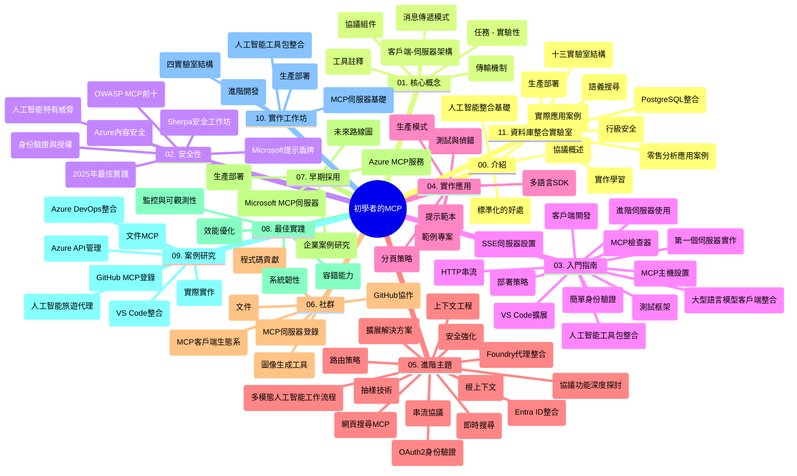

# 新手 Model Context Protocol (MCP) - 學習指南

本學習指南提供了「新手 Model Context Protocol (MCP)」課程的倉庫結構和內容概覽。請使用此指南有效瀏覽倉庫，充分利用可用資源。

## 倉庫概覽

Model Context Protocol (MCP) 是一套用於 AI 模型與客戶端應用之間互動的標準化框架。MCP 最初由 Anthropic 創建，現由更廣泛的 MCP 社群通過官方 GitHub 組織維護。本倉庫提供一套全面課程，包含 C#、Java、JavaScript、Python 和 TypeScript 實作範例，專為 AI 開發人員、系統架構師及軟件工程師設計。

## 課程視覺地圖

## 倉庫結構

倉庫組織成十一個主要部分，每部分聚焦不同 MCP 相關主題：

1. **簡介 (00-Introduction/)**
   - Model Context Protocol 概述
   - AI 流程標準化的重要性
   - 實際用例與效益

2. **核心概念 (01-CoreConcepts/)**
   - 用戶端-伺服器架構
   - 協議核心組件
   - MCP 中的訊息傳遞模式

3. **安全性 (02-Security/)**
   - MCP 系統中的安全威脅
   - 安全實作最佳實務
   - 認證與授權策略
   - **完整安全文件**：
     - MCP 2025 年安全最佳實務
     - Azure 內容安全實作指南
     - MCP 安全控管與技術
     - MCP 最佳實務速查
   - **重要安全議題**：
     - 提示注入與工具中毒攻擊
     - 會話劫持與混淆代理問題
     - 權杖傳遞漏洞
     - 過度權限與訪問控管
     - AI 元件供應鏈安全
     - 微軟提示盾牌整合

4. **快速上手 (03-GettingStarted/)**
   - 環境設置與配置
   - 建立基本 MCP 伺服器與用戶端
   - 與現有應用整合
   - 包含：
     - 第一個伺服器實作
     - 用戶端開發
     - 大型語言模型用戶端整合
     - VS Code 整合
     - 伺服器事件 (SSE) 伺服器
     - 進階伺服器使用
     - HTTP 串流
     - AI 工具組整合
     - 測試策略
     - 部署指南

5. **實務實作 (04-PracticalImplementation/)**
   - 多種語言 SDK 使用
   - 除錯、測試及驗證技巧
   - 建立可重用的提示模板與流程
   - 範例專案實作示範

6. **進階議題 (05-AdvancedTopics/)**
   - 上下文工程技術
   - Foundry 代理整合
   - 多模態 AI 工作流程 
   - OAuth2 認證示範
   - 即時搜尋能力
   - 即時串流
   - 根上下文實作
   - 路由策略
   - 採樣技術
   - 擴充方案
   - 安全考量
   - Entra ID 安全整合
   - 網路搜尋整合

7. **社群貢獻 (06-CommunityContributions/)**
   - 如何貢獻程式碼與文件
   - GitHub 協作方式
   - 社群驅動的改進與回饋
   - 使用各種 MCP 用戶端（Claude Desktop、Cline、VSCode）
   - 支援主流 MCP 伺服器含影像生成

8. **早期採用經驗 (07-LessonsfromEarlyAdoption/)**
   - 真實世界實作與成功案例
   - 基於 MCP 的解決方案開發與部署
   - 趨勢與未來路線圖
   - **微軟 MCP 伺服器指南**：詳細介紹十款可用於生產的微軟 MCP 伺服器：
     - Microsoft Learn Docs MCP 伺服器
     - Azure MCP 伺服器（15+ 專用連接器）
     - GitHub MCP 伺服器
     - Azure DevOps MCP 伺服器
     - MarkItDown MCP 伺服器
     - SQL Server MCP 伺服器
     - Playwright MCP 伺服器
     - Dev Box MCP 伺服器
     - Azure AI Foundry MCP 伺服器
     - Microsoft 365 Agents Toolkit MCP 伺服器

9. **最佳實務 (08-BestPractices/)**
   - 效能調優與優化
   - 設計容錯的 MCP 系統
   - 測試與韌性策略

10. **案例研究 (09-CaseStudy/)**
    - **七個深入案例研究** 展示 MCP 在多種場景的應用彈性：
    - **Azure AI 旅遊代理**：多代理協同，結合 Azure OpenAI 與 AI 搜尋
    - **Azure DevOps 整合**：自動化工作流程以更新 YouTube 數據
    - **即時文件檢索**：Python 終端用戶端結合串流 HTTP
    - **互動學習計劃產生器**：Chainlit 網頁應用與對話式 AI
    - **編輯器內文件查閱**：VS Code 與 GitHub Copilot 工作流程整合
    - **Azure API 管理**：企業級 API 整合與 MCP 伺服器建置
    - **GitHub MCP 註冊中心**：生態系開發與代理整合平台
    - 涉及企業整合、開發者生產力及生態系發展範例

11. **實戰工作坊 (10-StreamliningAIWorkflowsBuildingAnMCPServerWithAIToolkit/)**
    - 結合 MCP 與 AI 工具組的全方位實戰工作坊
    - 建構連結 AI 模型與現實工具的智慧應用
    - 包涵基礎、定製伺服器開發與生產部署策略實務模組
    - **實驗室結構**：
      - 實驗室 1：MCP 伺服器基礎
      - 實驗室 2：進階 MCP 伺服器開發
      - 實驗室 3：AI 工具組整合
      - 實驗室 4：生產部署與擴充
    - 依步驟指引進行實驗學習

12. **MCP 伺服器資料庫整合實驗室 (11-MCPServerHandsOnLabs/)**
    - **包含 13 個實驗室的全面學習路徑**，建構具生產力的 MCP 伺服器並整合 PostgreSQL
    - **真實零售分析案例** 使用 Zava Retail 使用案例
    - **企業級設計模式**：行級安全 (RLS)、語意搜尋、多租戶資料訪問
    - **完全實驗室結構**：
      - **實驗室 00-03：基礎** - 簡介、架構、安全、環境設定
      - **實驗室 04-06：MCP 伺服器建構** - 資料庫設計、MCP 伺服器開發、工具打造
      - **實驗室 07-09：進階功能** - 語意搜尋、測試除錯、VS Code 整合
      - **實驗室 10-12：生產與最佳實務** - 部署、監控與優化
    - **涵蓋技術**：FastMCP 框架、PostgreSQL、Azure OpenAI、Azure Container Apps、Application Insights
    - **學習成果**：生產力 MCP 伺服器、資料庫整合模式、AI 驅動分析、企業安全

## 附加資源

倉庫還包含輔助資源：

- **Images 資料夾**：課程中使用之圖表與示意圖
- **翻譯**：多語言支持及文件自動翻譯
- **官方 MCP 資源**：
  - [MCP 文件](https://modelcontextprotocol.io/)
  - [MCP 規範](https://spec.modelcontextprotocol.io/)
  - [MCP GitHub 倉庫](https://github.com/modelcontextprotocol)

## 如何使用此倉庫

1. **循序漸進學習**：依章節序號（00 至 11）進行，有系統地學習內容。
2. **語言專注**：若偏好特定程式語言，可前往 samples 目錄探索對應語言實作。
3. **實務上手**：「快速上手」章節適合建立環境及創建首個 MCP 伺服器與用戶端。
4. **進階探索**：熟悉基礎後，深入進階議題擴展知識。
5. **社群互動**：加入 MCP 社群 GitHub 討論及 Discord 頻道，與專家和同好互動。

## MCP 用戶端與工具

課程涵蓋多種 MCP 用戶端與工具：

1. **官方用戶端**：
   - Visual Studio Code 
   - VS Code 中的 MCP
   - Claude Desktop
   - VSCode 中的 Claude
   - Claude API

2. **社群用戶端**：
   - Cline（終端機）
   - Cursor（程式碼編輯器）
   - ChatMCP
   - Windsurf

3. **MCP 管理工具**：
   - MCP CLI
   - MCP Manager
   - MCP Linker
   - MCP Router

## 受歡迎的 MCP 伺服器

倉庫介紹多款 MCP 伺服器，包括：

1. **微軟官方 MCP 伺服器**：
   - Microsoft Learn Docs MCP 伺服器
   - Azure MCP 伺服器（15+ 專用連接器）
   - GitHub MCP 伺服器
   - Azure DevOps MCP 伺服器
   - MarkItDown MCP 伺服器
   - SQL Server MCP 伺服器
   - Playwright MCP 伺服器
   - Dev Box MCP 伺服器
   - Azure AI Foundry MCP 伺服器
   - Microsoft 365 Agents Toolkit MCP 伺服器

2. **官方參考伺服器**：
   - Filesystem
   - Fetch
   - Memory
   - Sequential Thinking

3. **影像生成**：
   - Azure OpenAI DALL-E 3
   - Stable Diffusion WebUI
   - Replicate

4. **開發工具**：
   - Git MCP
   - 終端控制
   - 程式碼助理

5. **專用伺服器**：
   - Salesforce
   - Microsoft Teams
   - Jira 與 Confluence

## 貢獻方式

此倉庫歡迎社群貢獻。請參閱「社群貢獻」章節，了解如何有效參與 MCP 生態系發展。

----

*本學習指南最後更新於 2026 年 2 月 5 日，反映最新 MCP 規範 2025-11-25，並概述截至該日期的倉庫內容。日後倉庫內容可能更新。*

---

<!-- CO-OP TRANSLATOR DISCLAIMER START -->
**免責聲明**：  
此文件乃使用 AI 翻譯服務 [Co-op Translator](https://github.com/Azure/co-op-translator) 進行翻譯。雖然我們努力追求翻譯準確性，但請注意自動翻譯可能包含錯誤或不準確之處。原文文件應視為權威來源。對於重要資訊，建議聘請專業人工翻譯。我們不對因使用此翻譯而導致的任何誤解或誤譯承擔責任。
<!-- CO-OP TRANSLATOR DISCLAIMER END -->