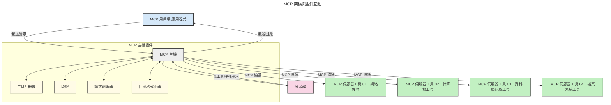

# 模型上下文協議 (MCP) 介紹：為什麼它對可擴展 AI 應用程式至關重要

[](https://youtu.be/agBbdiOPLQA)

_(點擊上方圖片觀看本課程視頻)_

生成式 AI 應用程式是一大進步，因為它們通常讓使用者能以自然語言提示與應用互動。然而，隨著時間和資源投入增加，您希望能輕鬆整合功能和資源，使擴展變得簡單，您的應用程式能同時支援多個模型，並處理各種模型細節。簡而言之，構建生成式 AI 應用最初很簡單，但隨著其增長及複雜化，您需要開始定義架構，並可能需要依賴一個標準來確保您的應用程式以一致的方式構建。這正是 MCP 出場協調一切並提供標準的原因。

---

## **🔍 什麼是模型上下文協議 (MCP)？**

**模型上下文協議 (MCP)** 是一個**開放且標準化的介面**，允許大型語言模型 (LLMs) 無縫地與外部工具、API 和資料源互動。它提供一致的架構，強化 AI 模型功能，超越訓練數據，使 AI 系統更智能、可擴展且反應靈敏。

---

## **🎯 為什麼 AI 標準化重要**

隨著生成式 AI 應用的複雜度增加，採用能確保**可擴展性、可擴充性、可維護性**，以及**避免供應商綁定**的標準變得非常重要。MCP 解決以下需求：

- 統一模型與工具的整合
- 減少脆弱、一次性的客製解決方案
- 允許不同供應商的多個模型共存於同一生態系統

**注意：** 雖然 MCP 自稱為開放標準，但目前無計劃透過 IEEE、IETF、W3C、ISO 或其他標準組織來制訂 MCP 標準。

---

## **📚 學習目標**

閱讀完本文，您將能夠：

- 定義**模型上下文協議 (MCP)**及其使用案例
- 理解 MCP 如何標準化模型與工具間的通訊
- 識別 MCP 架構的核心組件
- 探索 MCP 在企業和開發環境中的實際應用

---

## **💡 為什麼模型上下文協議 (MCP) 是遊戲改變者**

### **🔗 MCP 解決 AI 互動的碎片化問題**

在 MCP 出現前，整合模型與工具需要：

- 為每對工具與模型撰寫客製程式碼
- 各供應商擁有非標準 API
- 更新頻繁導致中斷
- 工具數量增加時可擴展性差

### **✅ MCP 標準化的好處**

| **好處**                | **說明**                                                            |
|--------------------------|--------------------------------------------------------------------|
| 互通性                   | LLM 能與不同供應商的工具無縫配合                                  |
| 一致性                   | 平台和工具間的統一行為                                              |
| 重複使用性               | 工具建好一次即可跨專案和系統使用                                    |
| 加速開發                 | 使用標準化、即插即用介面減少開發時間                                |

---

## **🧱 MCP 高階架構概覽**

MCP 採用**客戶端-伺服器模型**，其中：

- **MCP Host** 運行 AI 模型
- **MCP Client** 發起請求
- **MCP Server** 提供上下文、工具與功能

### **核心組件：**

- **資源** – 靜態或動態模型數據  
- **提示** – 預設的工作流程以引導生成  
- **工具** – 可執行功能，如搜尋、計算  
- **抽樣** – 透過遞迴互動呈現智能行為
- **誘導** – 由伺服器主動請求使用者輸入
- **根目錄** – 伺服器存取控制的檔案系統邊界

### **協議架構：**

MCP 採用兩層架構：
- **資料層**：基於 JSON-RPC 2.0 的通訊，含生命周期管理與原語
- **傳輸層**：本地使用 STDIO，遠端使用 SSE 支援的串流 HTTP 通訊管道

---

## MCP 伺服器如何運作

MCP 伺服器的運作方式如下：

- **請求流程**：
    1. 請求由最終使用者或代表其行動的軟體啟動。
    2. **MCP 客戶端** 將請求送到管理 AI 模型執行環境的 **MCP Host**。
    3. **AI 模型** 接收使用者提示，並可以透過一個或多個工具調用請求存取外部工具或數據。
    4. **MCP Host**（非模型本身）以標準化協議與適當的 **MCP Server(s)** 通訊。
- **MCP Host 功能**：
    - **工具註冊表**：維護可用工具及其功能目錄。
    - **驗證機制**：核實工具存取權限。
    - **請求處理器**：處理模型的工具請求。
    - **回應格式化器**：將工具輸出格式化為模型易於理解的格式。
- **MCP 伺服器執行**：
    - **MCP Host** 將工具呼叫路由至一個或多個公開專業功能（例如搜尋、計算、資料庫查詢）的 **MCP Server**。
    - **MCP Server** 執行相應操作並以一致格式返回結果給 **MCP Host**。
    - **MCP Host** 格式化並轉發結果給 **AI 模型**。
- **回應完成**：
    - **AI 模型** 將工具輸出整合進最終回應中。
    - **MCP Host** 將此回應送回 **MCP Client**，由其轉交給最終使用者或呼叫軟體。
    


## 👨‍💻 如何建置 MCP 伺服器（含範例）

MCP 伺服器允許您透過提供數據及功能擴展 LLM 能力。

準備好試試嗎？以下是幾種語言和/或技術棧的 SDK 及建立簡單 MCP 伺服器的範例：

- **Python SDK**: https://github.com/modelcontextprotocol/python-sdk

- **TypeScript SDK**: https://github.com/modelcontextprotocol/typescript-sdk

- **Java SDK**: https://github.com/modelcontextprotocol/java-sdk

- **C#/.NET SDK**: https://github.com/modelcontextprotocol/csharp-sdk


## 🌍 MCP 的實際應用場景

MCP 透過擴展 AI 功能支持多種應用：

| **應用場景**               | **說明**                                                               |
|-----------------------------|------------------------------------------------------------------------|
| 企業數據整合                | 將 LLM 連接至資料庫、CRM 或內部工具                                   |
| 智能代理系統                | 為自動化代理提供工具存取和決策工作流程                               |
| 多模態應用                  | 在單一統一 AI 應用中結合文字、影像和音訊工具                          |
| 即時數據整合                | 將即時數據引入 AI 互動以產生更精確、當前的輸出                        |


### 🧠 MCP = AI 互動的通用標準

模型上下文協議 (MCP) 如同 USB-C 標準化裝置實體連接一般，是 AI 互動的通用標準。在 AI 領域，MCP 提供一致介面，讓模型（客戶端）能無縫整合外部工具及資料提供者（伺服器）。這消除了為每個 API 或資料源開發多樣化自訂協議的需求。

依 MCP 標準，兼容的工具（稱為 MCP 伺服器）遵循統一標準，能列出所提供的工具或操作，並在 AI 代理請求時執行這些操作。支援 MCP 的 AI 代理平台可發現伺服器上的可用工具並透過此標準協議調用。

### 💡 促進知識存取

除了提供工具外，MCP 還促進對知識的存取。它使應用程式能為大型語言模型 (LLMs) 提供上下文，連接各種資料源。例如，某 MCP 伺服器可能代表公司的文件庫，允許代理根據需求檢索相關資訊。另一伺服器則可處理特定動作，如發送電子郵件或更新記錄。從代理角度看，這些僅是可使用的工具——有些工具回傳資料（知識上下文），其他則執行動作。MCP 高效管理兩者。

代理連接至 MCP 伺服器時，會自動透過標準格式學習伺服器的可用功能和可存取資料。這標準化實現工具動態可用。例如在代理系統中新增 MCP 伺服器，其功能立即可用，無需另行修改代理指令。

此整合流程如以下圖示所示，伺服器同時提供工具和知識，確保系統間無縫協作。

### 👉 範例：可擴展代理解決方案

```mermaid
---
title: 可擴展代理方案與MCP
description: 一個圖表說明用戶如何與連接多個MCP伺服器的LLM互動，每個伺服器都提供知識和工具，創建可擴展的人工智能系統架構
---
graph TD
    User -->|提示| LLM
    LLM -->|回應| User
    LLM -->|MCP| ServerA
    LLM -->|MCP| ServerB
    ServerA -->|通用連接器| ServerB
    ServerA --> 知識A
    ServerA --> 工具A
    ServerB --> 知識B
    ServerB --> 工具B

    subgraph Server A
        知識A[知識]
        工具A[工具]
    end

    subgraph Server B
        知識B[知識]
        工具B[工具]
    end
```通用連接器允許 MCP 伺服器彼此通訊並共享功能，使 ServerA 可將任務委派給 ServerB 或存取其工具和知識。此舉促成伺服器間的工具及資料聯邦，支援可擴展且模組化的代理架構。由於 MCP 標準化了工具呈現，代理能在伺服器間動態發現並路由請求，無需硬編碼整合。

工具與知識聯邦：工具和資料可跨伺服器存取，實現更具擴展性及模組性的代理架構。

### 🔄 客戶端 LLM 整合的進階 MCP 場景

除了基本 MCP 架構，還有更進階的場景，同時在客戶端和伺服器端包含 LLM，實現更複雜的交互。以下圖示中，**客戶端應用** 可能是具備數個 MCP 工具可供 LLM 使用的 IDE：

```mermaid
---
title: 具客戶端-伺服器LLM整合的進階MCP情境
description: 一個序列圖，展示用戶、客戶端應用程式、客戶端LLM、多個MCP伺服器及伺服器LLM之間的詳細互動流程，說明工具發現、用戶互動、直接工具調用與功能協商階段
---
sequenceDiagram
    autonumber
    actor User as 👤 用戶
    participant ClientApp as 🖥️ 客戶端應用程式
    participant ClientLLM as 🧠 客戶端LLM
    participant Server1 as 🔧 MCP伺服器1
    participant Server2 as 📚 MCP伺服器2
    participant ServerLLM as 🤖 伺服器LLM
    
    %% Discovery Phase
    rect rgb(220, 240, 255)
        Note over ClientApp, Server2: 工具發現階段
        ClientApp->>+Server1: 請求可用工具/資源
        Server1-->>-ClientApp: 回傳工具清單 (JSON)
        ClientApp->>+Server2: 請求可用工具/資源
        Server2-->>-ClientApp: 回傳工具清單 (JSON)
        Note right of ClientApp: 本地儲存合併工具<br/>目錄
    end
    
    %% User Interaction
    rect rgb(255, 240, 220)
        Note over User, ClientLLM: 用戶互動階段
        User->>+ClientApp: 輸入自然語言提示
        ClientApp->>+ClientLLM: 轉發提示 + 工具目錄
        ClientLLM->>-ClientLLM: 分析提示並選擇工具
    end
    
    %% Scenario A: Direct Tool Calling
    alt Direct Tool Calling
        rect rgb(220, 255, 220)
            Note over ClientApp, Server1: 情境A：直接工具調用
            ClientLLM->>+ClientApp: 請求工具執行
            ClientApp->>+Server1: 執行特定工具
            Server1-->>-ClientApp: 回傳結果
            ClientApp->>+ClientLLM: 處理結果
            ClientLLM-->>-ClientApp: 產生回應
            ClientApp-->>-User: 顯示最終答案
        end
    
    %% Scenario B: Feature Negotiation (VS Code style)
    else Feature Negotiation (VS Code style)
        rect rgb(255, 220, 220)
            Note over ClientApp, ServerLLM: 情境B：功能協商
            ClientLLM->>+ClientApp: 識別所需能力
            ClientApp->>+Server2: 協商功能/能力
            Server2->>+ServerLLM: 請求額外上下文
            ServerLLM-->>-Server2: 提供上下文
            Server2-->>-ClientApp: 回傳可用功能
            ClientApp->>+Server2: 呼叫協商後的工具
            Server2-->>-ClientApp: 回傳結果
            ClientApp->>+ClientLLM: 處理結果
            ClientLLM-->>-ClientApp: 產生回應
            ClientApp-->>-User: 顯示最終答案
        end
    end
```
## 🔐 MCP 的實際好處

使用 MCP 的實際好處包括：

- **資訊新鮮度**：模型可以訪問超越訓練數據的最新資訊
- **能力擴展**：模型可利用專門工具完成未經訓練的任務
- **減少幻覺**：外部數據源提供事實根據
- **隱私保障**：敏感資料保留在安全環境中，避免嵌入提示中

## 📌 主要重點

使用 MCP 的主要重點包括：

- **MCP** 標準化 AI 模型與工具及數據的交互方式
- 促進**可擴充性、一致性與互通性**
- MCP 有助**減少開發時間、提升可靠性及擴展模型能力**
- 客戶端-伺服器架構能**實現靈活、可擴展的 AI 應用**

## 🧠 練習

思考您有興趣構建的 AI 應用：

- 哪些**外部工具或數據**能增強其能力？
- MCP 如何讓整合**更簡單且更可靠？**

## 附加資源

- [MCP GitHub 倉庫](https://github.com/modelcontextprotocol)


## 下一步

下一章：[第一章：核心概念](../01-CoreConcepts/README.md)

---

<!-- CO-OP TRANSLATOR DISCLAIMER START -->
**免責聲明**：
本文件是使用 AI 翻譯服務 [Co-op Translator](https://github.com/Azure/co-op-translator) 進行翻譯。雖然我們力求準確，但請注意自動翻譯可能包含錯誤或不準確之處。原始母語文件應視為權威版本。對於重要資訊，建議使用專業人工翻譯。我們對因使用此翻譯所引起的任何誤解或誤釋不承擔任何責任。
<!-- CO-OP TRANSLATOR DISCLAIMER END -->