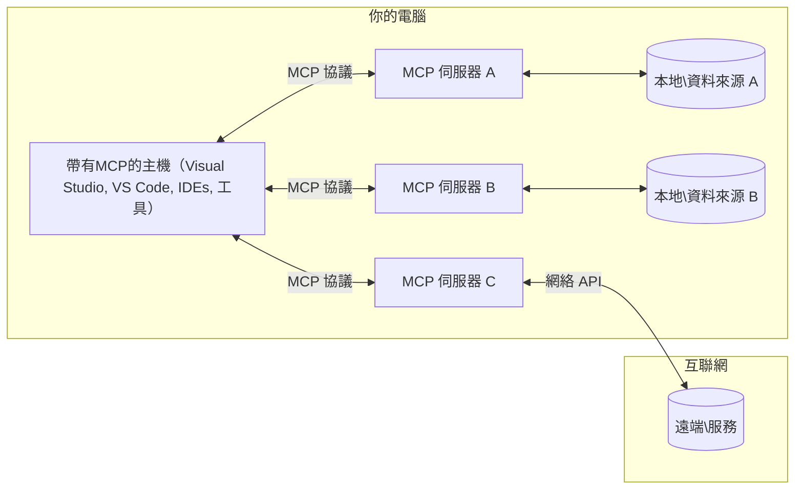

# MCP 核心概念：掌握模型上下文協議以整合人工智能

[](https://youtu.be/earDzWGtE84)

_(點擊上圖以觀看本課程的影片)_

[模型上下文協議 (Model Context Protocol, MCP)](https://github.com/modelcontextprotocol) 是一個強大且標準化的框架，可優化大型語言模型（LLMs）與外部工具、應用程式及資料來源之間的通訊。  
本指南將帶您深入了解 MCP 的核心概念。您將學習其客戶端-伺服器架構、重要組件、通訊機制與實作最佳實踐。

- **明確使用者同意**：所有資料存取與操作均須在執行前獲得使用者明確批准。使用者必須清楚理解將被存取的資料以及將進行的動作，並擁有詳細的權限和授權控制。
- **資料隱私保護**：使用者資料僅在取得明確同意後暴露，且必須透過嚴密的存取控制於整個互動生命週期中予以保護。實作必須防止未授權的資料傳輸並維持嚴格的隱私界線。
- **工具執行安全**：每次呼叫工具皆需取得使用者明確同意，讓使用者清楚瞭解工具的功能、參數及可能影響。必須建立堅固的安全界線以防止意外、不安全或惡意的工具執行。
- **傳輸層安全**：所有通訊通道應使用適當的加密和認證機制。遠端連線需實作安全傳輸協定及正確的認證憑證管理。

#### 實作指引：

- **權限管理**：實作細粒度權限系統，允許使用者控制可存取的伺服器、工具和資源
- **認證與授權**：使用安全認證方法（OAuth、API 金鑰）並妥善管理與過期令牌  
- **輸入驗證**：根據定義的結構驗證所有參數與資料輸入以防注入攻擊
- **稽核日誌**：保持全面的操作記錄以利安全監控與合規性

## 概覽

本課程探討構成模型上下文協議 (MCP) 生態系統的基本架構與組件。您將了解客戶端-伺服器架構、關鍵組件及推動 MCP 互動的通訊機制。

## 主要學習目標

完成本課程後，您將能：

- 理解 MCP 的客戶端-伺服器架構
- 辨識 Hosts、Clients 與 Servers 的角色與職責
- 分析 MCP 讓整合更具彈性的核心特性
- 瞭解 MCP 生態系中的資訊流動
- 透過 .NET、Java、Python 與 JavaScript 程式範例獲得實務見解

## MCP 架構：深入解析

MCP 生態系基於客戶端-伺服器模型構建。此模組化結構允許 AI 應用與工具、資料庫、API 及上下文資源進行高效互動。我們將此架構拆解為其核心組件。

MCP 核心遵循客戶端-伺服器架構，其中主機應用可連接多個伺服器：


- **MCP Hosts**：如 VSCode、Claude Desktop、IDE 或希望透過 MCP 存取資料的 AI 工具
- **MCP Clients**：與伺服器維持一對一連線的協議用戶端
- **MCP Servers**：透過標準化模型上下文協議提供特定功能的輕量程式
- **本地資料來源**：電腦上的檔案、資料庫及 MCP 伺服器能安全存取的服務
- **遠端服務**：透過 API 與 MCP 伺服器連接的網際網路上外部系統

MCP 協議是一項持續演進的標準，使用日期格式版號（YYYY-MM-DD）。目前協議版本為 **2025-11-25**。您可見最新的[協議規範](https://modelcontextprotocol.io/specification/2025-11-25/)

### 1. 主機（Hosts）

在模型上下文協議 (MCP) 中，**Host** 是作為使用者與協議主要互動介面的 AI 應用程式。Host 負責協調及管理與多個 MCP 伺服器的連線，並為每個伺服器連線建立專用的 MCP 客戶端。Host 例如：

- **AI 應用**：Claude Desktop、Visual Studio Code、Claude Code
- **開發環境**：整合 MCP 的 IDE 與程式編輯器
- **客製化應用**：專用 AI 代理人與工具

**Hosts** 是協調 AI 模型互動的應用程式。其職責包括：

- **協調 AI 模型**：執行或與 LLM 互動以產生回應並協調 AI 工作流程
- **管理用戶端連線**：為每個 MCP 伺服器建立並維護一個 MCP 用戶端
- **控制使用者介面**：處理對話流程、使用者互動及回應呈現  
- **執行安全控管**：管理權限、安全限制及認證
- **處理使用者同意**：管理資料分享與工具執行的使用者批准

### 2. 用戶端（Clients）

**Clients** 是維持 Hosts 與 MCP 伺服器間一對一專用連線的重要組件。每個 MCP 用戶端由 Host 初始化以連至特定 MCP 伺服器，確保連線有序且安全。多個用戶端使得 Host 能同時連接多個伺服器。

**Clients** 是 hosts 程式內的連接組件。它們負責：

- **協議通訊**：以 JSON-RPC 2.0 協定向伺服器發送請求、提示與指令
- **能力協商**：於初始化期間與伺服器協商支援的功能及協議版本
- **工具執行**：管理模型發出的工具執行請求並處理回應
- **即時更新**：處理伺服器的通知與即時狀態更新
- **回應處理**：處理及格式化伺服器回應以呈現給使用者

### 3. 伺服器（Servers）

**Servers** 是為 MCP 用戶端提供上下文、工具和功能的程式。伺服器可以在本地（與 Host 同機器）或遠端（外部平台）執行，負責處理用戶端請求並提供結構化回應。伺服器透過標準化模型上下文協議揭露特定功能。

**Servers** 是提供上下文與能力的服務。它們職責包含：

- **功能登錄**：向用戶端登錄並揭露可用原語（資源、提示、工具）
- **請求處理**：接受並執行來自用戶端的工具呼叫、資源請求與提示請求
- **上下文提供**：提供上下文資訊與資料以強化模型回應
- **狀態管理**：維持會話狀態並在需要時處理有狀態的互動
- **即時通知**：向連線中的用戶端推送功能變更及更新通知

伺服器可由任何人開發，以增強模型功能且支援本地及遠端部署場景。

### 4. 伺服器原語（Server Primitives）

模型上下文協議伺服器提供三種核心**原語**，定義了用戶端、主機和語言模型間豐富互動的基本構建塊。這些原語指定協議提供的上下文資訊類型及可執行動作。

MCP 伺服器可揭露以下任意組合的三種核心原語：

#### 資源（Resources）

**資源** 是提供給 AI 應用的上下文資訊資料來源。它們代表可用於增強模型理解與決策之靜態或動態內容：

- **上下文資料**：AI 模型消費的結構化資訊與背景
- **知識庫**：文件庫、文章、手冊與研究論文
- **本地資料來源**：檔案、資料庫與本地系統資訊  
- **外部資料**：API 回應、網路服務與遠端系統資料
- **動態內容**：根據外部條件即時更新的資料

資源以 URI 識別，支援透過 `resources/list` 進行發現及透過 `resources/read` 進行讀取：

```text
file://documents/project-spec.md
database://production/users/schema
api://weather/current
```

#### 提示（Prompts）

**提示** 是可重用的範本，有助結構化與語言模型的互動。它們提供標準化互動模式與範本化工作流程：

- **基於範本的互動**：預先結構化的訊息與對話起始
- **工作流程範本**：用於常見任務與互動的標準序列
- **少量示例**：用於模型指導的範例範本
- **系統提示**：定義模型行為與上下文的基礎提示
- **動態範本**：具參數的提示，可依特定上下文調整

提示支援變數替換，可透過 `prompts/list` 發現並以 `prompts/get` 取得：

```markdown
Generate a {{task_type}} for {{product}} targeting {{audience}} with the following requirements: {{requirements}}
```

#### 工具（Tools）

**工具** 是 AI 模型可調用的可執行功能，用於執行特定操作。它們是 MCP 生態系的「動詞」，使模型能與外部系統互動：

- **可執行功能**：模型可調用並帶特定參數的獨立操作
- **外部系統整合**：API 呼叫、資料庫查詢、檔案操作、計算
- **獨特身份**：每個工具均有獨特名稱、描述及參數結構
- **結構化輸入輸出**：工具接受驗證過的參數並回傳結構化且類型明確的回應
- **操作能力**：使模型能執行實際行動並取得即時資料

工具以 JSON 結構定義參數驗證，可透過 `tools/list` 發現，並以 `tools/call` 呼叫。工具亦可包含**圖示**作為輔助使用者介面呈現的額外元資料。

**工具註解**：工具支援行為註解（例如 `readOnlyHint`、`destructiveHint`），說明工具是否為唯讀或具破壞性，有助用戶端做出執行判斷。

工具範例定義：

```typescript
server.tool(
  "search_products", 
  {
    query: z.string().describe("Search query for products"),
    category: z.string().optional().describe("Product category filter"),
    max_results: z.number().default(10).describe("Maximum results to return")
  }, 
  async (params) => {
    // 執行搜索並返回結構化結果
    return await productService.search(params);
  }
);
```

## 客戶端原語（Client Primitives）

在模型上下文協議 (MCP) 中，**用戶端**可揭露原語，使伺服器能向主機應用請求額外能力。這些用戶端原語允許更豐富、具互動性的伺服器實作，能使用 AI 模型能力及使用者互動。

### 取樣（Sampling）

**取樣** 讓伺服器能向用戶端的 AI 應用請求語言模型完成結果。此原語使伺服器得以無需嵌入自有的 LLM 相依性即訪問 LLM 能力：

- **模型無關存取**：伺服器可請求完成結果，無需包含 LLM SDK 或管理模型存取
- **伺服器主動 AI**：使伺服器可自主利用用戶端的 AI 模型生成內容
- **遞迴 LLM 互動**：支持伺服器需多階段 AI 協助的複雜場景
- **動態內容生成**：允許伺服器使用主機模型產生上下文回應
- **工具呼叫支援**：伺服器可包含 `tools` 和 `toolChoice` 參數，使用戶端模型在取樣期間可調用工具

取樣由 `sampling/complete` 方法發起，伺服器送出完成請求給用戶端。

### 根目錄（Roots）

**根目錄** 透過標準化方式讓用戶端向伺服器揭露檔案系統邊界，有助伺服器理解能存取的目錄與檔案範圍：

- **檔案系統邊界**：定義伺服器能作業的檔案系統範圍
- **存取控制**：協助伺服器理解其擁有權限存取的目錄與檔案
- **動態更新**：用戶端變更根目錄清單時可通知伺服器
- **URI 識別**：根目錄使用 `file://` URI 來標示可存取的目錄與檔案

根目錄透過 `roots/list` 方法揭露，用戶端在根目錄有變動時可發送 `notifications/roots/list_changed` 通知。

### 問詢（Elicitation）  

**問詢** 讓伺服器透過用戶端介面請求使用者提供額外資訊或確認：

- **使用者輸入請求**：伺服器在工具執行需要時可索取更多資訊
- **確認對話**：請求使用者核准敏感或具影響力的操作
- **互動式工作流程**：讓伺服器創建逐步的使用者互動程序
- **動態參數收集**：於工具執行過程蒐集缺失或選填參數

問詢請求使用 `elicitation/request` 方法，經由用戶端介面蒐集使用者輸入。

**URL 模式問詢**：伺服器也可請求基於 URL 的使用者互動，讓伺服器引導使用者至外部網頁作認證、確認或資料輸入。

### 記錄（Logging）

**記錄** 允許伺服器向用戶端傳送結構化日誌訊息，以利偵錯、監控與運維透明：

- **偵錯支援**：使伺服器能提供詳細執行日誌以輔助故障排除
- **運維監控**：向用戶端傳送狀態更新和效能指標
- **錯誤報告**：提供詳細錯誤情境與診斷資訊
- **稽核軌跡**：建立伺服器操作與決策的完整紀錄

記錄訊息會送達用戶端，以提供伺服器作業透明度並促進偵錯。

## MCP 中的信息流動

模型上下文協議 (MCP) 定義 hosts、clients、servers 及模型之間的結構化資訊流。理解此流有助明確用戶請求如何被處理，以及外部工具及資料如何整合入模型回應。

- **主機發起連線**  
  主機應用（如 IDE 或聊天介面）建立與 MCP 伺服器的連線，通常透過 STDIO、WebSocket 或其他支援的傳輸方式。

- **能力協商**  
  用戶端（嵌入在主機中）與伺服器交換其支援的功能、工具、資源及協議版本資訊，確保雙方瞭解會話可用能力。

- **使用者請求**  
  使用者與主機互動（例如輸入提示或指令）。主機收集此輸入並委派給用戶端處理。

- **資源或工具使用**  
  - 用戶端可能向伺服器請求額外上下文或資源（如檔案、資料庫條目或知識庫文章），以豐富模型理解。
  - 若模型判定需用到工具（如擷取資料、執行計算或呼叫 API），用戶端將發送工具調用請求予伺服器，包含工具名稱及參數。

- **伺服器執行**  

伺服器接收資源或工具請求，執行必要的操作（例如執行函數、查詢資料庫或檢索檔案），並以結構化格式將結果返回給客戶端。

- **回應產生**  
  客戶端將伺服器的回應（資源資料、工具輸出等）整合進持續的模型互動中。模型利用這些資訊產生全面且具上下文相關性的回應。

- **結果呈現**  
  主機接收來自客戶端的最終輸出並呈現給使用者，通常包括模型產生的文本以及任何工具執行或資源查詢的結果。

此流程使 MCP 能支援先進、互動且具上下文感知的 AI 應用，無縫連接模型與外部工具和資料來源。

## 協議架構與層次

MCP 由兩個協同工作的獨立架構層組成，提供完整的通訊框架：

### 資料層

**資料層**以 **JSON-RPC 2.0** 為基礎實作 MCP 協議核心。此層定義訊息結構、語意及互動模式：

#### 核心元件：

- **JSON-RPC 2.0 協議**：所有通訊使用標準化 JSON-RPC 2.0 訊息格式處理方法呼叫、回應及通知
- **生命週期管理**：處理客戶端與伺服器間的連線初始化、能力協商及會話終止
- **伺服器基元**：使伺服器能透過工具、資源和提示提供核心功能
- **客戶端基元**：使伺服器可向客戶端請求 LLM 取樣、引導使用者輸入及傳送日誌訊息
- **即時通知**：支援非同步通知以動態更新資訊無需輪詢

#### 主要特點：

- **協議版本協商**：使用基於日期的版本號（YYYY-MM-DD）確保相容性
- **功能探索**：客戶端與伺服器在初始化期間交換支援功能資訊
- **有狀態會話**：維持跨多次互動的連線狀態以保持上下文連續性

### 傳輸層

**傳輸層**管理 MCP 參與者間的通訊通道、訊息框架及驗證：

#### 支援的傳輸機制：

1. **STDIO 傳輸**：
   - 使用標準輸入輸出流作為直接進程通訊
   - 適用於同一機器上的本地進程，無網路額外負擔
   - 常見於本地 MCP 伺服器實作

2. **可串流 HTTP 傳輸**：
   - 用 HTTP POST 傳送客戶端至伺服器訊息  
   - 選用伺服器推送事件（SSE）實現伺服器至客戶端串流
   - 支援跨網路遠端伺服器通訊
   - 支援標準 HTTP 認證（Bearer Token、API 金鑰、自訂標頭）
   - MCP 建議使用 OAuth 進行安全的 token 驗證

#### 傳輸抽象：

傳輸層將通訊細節從資料層抽象出來，使所有傳輸機制皆使用相同 JSON-RPC 2.0 訊息格式。此抽象設計支援應用無縫切換本地與遠端伺服器。

### 安全考量

MCP 實作必須遵守若干關鍵安全原則，確保所有協議操作中的互動安全、可信且受保護：

- **使用者同意與控制**：操作或資料存取前須獲得使用者明確同意，並提供清晰控制權限介面，讓使用者決定分享哪些資料及授權哪些操作，並以直覺式界面輔助審核與批准行動。

- **資料隱私**：使用者資料僅在明確同意下公開，並須受到適當存取控管保護。MCP 實作必須防範未經授權的資料傳輸，確保資料隱私於整個互動過程中維持。

- **工具安全**：調用任何工具前需獲得明確使用者同意。使用者應充分了解工具功能，並強制執行健全的安全邊界，防止意外或不安全的工具執行。

遵循這些安全原則，MCP 確保使用者信任、隱私與安全性在所有協議互動中獲得保障，同時實現強大 AI 整合能力。

## 程式碼範例：關鍵元件

以下示範多種流行編程語言中如何實作 MCP 伺服器核心元件及工具的程式碼範例。

### .NET 範例：建立簡易 MCP 伺服器與工具

此實用 .NET 程式碼範例展示如何實作一個簡單的 MCP 伺服器與自訂工具，示範工具定義、註冊及請求處理，並使用模型上下文協定連接伺服器。

```csharp
using System;
using System.Threading.Tasks;
using ModelContextProtocol.Server;
using ModelContextProtocol.Server.Transport;
using ModelContextProtocol.Server.Tools;

public class WeatherServer
{
    public static async Task Main(string[] args)
    {
        // Create an MCP server
        var server = new McpServer(
            name: "Weather MCP Server",
            version: "1.0.0"
        );
        
        // Register our custom weather tool
        server.AddTool<string, WeatherData>("weatherTool", 
            description: "Gets current weather for a location",
            execute: async (location) => {
                // Call weather API (simplified)
                var weatherData = await GetWeatherDataAsync(location);
                return weatherData;
            });
        
        // Connect the server using stdio transport
        var transport = new StdioServerTransport();
        await server.ConnectAsync(transport);
        
        Console.WriteLine("Weather MCP Server started");
        
        // Keep the server running until process is terminated
        await Task.Delay(-1);
    }
    
    private static async Task<WeatherData> GetWeatherDataAsync(string location)
    {
        // This would normally call a weather API
        // Simplified for demonstration
        await Task.Delay(100); // Simulate API call
        return new WeatherData { 
            Temperature = 72.5,
            Conditions = "Sunny",
            Location = location
        };
    }
}

public class WeatherData
{
    public double Temperature { get; set; }
    public string Conditions { get; set; }
    public string Location { get; set; }
}
```


### Java 範例：MCP 伺服器元件

此範例示範與上述 .NET 範例相同的 MCP 伺服器及工具註冊，但使用 Java 實作。

```java
import io.modelcontextprotocol.server.McpServer;
import io.modelcontextprotocol.server.McpToolDefinition;
import io.modelcontextprotocol.server.transport.StdioServerTransport;
import io.modelcontextprotocol.server.tool.ToolExecutionContext;
import io.modelcontextprotocol.server.tool.ToolResponse;

public class WeatherMcpServer {
    public static void main(String[] args) throws Exception {
        // 創建一個 MCP 伺服器
        McpServer server = McpServer.builder()
            .name("Weather MCP Server")
            .version("1.0.0")
            .build();
            
        // 註冊一個天氣工具
        server.registerTool(McpToolDefinition.builder("weatherTool")
            .description("Gets current weather for a location")
            .parameter("location", String.class)
            .execute((ToolExecutionContext ctx) -> {
                String location = ctx.getParameter("location", String.class);
                
                // 獲取天氣數據（簡化版）
                WeatherData data = getWeatherData(location);
                
                // 返回格式化的回應
                return ToolResponse.content(
                    String.format("Temperature: %.1f°F, Conditions: %s, Location: %s", 
                    data.getTemperature(), 
                    data.getConditions(), 
                    data.getLocation())
                );
            })
            .build());
        
        // 使用 stdio 傳輸連接伺服器
        try (StdioServerTransport transport = new StdioServerTransport()) {
            server.connect(transport);
            System.out.println("Weather MCP Server started");
            // 伺服器保持運行直到進程終止
            Thread.currentThread().join();
        }
    }
    
    private static WeatherData getWeatherData(String location) {
        // 實作會調用天氣 API
        // 為示例目的而簡化
        return new WeatherData(72.5, "Sunny", location);
    }
}

class WeatherData {
    private double temperature;
    private String conditions;
    private String location;
    
    public WeatherData(double temperature, String conditions, String location) {
        this.temperature = temperature;
        this.conditions = conditions;
        this.location = location;
    }
    
    public double getTemperature() {
        return temperature;
    }
    
    public String getConditions() {
        return conditions;
    }
    
    public String getLocation() {
        return location;
    }
}
```


### Python 範例：建構 MCP 伺服器

此範例使用 fastmcp，請先安裝該套件：

```python
pip install fastmcp
```
Code Sample:

```python
#!/usr/bin/env python3
import asyncio
from fastmcp import FastMCP
from fastmcp.transports.stdio import serve_stdio

# 建立一個 FastMCP 伺服器
mcp = FastMCP(
    name="Weather MCP Server",
    version="1.0.0"
)

@mcp.tool()
def get_weather(location: str) -> dict:
    """Gets current weather for a location."""
    return {
        "temperature": 72.5,
        "conditions": "Sunny",
        "location": location
    }

# 使用類別的替代方法
class WeatherTools:
    @mcp.tool()
    def forecast(self, location: str, days: int = 1) -> dict:
        """Gets weather forecast for a location for the specified number of days."""
        return {
            "location": location,
            "forecast": [
                {"day": i+1, "temperature": 70 + i, "conditions": "Partly Cloudy"}
                for i in range(days)
            ]
        }

# 註冊類別工具
weather_tools = WeatherTools()

# 啟動伺服器
if __name__ == "__main__":
    asyncio.run(serve_stdio(mcp))
```


### JavaScript 範例：建立 MCP 伺服器

此範例展示如何用 JavaScript 建立 MCP 伺服器及註冊兩個天氣相關工具。

```javascript
// 使用官方的模型上下文協定 SDK
import { McpServer } from "@modelcontextprotocol/sdk/server/mcp.js";
import { StdioServerTransport } from "@modelcontextprotocol/sdk/server/stdio.js";
import { z } from "zod"; // 用於參數驗證

// 建立一個 MCP 伺服器
const server = new McpServer({
  name: "Weather MCP Server",
  version: "1.0.0"
});

// 定義天氣工具
server.tool(
  "weatherTool",
  {
    location: z.string().describe("The location to get weather for")
  },
  async ({ location }) => {
    // 這通常會調用天氣 API
    // 為示範而簡化
    const weatherData = await getWeatherData(location);
    
    return {
      content: [
        { 
          type: "text", 
          text: `Temperature: ${weatherData.temperature}°F, Conditions: ${weatherData.conditions}, Location: ${weatherData.location}` 
        }
      ]
    };
  }
);

// 定義預報工具
server.tool(
  "forecastTool",
  {
    location: z.string(),
    days: z.number().default(3).describe("Number of days for forecast")
  },
  async ({ location, days }) => {
    // 這通常會調用天氣 API
    // 為示範而簡化
    const forecast = await getForecastData(location, days);
    
    return {
      content: [
        { 
          type: "text", 
          text: `${days}-day forecast for ${location}: ${JSON.stringify(forecast)}` 
        }
      ]
    };
  }
);

// 輔助函數
async function getWeatherData(location) {
  // 模擬 API 呼叫
  return {
    temperature: 72.5,
    conditions: "Sunny",
    location: location
  };
}

async function getForecastData(location, days) {
  // 模擬 API 呼叫
  return Array.from({ length: days }, (_, i) => ({
    day: i + 1,
    temperature: 70 + Math.floor(Math.random() * 10),
    conditions: i % 2 === 0 ? "Sunny" : "Partly Cloudy"
  }));
}

// 使用 stdio 傳輸連接伺服器
const transport = new StdioServerTransport();
server.connect(transport).catch(console.error);

console.log("Weather MCP Server started");
```


此 JavaScript 範例示範建立 MCP 客戶端連接伺服器，傳送提示並處理回應，包括任何工具呼叫。

## 安全與授權

MCP 包含若干內建安全與授權機制以管理整體協議的安全性：

1. **工具權限控管**：  
  客戶端可指定模型在會話期間允許使用的工具，確保僅有明確授權的工具可用，降低意外或不安全操作風險。權限可依使用者偏好、組織政策或互動上下文動態配置。

2. **身份驗證**：  
  伺服器可要求身份驗證後授權使用工具、資源或敏感操作，可能採用 API 金鑰、OAuth Token 或其他認證方式。適當驗證確保僅受信任客戶端與使用者可呼叫伺服器端能力。

3. **參數驗證**：  
  所有工具呼叫均強制參數驗證。各工具定義所需參數型別、格式與限制，伺服器依此驗證請求，有效防止不正確或惡意輸入進入工具實作，維護操作完整性。

4. **速率限制**：  
  為防止濫用保障平衡資源使用，MCP 伺服器可對工具呼叫與資源存取實施速率限制。限制可依使用者、會話或全域設定，防護拒絕服務攻擊及過度消耗。

綜合這些機制，MCP 提供安全基礎以整合語言模型與外部工具及資料來源，同時賦予使用者及開發者細緻的存取與用量控管。

## 協議訊息與通訊流程

MCP 使用結構化 **JSON-RPC 2.0** 訊息，促進主機、客戶端及伺服器間清晰可靠的互動。協議定義不同操作的專用訊息模式：

### 核心訊息類型：

#### **初始化訊息**
- **`initialize` 請求**：建立連線並協商協議版本與功能
- **`initialize` 回應**：確認支援功能與伺服器資訊  
- **`notifications/initialized`**：發出初始化完成且會話準備就緒通知

#### **探索訊息**
- **`tools/list` 請求**：探索伺服器提供之工具
- **`resources/list` 請求**：列出可用資源（資料來源）
- **`prompts/list` 請求**：取得可用提示範本

#### **執行訊息**  
- **`tools/call` 請求**：執行指定工具並附帶參數
- **`resources/read` 請求**：擷取特定資源內容
- **`prompts/get` 請求**：取回提示範本及可選參數

#### **客戶端訊息**
- **`sampling/complete` 請求**：伺服器向客戶端請求 LLM 補全
- **`elicitation/request`**：伺服器透過客戶端介面請求使用者輸入
- **日誌訊息**：伺服器向客戶端傳送結構化日誌訊息

#### **通知訊息**
- **`notifications/tools/list_changed`**：伺服器通知工具列表變更
- **`notifications/resources/list_changed`**：伺服器通知資源列表變更  
- **`notifications/prompts/list_changed`**：伺服器通知提示列表變更

### 訊息結構：

所有 MCP 訊息皆遵循 JSON-RPC 2.0 格式：
- **請求訊息**：包含 `id`、`method` 及可選 `params`
- **回應訊息**：包含 `id`，及 `result` 或 `error`
- **通知訊息**：包含 `method` 及可選 `params`（無 `id` 且不期待回應）

此結構化通訊確保互動可靠、可追蹤且具擴充性，支援即時更新、工具鏈接與健全錯誤處理等進階場景。

### 任務（實驗性）

**任務** 為實驗性功能，提供持久執行封裝，允許延遲結果檢索及狀態追蹤：

- **長時間運作作業**：跟蹤耗資計算、自動化工作流程及批次處理
- **延遲結果**：輪詢任務狀態並於操作完成時取得結果
- **狀態追蹤**：監控任務生命週期狀態進展
- **多步驟操作**：支援跨多次互動的複雜工作流程

任務封裝標準 MCP 請求，實現無法即時完成操作的非同步執行模式。

## 重要摘要

- **架構**：MCP 採用客戶端-伺服器架構，由主機管理多個客戶端連線至伺服器
- **參與者**：生態系包含主機（AI 應用）、客戶端（協議連接器）、伺服器（功能提供者）
- **傳輸機制**：支援 STDIO（本地）及可串流 HTTP 伴隨選用 SSE（遠端）
- **核心基元**：伺服器暴露工具（可執行函數）、資源（資料來源）、提示（範本）
- **客戶端基元**：伺服器可向客戶端請求取樣（LLM 補全含工具調用）、引導（包括 URL 模式使用者輸入）、根路徑（檔案系統邊界）及日誌
- **實驗功能**：任務提供長任務持久執行封裝
- **協議基礎**：基於 JSON-RPC 2.0 且使用日期版號（最新：2025-11-25）
- **即時功能**：支援動態更新通知與實時同步
- **安全優先**：明確使用者同意、資料隱私保護及安全傳輸為核心要求

## 練習

設計一個在您的領域有用的簡單 MCP 工具。定義：
1. 工具名稱
2. 接受的參數
3. 回傳的輸出
4. 模型如何使用該工具解決使用者問題


---

## 接下來

下一節：[第 2 章：安全](../02-Security/README.md)

---

<!-- CO-OP TRANSLATOR DISCLAIMER START -->
**免責聲明**：
本文件由人工智能翻譯服務 [Co-op Translator](https://github.com/Azure/co-op-translator) 翻譯。雖然我們致力於準確性，但請注意，自動翻譯可能包含錯誤或不準確之處。原始文件的母語版本應被視為權威來源。對於重要資訊，建議使用專業人工翻譯。我們對因使用此翻譯而產生的任何誤解或誤釋概不負責。
<!-- CO-OP TRANSLATOR DISCLAIMER END -->