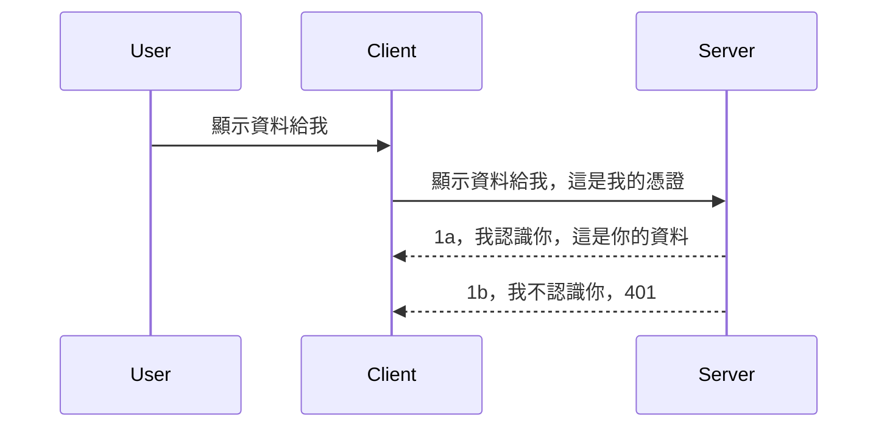

# 簡易認證

MCP SDK 支援使用 OAuth 2.1，說實話這是一個相當複雜的流程，涉及認證伺服器、資源伺服器、提交憑證、取得代碼、用代碼交換權杖，直到你終於能取得資源資料。如果你不熟悉 OAuth，這是一個很棒的實作方式，建議先從一些基本認證開始，逐步建立更好更安全的機制。這就是本章存在的原因，帶領你進入更進階的認證。

## 認證，我們指的是什麼？

認證是 authentication 與 authorization 的縮寫，這裡的概念是我們需要完成兩件事：

- **Authentication**（身份驗證），辨別我們是否讓一個人進入我們的房子，確認他們有權利「在此」，也就是有權存取我們 MCP 伺服器中提供功能的資源伺服器。
- **Authorization**（授權），確認使用者是否有權限使用他所請求的特定資源，例如是這些訂單或這些產品，或是他只能讀取內容卻無法刪除等等。

## 憑證：我們如何告訴系統我們是誰

大多數的網頁開發者都開始以向伺服器提供憑證的角度思考，通常是某個秘密，以判斷他們是否被允許存在於此「身分驗證」。這憑證通常是以 base64 編碼的使用者名稱與密碼，或是唯一識別特定使用者的 API 金鑰。

這會藉由一個叫做「Authorization」的標頭傳送，如下：

```json
{ "Authorization": "secret123" }
```

這通常稱之為基本認證。整個流程如下所示運作：


了解流程後，如何實作呢？大多數的網頁伺服器有個叫做中介軟體（middleware）的概念，這段程式碼會在請求流程中執行，用來驗證憑證。如果憑證有效，就讓請求繼續；若無效，就回傳認證錯誤。來看看實作範例：

**Python**

```python
class AuthMiddleware(BaseHTTPMiddleware):
    async def dispatch(self, request, call_next):

        has_header = request.headers.get("Authorization")
        if not has_header:
            print("-> Missing Authorization header!")
            return Response(status_code=401, content="Unauthorized")

        if not valid_token(has_header):
            print("-> Invalid token!")
            return Response(status_code=403, content="Forbidden")

        print("Valid token, proceeding...")
       
        response = await call_next(request)
        # 新增任何客戶標頭或以某種方式更改回應內容
        return response


starlette_app.add_middleware(CustomHeaderMiddleware)
```

這裡我們：

- 建立一個名為 `AuthMiddleware` 的中介軟體，其 `dispatch` 方法由伺服器呼叫。
- 將這個 middleware 加入到網頁伺服器：

    ```python
    starlette_app.add_middleware(AuthMiddleware)
    ```

- 撰寫驗證邏輯，檢查是否有 Authorization 標頭，並確認密碼有效：

    ```python
    has_header = request.headers.get("Authorization")
    if not has_header:
        print("-> Missing Authorization header!")
        return Response(status_code=401, content="Unauthorized")

    if not valid_token(has_header):
        print("-> Invalid token!")
        return Response(status_code=403, content="Forbidden")
    ```

    如果密碼存在且有效，就呼叫 `call_next` 讓請求繼續，並回傳回應。

    ```python
    response = await call_next(request)
    # 在回應中加入任何客戶標頭或以某種方式更改內容
    return response
    ```

運作方式是當有網路請求進來時，中介軟體會被呼叫，根據實作結果，要嘛讓請求通過，要嘛回傳表示客戶端未被允許繼續的錯誤。

**TypeScript**

使用流行的框架 Express，我們在請求抵達 MCP 伺服器前攔截請求。程式碼如下：

```typescript
function isValid(secret) {
    return secret === "secret123";
}

app.use((req, res, next) => {
    // 1. 有冇授權標頭？
    if(!req.headers["Authorization"]) {
        res.status(401).send('Unauthorized');
    }
    
    let token = req.headers["Authorization"];

    // 2. 檢查有效性。
    if(!isValid(token)) {
        res.status(403).send('Forbidden');
    }

   
    console.log('Middleware executed');
    // 3. 將請求傳遞到請求流程嘅下一步。
    next();
});
```

此程式碼中：

1. 確認是否存在 Authorization 標頭，若無則回傳 401 錯誤。
2. 驗證憑證或令牌是否有效，若無效回傳 403 錯誤。
3. 若有效，將請求繼續傳遞並回傳所請求的資源。

## 練習：實作認證

讓我們用所學試著實作。計劃如下：

伺服器

- 建立網頁伺服器與 MCP 實例。
- 為伺服器實作中介軟體。

客戶端

- 透過標頭送出帶有憑證的網路請求。

### -1- 建立網頁伺服器與 MCP 實例

第一步，我們需要創建網頁伺服器實例與 MCP Server。

**Python**

這裡建立 MCP 伺服器實例，建立 starlette 網頁應用並用 uvicorn 主機托管：

```python
# 建立 MCP 伺服器

app = FastMCP(
    name="MCP Resource Server",
    instructions="Resource Server that validates tokens via Authorization Server introspection",
    host=settings["host"],
    port=settings["port"],
    debug=True
)

# 建立 starlette 網頁應用程式
starlette_app = app.streamable_http_app()

# 使用 uvicorn 提供應用程式服務
async def run(starlette_app):
    import uvicorn
    config = uvicorn.Config(
            starlette_app,
            host=app.settings.host,
            port=app.settings.port,
            log_level=app.settings.log_level.lower(),
        )
    server = uvicorn.Server(config)
    await server.serve()

run(starlette_app)
```

此程式碼中：

- 建立 MCP Server。
- 從 MCP Server 建構 starlette 網頁應用：`app.streamable_http_app()`。
- 使用 uvicorn 以 `server.serve()` 主機並提供服務。

**TypeScript**

這裡建立 MCP 伺服器實例。

```typescript
const server = new McpServer({
      name: "example-server",
      version: "1.0.0"
    });

    // ... 設置伺服器資源、工具和提示 ...
```

必須在 POST /mcp 路由定義中建立 MCP Server，因此我們將上述程式碼移動如下：

```typescript
import express from "express";
import { randomUUID } from "node:crypto";
import { McpServer } from "@modelcontextprotocol/sdk/server/mcp.js";
import { StreamableHTTPServerTransport } from "@modelcontextprotocol/sdk/server/streamableHttp.js";
import { isInitializeRequest } from "@modelcontextprotocol/sdk/types.js"

const app = express();
app.use(express.json());

// 用於按會話ID儲存傳輸的映射
const transports: { [sessionId: string]: StreamableHTTPServerTransport } = {};

// 處理客戶端至伺服器的POST請求
app.post('/mcp', async (req, res) => {
  // 檢查是否存在會話ID
  const sessionId = req.headers['mcp-session-id'] as string | undefined;
  let transport: StreamableHTTPServerTransport;

  if (sessionId && transports[sessionId]) {
    // 重用現有的傳輸
    transport = transports[sessionId];
  } else if (!sessionId && isInitializeRequest(req.body)) {
    // 新的初始化請求
    transport = new StreamableHTTPServerTransport({
      sessionIdGenerator: () => randomUUID(),
      onsessioninitialized: (sessionId) => {
        // 按會話ID儲存傳輸
        transports[sessionId] = transport;
      },
      // DNS重綁定保護預設為關閉，以保持向後兼容性。如果你在本地運行此伺服器
      // 請確保設置：
      // enableDnsRebindingProtection: true,
      // allowedHosts: ['127.0.0.1'],
    });

    // 傳輸關閉時清理資源
    transport.onclose = () => {
      if (transport.sessionId) {
        delete transports[transport.sessionId];
      }
    };
    const server = new McpServer({
      name: "example-server",
      version: "1.0.0"
    });

    // ... 設置伺服器資源、工具及提示 ...

    // 連接至MCP伺服器
    await server.connect(transport);
  } else {
    // 無效的請求
    res.status(400).json({
      jsonrpc: '2.0',
      error: {
        code: -32000,
        message: 'Bad Request: No valid session ID provided',
      },
      id: null,
    });
    return;
  }

  // 處理此請求
  await transport.handleRequest(req, res, req.body);
});

// 用於GET及DELETE請求的可重用處理器
const handleSessionRequest = async (req: express.Request, res: express.Response) => {
  const sessionId = req.headers['mcp-session-id'] as string | undefined;
  if (!sessionId || !transports[sessionId]) {
    res.status(400).send('Invalid or missing session ID');
    return;
  }
  
  const transport = transports[sessionId];
  await transport.handleRequest(req, res);
};

// 處理透過SSE的伺服器至客戶端通知GET請求
app.get('/mcp', handleSessionRequest);

// 處理會話終止的DELETE請求
app.delete('/mcp', handleSessionRequest);

app.listen(3000);
```

你可以看到 MCP Server 建立被移進了 `app.post("/mcp")`。

下一步是建立中介軟體來驗證傳入的憑證。

### -2- 為伺服器實作中介軟體

接著實作中介軟體，我們會建立一個中介軟體去查找 `Authorization` 標頭中的憑證並驗證，如果可接受，請求將繼續執行其應該執行的操作（例如列出工具、讀取資源或客戶端請求的其他 MCP 功能）。

**Python**

建立中介軟體需建立一個繼承 `BaseHTTPMiddleware` 的類別。有兩個重要變數：

- `request`，我們用它來讀取標頭資訊。
- `call_next`，當客戶端帶有我們接受的憑證時呼叫此回調。

首先要處理 `Authorization` 標頭缺失的狀況：

```python
has_header = request.headers.get("Authorization")

# 無標頭存在，回應401失敗，否則繼續。
if not has_header:
    print("-> Missing Authorization header!")
    return Response(status_code=401, content="Unauthorized")
```

此處回傳 401 未授權訊息，因為客戶端認證失敗。

接著若有憑證送出，驗證其有效性：

```python
 if not valid_token(has_header):
    print("-> Invalid token!")
    return Response(status_code=403, content="Forbidden")
```

注意我們回傳 403 禁止存取訊息。以下是完整中介軟體範例：

```python
class AuthMiddleware(BaseHTTPMiddleware):
    async def dispatch(self, request, call_next):

        has_header = request.headers.get("Authorization")
        if not has_header:
            print("-> Missing Authorization header!")
            return Response(status_code=401, content="Unauthorized")

        if not valid_token(has_header):
            print("-> Invalid token!")
            return Response(status_code=403, content="Forbidden")

        print("Valid token, proceeding...")
        print(f"-> Received {request.method} {request.url}")
        response = await call_next(request)
        response.headers['Custom'] = 'Example'
        return response

```

很好，但 `valid_token` 函式是什麼？如下：

```python
# 唔好用喺實際生產 - 改善佢 !!
def valid_token(token: str) -> bool:
    # 刪除 "Bearer " 嘅前綴
    if token.startswith("Bearer "):
        token = token[7:]
        return token == "secret-token"
    return False
```

這顯然還能改進。

重要：絕對不應將這類密鑰寫死於程式碼中。理想做法是從資料來源或身份服務提供者（IDP）取用比較值，甚至更好是讓 IDP 負責驗證。

**TypeScript**

使用 Express，我們呼叫 `use` 方法來使用中介軟體函式。

流程：

- 從請求變數讀取 `Authorization` 屬性中的憑證。
- 驗證憑證，若通過則讓請求繼續，客戶端的 MCP 請求也能正常執行。

此處檢查是否存在 `Authorization` 標頭，若無則阻止請求通過：

```typescript
if(!req.headers["authorization"]) {
    res.status(401).send('Unauthorized');
    return;
}
```

未送出標頭時回傳 401。

接著檢查憑證是否有效，無效就阻止且回應不同訊息：

```typescript
if(!isValid(token)) {
    res.status(403).send('Forbidden');
    return;
} 
```

此處會回傳 403 錯誤。

完整程式碼如下：

```typescript
app.use((req, res, next) => {
    console.log('Request received:', req.method, req.url, req.headers);
    console.log('Headers:', req.headers["authorization"]);
    if(!req.headers["authorization"]) {
        res.status(401).send('Unauthorized');
        return;
    }
    
    let token = req.headers["authorization"];

    if(!isValid(token)) {
        res.status(403).send('Forbidden');
        return;
    }  

    console.log('Middleware executed');
    next();
});
```

我們設置伺服器中介軟體以檢查客戶端送出的憑證。那客戶端本身呢？

### -3- 透過標頭送出含憑證的網路請求

確認客戶端將憑證透過標頭送出。由於我們會使用 MCP 客戶端，需了解如何做到這點。

**Python**

客戶端需傳送含憑證的標頭，如下：

```python
# 不要硬編碼此值，最少應該放在環境變量或更安全的儲存空間中
token = "secret-token"

async with streamablehttp_client(
        url = f"http://localhost:{port}/mcp",
        headers = {"Authorization": f"Bearer {token}"}
    ) as (
        read_stream,
        write_stream,
        session_callback,
    ):
        async with ClientSession(
            read_stream,
            write_stream
        ) as session:
            await session.initialize()
      
            # 待辦事項，你想在客戶端完成的功能，例如列出工具、調用工具等。
```

你可以看到我們如何將 `headers` 設為 `{"Authorization": f"Bearer {token}"}`。

**TypeScript**

這可以分兩步：

1. 用憑證填入設定物件。
2. 將設定物件傳給傳輸層。

```typescript

// 不要像這裡顯示的那樣硬編碼值。至少將其設為環境變量，並在開發模式下使用類似 dotenv 的工具。
let token = "secret123"

// 定義一個客戶端傳輸選項對象
let options: StreamableHTTPClientTransportOptions = {
  sessionId: sessionId,
  requestInit: {
    headers: {
      "Authorization": "secret123"
    }
  }
};

// 將選項對象傳遞給傳輸層
async function main() {
   const transport = new StreamableHTTPClientTransport(
      new URL(serverUrl),
      options
   );
```

如上範例，我們建立 `options` 物件，將標頭放在 `requestInit` 屬性下。

重要：如何改進呢？目前方案有風險。首先，若沒使用 HTTPS，憑證很容易被竊取。即使有 HTTPS，也需要能輕易撤銷令牌，以及加強檢查機制，如檢查請求來源地點、是否頻繁發生（機器人行為）、總之有許多安全考量。

不過對於非常簡單的 API，只想讓已認證者呼叫 API，目前方案算是不錯的起點。

話說回來，我們試著透過標準格式如 JSON Web Token，即 JWT 或稱 JOT 令牌來強化安全。

## JSON Web Tokens，JWT

我們試著改進送出非常簡單的憑證。採用 JWT 馬上帶來哪些好處？

- **安全性提升**。基本認證中，不斷重覆傳送使用者名稱與密碼（或 API 金鑰）的 base64 編碼，風險較高。JWT 會先送使用者名稱與密碼，換回一個令牌，且有時效限制會過期。JWT 允許用細粒度的存取控制，依角色、範圍與權限授予。
- **無狀態與擴展性**。JWT 是自包含的，攜帶全部使用者資訊，省略伺服器端儲存 session。令牌可本地驗證。
- **跨系統與聯合驗證**。JWT 是 Open ID Connect 的核心，廣泛用於已知的身份提供者如 Entra ID、Google 身分驗證與 Auth0。可實現單一登入等企業級功能。
- **模組化與彈性**。JWT 可以配合 API Gateway 例如 Azure API 管理、NGINX 等，也支援使用者驗證情境與服務間通信，包括冒充與委派。
- **效能與快取**。JWT 解碼後可快取，減少解析次數。這有助降低高流量應用伺服器負擔，提高吞吐量。
- **進階功能**。包含內省（驗證令牌有效性）和撤銷（使令牌失效）。

擁有這些優勢，我們看看如何將實作帶到下一階段。

## 將基本認證轉為 JWT

大致上的變更為：

- **學會建構 JWT 令牌**，使其能從客戶端傳送到伺服器。
- **驗證 JWT 令牌**，若有效，讓客戶端取得資源。
- **安全儲存令牌**。我們如何存放此令牌。
- **保護路由**。需保護路由，尤其是 MCP 特定功能。
- **加入刷新令牌**。確保建立短期有效的存取令牌並設置長效刷新令牌可取得新令牌，此外要有刷新端點及輪替機制。

### -1- 建構 JWT 令牌

JWT 由以下部份組成：

- **標頭**，使用的算法與令牌類型。
- **有效載荷**，宣告（claims），例如 sub（此令牌代表的使用者或實體，通常是 userid）、exp（到期時間）、role（角色）。
- **簽章**，用密鑰或私鑰簽名。

我們需建立標頭、載荷和編碼令牌。

**Python**

```python

import jwt
import jwt
from jwt.exceptions import ExpiredSignatureError, InvalidTokenError
import datetime

# 用於簽署 JWT 的祕密金鑰
secret_key = 'your-secret-key'

header = {
    "alg": "HS256",
    "typ": "JWT"
}

# 用戶資訊及其權利與過期時間
payload = {
    "sub": "1234567890",               # 主旨（用戶 ID）
    "name": "User Userson",                # 自訂聲明
    "admin": True,                     # 自訂聲明
    "iat": datetime.datetime.utcnow(),# 發行時間
    "exp": datetime.datetime.utcnow() + datetime.timedelta(hours=1)  # 到期時間
}

# 編碼它
encoded_jwt = jwt.encode(payload, secret_key, algorithm="HS256", headers=header)
```

程式碼中：

- 定義標頭為 HS256 算法與 JWT 類型。
- 建立載荷，包含主體（user id）、使用者名稱、角色、發行時間與過期時間，實現有時效性的設計。

**TypeScript**

這裡我們要用一些相依套件以建構 JWT 令牌。

相依套件

```sh

npm install jsonwebtoken
npm install --save-dev @types/jsonwebtoken
```

安裝依賴後，建立標頭、載荷及編碼令牌。

```typescript
import jwt from 'jsonwebtoken';

const secretKey = 'your-secret-key'; // 在生產環境使用環境變數

// 定義載荷
const payload = {
  sub: '1234567890',
  name: 'User usersson',
  admin: true,
  iat: Math.floor(Date.now() / 1000), // 發行時間
  exp: Math.floor(Date.now() / 1000) + 60 * 60 // 1小時後過期
};

// 定義標頭（可選，jsonwebtoken 設置預設值）
const header = {
  alg: 'HS256',
  typ: 'JWT'
};

// 創建令牌
const token = jwt.sign(payload, secretKey, {
  algorithm: 'HS256',
  header: header
});

console.log('JWT:', token);
```

此令牌：

使用 HS256 簽署
有效期一小時
包含子項如 sub、name、admin、iat 與 exp。

### -2- 驗證令牌

伺服器端需驗證令牌，確認客戶端傳來的令牌有效。我們應該檢查結構與有效性，也建議再確認此令牌代表的使用者是否存在系統及其權限。

驗證先將令牌解碼，以便讀取與檢查：

**Python**

```python

# 解碼並驗證 JWT
try:
    decoded = jwt.decode(token, secret_key, algorithms=["HS256"])
    print("✅ Token is valid.")
    print("Decoded claims:")
    for key, value in decoded.items():
        print(f"  {key}: {value}")
except ExpiredSignatureError:
    print("❌ Token has expired.")
except InvalidTokenError as e:
    print(f"❌ Invalid token: {e}")

```

此程式中，我們呼叫 `jwt.decode`，輸入令牌、密鑰與演算法。使用 try-catch 來捕捉驗證錯誤。

**TypeScript**

呼叫 `jwt.verify` 取得可分析的解碼令牌。若失敗，代表令牌格式有誤或已無效。

```typescript

try {
  const decoded = jwt.verify(token, secretKey);
  console.log('Decoded Payload:', decoded);
} catch (err) {
  console.error('Token verification failed:', err);
}
```

提醒：如前所述，我們應添加其他檢查，確保令牌指向我們系統中的使用者，且使用者擁有相符權限。
接下來，讓我們來看看基於角色的訪問控制，也稱為 RBAC。

## 添加基於角色的訪問控制

這個概念是我們想表達不同角色有不同的權限。例如，我們假設管理員可以做所有事情，普通用戶可以讀寫，訪客只能讀取。因此，這裡有一些可能的權限等級：

- Admin.Write  
- User.Read  
- Guest.Read  

讓我們看看如何用中介軟件實現這樣的控制。中介軟件可以按路由添加，也可以對所有路由添加。

**Python**

```python
from starlette.middleware.base import BaseHTTPMiddleware
from starlette.responses import JSONResponse
import jwt

# 唔好將秘密寫喺代碼入面，呢個只係示範用途。請從安全嘅地方讀取。
SECRET_KEY = "your-secret-key" # 請將呢個放入環境變量中
REQUIRED_PERMISSION = "User.Read"

class JWTPermissionMiddleware(BaseHTTPMiddleware):
    async def dispatch(self, request, call_next):
        auth_header = request.headers.get("Authorization")
        if not auth_header or not auth_header.startswith("Bearer "):
            return JSONResponse({"error": "Missing or invalid Authorization header"}, status_code=401)

        token = auth_header.split(" ")[1]
        try:
            decoded = jwt.decode(token, SECRET_KEY, algorithms=["HS256"])
        except jwt.ExpiredSignatureError:
            return JSONResponse({"error": "Token expired"}, status_code=401)
        except jwt.InvalidTokenError:
            return JSONResponse({"error": "Invalid token"}, status_code=401)

        permissions = decoded.get("permissions", [])
        if REQUIRED_PERMISSION not in permissions:
            return JSONResponse({"error": "Permission denied"}, status_code=403)

        request.state.user = decoded
        return await call_next(request)


```
  
有幾種不同的方法像下面這樣添加中介軟件：

```python

# 方案 1：在建立 starlette 應用時加入中介軟件
middleware = [
    Middleware(JWTPermissionMiddleware)
]

app = Starlette(routes=routes, middleware=middleware)

# 方案 2：在 starlette 應用已建構後加入中介軟件
starlette_app.add_middleware(JWTPermissionMiddleware)

# 方案 3：每條路由加入中介軟件
routes = [
    Route(
        "/mcp",
        endpoint=..., # 處理程序
        middleware=[Middleware(JWTPermissionMiddleware)]
    )
]
```
  
**TypeScript**

我們可以使用 `app.use` 以及一個會對所有請求執行的中介軟件。

```typescript
app.use((req, res, next) => {
    console.log('Request received:', req.method, req.url, req.headers);
    console.log('Headers:', req.headers["authorization"]);

    // 1. 檢查是否已送出授權標頭

    if(!req.headers["authorization"]) {
        res.status(401).send('Unauthorized');
        return;
    }
    
    let token = req.headers["authorization"];

    // 2. 檢查令牌是否有效
    if(!isValid(token)) {
        res.status(403).send('Forbidden');
        return;
    }  

    // 3. 檢查令牌用戶是否存在於我們系統中
    if(!isExistingUser(token)) {
        res.status(403).send('Forbidden');
        console.log("User does not exist");
        return;
    }
    console.log("User exists");

    // 4. 驗證令牌是否具有正確的權限
    if(!hasScopes(token, ["User.Read"])){
        res.status(403).send('Forbidden - insufficient scopes');
    }

    console.log("User has required scopes");

    console.log('Middleware executed');
    next();
});

```
  
中介軟件可以做很多事情，我們的中介軟件應該做的包括：

1. 檢查是否存在授權標頭  
2. 檢查 token 是否有效，我們調用 `isValid` 方法來檢查 JWT token 的完整性和有效性。  
3. 驗證用戶是否存在於我們的系統中，我們應該檢查這點。

   ```typescript
    // 資料庫中的用戶
   const users = [
     "user1",
     "User usersson",
   ]

   function isExistingUser(token) {
     let decodedToken = verifyToken(token);

     // 待辦，檢查用戶是否存在於資料庫
     return users.includes(decodedToken?.name || "");
   }
   ```
  
   上面，我們創建了一個非常簡單的 `users` 列表，顯然應該存儲在資料庫中。

4. 此外，我們還應該檢查 token 是否擁有正確的權限。

   ```typescript
   if(!hasScopes(token, ["User.Read"])){
        res.status(403).send('Forbidden - insufficient scopes');
   }
   ```
  
   在中介軟件的代碼中，我們檢查 token 是否包含 User.Read 權限，如果沒有則回傳 403 錯誤。以下是 `hasScopes` 輔助方法。

   ```typescript
   function hasScopes(scope: string, requiredScopes: string[]) {
     let decodedToken = verifyToken(scope);
    return requiredScopes.every(scope => decodedToken?.scopes.includes(scope));
  }  
   ```

Have a think which additional checks you should be doing, but these are the absolute minimum of checks you should be doing.

Using Express as a web framework is a common choice. There are helpers library when you use JWT so you can write less code.

- `express-jwt`, helper library that provides a middleware that helps decode your token.
- `express-jwt-permissions`, this provides a middleware `guard` that helps check if a certain permission is on the token.

Here's what these libraries can look like when used:

```typescript
const express = require('express');
const jwt = require('express-jwt');
const guard = require('express-jwt-permissions')();

const app = express();
const secretKey = 'your-secret-key'; // put this in env variable

// Decode JWT and attach to req.user
app.use(jwt({ secret: secretKey, algorithms: ['HS256'] }));

// Check for User.Read permission
app.use(guard.check('User.Read'));

// multiple permissions
// app.use(guard.check(['User.Read', 'Admin.Access']));

app.get('/protected', (req, res) => {
  res.json({ message: `Welcome ${req.user.name}` });
});

// Error handler
app.use((err, req, res, next) => {
  if (err.code === 'permission_denied') {
    return res.status(403).send('Forbidden');
  }
  next(err);
});

```
  
現在你已經看到如何使用中介軟件進行身份驗證和授權，那 MCP 呢？它會改變我們的身份驗證方式嗎？讓我們在下一節中看看。

### -3- 將 RBAC 添加到 MCP

到目前為止，你已經看到如何通過中介軟件添加 RBAC，但對於 MCP，沒有簡單的方法可以為每個 MCP 功能添加 RBAC，那我們該怎麼辦？我們必須加入類似下面的程式碼，檢查客戶端是否有權調用特定工具：

你有幾種方式來完成每個功能的 RBAC，這裡列出一些：

- 對每個工具、資源、提示添加檢查，確保檢查權限等級。

   **python**

   ```python
   @tool()
   def delete_product(id: int):
      try:
          check_permissions(role="Admin.Write", request)
      catch:
        pass # 客戶端授權失敗，拋出授權錯誤
   ```
  
   **typescript**

   ```typescript
   server.registerTool(
    "delete-product",
    {
      title: Delete a product",
      description: "Deletes a product",
      inputSchema: { id: z.number() }
    },
    async ({ id }) => {
      
      try {
        checkPermissions("Admin.Write", request);
        // 待辦，將 ID 發送到 productService 和遠端入口
      } catch(Exception e) {
        console.log("Authorization error, you're not allowed");  
      }

      return {
        content: [{ type: "text", text: `Deletected product with id ${id}` }]
      };
    }
   );
   ```
  

- 使用進階伺服器方式和請求處理程序，減少需要檢查的地方數量。

   **Python**

   ```python
   
   tool_permission = {
      "create_product": ["User.Write", "Admin.Write"],
      "delete_product": ["Admin.Write"]
   }

   def has_permission(user_permissions, required_permissions) -> bool:
      # user_permissions: 使用者擁有的權限清單
      # required_permissions: 工具所需的權限清單
      return any(perm in user_permissions for perm in required_permissions)

   @server.call_tool()
   async def handle_call_tool(
     name: str, arguments: dict[str, str] | None
   ) -> list[types.TextContent]:
    # 假設 request.user.permissions 是使用者的權限清單
     user_permissions = request.user.permissions
     required_permissions = tool_permission.get(name, [])
     if not has_permission(user_permissions, required_permissions):
        # 拋出錯誤「你沒有權限呼叫工具 {name}」
        raise Exception(f"You don't have permission to call tool {name}")
     # 繼續並呼叫工具
     # ...
   ```   
      

   **TypeScript**

   ```typescript
   function hasPermission(userPermissions: string[], requiredPermissions: string[]): boolean {
       if (!Array.isArray(userPermissions) || !Array.isArray(requiredPermissions)) return false;
       // 如果用戶擁有至少一個必需的權限，則返回真
       
       return requiredPermissions.some(perm => userPermissions.includes(perm));
   }
  
   server.setRequestHandler(CallToolRequestSchema, async (request) => {
      const { params: { name } } = request;
  
      let permissions = request.user.permissions;
  
      if (!hasPermission(permissions, toolPermissions[name])) {
         return new Error(`You don't have permission to call ${name}`);
      }
  
      // 繼續..
   });
   ```
  
   注意，你需要確保你的中介軟件為請求的 user 屬性分配了解碼後的 token，這樣上面的代碼才簡單。

### 小結

現在我們已經討論了如何一般性地為 RBAC 添加支持，特別是對 MCP，該是你自己嘗試實作安全機制的時候，確保你理解介紹給你的概念。

## 作業 1：使用基礎驗證構建 MCP 伺服器和 MCP 客戶端

這裡你會學到如何通過標頭傳送憑證。

## 解決方案 1

[Solution 1](./code/basic/README.md)

## 作業 2：將作業 1 的解決方案升級為使用 JWT

採用第一個方案，但這一次，我們來改進它。

不再使用 Basic Auth，而是使用 JWT。

## 解決方案 2

[Solution 2](./solution/jwt-solution/README.md)

## 挑戰

為我們在「將 RBAC 添加到 MCP」一節描述的每個工具增加 RBAC。

## 總結

希望你在本章學到了很多，從完全沒有安全，到基本安全，再到 JWT 以及它如何被添加到 MCP。

我們搭建了使用自訂 JWT 的堅實基礎，但隨著規模擴大，我們正朝著標準化的身份模型前進。採用像 Entra 或 Keycloak 這樣的身分提供者( IdP )，讓我們可以將 token 發行、驗證和生命週期管理委託給可信的平台，專注於應用邏輯和用戶體驗。

對此，我們有一個更[進階的 Entra 章節](../../05-AdvancedTopics/mcp-security-entra/README.md)

## 接下來

- 下一步：[設定 MCP 主機](../12-mcp-hosts/README.md)

---

<!-- CO-OP TRANSLATOR DISCLAIMER START -->
**免責聲明**：
本文件乃使用人工智能翻譯服務 [Co-op Translator](https://github.com/Azure/co-op-translator) 翻譯而成。儘管我們力求準確，但請注意自動翻譯可能包含錯誤或不準確之處。原始文件之母語版本應視為權威來源。對於重要資訊，建議採用專業人工翻譯。我們不對因使用本翻譯而引致的任何誤解或誤釋承擔責任。
<!-- CO-OP TRANSLATOR DISCLAIMER END -->