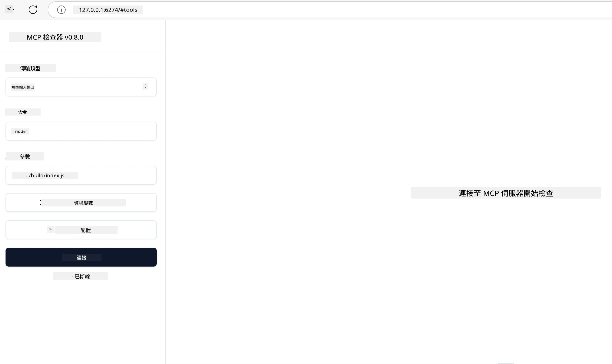

# 實務實作

[](https://youtu.be/vCN9-mKBDfQ)

_（點擊上方圖片觀看本課程影片）_

實務實作是 Model Context Protocol (MCP) 威力具體展現的地方。理解 MCP 背後的理論和架構當然重要，但真正的價值在於將這些概念應用於開發、測試和部署解決真實世界問題的方案。本章節填補了概念性知識與實際開發之間的鴻溝，帶領你完成基於 MCP 的應用程式開發流程。

無論你是在開發智慧助理、將 AI 整合進企業工作流程，還是為資料處理打造自訂工具，MCP 都提供了彈性的基礎。它的語言無關設計以及支援多種熱門程式語言的官方 SDK，使廣大開發者都能輕鬆上手。透過這些 SDK，你可以快速製作原型、反覆迭代，並在不同平台與環境中擴展解決方案。

在接下來的章節中，你會看到實務範例、示範程式碼與部署策略，展示如何以 C＃、Java（配合 Spring）、TypeScript、JavaScript 及 Python 實作 MCP。你也會學習如何偵錯與測試 MCP 伺服器、管理 API，以及使用 Azure 雲端部署解決方案。這些實作資源將加速你的學習，幫助你自信地打造穩健且可投入生產的 MCP 應用程式。

## 概覽

本課程專注於在多種程式語言中實作 MCP 的實務面向。我們將探討如何使用 C＃、Java（Spring）、TypeScript、JavaScript 及 Python 的 MCP SDK 打造穩健的應用程式，偵錯與測試 MCP 伺服器，並建立可重用的資源、提示與工具。

## 學習目標

完成本課程後，你將能夠：

- 使用官方 SDK 在多種程式語言中實作 MCP 解決方案
- 系統化偵錯與測試 MCP 伺服器
- 建立與使用伺服器功能（資源、提示與工具）
- 設計複雜任務的有效 MCP 工作流程
- 優化 MCP 實作的效能與可靠性

## 官方 SDK 資源

Model Context Protocol 提供多種程式語言的官方 SDK（依循 [MCP 規範 2025-11-25](https://spec.modelcontextprotocol.io/specification/2025-11-25/)）：

- [C# SDK](https://github.com/modelcontextprotocol/csharp-sdk)
- [Java（Spring）SDK](https://github.com/modelcontextprotocol/java-sdk) **注意：** 需依賴 [Project Reactor](https://projectreactor.io)。（參考 [討論議題 246](https://github.com/orgs/modelcontextprotocol/discussions/246)。）
- [TypeScript SDK](https://github.com/modelcontextprotocol/typescript-sdk)
- [Python SDK](https://github.com/modelcontextprotocol/python-sdk)
- [Kotlin SDK](https://github.com/modelcontextprotocol/kotlin-sdk)
- [Go SDK](https://github.com/modelcontextprotocol/go-sdk)

## 使用 MCP SDK

本節展示在多種程式語言中實作 MCP 的實務範例。你可以在 `samples` 目錄中，依語言查看範例程式碼。

### 可用範例

本專案包含以下語言的 [範例實作](../../../04-PracticalImplementation/samples)：

- [C#](./samples/csharp/README.md)
- [Java with Spring](./samples/java/containerapp/README.md)
- [TypeScript](./samples/typescript/README.md)
- [JavaScript](./samples/javascript/README.md)
- [Python](./samples/python/README.md)

每個範例均展示該語言與生態系的主要 MCP 概念與實作模式。

### 實務指南

額外實務 MCP 實作指南：

- [分頁與大量結果集](./pagination/README.md) - 處理工具、資源與大型資料集的基於游標的分頁

## 核心伺服器功能

MCP 伺服器能實作以下任意功能組合：

### 資源

資源提供使用者或 AI 模型可用的上下文與資料：

- 文件存放庫
- 知識庫
- 結構化資料來源
- 檔案系統

### 提示

提示為對使用者的模板訊息與工作流程：

- 預先定義的對話模板
- 引導式互動模式
- 專門的對話結構

### 工具

工具是 AI 模型可執行的功能：

- 資料處理工具
- 外部 API 整合
- 計算能力
- 搜尋功能

## 範例實作：C# 實作

官方 C# SDK 倉庫包含多個示例，展示 MCP 的各個面向：

- **基礎 MCP 客戶端**：示範如何建立 MCP 客戶端並呼叫工具
- **基礎 MCP 伺服器**：最小化伺服器實作與基本工具註冊
- **進階 MCP 伺服器**：具備工具註冊、認證與錯誤處理的完整伺服器
- **ASP.NET 整合**：展示 ASP.NET Core 整合範例
- **工具實作模式**：多種不同複雜度的工具實作範式

MCP C# SDK 處於預覽階段，API 可能變動。我們將持續更新本部落格，隨著 SDK 演進。

### 主要功能

- [C# MCP Nuget ModelContextProtocol](https://www.nuget.org/packages/ModelContextProtocol)
- 建立你的[第一個 MCP 伺服器](https://devblogs.microsoft.com/dotnet/build-a-model-context-protocol-mcp-server-in-csharp/)。

完整的 C# 實作範例，請參考 [官方 C# SDK 範例倉庫](https://github.com/modelcontextprotocol/csharp-sdk)

## 範例實作：Java with Spring 實作

Java with Spring SDK 提供企業級 MCP 實作方案，具備堅實功能。

### 主要功能

- Spring Framework 整合
- 強大的類型安全
- 反應式程式支援
- 完整的錯誤處理

完整的 Java with Spring 實作範例，請參考 samples 目錄中的 [Java with Spring 範例](samples/java/containerapp/README.md)。

## 範例實作：JavaScript 實作

JavaScript SDK 提供輕量且彈性的 MCP 實作方法。

### 主要功能

- 支援 Node.js 與瀏覽器
- 使用 Promise 的 API
- 易於與 Express 及其他框架整合
- 支援 WebSocket 流式傳輸

完整 JavaScript 實作範例，請參考 samples 目錄中的 [JavaScript 範例](samples/javascript/README.md)。

## 範例實作：Python 實作

Python SDK 提供優雅貼近 Pythonic 的 MCP 實作方式，並能整合優異的機器學習框架。

### 主要功能

- 支援 asyncio 的 async/await
- FastAPI 整合
- 簡單的工具註冊
- 原生整合熱門機器學習庫

完整 Python 實作範例，請參考 samples 目錄中的 [Python 範例](samples/python/README.md)。

## API 管理

Azure API 管理是保障 MCP 伺服器安全的良方。核心想法是將 Azure API 管理實例放置在 MCP 伺服器前端，並讓它管理你可能需要的功能，如：

- 限速
- 令牌管理
- 監控
- 負載平衡
- 安全性

### Azure 範例

以下為 Azure 範例，實際操作即是 [建立 MCP 伺服器並用 Azure API 管理保護它](https://github.com/Azure-Samples/remote-mcp-apim-functions-python)。

請看下方圖片中的授權流程：


圖中發生的流程：

- 使用 Microsoft Entra 進行認證/授權。
- Azure API 管理作為閘道，透過策略導向與管理流量。
- Azure 監控紀錄所有請求以供後續分析。

#### 授權流程

我們來更詳細看看授權流程：


#### MCP 授權規範

了解更多關於 [MCP 授權規範](https://spec.modelcontextprotocol.io/specification/2025-11-25/basic/authorization/)

## 將遠端 MCP 伺服器部署到 Azure

讓我們嘗試部署之前提到的範例：

1. 複製倉庫

    ```bash
    git clone https://github.com/Azure-Samples/remote-mcp-apim-functions-python.git
    cd remote-mcp-apim-functions-python
    ```

1. 註冊 `Microsoft.App` 資源提供者。

   - 若使用 Azure CLI，執行 `az provider register --namespace Microsoft.App --wait`。
   - 若使用 Azure PowerShell，執行 `Register-AzResourceProvider -ProviderNamespace Microsoft.App`，稍等後透過 `(Get-AzResourceProvider -ProviderNamespace Microsoft.App).RegistrationState` 檢查註冊是否完成。

1. 執行此 [azd](https://aka.ms/azd) 指令以配置 API 管理服務、函式應用（含程式碼）及其他必需的 Azure 資源

    ```shell
    azd up
    ```

    該指令將在 Azure 上部署所有雲端資源

### 使用 MCP Inspector 測試你的伺服器

1. 在 **新終端機視窗**，安裝並執行 MCP Inspector

    ```shell
    npx @modelcontextprotocol/inspector
    ```

    你應該會看到類似下方介面：

    

1. 按住 CTRL 點擊，從應用程式顯示的網址（例如 [http://127.0.0.1:6274/#resources](http://127.0.0.1:6274/#resources)）載入 MCP Inspector 網頁應用程式
1. 將傳輸類型設為 `SSE`
1. 將 URL 設定為執行 `azd up` 後顯示的 API 管理 SSE 端點，然後 **連線**：

    ```shell
    https://<apim-servicename-from-azd-output>.azure-api.net/mcp/sse
    ```

1. **列出工具**。點擊工具並 **執行工具**。

若每個步驟都成功，你現在應該已連線到 MCP 伺服器並成功呼叫某個工具。

## Azure 的 MCP 伺服器

[Remote-mcp-functions](https://github.com/Azure-Samples/remote-mcp-functions-dotnet)：此組倉庫為使用 Azure Functions 以 Python、C# .NET 或 Node/TypeScript 快速建置並部署自訂遠端 MCP（Model Context Protocol）伺服器的範本。

此範例提供完整解決方案，允許開發者：

- 本機建置與執行：於本機開發與偵錯 MCP 伺服器
- 部署至 Azure：可使用簡單的 azd up 指令輕鬆部署雲端
- 客戶端連線：從各種客戶端（包括 VS Code 的 Copilot 代理模式及 MCP Inspector 工具）連接 MCP 伺服器

### 主要功能

- 安全設計：MCP 伺服器利用金鑰與 HTTPS 保障安全
- 認證選項：支援透過內建認證及/或 API 管理的 OAuth
- 網路隔離：允許使用 Azure 虛擬網路（VNET）隔離網路
- 無伺服器架構：利用 Azure Functions 進行擴展性事件驅動執行
- 本地開發：完整本地開發與偵錯支持
- 簡便部署：精簡的 Azure 部署流程

此倉庫包含所有必要的配置檔、原始碼與基礎架構定義，讓你迅速開始生產就緒 MCP 伺服器實作。

- [Azure 遠端 MCP Functions Python](https://github.com/Azure-Samples/remote-mcp-functions-python) - 使用 Azure Functions 與 Python 的 MCP 範例實作

- [Azure 遠端 MCP Functions .NET](https://github.com/Azure-Samples/remote-mcp-functions-dotnet) - 使用 Azure Functions 與 C# .NET 的 MCP 範例實作

- [Azure 遠端 MCP Functions Node/Typescript](https://github.com/Azure-Samples/remote-mcp-functions-typescript) - 使用 Azure Functions 與 Node/TypeScript 的 MCP 範例實作

## 重要重點

- MCP SDK 在多種語言提供特定工具，以實作堅固的 MCP 解決方案
- 偵錯與測試過程對穩定 MCP 應用至關重要
- 可重用的提示模板促使 AI 互動一致
- 良好設計的工作流程能協調多工具執行複雜任務
- 實作 MCP 解決方案需顧及安全性、效能及錯誤處理

## 練習

設計一個可解決你領域中真實問題的實務 MCP 工作流程：

1. 確定 3-4 個可幫助解決問題的工具
2. 繪製展示這些工具如何互動的工作流程圖
3. 用你偏好的語言實作其中一個工具的基本版本
4. 建立一個提示模板，幫助模型有效使用該工具

## 其他資源

---

## 下一步

下一章： [進階主題](../05-AdvancedTopics/README.md)

---

<!-- CO-OP TRANSLATOR DISCLAIMER START -->
**免責聲明**：
本文件乃使用 AI 翻譯服務 [Co-op Translator](https://github.com/Azure/co-op-translator) 進行翻譯。雖然我們力求準確，但請注意自動翻譯可能包含錯誤或不準確之處。原始文件之本地語言版本應視為權威來源。對於重要資訊，建議採用專業人工翻譯。我們不對因使用本翻譯而引起之任何誤解或誤譯承擔責任。
<!-- CO-OP TRANSLATOR DISCLAIMER END -->