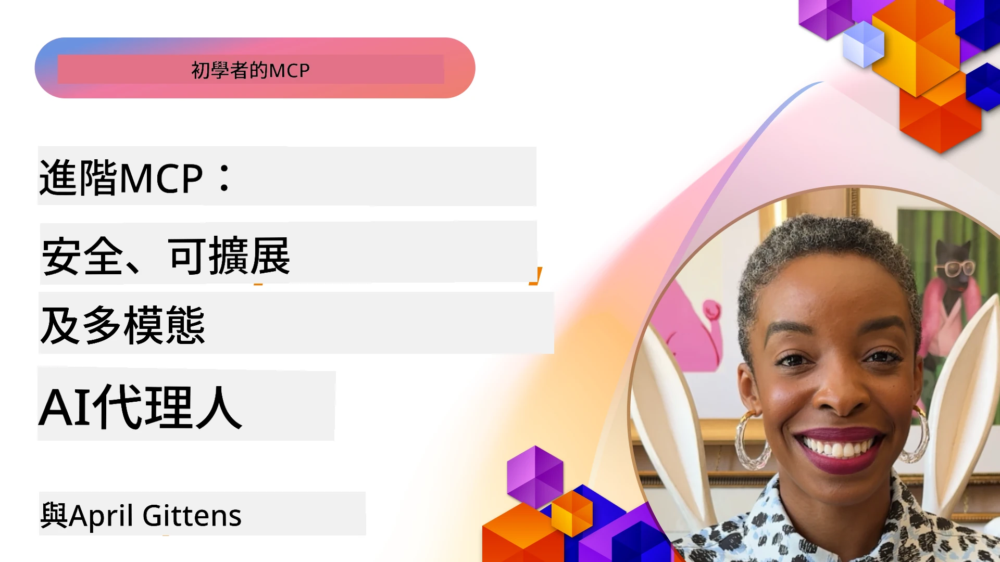

# MCP 進階主題

_(點擊上方圖片觀看本課程影片)_

本章涵蓋 Model Context Protocol (MCP) 實作的一系列進階主題，包括多模態整合、可擴展性、安全最佳實踐及企業整合。這些主題對於構建穩健且具生產力的 MCP 應用程式，以滿足現代 AI 系統需求至關重要。

## 概覽

本課程探討 MCP 實作中的進階概念，聚焦多模態整合、可擴展性、安全最佳實踐及企業整合。這些主題是構建能夠處理企業環境複雜需求的生產級 MCP 應用程式的關鍵。

## 學習目標

完成本課程後，您將能夠：

- 在 MCP 架構中實作多模態功能
- 設計適用於高負載場景的可擴展 MCP 架構
- 應用符合 MCP 安全原則的安全最佳實踐
- 將 MCP 與企業 AI 系統及框架整合
- 優化生產環境中的效能與可靠性

## 課程與範例專案

| 連結 | 標題 | 說明 |
|------|-------|-------------|
| [5.1 Integration with Azure](./mcp-integration/README.md) | 與 Azure 整合 | 學習如何將您的 MCP Server 整合到 Azure |
| [5.2 Multi modal sample](./mcp-multi-modality/README.md) | MCP 多模態範例 | 音訊、圖像與多模態回應範例 |
| [5.3 MCP OAuth2 sample](../../../05-AdvancedTopics/mcp-oauth2-demo) | MCP OAuth2 示範 | 最小化 Spring Boot 應用程式示範 MCP 之 OAuth2，涵蓋授權與資源伺服器。展示安全的令牌發行、受保護端點、Azure Container Apps 部署及 API 管理整合。 |
| [5.4 Root Contexts](./mcp-root-contexts/README.md) | 根上下文 | 進一步了解根上下文及其實作方式 |
| [5.5 Routing](./mcp-routing/README.md) | 路由 | 學習不同類型的路由 |
| [5.6 Sampling](./mcp-sampling/README.md) | 取樣 | 學習如何進行取樣 |
| [5.7 Scaling](./mcp-scaling/README.md) | 擴展 | 了解擴展相關知識 |
| [5.8 Security](./mcp-security/README.md) | 安全性 | 保護您的 MCP Server |
| [5.9 Web Search sample](./web-search-mcp/README.md) | 網路搜尋 MCP | Python MCP 伺服器與用戶端整合 SerpAPI，實現即時網頁、新聞、產品搜尋及問答。展示多工具協調、外部 API 整合及強健的錯誤處理。 |
| [5.10 Realtime Streaming](./mcp-realtimestreaming/README.md) | 串流 | 即時資料串流在當今資料驅動世界中不可或缺，企業與應用需快速取得資訊以做出即時決策。|
| [5.11 Realtime Web Search](./mcp-realtimesearch/README.md) | 即時網路搜尋 | MCP 如何透過提供標準化的上下文管理方法，改變即時網路搜尋於 AI 模型、搜尋引擎及應用間的協作。| 
| [5.12  Entra ID Authentication for Model Context Protocol Servers](./mcp-security-entra/README.md) | Entra ID 認證 | Microsoft Entra ID 提供強大雲端身份識別與存取管理解決方案，確保僅授權使用者與應用可與您的 MCP 伺服器互動。|
| [5.13 Azure AI Foundry Agent Integration](./mcp-foundry-agent-integration/README.md) | Azure AI Foundry 整合 | 學習如何將 Model Context Protocol 伺服器與 Azure AI Foundry 代理整合，使得強大工具協調及具標準化外部資料源連結的企業 AI 能力成為可能。|
| [5.14 Context Engineering](./mcp-contextengineering/README.md) | 上下文工程 | MCP 伺服器未來的上下文工程技術機會，包括上下文優化、動態上下文管理，以及 MCP 框架中有效提示工程策略。|
| [5.15 MCP Custom Transport](./mcp-transport/README.md) | 自訂傳輸 | 學習如何為特殊 MCP 通訊場景實作自訂傳輸機制。|
| [5.16 Protocol Features Deep Dive](./mcp-protocol-features/README.md) | 協定功能深入探討 | 精通進階協定功能，包括進度通知、請求取消、資源範本及錯誤處理模式。|

> **MCP 規範 2025-11-25 新增**：規範現已包含試驗性支援 **任務**（具進度追蹤的長時間操作）、**工具註解**（安全相關工具行為元資料）、**URL 模式引導**（向用戶端請求特定 URL 內容）及增強 **根上下文**（用於工作區上下文管理）。完整細節請參閱 [MCP 規範變更記錄](https://spec.modelcontextprotocol.io/)。

## 額外參考資料

欲取得最新進階 MCP 主題資訊，請參考：
- [MCP 文件](https://modelcontextprotocol.io/)
- [MCP 規範 (2025-11-25)](https://spec.modelcontextprotocol.io/specification/2025-11-25/)
- [GitHub 儲存庫](https://github.com/modelcontextprotocol)
- [OWASP MCP 十大](https://microsoft.github.io/mcp-azure-security-guide/mcp/) - 安全風險與緩解措施
- [MCP 安全峰會工作坊 (Sherpa)](https://azure-samples.github.io/sherpa/) - 實作安全訓練

## 主要重點歸納

- 多模態 MCP 實現擴展 AI 功能超越文字處理
- 可擴展性為企業部署核心，可透過水平及垂直擴展實現
- 完整安全措施保護資料並確保正確存取控制
- 與 Azure OpenAI 及 Microsoft AI Foundry 等平台的企業整合提升 MCP 能力
- 進階 MCP 實現受益於優化架構與謹慎資源管理

## 練習

為特定使用案例設計企業級 MCP 實現：

1. 確認使用案例的多模態需求
2. 概述保護敏感資料所需的安全控管
3. 設計可處理變動負載的可擴展架構
4. 規劃與企業 AI 系統的整合點
5. 紀錄潛在效能瓶頸及緩解策略

## 額外資源

- [Azure OpenAI 文件](https://learn.microsoft.com/en-us/azure/ai-services/openai/)
- [Microsoft AI Foundry 文件](https://learn.microsoft.com/en-us/ai-services/)

---

## 下一步

從本模組的課程開始探索：[5.1 MCP Integration](./mcp-integration/README.md)

完成本模組後，繼續學習：[第 6 模組：社群貢獻](../06-CommunityContributions/README.md)

---

<!-- CO-OP TRANSLATOR DISCLAIMER START -->
**免責聲明**：
本文件乃使用人工智能翻譯服務 [Co-op Translator](https://github.com/Azure/co-op-translator) 進行翻譯。儘管我們努力追求準確性，但請注意，自動翻譯可能包含錯誤或不準確之處。原文文件的母語版本應視為唯一權威來源。對於重要資訊，建議採用專業人工翻譯。我們對因使用此翻譯而產生的任何誤解或誤讀概不負責。
<!-- CO-OP TRANSLATOR DISCLAIMER END -->