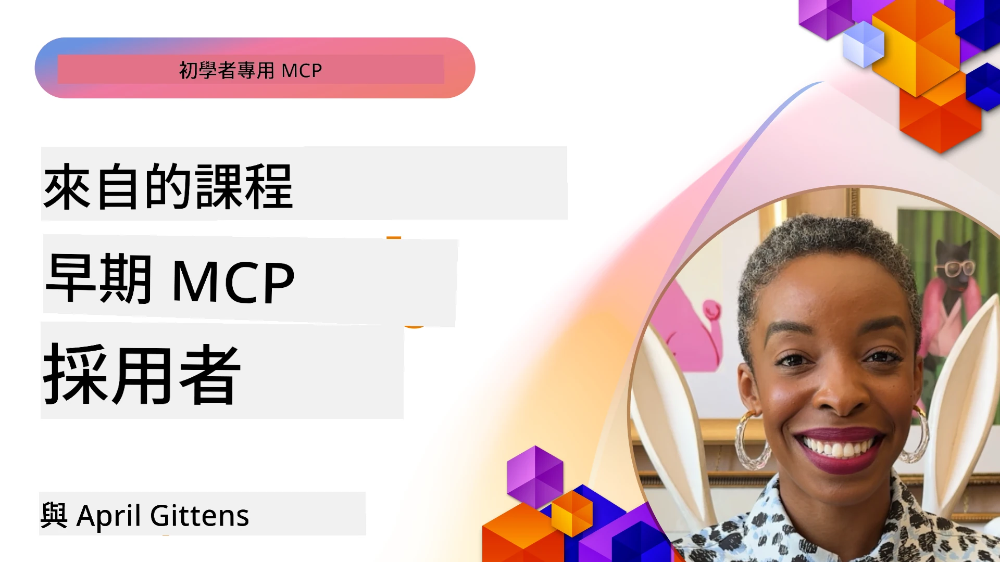

# 🌟 早期採用者的經驗教訓

[](https://youtu.be/jds7dSmNptE)

_(點擊上方圖片觀看本課程影片)_

## 🎯 本單元涵蓋內容

本單元探討真實組織與開發人員如何利用模型上下文協定 (MCP) 來解決實際挑戰並推動創新。透過詳細案例研究、實作專案與實務範例，您將發現 MCP 如何實現安全、可擴展的 AI 整合，連接大型語言模型、工具與企業資料。

### 📚 觀看 MCP 實際應用

想看看這些原則如何運用在可投入生產的工具中嗎？請參閱我們的 [**10 個改變開發者生產力的 Microsoft MCP 伺服器**](microsoft-mcp-servers.md)，展示您今日即可使用的真實 Microsoft MCP 伺服器。

## 概述

本課程探討早期採用者如何利用模型上下文協定 (MCP) 解決產業中的實際挑戰並推動創新。透過詳細案例研究與實作專案，您將看到 MCP 如何實現標準化、安全且可擴展的 AI 整合——在統一框架內連接大型語言模型、工具及企業資料。您將獲得設計與建構 MCP 解決方案的實務經驗，學習已證實的實作模式，並掌握在生產環境中部署 MCP 的最佳實務。課程亦強調新興趨勢、未來方向及開源資源，助您站在 MCP 技術與其持續演進生態系的前沿。

## 學習目標

- 分析不同行業中的實際 MCP 實作案例  
- 設計並建置完整 MCP 應用程式  
- 探索 MCP 技術的新興趨勢與未來發展方向  
- 在真實開發場景中應用最佳實務  

## 真實世界的 MCP 實作案例

### 案例研究 1：企業客戶支援自動化

一家跨國公司實施了基於 MCP 的解決方案，以標準化其客戶支援系統中的 AI 互動。這使他們能夠：

- 為多個大型語言模型供應商創建統一介面  
- 在各部門間維持一致的提示管理  
- 實施強健的安全與合規控管  
- 根據特定需求輕鬆切換不同 AI 模型  

**技術實作：**

```python
# Python MCP 伺服器實作，用於客戶支持
import logging
import asyncio
from modelcontextprotocol import create_server, ServerConfig
from modelcontextprotocol.server import MCPServer
from modelcontextprotocol.transports import create_http_transport
from modelcontextprotocol.resources import ResourceDefinition
from modelcontextprotocol.prompts import PromptDefinition
from modelcontextprotocol.tool import ToolDefinition

# 配置日誌記錄
logging.basicConfig(level=logging.INFO)

async def main():
    # 建立伺服器配置
    config = ServerConfig(
        name="Enterprise Customer Support Server",
        version="1.0.0",
        description="MCP server for handling customer support inquiries"
    )
    
    # 初始化 MCP 伺服器
    server = create_server(config)
    
    # 登記知識庫資源
    server.resources.register(
        ResourceDefinition(
            name="customer_kb",
            description="Customer knowledge base documentation"
        ),
        lambda params: get_customer_documentation(params)
    )
    
    # 登記提示模板
    server.prompts.register(
        PromptDefinition(
            name="support_template",
            description="Templates for customer support responses"
        ),
        lambda params: get_support_templates(params)
    )
    
    # 登記支持工具
    server.tools.register(
        ToolDefinition(
            name="ticketing",
            description="Create and update support tickets"
        ),
        handle_ticketing_operations
    )
    
    # 使用 HTTP 傳輸啟動伺服器
    transport = create_http_transport(port=8080)
    await server.run(transport)

if __name__ == "__main__":
    asyncio.run(main())
```
  
**成果：** 模型成本降低 30%，回應一致性提升 45%，全球營運合規性獲得提升。

### 案例研究 2：醫療診斷助理

一家醫療機構開發了 MCP 基礎設施，整合多個專業醫療 AI 模型，同時確保敏感病患資料受到保護：

- 無縫切換一般與專科醫療模型  
- 嚴格的隱私控管與審計追蹤  
- 與既有電子病歷系統 (EHR) 整合  
- 針對醫療術語保持一致的提示工程  

**技術實作：**

```csharp
// C# MCP host application implementation in healthcare application
using Microsoft.Extensions.DependencyInjection;
using ModelContextProtocol.SDK.Client;
using ModelContextProtocol.SDK.Security;
using ModelContextProtocol.SDK.Resources;

public class DiagnosticAssistant
{
    private readonly MCPHostClient _mcpClient;
    private readonly PatientContext _patientContext;
    
    public DiagnosticAssistant(PatientContext patientContext)
    {
        _patientContext = patientContext;
        
        // Configure MCP client with healthcare-specific settings
        var clientOptions = new ClientOptions
        {
            Name = "Healthcare Diagnostic Assistant",
            Version = "1.0.0",
            Security = new SecurityOptions
            {
                Encryption = EncryptionLevel.Medical,
                AuditEnabled = true
            }
        };
        
        _mcpClient = new MCPHostClientBuilder()
            .WithOptions(clientOptions)
            .WithTransport(new HttpTransport("https://healthcare-mcp.example.org"))
            .WithAuthentication(new HIPAACompliantAuthProvider())
            .Build();
    }
    
    public async Task<DiagnosticSuggestion> GetDiagnosticAssistance(
        string symptoms, string patientHistory)
    {
        // Create request with appropriate resources and tool access
        var resourceRequest = new ResourceRequest
        {
            Name = "patient_records",
            Parameters = new Dictionary<string, object>
            {
                ["patientId"] = _patientContext.PatientId,
                ["requestingProvider"] = _patientContext.ProviderId
            }
        };
        
        // Request diagnostic assistance using appropriate prompt
        var response = await _mcpClient.SendPromptRequestAsync(
            promptName: "diagnostic_assistance",
            parameters: new Dictionary<string, object>
            {
                ["symptoms"] = symptoms,
                patientHistory = patientHistory,
                relevantGuidelines = _patientContext.GetRelevantGuidelines()
            });
            
        return DiagnosticSuggestion.FromMCPResponse(response);
    }
}
```
  
**成果：** 為醫師改善診斷建議，同時確保全面符合 HIPAA，並大幅減少系統間切換上下文的負擔。

### 案例研究 3：金融服務風險分析

一家金融機構實施 MCP 以標準化不同部門的風險分析流程：

- 為信用風險、詐欺偵測和投資風險模型建立統一介面  
- 嚴格存取控管與模型版本管理  
- 確保所有 AI 建議具備可審計性  
- 在多元系統間維持一致的資料格式  

**技術實作：**

```java
// 用於金融風險評估的 Java MCP 伺服器
import org.mcp.server.*;
import org.mcp.security.*;

public class FinancialRiskMCPServer {
    public static void main(String[] args) {
        // 創建具備金融合規功能的 MCP 伺服器
        MCPServer server = new MCPServerBuilder()
            .withModelProviders(
                new ModelProvider("risk-assessment-primary", new AzureOpenAIProvider()),
                new ModelProvider("risk-assessment-audit", new LocalLlamaProvider())
            )
            .withPromptTemplateDirectory("./compliance/templates")
            .withAccessControls(new SOCCompliantAccessControl())
            .withDataEncryption(EncryptionStandard.FINANCIAL_GRADE)
            .withVersionControl(true)
            .withAuditLogging(new DatabaseAuditLogger())
            .build();
            
        server.addRequestValidator(new FinancialDataValidator());
        server.addResponseFilter(new PII_RedactionFilter());
        
        server.start(9000);
        
        System.out.println("Financial Risk MCP Server running on port 9000");
    }
}
```
  
**成果：** 強化合規性，模型部署週期加速 40%，跨部門風險評估一致性提升。

### 案例研究 4：微軟 Playwright MCP 伺服器用於瀏覽器自動化

微軟開發了 [Playwright MCP 伺服器](https://github.com/microsoft/playwright-mcp)，以透過模型上下文協定實現安全、標準化的瀏覽器自動化。該生產可用伺服器允許 AI 代理與大型語言模型在可控、可稽核且可擴充的方式與網頁瀏覽器互動，可用於自動化網頁測試、資料擷取與端對端工作流程。

> **🎯 可投入生產的工具**  
> 本案例展示您今日即可使用的真實 MCP 伺服器！欲了解更多 Playwright MCP 伺服器與其他 9 個微軟可投入生產的 MCP 伺服器，請參閱我們的 [**Microsoft MCP 伺服器指南**](microsoft-mcp-servers.md#8--playwright-mcp-server)。

**主要特色：**  
- 將瀏覽器自動化功能（導航、表單填寫、螢幕截圖等）作為 MCP 工具公開  
- 實施嚴格存取控管與沙盒環境，防止未授權操作  
- 提供瀏覽器互動的詳細審計日誌  
- 支援與 Azure OpenAI 及其他大型語言模型供應商整合，實現代理驅動自動化  
- 為 GitHub Copilot 的程式編寫代理提供網頁瀏覽功能  

**技術實作：**

```typescript
// TypeScript：在 MCP 伺服器中註冊 Playwright 瀏覽器自動化工具
import { createServer, ToolDefinition } from 'modelcontextprotocol';
import { launch } from 'playwright';

const server = createServer({
  name: 'Playwright MCP Server',
  version: '1.0.0',
  description: 'MCP server for browser automation using Playwright'
});

// 註冊一個用於導航到 URL 並擷取截圖的工具
server.tools.register(
  new ToolDefinition({
    name: 'navigate_and_screenshot',
    description: 'Navigate to a URL and capture a screenshot',
    parameters: {
      url: { type: 'string', description: 'The URL to visit' }
    }
  }),
  async ({ url }) => {
    const browser = await launch();
    const page = await browser.newPage();
    await page.goto(url);
    const screenshot = await page.screenshot();
    await browser.close();
    return { screenshot };
  }
);

// 啟動 MCP 伺服器
server.listen(8080);
```
  
**成果：**  
- 為 AI 代理及大型語言模型提供安全、程式化的瀏覽器自動化能力  
- 降低手動測試工作量並提升網頁應用測試覆蓋率  
- 提供可重用、可擴展的瀏覽器工具整合框架，適合企業環境  
- 支援 GitHub Copilot 的網頁瀏覽功能  

**參考資料：**

- [Playwright MCP Server GitHub 倉庫](https://github.com/microsoft/playwright-mcp)  
- [Microsoft AI 和自動化解決方案](https://azure.microsoft.com/en-us/products/ai-services/)

### 案例研究 5：Azure MCP – 企業級模型上下文協定即服務

Azure MCP 伺服器 ([https://aka.ms/azmcp](https://aka.ms/azmcp)) 是 Microsoft 管理的企業級模型上下文協定實作，提供可擴展、安全且合規的 MCP 伺服器能力作為雲端服務。Azure MCP 使組織能快速部署、管理並整合 MCP 伺服器與 Azure AI、資料及安全服務，降低營運成本並加速 AI 採用。

> **🎯 可投入生產的工具**  
> 這是您今日即可使用的真實 MCP 伺服器！欲了解更多 Azure AI Foundry MCP 伺服器，請參閱我們的 [**Microsoft MCP 伺服器指南**](microsoft-mcp-servers.md)。

- 完整管理的 MCP 伺服器主機，內建擴展、監控及安全性功能  
- 原生整合 Azure OpenAI、Azure AI Search 以及其他 Azure 服務  
- 企業認證及授權透過 Microsoft Entra ID  
- 支援客製化工具、提示模板及資源連接器  
- 符合企業安全及法規規範  

**技術實作：**

```yaml
# Example: Azure MCP server deployment configuration (YAML)
apiVersion: mcp.microsoft.com/v1
kind: McpServer
metadata:
  name: enterprise-mcp-server
spec:
  modelProviders:
    - name: azure-openai
      type: AzureOpenAI
      endpoint: https://<your-openai-resource>.openai.azure.com/
      apiKeySecret: <your-azure-keyvault-secret>
  tools:
    - name: document_search
      type: AzureAISearch
      endpoint: https://<your-search-resource>.search.windows.net/
      apiKeySecret: <your-azure-keyvault-secret>
  authentication:
    type: EntraID
    tenantId: <your-tenant-id>
  monitoring:
    enabled: true
    logAnalyticsWorkspace: <your-log-analytics-id>
```
  
**成果：**  
- 提供即用型合規 MCP 伺服器平台，縮短企業 AI 專案的價值實現時間  
- 簡化大型語言模型、工具及企業資料來源的整合  
- 強化 MCP 工作負載的安全性、可觀察性及營運效率  
- 透過 Azure SDK 最佳實務與現行認證模式提升程式碼品質  

**參考資料：**  
- [Azure MCP 文件](https://aka.ms/azmcp)  
- [Azure MCP 伺服器 GitHub 倉庫](https://github.com/Azure/azure-mcp)  
- [Azure AI 服務](https://azure.microsoft.com/en-us/products/ai-services/)  
- [Microsoft MCP 中心](https://mcp.azure.com)

## 案例研究 6：NLWeb  
MCP（模型上下文協定）是用於聊天機器人與 AI 助理與工具互動的新興協定。每個 NLWeb 實例同時也是 MCP 伺服器，支援一個核心方法 ask，該方法用於以自然語言向網站提出問題。回傳的回答利用 schema.org，該架構是廣泛使用以描述網頁資料的詞彙。簡單來說，MCP 對 NLWeb，就像 Http 對 HTML。NLWeb 結合協定、Schema.org 格式與範例程式碼，幫助網站快速建置這些端點，對人類透過對話介面、對機器則透過自然代理間互動均有利。

NLWeb 有兩個明確組成部分。  
- 一個協議，起步非常簡單，用來以自然語言與網站介面互動，回傳答案利用 json 及 schema.org 格式。詳情請參閱 REST API 文件。  
- 一個簡單實作 (1) 的版本，利用現有標記，適用於可抽象成列表的項目（產品、食譜、景點、評論等）。搭配一組使用者介面元件，網站可輕鬆為內容提供對話介面。詳情請參閱 Life of a chat query 文件。  

**參考資料：**  
- [Azure MCP 文件](https://aka.ms/azmcp)  
- [NLWeb](https://github.com/microsoft/NlWeb)

### 案例研究 7：Azure AI Foundry MCP 伺服器 – 企業 AI 代理整合

Azure AI Foundry MCP 伺服器展示 MCP 如何用於企業環境中協調管理 AI 代理與工作流程。通過整合 MCP 與 Azure AI Foundry，組織能標準化代理互動，利用 Foundry 的工作流程管理，並確保安全且可擴展的部署。

> **🎯 可投入生產的工具**  
> 這是您今日即可使用的真實 MCP 伺服器！欲了解更多 Azure AI Foundry MCP 伺服器，請參閱我們的 [**Microsoft MCP 伺服器指南**](microsoft-mcp-servers.md#9--azure-ai-foundry-mcp-server)。

**主要特色：**  
- 全面存取 Azure AI 生態系，包括模型目錄及部署管理  
- 利用 Azure AI Search 進行知識索引，支援 RAG 應用  
- 提供 AI 模型效能與品質保證評估工具  
- 整合 Azure AI Foundry 目錄與實驗室，應用最新研究模型  
- 對生產場景中代理管理與評估的支援  

**成果：**  
- 快速原型開發與完整 AI 代理工作流程監控  
- 與 Azure AI 服務無縫整合，支援進階場景  
- 建立、部署與監控代理管線的統一介面  
- 提升企業的安全性、合規性及營運效率  
- 加速 AI 採用，同時維持對複雜代理流程的掌控  

**參考資料：**  
- [Azure AI Foundry MCP 伺服器 GitHub 倉庫](https://github.com/azure-ai-foundry/mcp-foundry)  
- [Azure AI 代理與 MCP 整合（Microsoft Foundry 部落格）](https://devblogs.microsoft.com/foundry/integrating-azure-ai-agents-mcp/)

### 案例研究 8：Foundry MCP Playground – 實驗與原型開發平台

Foundry MCP Playground 提供即用環境，讓開發人員可實驗 MCP 伺服器與 Azure AI Foundry 整合。開發者能快速製作原型、測試與評估 AI 模型及代理工作流程，並利用 Azure AI Foundry 目錄與實驗室資源。Playground 簡化配置，提供範例專案並支援協作開發，讓使用者輕鬆探索最佳實踐與新場景，減少基礎建設負擔。此平台對於希望驗證概念、分享實驗、加速學習的團隊特別有用。透過降低門檻，促進 MCP 與 Azure AI Foundry 生態系內的創新與社群貢獻。

**參考資料：**

- [Foundry MCP Playground GitHub 倉庫](https://github.com/azure-ai-foundry/foundry-mcp-playground)

### 案例研究 9：Microsoft Learn Docs MCP 伺服器 – AI 驅動的文件存取

Microsoft Learn Docs MCP 伺服器是一個雲端服務，透過模型上下文協定，讓 AI 助理即時存取微軟官方文件。該生產可用伺服器連接 Microsoft Learn 全方位生態系，並支援官方文件的語義搜尋。

> **🎯 可投入生產的工具**  
> 這是您今日即可使用的真實 MCP 伺服器！欲了解更多 Microsoft Learn Docs MCP 伺服器，請參閱我們的 [**Microsoft MCP 伺服器指南**](microsoft-mcp-servers.md#1--microsoft-learn-docs-mcp-server)。

**主要特色：**  
- 即時存取 Microsoft 官方文件、Azure 文件及 Microsoft 365 文件  
- 進階語義搜尋，可理解上下文與意圖  
- 並隨 Microsoft Learn 內容持續更新  
- 涵蓋完整 Microsoft Learn、Azure 文件和 Microsoft 365 資源  
- 回傳最多 10 筆高品質內容切片，含文章標題與網址  

**重要性：**  
- 解決微軟技術“AI 知識過時”的問題  
- 確保 AI 助理可掌握最新 .NET、C#、Azure 與 Microsoft 365 功能  
- 提供權威第一方資訊，確保程式碼生成準確  
- 是開發者應對快速演進微軟技術的關鍵工具  

**成果：**  
- 顯著提高 AI 生成微軟技術相關程式碼的準確度  
- 減少尋找最新文件與最佳實務的時間  
- 提升開發者產能，實現上下文感知式文件檢索  
- 與開發流程無縫整合，無需離開 IDE  

**參考資料：**  
- [Microsoft Learn Docs MCP 伺服器 GitHub 倉庫](https://github.com/MicrosoftDocs/mcp)  
- [Microsoft Learn 文件](https://learn.microsoft.com/)

## 實作專案

### 專案 1：建置多供應商 MCP 伺服器

**目標：** 創建一個 MCP 伺服器，可根據特定條件將請求路由至不同 AI 模型供應商。

**需求：**

- 支援至少三種不同模型供應商（例如 OpenAI、Anthropic、本地模型）  
- 實作基於請求元資料的路由機制  
- 建立管理供應商憑證的設定系統  
- 加入快取機制以優化性能與成本  
- 建置簡易儀表板以監控使用情況  

**實作步驟：**

1. 建立基本 MCP 伺服器架構  
2. 分別為各 AI 模型服務實作供應商接頭  
3. 根據請求屬性設計路由邏輯  
4. 加入頻繁請求的快取機制  
5. 開發監控儀表板  
6. 使用不同請求模式測試  

**技術堆疊：** 可選 Python（或依喜好選擇 .NET/Java/Python）、Redis 作為快取，以及簡易的 Web 框架建置儀表板。

### 專案 2：企業提示管理系統
**目標：** 開發一個基於 MCP 的系統，用於在組織內管理、版本控制及部署提示模板。

**需求：**

- 建立提示模板的集中式儲存庫
- 實作版本控制與審批工作流程
- 建立模板測試功能，並提供範例輸入
- 開發基於角色的存取控制
- 創建用於模板檢索與部署的 API

**實作步驟：**

1. 設計模板存儲的資料庫結構
2. 建立模板 CRUD 操作的核心 API
3. 實作版本控制系統
4. 建構審批工作流程
5. 開發測試框架
6. 創建簡易的網頁管理介面
7. 與 MCP 伺服器整合

**技術選擇：** 選擇您喜愛的後端框架、SQL 或 NoSQL 資料庫，及用於管理介面的前端框架。

### 專案 3：基於 MCP 的內容生成平台

**目標：** 建立一個內容生成平台，利用 MCP 提供跨不同內容類型一致性的結果。

**需求：**

- 支援多種內容格式（部落格文章、社交媒體、行銷文案）
- 實作基於模板的生成，並提供自訂選項
- 創建內容審核與反饋系統
- 追蹤內容績效指標
- 支援內容版本控制與迭代

**實作步驟：**

1. 建立 MCP 用戶端基礎設施
2. 建立不同內容類型的模板
3. 建構內容生成流程
4. 實作審核系統
5. 開發績效追蹤系統
6. 建立用戶介面以管理模板與內容生成

**技術選擇：** 您偏好的程式語言、網頁框架與資料庫系統。

## MCP 技術的未來方向

### 新興趨勢

1. **多模態 MCP**
   - 擴展 MCP 標準以涵蓋影像、音訊及影片模型的互動
   - 開發跨模態推理能力
   - 不同模態的標準化提示格式

2. **聯邦 MCP 基礎設施**
   - 分散式 MCP 網路，可跨組織共享資源
   - 安全模型共享的標準協定
   - 隱私保護計算技術

3. **MCP 市場**
   - 分享與營利 MCP 模板及插件的生態系
   - 品質保證與認證流程
   - 與模型市場的整合

4. **邊緣計算的 MCP**
   - 為資源受限的邊緣裝置調整 MCP 標準
   - 為低頻寬環境優化的協定
   - 針對物聯網生態系的專門 MCP 實作

5. **法規框架**
   - 開發符合規範的 MCP 擴充套件
   - 標準化的稽核軌跡與解釋介面
   - 與新興 AI 管理框架的整合

### 來自 Microsoft 的 MCP 解決方案

Microsoft 與 Azure 開發了多個開源倉庫，幫助開發者在各種情境中實作 MCP：

#### Microsoft Organization

1. [playwright-mcp](https://github.com/microsoft/playwright-mcp) - 用於瀏覽器自動化與測試的 Playwright MCP 伺服器
2. [files-mcp-server](https://github.com/microsoft/files-mcp-server) - OneDrive MCP 伺服器實作，用於本地測試與社群貢獻
3. [NLWeb](https://github.com/microsoft/NlWeb) - NLWeb 是一套開放協定與相關開源工具的集合，重點在建立 AI 網路的基礎層

#### Azure-Samples Organization

1. [mcp](https://github.com/Azure-Samples/mcp) - Azure 上使用多語言構建與整合 MCP 伺服器的範例、工具與資源連結
2. [mcp-auth-servers](https://github.com/Azure-Samples/mcp-auth-servers) - 演示基於現行 Model Context Protocol 規範的認證 MCP 伺服器參考
3. [remote-mcp-functions](https://github.com/Azure-Samples/remote-mcp-functions) - Azure Functions 上遠端 MCP 伺服器實作的入口頁及語言別資源連結
4. [remote-mcp-functions-python](https://github.com/Azure-Samples/remote-mcp-functions-python) - 使用 Python 於 Azure Functions 快速啟動並部署自訂遠端 MCP 伺服器的模板
5. [remote-mcp-functions-dotnet](https://github.com/Azure-Samples/remote-mcp-functions-dotnet) - 使用 .NET/C# 於 Azure Functions 快速啟動並部署自訂遠端 MCP 伺服器的模板
6. [remote-mcp-functions-typescript](https://github.com/Azure-Samples/remote-mcp-functions-typescript) - 使用 TypeScript 於 Azure Functions 快速啟動並部署自訂遠端 MCP 伺服器的模板
7. [remote-mcp-apim-functions-python](https://github.com/Azure-Samples/remote-mcp-apim-functions-python) - 使用 Python 的 Azure API 管理作為連接遠端 MCP 伺服器的 AI 閘道
8. [AI-Gateway](https://github.com/Azure-Samples/AI-Gateway) - 包含 MCP 功能的 APIM ❤️ AI 實驗，整合 Azure OpenAI 與 AI Foundry

這些倉庫提供跨不同程式語言與 Azure 服務的各種 MCP 實作、模板與資源，涵蓋從基礎伺服器實做、認證、雲端部署到企業整合等多種使用情境。

#### MCP 資源目錄

官方 Microsoft MCP 倉庫的 [MCP Resources 目錄](https://github.com/microsoft/mcp/tree/main/Resources) 提供精選的範例資源、提示模板及工具定義，供 MCP 伺服器使用。此目錄旨在協助開發者快速上手 MCP，提供可重用的構建模組與最佳實踐範例，包括：

- **提示模板：** 常見 AI 任務與情境的即用型提示模板，可於自有 MCP 伺服器中調整使用。
- **工具定義：** 標準化工具整合與調用的範例工具架構與元資料。
- **資源範例：** MCP 框架下連接至資料源、API 與外部服務的範例資源定義。
- **參考實作：** 展示現實 MCP 專案中資源、提示與工具如何結構化與組織的實用範例。

這些資源加速開發、推動標準化，並協助確保 MCP 解決方案的最佳實務。

#### MCP 資源目錄

- [MCP 資源（範例提示、工具與資源定義）](https://github.com/microsoft/mcp/tree/main/Resources)

### 研究機會

- MCP 框架下的高效提示優化技術
- 用於多租戶 MCP 部署的安全模型
- 不同 MCP 實作的效能基準測試
- MCP 伺服器的形式化驗證方法

## 結論

模型上下文協議（MCP）正迅速塑造產業間標準化、安全及互操作性 AI 整合的未來。透過本課程的案例研究與實作專案，您已見識到包含 Microsoft 與 Azure 在內的早期採用者如何利用 MCP 解決真實世界挑戰，加速 AI 採用，並確保合規、安全與擴展性。MCP 的模組化方法使組織能將大型語言模型、工具與企業資料整合於單一、可稽核的框架中。隨著 MCP 不斷演進，持續參與社群、探索開源資源、並應用最佳實務將是打造強韌且面向未來的 AI 解決方案的關鍵。

## 其他資源

- [MCP Foundry GitHub 倉庫](https://github.com/azure-ai-foundry/mcp-foundry)
- [Foundry MCP Playground](https://github.com/azure-ai-foundry/foundry-mcp-playground)
- [將 Azure AI Agents 與 MCP 整合（Microsoft Foundry 部落格）](https://devblogs.microsoft.com/foundry/integrating-azure-ai-agents-mcp/)
- [MCP GitHub 倉庫（Microsoft）](https://github.com/microsoft/mcp)
- [MCP 資源目錄（範例提示、工具與資源定義）](https://github.com/microsoft/mcp/tree/main/Resources)
- [MCP 社群與文件](https://modelcontextprotocol.io/introduction)
- [MCP 規範 (2025-11-25)](https://spec.modelcontextprotocol.io/specification/2025-11-25/)
- [Azure MCP 文件](https://aka.ms/azmcp)
- [OWASP MCP 前十大](https://microsoft.github.io/mcp-azure-security-guide/mcp/) - 安全最佳實務
- [Playwright MCP Server GitHub 倉庫](https://github.com/microsoft/playwright-mcp)
- [Files MCP Server (OneDrive)](https://github.com/microsoft/files-mcp-server)
- [Azure-Samples MCP](https://github.com/Azure-Samples/mcp)
- [MCP Auth Servers (Azure-Samples)](https://github.com/Azure-Samples/mcp-auth-servers)
- [Remote MCP Functions (Azure-Samples)](https://github.com/Azure-Samples/remote-mcp-functions)
- [Remote MCP Functions Python (Azure-Samples)](https://github.com/Azure-Samples/remote-mcp-functions-python)
- [Remote MCP Functions .NET (Azure-Samples)](https://github.com/Azure-Samples/remote-mcp-functions-dotnet)
- [Remote MCP Functions TypeScript (Azure-Samples)](https://github.com/Azure-Samples/remote-mcp-functions-typescript)
- [Remote MCP APIM Functions Python (Azure-Samples)](https://github.com/Azure-Samples/remote-mcp-apim-functions-python)
- [AI-Gateway (Azure-Samples)](https://github.com/Azure-Samples/AI-Gateway)
- [Microsoft AI 與自動化解決方案](https://azure.microsoft.com/en-us/products/ai-services/)

## 練習題

1. 分析一個案例研究並提出替代的實作方法。
2. 選擇一個專案構想並撰寫詳細技術規格。
3. 研究一個案例中未涵蓋的產業，並概述 MCP 如何解決其特定挑戰。
4. 探索未來方向之一，並設計新的 MCP 擴展概念以支持該方向。

## 下一步

繼續探索：[Microsoft MCP Servers](./microsoft-mcp-servers.md)

繼續到：[Module 8: 最佳實務](../08-BestPractices/README.md)

---

<!-- CO-OP TRANSLATOR DISCLAIMER START -->
**免責聲明**：
本文件經由 AI 翻譯服務 [Co-op Translator](https://github.com/Azure/co-op-translator) 翻譯而成。雖然我們致力於確保翻譯準確，但請注意自動翻譯可能包含錯誤或不準確之處。原始文件的原文版本應被視為權威來源。對於重要資訊，建議採用專業人工翻譯。我們不對因使用本翻譯而導致的任何誤解或誤釋負責。
<!-- CO-OP TRANSLATOR DISCLAIMER END -->