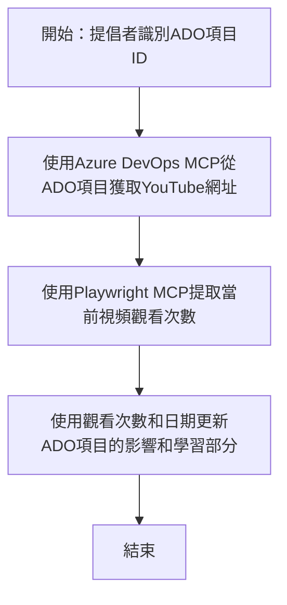

# 案例研究：使用 MCP 從 YouTube 數據更新 Azure DevOps 項目

> **免責聲明：** 市面上已存在可自動化將平台（如 YouTube）數據更新至 Azure DevOps 項目的工具及報告。以下情境僅作為樣本使用案例，說明如何應用 MCP 工具進行自動化及整合任務。

## 概述

本案例展示了如何利用 Model Context Protocol (MCP) 及其工具，自動化使用線上平台（例如 YouTube）資訊更新 Azure DevOps (ADO) 工作項目的流程。所描述的情境只是這些工具更廣泛功能的一個示範，能調整以適應許多類似的自動化需求。

在此例中，倡導者使用 ADO 項目追蹤線上會議，每個項目包含一個 YouTube 影片 URL。透過 MCP 工具，倡導者可以以可重覆且自動化的方式，更新 ADO 項目內最新的影片指標，例如觀看次數。此方式同樣可應用於需將線上來源資訊整合至 ADO 或其他系統的其他用例。

## 情境

一位倡導者負責追蹤線上會議及社群互動的影響力。每場會議記錄為 'DevRel' 專案中的 ADO 工作項目，且該項目有欄位存放 YouTube 影片 URL。為準確報告會議的影響範圍，倡導者需更新 ADO 項目，填寫目前的影片觀看數量及取得該資訊的日期。

## 使用工具

- [Azure DevOps MCP](https://github.com/microsoft/azure-devops-mcp)：透過 MCP 程式化存取及更新 ADO 工作項目。
- [Playwright MCP](https://github.com/microsoft/playwright-mcp)：自動化瀏覽器操作，擷取網頁上的即時數據，例如 YouTube 影片統計。

## 步驟工作流程

1. **確認 ADO 項目**：從 'DevRel' 專案中取得 ADO 工作項目 ID（例如 1234）。
2. **擷取 YouTube URL**：使用 Azure DevOps MCP 工具從工作項目中讀取 YouTube URL。
3. **取得影片觀看次數**：使用 Playwright MCP 工具造訪 YouTube URL，提取當前觀看數。
4. **更新 ADO 項目**：使用 Azure DevOps MCP 工具，將最新觀看數及取得日期寫入 ADO 工作項目的「影響與學習」欄位。

## 範例指令

```bash
- Work with the ADO Item ID: 1234
- The project is '2025-Awesome'
- Get the YouTube URL for the ADO item
- Use Playwright to get the current views from the YouTube video
- Update the ADO item with the current video views and the updated date of the information
```

## Mermaid 流程圖


## 技術實作

- **MCP 編排**：流程由 MCP 伺服器編排，協調同時使用 Azure DevOps MCP 與 Playwright MCP 工具。
- **自動化**：流程可手動觸發或排程定期執行，以保持 ADO 項目最新。
- **擴充性**：相同模式可延伸用於更新 ADO 項目其他線上指標（如按讚數、留言），或來自不同平台。

## 結果與影響

- **效率提升**：減輕倡導者手動擷取與更新影片數據的工作量。
- **準確性**：確保 ADO 項目反映線上來源的最新資料。
- **可重覆性**：為類似情境下的其他數據源或指標提供可重用的工作流程。

## 參考資料

- [Azure DevOps MCP](https://github.com/microsoft/azure-devops-mcp)
- [Playwright MCP](https://github.com/microsoft/playwright-mcp)
- [Model Context Protocol (MCP)](https://modelcontextprotocol.io/)

## 下一步

- 回到：[案例研究總覽](./README.md)
- 下一篇：[使用 MCP 即時文件擷取](./docs-mcp/README.md)

---

<!-- CO-OP TRANSLATOR DISCLAIMER START -->
**免責聲明**：  
本文件乃使用人工智能翻譯服務 [Co-op Translator](https://github.com/Azure/co-op-translator) 進行翻譯。儘管我們致力於確保準確性，但請注意，自動翻譯可能包含錯誤或不準確之處。原始文件以其母語版本為唯一權威來源。如涉及重要資訊，建議採用專業人工翻譯。我們對因使用本翻譯所引致之任何誤解或誤譯不承擔任何責任。
<!-- CO-OP TRANSLATOR DISCLAIMER END -->