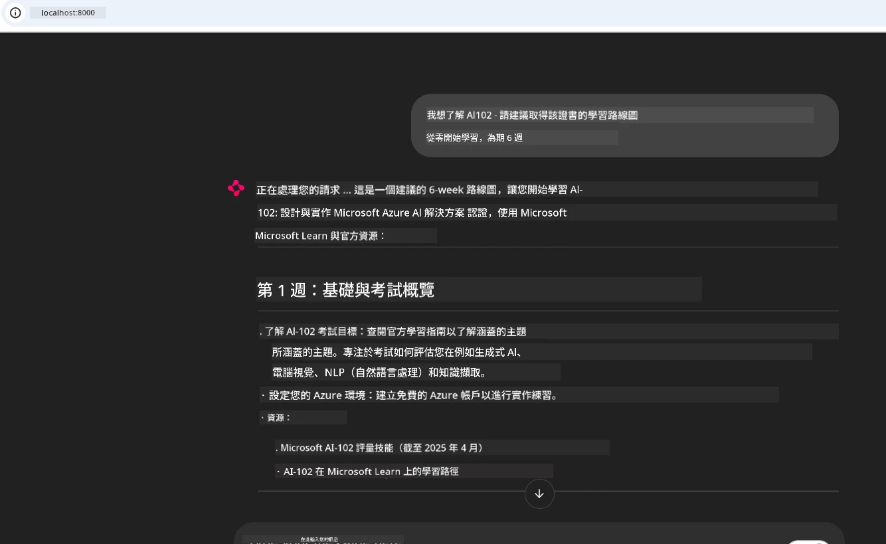
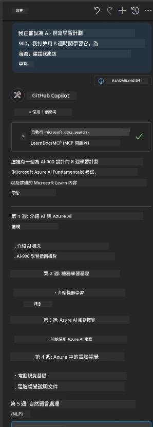

# 案例研究：從客戶端連接到 Microsoft Learn Docs MCP 伺服器

你是否曾經在文件網站、Stack Overflow 和無盡的搜尋引擎分頁之間忙碌切換，同時試圖解決程式碼中的問題？或許你會準備第二個顯示器專門用來看文件，或者不斷在 IDE 和瀏覽器之間按 Alt+Tab。若能將文件直接整合進你的工作流程——無論是在應用程式、IDE，甚至是自訂工具中，豈不是更好？在此案例研究中，我們將探索如何直接從自訂客戶端應用程式連接至 Microsoft Learn Docs MCP 伺服器，做到這一點。

## 概述

現代開發不只是寫程式碼——更在於在正確時間找到正確資訊。文件無所不在，但往往不在你最需要的地方：你的工具和工作流程內部。透過將文件檢索直接整合到應用程式中，你可以節省時間、減少情境切換，提升生產力。在本節中，我們將示範如何連接客戶端到 Microsoft Learn Docs MCP 伺服器，讓你能夠在不離開應用程式的情況下，存取即時且具情境感知的文件。

我們將逐步介紹如何建立連線、發送請求，以及有效地處理串流回應。此方法不僅能精簡你的工作流程，也開啟了打造更聰明、更有協助性的開發者工具的大門。

## 學習目標

為什麼要這麼做？因為最佳的開發者體驗是消除摩擦的體驗。想像有個世界，你的程式編輯器、聊天機器人或網頁應用程式能立即回答你的文件問題，且內容皆來自最新的 Microsoft Learn。完成這章節後，你將能夠：

- 了解 MCP 伺服器與客戶端通訊的基本概念
- 實作控制台或網頁應用程式，以連接 Microsoft Learn Docs MCP 伺服器
- 使用串流 HTTP 客戶端進行即時文件檢索
- 在應用程式中記錄且解讀文件回應

你將看到這些技能如何幫助你建立不僅具反應能力，更具互動性與情境感知的工具。

## 情境 1 - 使用 MCP 即時文件檢索

在此情境中，我們將示範如何連接客戶端至 Microsoft Learn Docs MCP 伺服器，讓你在不離開應用程式的情況下存取即時、具有情境感知的文件。

讓我們實際操作。你的任務是撰寫一個應用程式，連接至 Microsoft Learn Docs MCP 伺服器，調用 `microsoft_docs_search` 工具，並將串流回應記錄到控制台。

### 為什麼採用此方法？
因為這是建構更進階整合的基礎——無論你想打造聊天機器人、IDE 擴充功能，或是網頁儀表板。

你可以在此案例研究的 [`solution`](./solution/README.md) 資料夾中找到此情境的程式碼與說明。步驟將指導你建立連線：
- 使用官方 MCP SDK 和可串流 HTTP 客戶端進行連線
- 呼叫帶有查詢參數的 `microsoft_docs_search` 工具以檢索文件
- 實作適當的記錄與錯誤處理
- 創建互動式控制台介面，允許使用者輸入多筆搜尋查詢

此情境示範如何：
- 連接至 Docs MCP 伺服器
- 發送查詢
- 解析並列印結果

以下是執行解決方案可能的樣貌：

```
Prompt> What is Azure Key Vault?
Answer> Azure Key Vault is a cloud service for securely storing and accessing secrets. ...
```

以下是最小化範例解決方案。完整程式碼與詳情請參考解決方案資料夾。

<details>
<summary>Python</summary>

```python
import asyncio
from mcp.client.streamable_http import streamablehttp_client
from mcp import ClientSession

async def main():
    async with streamablehttp_client("https://learn.microsoft.com/api/mcp") as (read_stream, write_stream, _):
        async with ClientSession(read_stream, write_stream) as session:
            await session.initialize()
            result = await session.call_tool("microsoft_docs_search", {"query": "Azure Functions best practices"})
            print(result.content)

if __name__ == "__main__":
    asyncio.run(main())
```

- 欲取得完整實作與記錄，請參閱 [`scenario1.py`](../../../../09-CaseStudy/docs-mcp/solution/python/scenario1.py)。
- 有關安裝與使用說明，請參閱同資料夾中的 [`README.md`](./solution/python/README.md)檔案。
</details>

## 情境 2 - 使用 MCP 的互動學習計劃產生器網頁應用程式

在此情境中，你將學習如何把 Docs MCP 整合到網頁開發專案。目標是使使用者能直接從網頁介面搜尋 Microsoft Learn 文件，使文件能即時在你的應用程式或網站中被存取。

你將學會如何：
- 設置網頁應用程式
- 連接至 Docs MCP 伺服器
- 處理使用者輸入並顯示結果

以下是執行解決方案可能的樣貌：

```
User> I want to learn about AI102 - so suggest the roadmap to get it started from learn for 6 weeks

Assistant> Here’s a detailed 6-week roadmap to start your preparation for the AI-102: Designing and Implementing a Microsoft Azure AI Solution certification, using official Microsoft resources and focusing on exam skills areas:

---
## Week 1: Introduction & Fundamentals
- **Understand the Exam**: Review the [AI-102 exam skills outline](https://learn.microsoft.com/en-us/credentials/certifications/exams/ai-102/).
- **Set up Azure**: Sign up for a free Azure account if you don't have one.
- **Learning Path**: [Introduction to Azure AI services](https://learn.microsoft.com/en-us/training/modules/intro-to-azure-ai/)
- **Focus**: Get familiar with Azure portal, AI capabilities, and necessary tools.

....more weeks of the roadmap...

Let me know if you want module-specific recommendations or need more customized weekly tasks!
```

以下是最小化範例解決方案。完整程式碼與詳情請參考解決方案資料夾。



<details>
<summary>Python (Chainlit)</summary>

Chainlit 是一款用於建立對話式 AI 網頁應用程式的框架。它讓你輕鬆打造能調用 MCP 工具並即時顯示結果的互動聊天機器人和助理。非常適合快速原型開發及使用者友善介面。

```python
import chainlit as cl
import requests

MCP_URL = "https://learn.microsoft.com/api/mcp"

@cl.on_message
def handle_message(message):
    query = {"question": message}
    response = requests.post(MCP_URL, json=query)
    if response.ok:
        result = response.json()
        cl.Message(content=result.get("answer", "No answer found.")).send()
    else:
        cl.Message(content="Error: " + response.text).send()
```

- 欲取得完整實作，請參閱 [`scenario2.py`](../../../../09-CaseStudy/docs-mcp/solution/python/scenario2.py)。
- 安裝及運行指引，請參閱 [`README.md`](./solution/python/README.md)。
</details>

## 情境 3：在 VS Code 編輯器內使用 MCP 伺服器查看文件

如果你想直接在 VS Code 裡面取得 Microsoft Learn Docs，而不是切換瀏覽器分頁，可以在編輯器內使用 MCP 伺服器。這讓你能：

- 在 VS Code 內搜尋並閱讀文件，不必離開編碼環境。
- 直接參考文件並插入連結到 README 或課程檔案中。
- 結合 GitHub Copilot 與 MCP，打造無縫的 AI 驅動文件工作流程。

**你將學會如何：**
- 在工作區根目錄加入有效的 `.vscode/mcp.json` 檔案（見下方範例）。
- 開啟 VS Code 的 MCP 面板或使用命令選單搜尋並插入文件。
- 在工作時直接在 Markdown 文件中參考文件。
- 結合 GitHub Copilot，進一步提升生產力。

以下範例為在 VS Code 中設定 MCP 伺服器：

```json
{
  "servers": {
    "LearnDocsMCP": {
      "url": "https://learn.microsoft.com/api/mcp"
    }
  }
}
```

</details>

> 想取得詳細的操作說明與步驟圖示，請見 [`README.md`](./solution/scenario3/README.md)。



此方法非常適合任何製作技術課程、撰寫文件或需經常參考文件的開發工作。

## 主要重點

將文件直接整合到你的工具中，不僅是便利，更是提升生產力的關鍵。透過從你的客戶端連接至 Microsoft Learn Docs MCP 伺服器，你可以：

- 消除程式碼與文件之間的情境切換
- 即時取得更新且具情境感知的文件
- 打造更聰明且具互動性的開發者工具

這些技能將幫助你創造效率與愉悅兼具的解決方案。

## 其他資源

欲深化理解，請參考這些官方資源：

- [Microsoft Learn Docs MCP Server (GitHub)](https://github.com/MicrosoftDocs/mcp)
- [Azure MCP Server 入門 (mcp-python)](https://learn.microsoft.com/en-us/azure/developer/azure-mcp-server/get-started#create-the-python-app)
- [什麼是 Azure MCP Server？](https://learn.microsoft.com/en-us/azure/developer/azure-mcp-server/)
- [Model Context Protocol (MCP) 介紹](https://modelcontextprotocol.io/introduction)
- [從 MCP 伺服器新增套件 (Python)](https://learn.microsoft.com/en-us/semantic-kernel/concepts/plugins/adding-mcp-plugins)

## 下一步

- 返回：[案例研究總覽](../README.md)
- 繼續前往：[模組 10：使用 AI Toolkit 簡化 AI 工作流程](../../10-StreamliningAIWorkflowsBuildingAnMCPServerWithAIToolkit/README.md)

---

<!-- CO-OP TRANSLATOR DISCLAIMER START -->
**免責聲明**：  
本文件由 AI 翻譯服務 [Co-op Translator](https://github.com/Azure/co-op-translator) 所翻譯。雖然我們致力於翻譯的準確性，但請注意自動翻譯可能包含錯誤或不準確之處。原始文件的母語版本應視為權威來源。對於重要資訊，建議使用專業人工翻譯。本公司對於因使用本翻譯而產生的任何誤解或誤釋不承擔任何責任。
<!-- CO-OP TRANSLATOR DISCLAIMER END -->