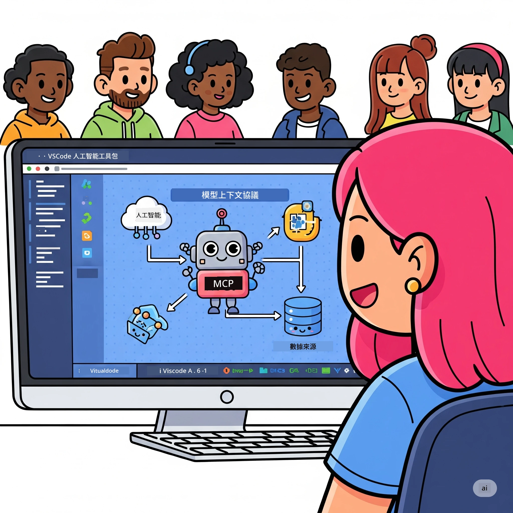
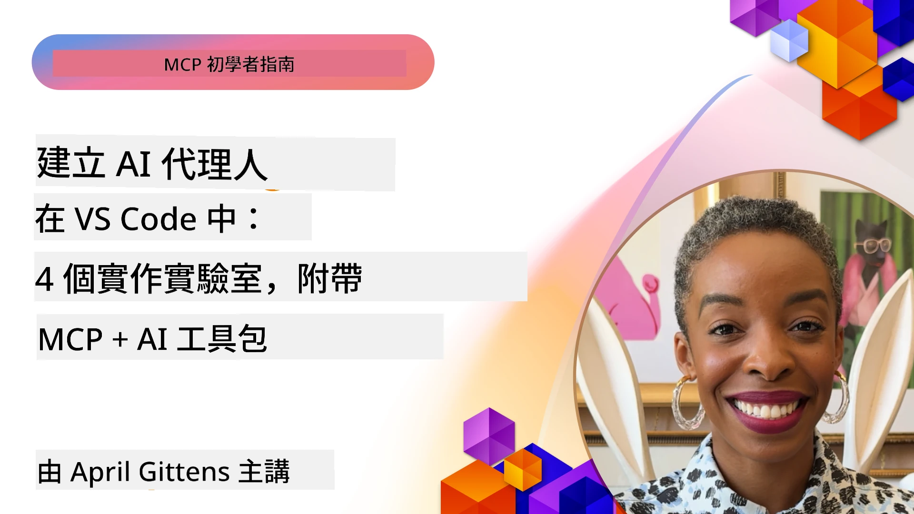

# 簡化人工智能工作流程：使用 AI 工具包建立 MCP 伺服器

## 🎯  概覽

_(點擊上方圖片觀看本課程影片)_

歡迎來到 **模型上下文協議 (MCP) 工作坊**！這個全面的實作工作坊結合了兩項尖端技術，徹底革新人智能應用程式開發：

- **🔗 模型上下文協議 (MCP)**：無縫 AI 工具整合的開放標準
- **🛠️ Visual Studio Code 人工智能工具包 (AITK)**：微軟強大的 AI 開發擴充套件

### 🎓 你將學到什麼

完成本工作坊後，你將掌握建立智慧應用程式的技巧，能夠銜接 AI 模型與現實世界工具和服務。從自動化測試到自訂 API 整合，實際學會解決複雜商業挑戰。

## 🏗️ 技術棧

### 🔌 模型上下文協議 (MCP)

MCP 就是 AI 界的 **「USB-C」** — 通用標準，將 AI 模型連結到外部工具與資料來源。

**✨ 主要特點：**

- 🔄 **標準化整合**：AI 與工具的通用介面
- 🏛️ **彈性架構**：支援本地及遠端伺服器透過 stdio/SSE 傳輸
- 🧰 **豐富生態系統**：工具、提示與資源匯聚於單一協議
- 🔒 **企業級準備**：內建安全與可靠性

**🎯 MCP 的重要性：**
正如 USB-C 清除了線材混亂，MCP 帶來 AI 系統整合的簡易性。一種協議，多種可能。

### 🤖 Visual Studio Code 人工智能工具包 (AITK)

微軟主打 AI 開發擴充，將 VS Code 轉化成人工智能利器。

**🚀 核心能力：**

- 📦 **模型目錄**：可存取 Azure AI、GitHub、Hugging Face、Ollama 等模型
- ⚡ **本地推論**：ONNX 最佳化的 CPU/GPU/NPU 執行
- 🏗️ **代理建構器**：具備 MCP 整合的視覺化 AI 代理開發
- 🎭 **多模態支持**：文字、視覺與結構化輸出

**💡 開發效益：**

- 零設定模型部署
- 直觀提示工程
- 即時測試操場
- 無縫 MCP 伺服器整合

## 📚 學習旅程

### [🚀 模組 1：AI 工具包基礎](./lab1/README.md)

**時長**：15 分鐘

- 🛠️ 安裝與配置 Visual Studio Code AI 工具包
- 🗂️ 探索模型目錄（超過 100 個模型來源包括 GitHub、ONNX、OpenAI、Anthropic、Google）
- 🎮 精通互動式操場，進行即時模型測試
- 🤖 使用代理建構器建立你的第一個 AI 代理
- 📊 以內建評估指標（F1、相關性、相似度、連貫性）評估模型表現
- ⚡ 學習批次處理與多模態支持功能

**🎯 學習成果**：建立功能完整的 AI 代理，全面理解 AITK 功能

### [🌐 模組 2：MCP 與 AI 工具包基礎](./lab2/README.md)

**時長**：20 分鐘

- 🧠 掌握模型上下文協議 (MCP) 架構與概念
- 🌐 探索微軟 MCP 伺服器生態系
- 🤖 利用 Playwright MCP 伺服器構建瀏覽器自動化代理
- 🔧 將 MCP 伺服器與 AI 工具包代理建構器結合
- 📊 配置並測試代理中的 MCP 工具
- 🚀 匯出並部署以 MCP 為核心的 AI 代理於生產環境

**🎯 學習成果**：部署結合外部工具的強化 AI 代理

### [🔧 模組 3：進階 MCP 開發與 AI 工具包](./lab3/README.md)

**時長**：20 分鐘

- 💻 使用 AI 工具包打造自訂 MCP 伺服器
- 🐍 配置與使用最新 MCP Python SDK（v1.9.3）
- 🔍 設置並使用 MCP Inspector 進行偵錯
- 🛠️ 建立具專業偵錯工作流程的天氣 MCP 伺服器
- 🧪 在代理建構器與 Inspector 環境中進行 MCP 伺服器偵錯

**🎯 學習成果**：使用現代工具開發與偵錯自訂 MCP 伺服器

### [🐙 模組 4：實務 MCP 開發－自訂 GitHub 克隆伺服器](./lab4/README.md)

**時長**：30 分鐘

- 🏗️ 打造符合實務的 GitHub 克隆 MCP 伺服器以支援開發流程
- 🔄 實作帶驗證與錯誤處理的智能倉庫複製
- 📁 建立智慧目錄管理並整合 VS Code
- 🤖 使用 GitHub Copilot 代理模式搭配自訂 MCP 工具
- 🛡️ 採用生產級可靠性與跨平台相容性

**🎯 學習成果**：部署提升實際開發效率的 MCP 伺服器

## 💡 真實世界應用與影響

### 🏢 企業應用範例

#### 🔄 DevOps 自動化

用智能自動化改造你的開發流程：

- **智能倉庫管理**：AI 驅動的程式碼審查與合併決策
- **智能 CI/CD**：根據程式碼變更自動優化管線
- **問題分流**：自動分類並指派缺陷

#### 🧪 品質保證革新

提升測試能力，導入 AI 自動化：

- **智能測試產生**：自動生成完整測試套件
- **視覺回歸測試**：AI 支援的 UI 改變偵測
- **效能監控**：主動辨識與解決問題

#### 📊 資料流程智慧化

建立更聰明的資料處理工作流程：

- **自適應 ETL 流程**：自我優化資料轉換
- **異常偵測**：即時資料品質監控
- **智能路由**：智慧化資料流管理

#### 🎧 客戶體驗升級

打造卓越的客戶互動：

- **情境感知支援**：AI 代理可存取顧客歷史
- **主動問題解決**：預測式客戶服務
- **跨通路整合**：統一的 AI 使用經驗

## 🛠️ 先決條件與設定

### 💻 系統需求

| 元件 | 要求 | 備註 |
|-----------|-------------|-------|
| **作業系統** | Windows 10+、macOS 10.15+、Linux | 任一現代作業系統皆可 |
| **Visual Studio Code** | 最新穩定版 | AITK 必須 |
| **Node.js** | v18.0+ 與 npm | 用於 MCP 伺服器開發 |
| **Python** | 3.10+ | Python MCP 伺服器選用 |
| **記憶體** | 最少 8GB RAM | 本地模型建議 16GB |

### 🔧 開發環境

#### 推薦 VS Code 擴充套件

- **AI 工具包** (ms-windows-ai-studio.windows-ai-studio)
- **Python** (ms-python.python)
- **Python 偵錯器** (ms-python.debugpy)
- **GitHub Copilot** (GitHub.copilot) - 選用但有助力

#### 選用工具

- **uv**：現代化 Python 套件管理器
- **MCP Inspector**：MCP 伺服器視覺偵錯工具
- **Playwright**：用於網頁自動化範例

## 🎖️ 學習成果與認證路徑

### 🏆 技能掌握清單

完成本工作坊，你將達成：

#### 🎯 核心能力

- [ ] **MCP 協議精通**：深入理解架構與實作模式
- [ ] **AITK 專業應用**：達到 AI 工具包快速開發專家
- [ ] **自訂伺服器開發**：構建、部署並維護生產 MCP 伺服器
- [ ] **工具整合卓越**：無縫銜接 AI 與現有開發流程
- [ ] **問題解決能力**：應用所學解決實際商業問題

#### 🔧 技術技能

- [ ] 設置與配置 VS Code 中的 AI 工具包
- [ ] 設計並實作自訂 MCP 伺服器
- [ ] 整合 GitHub 模型與 MCP 架構
- [ ] 建立 Playwright 自動化測試流程
- [ ] 部署 AI 代理於生產環境
- [ ] 偵錯並優化 MCP 伺服器效能

#### 🚀 高階能力

- [ ] 架構企業規模的 AI 整合方案
- [ ] 實施 AI 應用安全最佳實踐
- [ ] 設計可擴展的 MCP 伺服器架構
- [ ] 創建特定領域的自訂工具鏈
- [ ] 指導他人投入原生 AI 開發

## 📖 額外資源

- [MCP 規範 (2025-11-25)](https://spec.modelcontextprotocol.io/specification/2025-11-25/)
- [AI 工具包 GitHub 倉庫](https://github.com/microsoft/vscode-ai-toolkit)
- [MCP 伺服器範例集](https://github.com/modelcontextprotocol/servers)
- [最佳實踐指南](https://modelcontextprotocol.io/docs/best-practices)
- [OWASP MCP 十大](https://microsoft.github.io/mcp-azure-security-guide/mcp/) - 安全最佳實務

---

**🚀 準備好革新你的 AI 開發流程了嗎？**

讓我們攜手使用 MCP 與 AI 工具包，共同打造智慧應用的未來！

## 下一步

繼續閱讀：[模組 11：MCP 伺服器實作工作坊](../11-MCPServerHandsOnLabs/README.md)

---

<!-- CO-OP TRANSLATOR DISCLAIMER START -->
**免責聲明**：  
本文件使用 AI 翻譯服務 [Co-op Translator](https://github.com/Azure/co-op-translator) 進行翻譯。雖然我們力求準確，但請注意，自動翻譯可能包含錯誤或不準確之處。原始文件之母語版本應視為權威資料來源。對於重要資訊，建議採用專業人工翻譯。我們不對因使用本翻譯而引起之任何誤解或錯誤詮釋承擔責任。
<!-- CO-OP TRANSLATOR DISCLAIMER END -->