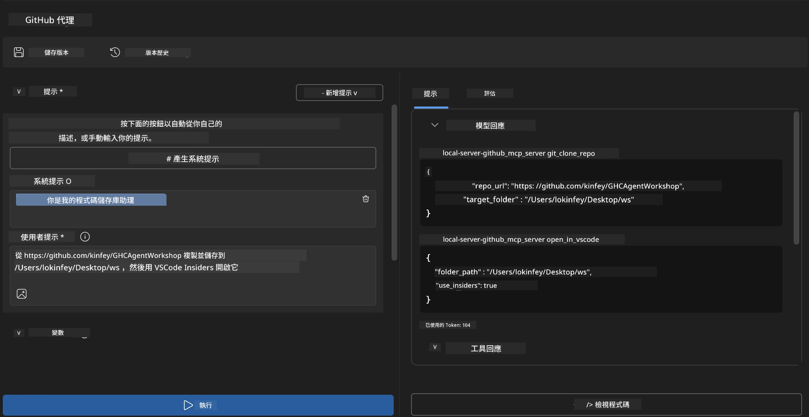
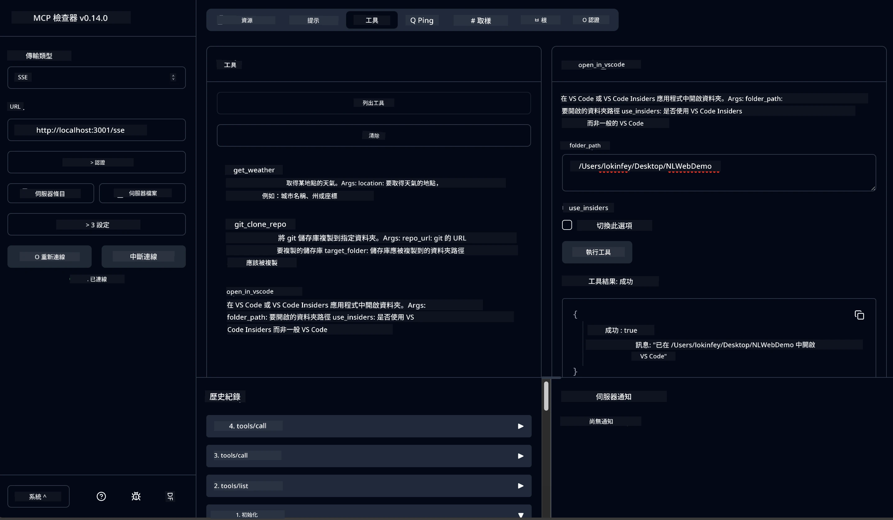

# 🐙 模組 4：實用 MCP 開發 - 自訂 GitHub 克隆伺服器


> **⚡ 快速開始：** 只需 30 分鐘，即可建立一個生產準備的 MCP 伺服器，自動化 GitHub 倉庫克隆與 VS Code 整合！

## 🎯 學習目標

完成本實驗後，您將能夠：

- ✅ 建立適用於實務開發工作流程的自訂 MCP 伺服器
- ✅ 透過 MCP 實作 GitHub 倉庫克隆功能
- ✅ 整合自訂 MCP 伺服器與 VS Code 及 Agent Builder
- ✅ 使用 GitHub Copilot Agent 模式搭配自訂 MCP 工具
- ✅ 在生產環境中測試及部署自訂 MCP 伺服器

## 📋 必備條件

- 完成第 1 至 3 實驗（MCP 基礎與進階開發）
- GitHub Copilot 訂閱（[免費註冊可用](https://github.com/github-copilot/signup)）
- 安裝具備 AI 工具組與 GitHub Copilot 擴充功能的 VS Code
- 安裝並配置 Git CLI

## 🏗️ 專案概覽

### **實際開發挑戰**
作為開發者，我們經常使用 GitHub 來克隆倉庫並在 VS Code 或 VS Code Insiders 中開啟。此手動流程包括：
1. 開啟終端機或命令提示字元
2. 導航到目標目錄
3. 執行 `git clone` 指令
4. 在克隆的目錄中開啟 VS Code

**我們的 MCP 解決方案將此流程簡化為一個智能指令！**

### **你將建立的系統**
一個 **GitHub 克隆 MCP 伺服器** (`git_mcp_server`)，具備：

| 功能 | 說明 | 優點 |
|---------|-------------|---------|
| 🔄 **智能倉庫克隆** | 克隆 GitHub 倉庫並進行驗證 | 自動錯誤檢查 |
| 📁 **智慧目錄管理** | 安全檢查並建立目錄 | 避免覆寫問題 |
| 🚀 **跨平台 VS Code 整合** | 在 VS Code / Insiders 中開啟專案 | 無縫工作流程轉換 |
| 🛡️ **強健錯誤處理** | 處理網絡、權限及路徑問題 | 生產環境可靠性 |

---

## 📖 實作步驟詳解

### 步驟 1：在 Agent Builder 創建 GitHub Agent

1. **透過 AI 工具組擴充功能啟動 Agent Builder**
2. **建立新 Agent，配置如下：**
   ```
   Agent Name: GitHubAgent
   ```

3. **初始化自訂 MCP 伺服器：**
   - 前往 **工具** → **新增工具** → **MCP 伺服器**
   - 選擇 **「建立新 MCP 伺服器」**
   - 選用 **Python 範本** 以達最大彈性
   - **伺服器名稱：** `git_mcp_server`

### 步驟 2：設定 GitHub Copilot Agent 模式

1. **在 VS Code 開啟 GitHub Copilot（Ctrl/Cmd + Shift + P →「GitHub Copilot: Open」）**
2. **在 Copilot 介面選擇 Agent 模型**
3. **選擇 Claude 3.7 模型以強化推理能力**
4. **啟用 MCP 整合以使用工具**

> **💡 專業提示：** Claude 3.7 對開發工作流程與錯誤處理模式具有優異理解力。

### 步驟 3：實作 MCP 伺服器核心功能

**請使用以下詳細提示與 GitHub Copilot Agent 模式搭配：**

```
Create two MCP tools with the following comprehensive requirements:

🔧 TOOL A: clone_repository
Requirements:
- Clone any GitHub repository to a specified local folder
- Return the absolute path of the successfully cloned project
- Implement comprehensive validation:
  ✓ Check if target directory already exists (return error if exists)
  ✓ Validate GitHub URL format (https://github.com/user/repo)
  ✓ Verify git command availability (prompt installation if missing)
  ✓ Handle network connectivity issues
  ✓ Provide clear error messages for all failure scenarios

🚀 TOOL B: open_in_vscode
Requirements:
- Open specified folder in VS Code or VS Code Insiders
- Cross-platform compatibility (Windows/Linux/macOS)
- Use direct application launch (not terminal commands)
- Auto-detect available VS Code installations
- Handle cases where VS Code is not installed
- Provide user-friendly error messages

Additional Requirements:
- Follow MCP 1.9.3 best practices
- Include proper type hints and documentation
- Implement logging for debugging purposes
- Add input validation for all parameters
- Include comprehensive error handling
```

### 步驟 4：測試你的 MCP 伺服器

#### 4a. 在 Agent Builder 測試

1. **啟動 Agent Builder 的除錯組態**
2. **使用以下系統提示設定你的 Agent：**

```
SYSTEM_PROMPT:
You are my intelligent coding repository assistant. You help developers efficiently clone GitHub repositories and set up their development environment. Always provide clear feedback about operations and handle errors gracefully.
```

3. **進行真實使用情境測試：**

```
USER_PROMPT EXAMPLES:

Scenario : Basic Clone and Open
"Clone {Your GitHub Repo link such as https://github.com/kinfey/GHCAgentWorkshop
 } and save to {The global path you specify}, then open it with VS Code Insiders"
```



**預期結果：**
- ✅ 成功克隆並確認路徑
- ✅ 自動啟動 VS Code
- ✅ 無效情境有明確錯誤訊息
- ✅ 適當處理邊界狀況

#### 4b. 在 MCP Inspector 測試




---


**🎉 恭喜！** 你已成功建立一個實用且具生產力的 MCP 伺服器，完美解決實務開發的工作流程挑戰。你的自訂 GitHub 克隆伺服器展示了 MCP 自動化及提升開發者生產力的強大能力。

### 🏆 達成成就：
- ✅ **MCP 開發者** - 建立自訂 MCP 伺服器
- ✅ **工作流程自動化者** - 精簡開發流程  
- ✅ **整合專家** - 串聯多種開發工具
- ✅ **生產準備** - 建置可部署方案

---

## 🎓 工作坊完結：你的 Model Context Protocol 旅程

**親愛的工作坊參加者，**

恭喜你完成了 Model Context Protocol 工作坊的所有四個模組！你從了解 AI 工具組基礎開始，邁向打造生產準備級 MCP 伺服器，成功解決真實世界開發挑戰。

### 🚀 你的學習路徑回顧：

**[模組 1](../lab1/README.md)**：你開始探索 AI 工具組基礎、模型測試與建立第一個 AI Agent。

**[模組 2](../lab2/README.md)**：你學習 MCP 架構、整合 Playwright MCP，製作首個瀏覽器自動化 Agent。

**[模組 3](../lab3/README.md)**：進階自訂 MCP 伺服器開發，包含 Weather MCP 伺服器與除錯工具的應用。

**[模組 4](../lab4/README.md)**：你已應用全部所學，建立實用的 GitHub 倉庫工作流程自動化工具。

### 🌟 你掌握的技能：

- ✅ **AI 工具組生態系**：模型、Agent 與整合模式
- ✅ **MCP 架構**：客戶端-伺服器設計、傳輸協議與安全性
- ✅ **開發工具**：從 Playground、Inspector 到生產部署
- ✅ **自訂開發**：建置、測試與部署專屬 MCP 伺服器
- ✅ **實務應用**：利用 AI 解決真實工作流程挑戰

### 🔮 你的下一步：

1. **建立你的專屬 MCP 伺服器**：應用所學自動化你的專屬工作流程
2. **加入 MCP 社群**：分享創作並向他人學習
3. **探索進階整合**：連結 MCP 伺服器與企業系統
4. **參與開源貢獻**：助力改善 MCP 工具與文檔

切記，本工作坊只是開始。Model Context Protocol 生態系持續迅速演進，你現在已裝備好成為 AI 驅動開發工具的先鋒。

**感謝你的參與與學習熱忱！**

希望本工作坊激發你創意，改變你建構與互動 AI 工具的開發旅程。

**祝你程式寫得開心！**

---

## 接下來的內容

恭喜你完成模組 10 全部實驗！

- 回到：[模組 10 概覽](../README.md)
- 繼續前往：[模組 11：MCP 伺服器實作實驗室](../../11-MCPServerHandsOnLabs/README.md)

---

<!-- CO-OP TRANSLATOR DISCLAIMER START -->
**免責聲明**：  
本文件使用 AI 翻譯服務 [Co-op Translator](https://github.com/Azure/co-op-translator) 進行翻譯。雖然我們致力於確保翻譯的準確性，但請注意，自動翻譯可能包含錯誤或不準確之處。原始文件的母語版本應視為權威來源。對於重要信息，建議採用專業人工翻譯。我們對因使用本翻譯而引起的任何誤解或誤譯不承擔任何責任。
<!-- CO-OP TRANSLATOR DISCLAIMER END -->