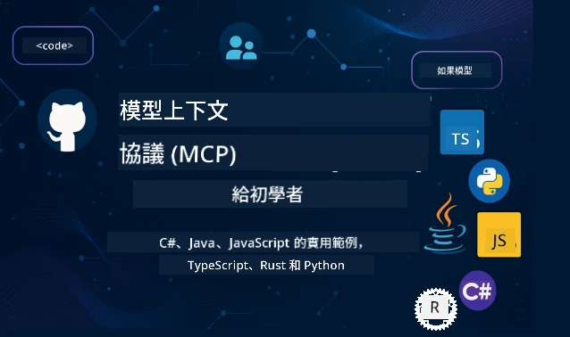

 

[](https://GitHub.com/microsoft/mcp-for-beginners/graphs/contributors)
[](https://GitHub.com/microsoft/mcp-for-beginners/issues)
[](https://GitHub.com/microsoft/mcp-for-beginners/pulls)
[](http://makeapullrequest.com)

[](https://GitHub.com/microsoft/mcp-for-beginners/watchers)
[](https://GitHub.com/microsoft/mcp-for-beginners/fork)
[](https://GitHub.com/microsoft/mcp-for-beginners/stargazers)


[](https://discord.gg/nTYy5BXMWG)

跟隨以下步驟開始使用這些資源：
1. **Fork 此倉庫**：點擊 [](https://GitHub.com/microsoft/mcp-for-beginners/fork)
2. **Clone 此倉庫**：   `git clone https://github.com/microsoft/mcp-for-beginners.git`
3. **加入** [](https://discord.gg/nTYy5BXMWG)


### 🌐 多語言支援

#### 透過 GitHub Action 支援（自動化且時刻保持最新）

<!-- CO-OP TRANSLATOR LANGUAGES TABLE START -->
[阿拉伯語](../ar/README.md) | [孟加拉語](../bn/README.md) | [保加利亞語](../bg/README.md) | [緬甸語](../my/README.md) | [中文（簡體）](../zh-CN/README.md) | [中文（繁體，香港）](../zh-HK/README.md) | [中文（繁體，澳門）](./README.md) | [中文（繁體，台灣）](../zh-TW/README.md) | [克羅地亞語](../hr/README.md) | [捷克語](../cs/README.md) | [丹麥語](../da/README.md) | [荷蘭語](../nl/README.md) | [愛沙尼亞語](../et/README.md) | [芬蘭語](../fi/README.md) | [法語](../fr/README.md) | [德語](../de/README.md) | [希臘語](../el/README.md) | [希伯來語](../he/README.md) | [印地語](../hi/README.md) | [匈牙利語](../hu/README.md) | [印度尼西亞語](../id/README.md) | [意大利語](../it/README.md) | [日語](../ja/README.md) | [坎納達語](../kn/README.md) | [韓語](../ko/README.md) | [立陶宛語](../lt/README.md) | [馬來語](../ms/README.md) | [馬拉雅拉姆語](../ml/README.md) | [馬拉地語](../mr/README.md) | [尼泊爾語](../ne/README.md) | [尼日利亞皮欽語](../pcm/README.md) | [挪威語](../no/README.md) | [波斯語 (法爾西語)](../fa/README.md) | [波蘭語](../pl/README.md) | [葡萄牙語 (巴西)](../pt-BR/README.md) | [葡萄牙語 (葡萄牙)](../pt-PT/README.md) | [旁遮普語 (古魯穆奇書寫)](../pa/README.md) | [羅馬尼亞語](../ro/README.md) | [俄語](../ru/README.md) | [塞爾維亞語（西里爾字母）](../sr/README.md) | [斯洛伐克語](../sk/README.md) | [斯洛文尼亞語](../sl/README.md) | [西班牙語](../es/README.md) | [斯瓦希里語](../sw/README.md) | [瑞典語](../sv/README.md) | [他加祿語（菲律賓語）](../tl/README.md) | [泰米爾語](../ta/README.md) | [泰盧固語](../te/README.md) | [泰語](../th/README.md) | [土耳其語](../tr/README.md) | [烏克蘭語](../uk/README.md) | [烏爾都語](../ur/README.md) | [越南語](../vi/README.md)

> **想要本地 Clone？**
>
> 本倉庫包含 50 多種語言翻譯，這會大幅增加下載大小。若想不帶翻譯資料進行 Clone，可使用稀疏檢出（sparse checkout）：
>
> **Bash / macOS / Linux:**
> ```bash
> git clone --filter=blob:none --sparse https://github.com/microsoft/mcp-for-beginners.git
> cd mcp-for-beginners
> git sparse-checkout set --no-cone '/*' '!translations' '!translated_images'
> ```
>
> **CMD (Windows):**
> ```cmd
> git clone --filter=blob:none --sparse https://github.com/microsoft/mcp-for-beginners.git
> cd mcp-for-beginners
> git sparse-checkout set --no-cone "/*" "!translations" "!translated_images"
> ```
>
> 這樣你可以更快地下載，並獲得完成課程所需的所有內容。
<!-- CO-OP TRANSLATOR LANGUAGES TABLE END -->

# 🚀 模型上下文協議 (MCP) 新手課程

## **透過 C#、Java、JavaScript、Rust、Python 與 TypeScript 的實作範例學習 MCP**

## 🧠 模型上下文協議課程概覽
歡迎開始你的模型上下文協議之旅！如果你曾經好奇 AI 應用程式如何與不同工具和服務溝通，你即將發現一個優雅的方案，正在改變開發者構建智慧系統的方式。

可以將 MCP 想像成 AI 應用的通用翻譯器——就像 USB 埠讓你可以將任何裝置連接到電腦一樣，MCP 讓 AI 模型以標準化方式連接到任何工具或服務。無論你是要建立第一個聊天機器人或是開發複雜的 AI 工作流程，瞭解 MCP 都會讓你擁有打造更強大、更靈活應用的能力。

這份課程設計充分考慮到你的學習歷程。我們會從你已熟悉的簡單概念開始，透過實作練習與你喜愛的程式語言，逐步增加你的專業知識。每個步驟都包含明確的說明、實用範例，以及滿滿的鼓勵。

完成整個旅程後，你將有信心建立自己的 MCP 伺服器，將它們與熱門 AI 平台整合，並明白這項技術如何重塑 AI 開發的未來。讓我們一同開啟這場精彩冒險吧！

### 官方文件與規範

此課程與 **MCP 規範 2025-11-25**（最新穩定版本）保持一致。 MCP 採用基於日期的版本管理（格式為 YYYY-MM-DD），確保協議版本追蹤清晰。

這些資源會隨著你理解程度提升而越來越有價值，但不必急著全部閱讀。請從你最感興趣的部分開始！
- 📘 [MCP 文件](https://modelcontextprotocol.io/) – 這是你的逐步教學與使用指南資源。文件針對新手編寫，提供清楚範例，讓你可依自己節奏跟著學習。
- 📜 [MCP 規範](https://modelcontextprotocol.io/specification/2025-11-25) – 可以當作你的全面參考手冊。隨著課程進度，常會回來查閱這裡的細節與進階功能。
- 📜 [MCP 規範版本管理](https://modelcontextprotocol.io/specification/versioning) – 含有協定版本歷史及 MCP 如何採用日期版本號的資訊。
- 🧑‍💻 [MCP GitHub 倉庫](https://github.com/modelcontextprotocol) – 這裡有多種程式語言的 SDK、工具和範例程式碼。就像一座實用的寶藏，含有能立即使用的元件和範例。
- 🌐 [MCP 社群](https://github.com/orgs/modelcontextprotocol/discussions) – 加入其他學習者與資深開發者的 MCP 討論，這是一個友善社群，歡迎提問，知識自由分享。
  
## 學習目標

完成本課程後，你將感到自信且充滿熱忱。以下是你將達成的目標：

• **理解 MCP 基礎**：你會明白模型上下文協議是什麼，為何它正在改變 AI 應用協作的方式，並透過具體類比與範例增進理解。

• **建立第一個 MCP 伺服器**：你將能用自己偏好的程式語言，從簡單範例做起，一步步建立可運作的 MCP 伺服器。

• **讓 AI 模型連接至真實工具**：你會學會如何架起 AI 模型與真實服務的橋樑，讓應用程式具備強大新功能。

• **實作安全最佳做法**：你會懂得如何保障 MCP 實作的安全，確保應用和使用者都受到保護。

• **自信部署應用**：你將了解如何帶著 MCP 專案從開發階段邁向正式運行，並掌握務實的部署策略。

• **加入 MCP 社群**：你會成為持續茁壯的開發者社群一員，共同塑造 AI 應用開發的未來。

## 必備背景知識

在深入 MCP 具體內容前，讓我們確保你對一些基礎概念感到舒適。不用擔心若你不是這些領域的專家——我們會在學習過程中完整說明！

### 了解協議（基礎觀念）

把協議想成對話規則。當你打電話給朋友，你們都知道接起後要說「哈囉」，輪流說話，結束前說「再見」。電腦程式也需要類似規則才能順利溝通。

MCP 是一種協議——一組共識規則，幫助 AI 模型與應用和工具、服務間進行有效的「對話」。就像對話規則讓人類溝通流暢，MCP 讓 AI 應用溝通更可靠、更強大。

### 用戶端與伺服器關係（程式如何協同）

你每天都在使用用戶端與伺服器關係！當你用瀏覽器（用戶端）瀏覽網站，就是連上發送網頁內容的網頁伺服器。瀏覽器知道如何請求資料，伺服器知道如何回應。

在 MCP 中，我們有類似關係：AI 模型扮演提出請求的用戶端，MCP 伺服器提供功能，就是 AI 可以請求特定任務的得力助手。

### 為何標準化重要（促進相容與合作）

想像每個車廠的加油孔形狀都不一樣，駕駛每台車都要帶不同轉接頭！標準化就是大家同意用統一方式，讓萬事協作無礙。

MCP 就是給 AI 應用的標準化。不用每個 AI 模型都寫客製化程式碼去適配工具，MCP 建立通用溝通方式。這意味著開發者可以開發一次工具，即可在許多 AI 系統間通用。

## 🧭 你的學習路線概覽

你的 MCP 旅程經過細心規劃，幫助你逐步建立信心與能力。每個階段介紹新概念，同時鞏固已學知識。

### 🌱 基礎階段：理解基本觀念（模組 0-2）

旅程從這裡開始！我們會用熟悉的比喻和簡易範例，介紹 MCP 概念。你將懂得 MCP 是什麼、為什麼存在，以及如何融入 AI 開發大環境。

• **模組 0 - MCP 入門**：先探索 MCP 是什麼，以及它對現代 AI 應用的重要性。你會看到實際 MCP 應用範例，並了解它如何解決開發者的常見問題。

• **模組 1 - 核心概念說明**：學習 MCP 的基本構建元素。會用大量比喻與視覺範例，確保概念自然易懂。

• **模組 2 - MCP 中的安全性**：安全聽起來可能嚇人，但我們會展示 MCP 內建的安全功能，並教你起步時保護應用的最佳實務。

### 🔨 建置階段：打造你的第一個實作（模組 3）

現在真正的樂趣開始了！你將動手建立 MCP 伺服器與用戶端。別擔心——我們會從簡單做起，引導你完成每一步。
本模組包含多個實作指南，讓你可使用喜歡的程式語言練習。你將會建立第一個伺服器、建構用於連接的客戶端，甚至整合如 VS Code 等熱門開發工具。

每個指南都包括完整的程式碼範例、故障排除提示，以及我們做出特定設計選擇的原因說明。到本階段結束時，你會擁有可以自豪的可運作 MCP 實現！

### 🚀 成長階段：進階概念與實務應用（模組 4-5）

掌握基礎後，準備探索更複雜的 MCP 功能。我們將涵蓋實務實作策略、除錯技術，以及如多模態 AI 整合等進階主題。

你還將學會如何為生產環境擴展 MCP 實現，並整合如 Azure 等雲端平台。這些模組將幫助你打造能應付實務需求的 MCP 解決方案。

### 🌟 精通階段：社群與專精（模組 6-11）

最後階段聚焦於加入 MCP 社群與專精你最感興趣的領域。你會學習如何貢獻開源 MCP 專案、實作進階身分驗證模式，以及打造完整的資料庫整合解決方案。

模組 11 值得特別提及──這是一條包含 13 個實驗室的完整實作學習路徑，教你如何構建具備 PostgreSQL 整合的生產級 MCP 伺服器。就像一個讓你綜合所有所學的壓軸專案！

### 📚 完整課程結構

| 模組 | 主題 | 說明 | 連結 |
|--------|-------|-------------|------|
| **模組 0-3：基礎** | | | |
| 00 | MCP 簡介 | Model Context Protocol 概觀及其在 AI 流程中的重要性 | [閱讀更多](./00-Introduction/README.md) |
| 01 | 核心概念解說 | 深入探討 MCP 核心概念 | [閱讀更多](./01-CoreConcepts/README.md) |
| 02 | MCP 安全性 | 安全威脅與最佳實務 | [閱讀更多](./02-Security/README.md) |
| 03 | MCP 入門 | 環境建置、基本伺服器／客戶端、整合 | [閱讀更多](./03-GettingStarted/README.md) |
| **模組 3：建立你的第一個伺服器與客戶端** | | | |
| 3.1 | 第一個伺服器 | 建立你的第一個 MCP 伺服器 | [指南](./03-GettingStarted/01-first-server/README.md) |
| 3.2 | 第一個客戶端 | 開發基礎 MCP 客戶端 | [指南](./03-GettingStarted/02-client/README.md) |
| 3.3 | 帶 LLM 的客戶端 | 整合大型語言模型 | [指南](./03-GettingStarted/03-llm-client/README.md) |
| 3.4 | VS Code 整合 | 在 VS Code 中使用 MCP 伺服器 | [指南](./03-GettingStarted/04-vscode/README.md) |
| 3.5 | stdio 伺服器 | 使用 stdio 傳輸建立伺服器 | [指南](./03-GettingStarted/05-stdio-server/README.md) |
| 3.6 | HTTP 串流 | 在 MCP 中實作 HTTP 串流 | [指南](./03-GettingStarted/06-http-streaming/README.md) |
| 3.7 | AI 工具組 | MCP 中使用 AI Toolkit | [指南](./03-GettingStarted/07-aitk/README.md) |
| 3.8 | 測試 | 測試你的 MCP 伺服器實作 | [指南](./03-GettingStarted/08-testing/README.md) |
| 3.9 | 部署 | 將 MCP 伺服器部署到生產 | [指南](./03-GettingStarted/09-deployment/README.md) |
| 3.10 | 進階伺服器使用 | 使用進階伺服器以啟用高級功能及改善架構 | [指南](./03-GettingStarted/10-advanced/README.md) |
| 3.11 | 簡易認證 | 從頭開始介紹認證與 RBAC | [指南](./03-GettingStarted/11-simple-auth/README.md) |
| 3.12 | MCP 主機 | 配置 Claude Desktop、Cursor、Cline 與其他 MCP 主機 | [指南](./03-GettingStarted/12-mcp-hosts/README.md) |
| 3.13 | MCP 檢視器 | 使用 Inspector 工具來除錯與測試 MCP 伺服器 | [指南](./03-GettingStarted/13-mcp-inspector/README.md) |
| **模組 4-5：實務與進階** | | | |
| 04 | 實務實作 | SDK、除錯、測試、可重用提示模板 | [閱讀更多](./04-PracticalImplementation/README.md) |
| 4.1 | 分頁 | 使用游標式分頁處理大量結果集 | [指南](./04-PracticalImplementation/pagination/README.md) |
| 05 | MCP 進階主題 | 多模態 AI、擴展、企業應用 | [閱讀更多](./05-AdvancedTopics/README.md) |
| 5.1 | Azure 整合 | MCP 與 Azure 整合 | [指南](./05-AdvancedTopics/mcp-integration/README.md) |
| 5.2 | 多模態 | 處理多種模態 | [指南](./05-AdvancedTopics/mcp-multi-modality/README.md) |
| 5.3 | OAuth2 示範 | 實作 OAuth2 認證 | [指南](./05-AdvancedTopics/mcp-oauth2-demo/README.md) |
| 5.4 | Root Contexts | 了解並實作根上下文 | [指南](./05-AdvancedTopics/mcp-root-contexts/README.md) |
| 5.5 | 路由 | MCP 路由策略 | [指南](./05-AdvancedTopics/mcp-routing/README.md) |
| 5.6 | 取樣 | MCP 中的取樣技術 | [指南](./05-AdvancedTopics/mcp-sampling/README.md) |
| 5.7 | 擴展 | MCP 實作擴展 | [指南](./05-AdvancedTopics/mcp-scaling/README.md) |
| 5.8 | 安全性 | 進階安全議題 | [指南](./05-AdvancedTopics/mcp-security/README.md) |
| 5.9 | 網路搜尋 | 實作網路搜尋功能 | [指南](./05-AdvancedTopics/web-search-mcp/README.md) |
| 5.10 | 即時串流 | 建構即時串流功能 | [指南](./05-AdvancedTopics/mcp-realtimestreaming/README.md) |
| 5.11 | 即時搜尋 | 實作即時搜尋 | [指南](./05-AdvancedTopics/mcp-realtimesearch/README.md) |
| 5.12 | Entra ID 認證 | 使用 Microsoft Entra ID 認證 | [指南](./05-AdvancedTopics/mcp-security-entra/README.md) |
| 5.13 | Foundry 整合 | 與 Azure AI Foundry 整合 | [指南](./05-AdvancedTopics/mcp-foundry-agent-integration/README.md) |
| 5.14 | 上下文工程 | 有效上下文工程技巧 | [指南](./05-AdvancedTopics/mcp-contextengineering/README.md) |
| 5.15 | MCP 自訂傳輸 | 自訂傳輸實作 | [指南](./05-AdvancedTopics/mcp-transport/README.md) |
| 5.16 | 協定功能 | 進度通知、取消、資源模板 | [指南](./05-AdvancedTopics/mcp-protocol-features/README.md) |
| **模組 6-10：社群與最佳實務** | | | |
| 06 | 社群貢獻 | 如何貢獻 MCP 生態系 | [指南](./06-CommunityContributions/README.md) |
| 07 | 早期採用見解 | 真實世界實作故事 | [指南](./07-LessonsfromEarlyAdoption/README.md) |
| 08 | MCP 最佳實務 | 效能、容錯、韌性 | [指南](./08-BestPractices/README.md) |
| 09 | MCP 案例研究 | 實務實作範例 | [指南](./09-CaseStudy/README.md) |
| 10 | 實作工作坊 | 使用 AI Toolkit 建置 MCP 伺服器 | [實驗室](./10-StreamliningAIWorkflowsBuildingAnMCPServerWithAIToolkit/README.md) |
| **模組 11：MCP 伺服器實作實驗室** | | | |
| 11 | MCP 伺服器資料庫整合 | PostgreSQL 整合的完整 13 實驗室實作路徑 | [實驗室](./11-MCPServerHandsOnLabs/README.md) |
| 11.1 | 簡介 | MCP 帶資料庫整合與零售分析案例概覽 | [實驗室 00](./11-MCPServerHandsOnLabs/00-Introduction/README.md) |
| 11.2 | 核心架構 | 理解 MCP 伺服器架構、資料庫層與安全模式 | [實驗室 01](./11-MCPServerHandsOnLabs/01-Architecture/README.md) |
| 11.3 | 安全與多租戶 | 行級安全、認證與多租戶資料存取 | [實驗室 02](./11-MCPServerHandsOnLabs/02-Security/README.md) |
| 11.4 | 環境建置 | 建置開發環境、Docker、Azure 資源 | [實驗室 03](./11-MCPServerHandsOnLabs/03-Setup/README.md) |
| 11.5 | 資料庫設計 | PostgreSQL 設定、零售架構設計及樣本資料 | [實驗室 04](./11-MCPServerHandsOnLabs/04-Database/README.md) |
| 11.6 | MCP 伺服器實作 | 建構帶資料庫整合的 FastMCP 伺服器 | [實驗室 05](./11-MCPServerHandsOnLabs/05-MCP-Server/README.md) |
| 11.7 | 工具開發 | 建立資料庫查詢工具與架構檢視 | [實驗室 06](./11-MCPServerHandsOnLabs/06-Tools/README.md) |
| 11.8 | 語義搜尋 | 使用 Azure OpenAI 與 pgvector 實作向量嵌入與語義搜尋 | [實驗室 07](./11-MCPServerHandsOnLabs/07-Semantic-Search/README.md) |
| 11.9 | 測試與除錯 | 測試策略、除錯工具與驗證方法 | [實驗室 08](./11-MCPServerHandsOnLabs/08-Testing/README.md) |
| 11.10 | VS Code 整合 | 設定 VS Code MCP 整合與 AI Chat 使用 | [實驗室 09](./11-MCPServerHandsOnLabs/09-VS-Code/README.md) |
| 11.11 | 部署策略 | Docker 部署、Azure Container Apps 與擴展考量 | [實驗室 10](./11-MCPServerHandsOnLabs/10-Deployment/README.md) |
| 11.12 | 監控 | 使用 Application Insights、日誌與效能監控 | [實驗室 11](./11-MCPServerHandsOnLabs/11-Monitoring/README.md) |
| 11.13 | 最佳實務 | 效能優化、安全強化與生產環境建議 | [實驗室 12](./11-MCPServerHandsOnLabs/12-Best-Practices/README.md) |

### 💻 範例程式專案

學習 MCP 最令人興奮的部分之一，是看見你的程式技能逐步成長。我們設計的程式碼範例從簡單開始，隨著理解加深逐漸變得更複雜。以下是我們如何介紹概念－用易懂但具真實 MCP 原則的程式碼，讓你不單了解這些程式碼做什麼，更懂得為何如此架構，以及它如何融入更大的 MCP 應用。

#### 基本 MCP 計算器範例

| 語言 | 說明 | 連結 |
|----------|-------------|------|
| C# | MCP 伺服器範例 | [查看程式碼](./03-GettingStarted/samples/csharp/README.md) |
| Java | MCP 計算器 | [查看程式碼](./03-GettingStarted/samples/java/calculator/README.md) |
| JavaScript | MCP 示範 | [查看程式碼](./03-GettingStarted/samples/javascript/README.md) |
| Python | MCP 伺服器 | [查看程式碼](../../03-GettingStarted/samples/python/mcp_calculator_server.py) |
| TypeScript | MCP 範例 | [查看程式碼](./03-GettingStarted/samples/typescript/README.md) |
| Rust | MCP 範例 | [查看程式碼](./03-GettingStarted/samples/rust/README.md) |

#### 進階 MCP 實作

| 語言 | 說明 | 連結 |
|----------|-------------|------|
| C# | 進階範例 | [查看程式碼](./04-PracticalImplementation/samples/csharp/README.md) |
| Java with Spring | Container App 範例 | [查看程式碼](./04-PracticalImplementation/samples/java/containerapp/README.md) |
| JavaScript | 進階範例 | [查看程式碼](./04-PracticalImplementation/samples/javascript/README.md) |
| Python | 複雜實作 | [查看程式碼](./04-PracticalImplementation/samples/python/README.md) |
| TypeScript | Container 範例 | [查看程式碼](./04-PracticalImplementation/samples/typescript/README.md) |


## 🎯 學習 MCP 的先決條件

為充分利用這份課程，你應具備：

- 至少熟悉以下程式語言之一的基礎知識：C#、Java、JavaScript、Python 或 TypeScript
- 了解客戶端-伺服器模型與 API
- 熟悉 REST 與 HTTP 概念
- （選擇性）具備 AI/ML 概念背景

- 加入我們的社群討論以獲得支援

## 📚 學習指南與資源

本儲存庫包含多項資源，幫助你有效學習與導航：

### 學習指南
一份綜合的[學習指南](./study_guide.md) 可幫助你有效導航此倉庫。這份視覺化課程地圖展示所有主題如何連結，並提供如何有效使用樣本專案的指引。它對於喜歡從整體視角學習的視覺型學習者特別有用。

指南包含：
- 展示所有涵蓋主題的視覺化課程地圖
- 各倉庫部分的詳細解析
- 如何使用樣本專案的指引
- 針對不同技能層級的推薦學習路徑
- 補充你學習旅程的額外資源

### 變更記錄

我們維護一份詳細的[變更記錄](./changelog.md)，追蹤課程材料的所有重大更新，讓你能隨時掌握最新的改進和新增內容。
- 新內容添加
- 結構調整
- 功能提升
- 文件更新

## 🛠️ 如何有效使用此課程

本指南中的每課程包含：

1. 清晰的MCP概念解說  
2. 多語言的即時程式碼範例  
3. 實作練習，構建真實MCP應用程式  
4. 進階學習者的額外資源

### 一起用C#學習MCP - 教學系列
讓我們一起認識Model Context Protocol (MCP)，這是一套前沿框架，旨在標準化AI模型與客戶端應用的互動。透過這個適合初學者的課程，我們將介紹MCP並引導你創建第一個MCP伺服器。
#### C#: [https://aka.ms/letslearnmcp-csharp](https://aka.ms/letslearnmcp-csharp)
#### Java: [https://aka.ms/letslearnmcp-java](https://aka.ms/letslearnmcp-java)
#### JavaScript: [https://aka.ms/letslearnmcp-javascript](https://aka.ms/letslearnmcp-javascript)
#### Python: [https://aka.ms/letslearnmcp-python](https://aka.ms/letslearnmcp-python)

## 🎓 你的MCP之旅開始了

恭喜！你已踏出令人興奮的第一步，將擴展你的程式設計能力並連結至AI開發的最前沿。

### 你已完成的部分

閱讀完此介紹後，你已開始建立MCP知識基礎。你了解MCP是什麼、為何重要，以及本課程如何支持你的學習旅程。這是重要的成就，也是你在這項核心技術中成為專家的開始。

### 接下來的冒險

隨著你逐步完成各單元，請記住每位專家曾經都是初學者。現在看似複雜的概念，經過練習與應用後將變得駕輕就熟。每一步都為你構築強大的能力，將助你在開發生涯中受用無窮。

### 你的支援網絡

你正加入一個熱愛MCP並樂於幫助他人成功的學習者與專家社群。不論你卡在程式碼挑戰或想分享重大突破，社群都會支援你。

如遇困難或對AI應用開發有任何疑問，請加入同行學習者及經驗豐富開發者的討論。這是一個支援性強且鼓勵提問、自由分享知識的社群。

[](https://discord.gg/nTYy5BXMWG)

若你在開發過程中有產品反饋或錯誤回報，請至：

[](https://aka.ms/foundry/forum)

### 準備開始了嗎？

你的MCP冒險即刻啟程！從單元0開始，進入你的第一個動手MCP體驗，或探索樣本專案，看看你將構建什麼。請記得——每位專家都曾從你現在的位置出發，憑耐心與練習，你將驚訝於自己的成就。

歡迎進入Model Context Protocol開發的世界。讓我們一起打造非凡！

## 🤝 為學習社群貢獻

這門課程因有像你這樣的學習者貢獻而日益茁壯！無論是修正錯字、建議更清楚的說明，還是新增範例，你的貢獻都助其他初學者成功。

感謝Microsoft優秀專業人士[Shivam Goyal](https://www.linkedin.com/in/shivam2003/)貢獻程式碼範例。

貢獻流程設計為友善並具支持性。大多數貢獻需簽署貢獻者授權協議(CLA)，自動化工具會引導你順利完成流程。

## 📜 開源學習

整個課程以MIT[授權條款](../../LICENSE)開放，意味著你可以自由使用、修改與分享。這支持我們讓MCP知識普及到全球開發者的使命。
## 🤝 貢獻指南

本專案歡迎貢獻及建議。大多數貢獻需你同意一份
貢獻者授權協議(CLA)，聲明你擁有且實際授權我們
使用你的貢獻。詳情請參閱 <https://cla.opensource.microsoft.com>。

當你提交拉取請求時，CLA機器人會自動判斷你是否需要提供
CLA並適當裝飾請求（例如狀態檢查、回覆）。請依照機器人
指示操作。你在所有使用我們CLA的倉庫中僅需做一次。

本專案採用[Microsoft 開源行為規範](https://opensource.microsoft.com/codeofconduct/)。
更多資訊請參閱[行為規範常見問題](https://opensource.microsoft.com/codeofconduct/faq/)或
聯絡[opencode@microsoft.com](mailto:opencode@microsoft.com)提出其他疑問或意見。

---

*準備好開始你的MCP旅程了嗎？從[模組00 - MCP簡介](./00-Introduction/README.md)開始，在Model Context Protocol開發的世界踏出你的第一步！*


## 🎒 其他課程
我們團隊還制作其他課程！來看看：

<!-- CO-OP TRANSLATOR OTHER COURSES START -->
### LangChain
[](https://aka.ms/langchain4j-for-beginners)
[](https://aka.ms/langchainjs-for-beginners?WT.mc_id=m365-94501-dwahlin)
[](https://github.com/microsoft/langchain-for-beginners?WT.mc_id=m365-94501-dwahlin)
---

### Azure / Edge / MCP / Agents
[](https://github.com/microsoft/AZD-for-beginners?WT.mc_id=academic-105485-koreyst)
[](https://github.com/microsoft/edgeai-for-beginners?WT.mc_id=academic-105485-koreyst)
[](https://github.com/microsoft/mcp-for-beginners?WT.mc_id=academic-105485-koreyst)
[](https://github.com/microsoft/ai-agents-for-beginners?WT.mc_id=academic-105485-koreyst)

---
 
### 生成式 AI 系列
[](https://github.com/microsoft/generative-ai-for-beginners?WT.mc_id=academic-105485-koreyst)
[-9333EA?style=for-the-badge&labelColor=E5E7EB&color=9333EA)](https://github.com/microsoft/Generative-AI-for-beginners-dotnet?WT.mc_id=academic-105485-koreyst)
[-C084FC?style=for-the-badge&labelColor=E5E7EB&color=C084FC)](https://github.com/microsoft/generative-ai-for-beginners-java?WT.mc_id=academic-105485-koreyst)
[-E879F9?style=for-the-badge&labelColor=E5E7EB&color=E879F9)](https://github.com/microsoft/generative-ai-with-javascript?WT.mc_id=academic-105485-koreyst)

---
 
### 核心學習
[](https://aka.ms/ml-beginners?WT.mc_id=academic-105485-koreyst)
[](https://aka.ms/datascience-beginners?WT.mc_id=academic-105485-koreyst)
[](https://aka.ms/ai-beginners?WT.mc_id=academic-105485-koreyst)
[](https://github.com/microsoft/Security-101?WT.mc_id=academic-96948-sayoung)
[](https://aka.ms/webdev-beginners?WT.mc_id=academic-105485-koreyst)
[](https://aka.ms/iot-beginners?WT.mc_id=academic-105485-koreyst)
[](https://github.com/microsoft/xr-development-for-beginners?WT.mc_id=academic-105485-koreyst)

---
 
### Copilot 系列
[](https://aka.ms/GitHubCopilotAI?WT.mc_id=academic-105485-koreyst)
[](https://github.com/microsoft/mastering-github-copilot-for-dotnet-csharp-developers?WT.mc_id=academic-105485-koreyst)
[](https://github.com/microsoft/CopilotAdventures?WT.mc_id=academic-105485-koreyst)
<!-- CO-OP 翻譯員 其他課程 結束 -->

---

<!-- CO-OP TRANSLATOR DISCLAIMER START -->
**免責聲明**：  
本文件由 AI 翻譯服務 [Co-op Translator](https://github.com/Azure/co-op-translator) 翻譯而成。雖然我們致力於準確性，但請注意，自動翻譯可能包含錯誤或不準確之處。原始文件的本地語言版本應被視為權威來源。對於重要資訊，建議採用專業人工翻譯。我們對因使用本翻譯而導致的任何誤解或誤譯概不負責。
<!-- CO-OP TRANSLATOR DISCLAIMER END -->