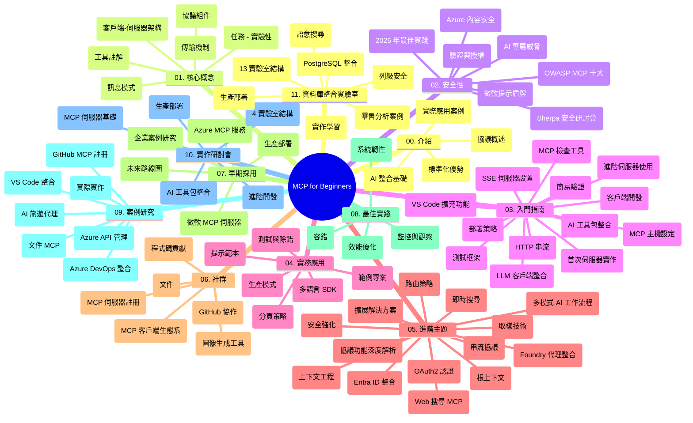

# 為初學者而設的模型上下文協定 (MCP) — 學習指南

本學習指南概述「為初學者而設的模型上下文協定 (MCP)」課程的倉庫結構和內容。使用此指南可有效瀏覽倉庫並充分利用可用資源。

## 倉庫概覽

模型上下文協定 (MCP) 是一個用於 AI 模型與客戶端應用程式之間互動的標準化框架。MCP 最初由 Anthropic 創建，現由官方 GitHub 組織中的更廣泛 MCP 社群維護。本倉庫提供包含 C#、Java、JavaScript、Python 和 TypeScript 的實作範例，針對 AI 開發者、系統架構師和軟件工程師設計的全面課程。

## 視覺課程地圖

## 倉庫結構

本倉庫組織為十一個主要部分，各自聚焦 MCP 的不同面向：

1. **導論 (00-Introduction/)**
   - 模型上下文協定概述
   - AI 流程中標準化的重要性
   - 實際使用案例及其好處

2. **核心概念 (01-CoreConcepts/)**
   - 客戶端-伺服器架構
   - 協定主要組件
   - MCP 中的訊息模式

3. **安全性 (02-Security/)**
   - MCP 系統中的安全威脅
   - 安全實作最佳實務
   - 認證與授權策略
   - **完整的安全文件**：
     - 2025 年 MCP 安全最佳實務
     - Azure 內容安全實作指南
     - MCP 安全控管與技術
     - MCP 最佳實務快速參考
   - **重要安全議題**：
     - 提示注入與工具中毒攻擊
     - 會話劫持與代理混淆問題
     - 令牌穿透漏洞
     - 過度權限與存取控制
     - AI 元件供應鏈安全
     - Microsoft 提示盾牌集成

4. **入門指南 (03-GettingStarted/)**
   - 環境設定與配置
   - 建立基本 MCP 伺服器與客戶端
   - 與既有應用集成
   - 包含章節：
     - 首個伺服器實作
     - 客戶端開發
     - LLM 客戶端整合
     - VS Code 整合
     - 伺服器端事件 (SSE) 伺服器
     - 進階伺服器使用
     - HTTP 串流
     - AI 工具包整合
     - 測試策略
     - 部署指南

5. **實務實作 (04-PracticalImplementation/)**
   - 使用不同程式語言的 SDK
   - 除錯、測試與驗證技術
   - 製作可重複使用提示範本及工作流程
   - 實作範例專案

6. **進階主題 (05-AdvancedTopics/)**
   - 上下文工程技巧
   - Foundry 代理集成
   - 多模態 AI 工作流程
   - OAuth2 認證演示
   - 即時搜尋功能
   - 即時串流
   - 根上下文實作
   - 路由策略
   - 採樣技術
   - 擴展方法
   - 安全考量
   - Entra ID 安全集成
   - 網頁搜尋整合

7. **社群貢獻 (06-CommunityContributions/)**
   - 如何貢獻程式碼與文檔
   - 透過 GitHub 合作
   - 社群驅動增強與回饋
   - 使用多種 MCP 客戶端 (Claude Desktop、Cline、VSCode)
   - 使用熱門 MCP 伺服器包含影像產生

8. **早期採用經驗 (07-LessonsfromEarlyAdoption/)**
   - 真實世界實作與成功案例
   - 架構與部署基於 MCP 的解決方案
   - 趨勢與未來路線圖
   - **Microsoft MCP 伺服器指南**：詳盡介紹 10 個可生產使用的 Microsoft MCP 伺服器，包括：
     - Microsoft Learn Docs MCP 伺服器
     - Azure MCP 伺服器（含 15+ 專用連接器）
     - GitHub MCP 伺服器
     - Azure DevOps MCP 伺服器
     - MarkItDown MCP 伺服器
     - SQL Server MCP 伺服器
     - Playwright MCP 伺服器
     - Dev Box MCP 伺服器
     - Azure AI Foundry MCP 伺服器
     - Microsoft 365 Agents Toolkit MCP 伺服器

9. **最佳實務 (08-BestPractices/)**
   - 性能調整與優化
   - 設計容錯 MCP 系統
   - 測試與韌性策略

10. **案例研究 (09-CaseStudy/)**
    - **七個完整案例展示 MCP 在多元場景的靈活性**：
    - **Azure AI 旅遊代理**：結合 Azure OpenAI 與 AI 搜尋的多代理協調
    - **Azure DevOps 整合**：使用 YouTube 資料更新自動化工作流程
    - **即時文件檢索**：Python 控制台客戶端搭配 HTTP 串流
    - **互動式學習計劃產生器**：Chainlit 網頁應用結合會話 AI
    - **編輯器內文件**：VS Code 整合 GitHub Copilot 工作流程
    - **Azure API 管理**：企業 API 整合搭配 MCP 伺服器構建
    - **GitHub MCP 登錄中心**：生態系統開發與代理整合平台
    - 涵蓋企業整合、開發效能及生態系統擴展等實作範例

11. **實作工作坊 (10-StreamliningAIWorkflowsBuildingAnMCPServerWithAIToolkit/)**
    - 結合 MCP 與 AI 工具包的綜合實作工作坊
    - 架構智能應用，連結 AI 模型與現實工具
    - 實務模組涵蓋基礎知識、客製伺服器開發及生產部署策略
    - **實驗室結構**：
      - 實驗室 1：MCP 伺服器基礎
      - 實驗室 2：進階 MCP 伺服器開發
      - 實驗室 3：AI 工具包整合
      - 實驗室 4：生產部署與擴展
    - 以實驗室為主的分步學習方式

12. **MCP 伺服器資料庫整合實驗室 (11-MCPServerHandsOnLabs/)**
    - **全面十三實驗室學習路徑**，用 PostgreSQL 建置生產級 MCP 伺服器
    - **真實零售分析案例**：使用 Zava Retail 實例
    - **企業級設計模式**：包含行級安全 (RLS)、語義搜尋、multi-tenant 資料存取
    - **完整實驗室架構**：
      - **實驗室 00-03：基礎** — 導論、架構、安全、環境設定
      - **實驗室 04-06：建置 MCP 伺服器** — 資料庫設計、MCP 伺服器實作、工具開發
      - **實驗室 07-09：進階功能** — 語義搜尋、測試與除錯、VS Code 整合
      - **實驗室 10-12：生產與最佳實務** — 部署、監控、優化
    - **涵蓋技術**：FastMCP 框架、PostgreSQL、Azure OpenAI、Azure 容器應用、Application Insights
    - **學習成果**：生產級 MCP 伺服器、資料庫整合模式、AI 驅動分析、企業安全

## 額外資源

倉庫包含輔助資源：

- **Images 資料夾**：課程中使用的圖表和插圖
- **翻譯**：多語言支援與文件自動翻譯
- **官方 MCP 資源**：
  - [MCP 文件](https://modelcontextprotocol.io/)
  - [MCP 規範](https://spec.modelcontextprotocol.io/)
  - [MCP GitHub 倉庫](https://github.com/modelcontextprotocol)

## 如何使用此倉庫

1. **按順序學習**：依章節順序 (00 到 11) 獲得有系統的學習體驗。
2. **程式語言專攻**：若專注特定程式語言，探索相應語言的範例資料夾。
3. **實務入門**：從「入門指南」開始，設定環境並建立首個 MCP 伺服器與客戶端。
4. **進階探索**：熟悉基礎後，深入進階主題擴充知識。
5. **社群互動**：透過 GitHub 討論與 Discord 頻道加入 MCP 社群，與專家及開發者互動。

## MCP 客戶端與工具

課程涵蓋多樣 MCP 客戶端與工具：

1. **官方客戶端**：
   - Visual Studio Code 
   - VS Code 的 MCP 擴展
   - Claude Desktop
   - VSCode 中的 Claude 
   - Claude API

2. **社群客戶端**：
   - Cline（終端機版）
   - Cursor（程式碼編輯器）
   - ChatMCP
   - Windsurf

3. **MCP 管理工具**：
   - MCP CLI
   - MCP 管理員
   - MCP 連接器
   - MCP 路由器

## 熱門 MCP 伺服器

倉庫介紹多款 MCP 伺服器，包括：

1. **官方 Microsoft MCP 伺服器**：
   - Microsoft Learn Docs MCP 伺服器
   - Azure MCP 伺服器（含 15+ 專用連接器）
   - GitHub MCP 伺服器
   - Azure DevOps MCP 伺服器
   - MarkItDown MCP 伺服器
   - SQL Server MCP 伺服器
   - Playwright MCP 伺服器
   - Dev Box MCP 伺服器
   - Azure AI Foundry MCP 伺服器
   - Microsoft 365 Agents Toolkit MCP 伺服器

2. **官方參考伺服器**：
   - 檔案系統
   - 擷取
   - 記憶體
   - 順序思考

3. **影像產生**：
   - Azure OpenAI DALL-E 3
   - Stable Diffusion WebUI
   - Replicate

4. **開發工具**：
   - Git MCP
   - 終端控制
   - 程式碼助手

5. **專用伺服器**：
   - Salesforce
   - Microsoft Teams
   - Jira 與 Confluence

## 貢獻

歡迎社群對此倉庫做出貢獻。請參閱「社群貢獻」章節，了解如何有效貢獻 MCP 生態系統。

----

*本學習指南最後更新於 2026 年 2 月 5 日，反映最新 MCP 規範 2025-11-25，並概述該日期之倉庫內容。倉庫內容可能於此日期後更新。*

---

<!-- CO-OP TRANSLATOR DISCLAIMER START -->
**免責聲明**：
本文件由 AI 翻譯服務 [Co-op Translator](https://github.com/Azure/co-op-translator) 所翻譯。雖然我們致力於確保準確性，但請注意，自動翻譯可能包含錯誤或不準確之處。原始文件的母語版本應視為具權威性的來源。對於重要資訊，建議採用專業人工翻譯。我們不對因使用此翻譯而引起的任何誤解或誤釋承擔責任。
<!-- CO-OP TRANSLATOR DISCLAIMER END -->