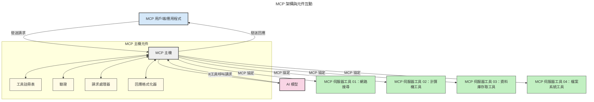

# 模型上下文協議 (MCP) 簡介：為何對可擴展 AI 應用程式如此重要

[](https://youtu.be/agBbdiOPLQA)

_(點擊上方圖片觀看本課程影片)_

生成式 AI 應用程式是一大進步，因為它們通常讓使用者能以自然語言提示與應用程式互動。然而，當投入更多時間與資源發展此類應用程式時，你希望能輕鬆整合各項功能與資源，並且易於擴充，能讓應用程式同時支援多個模型，且處理各種模型細節。簡言之，構建生成式 AI 應用程式一開始很容易，但當其規模擴大且變得更複雜時，就需開始定義架構，並可能需要依賴標準，確保應用程式建構的一致性。這正是 MCP 出場，整理並提供一套標準。

---

## **🔍 什麼是模型上下文協議 (MCP)?**

**模型上下文協議（MCP）** 是一個 **開放且標準化的介面**，允許大型語言模型（LLM）與外部工具、API 以及資料來源無縫互動。它提供了一致的架構，以強化 AI 模型在訓練資料以外的功能，使 AI 系統更智能、可擴展且更具回應性。

---

## **🎯 為什麼AI標準化很重要**

隨着生成式 AI 應用程式越發複雜，採用標準以確保 **可擴展性、可擴充性、可維護性** 以及 **避免廠商綁定** 是至關重要的。MCP 解決了這些需求，通過：

- 統一模型與工具的整合
- 減少脆弱且零散的客製化解決方案
- 允許多個不同廠商的模型共存於同一生態系統內

**注意：** MCP 雖自稱為開放標準，但沒有計劃透過任何既有標準組織，如 IEEE、IETF、W3C、ISO 或其他標準組織進行標準化。

---

## **📚 學習目標**

閱讀本文後，你將能夠：

- 定義 **模型上下文協議 (MCP)** 及其應用情境
- 理解 MCP 如何標準化模型與工具的通訊
- 識別 MCP 架構的核心組件
- 探索 MCP 在企業和開發情境中的實際應用

---

## **💡 為何模型上下文協議 (MCP) 是改變遊戲規則**

### **🔗 MCP 解決了 AI 互動的分散問題**

在 MCP 出現之前，模型與工具的整合需要：

- 針對每個工具-模型組合撰寫自訂程式碼
- 每個廠商都有非標準的 API
- 更新時常常導致斷裂問題
- 面對更多工具時缺乏良好可擴展性

### **✅ MCP 標準化的優點**

| **優點**                | **說明**                                                                 |
|-------------------------|---------------------------------------------------------------------------|
| 互通性                  | LLM 可無縫搭配不同廠商的工具                                            |
| 一致性                  | 跨平台與工具的行為一致                                                  |
| 重用性                  | 工具一次建置，可跨專案和系統使用                                        |
| 開發加速                | 透過標準化的即插即用介面，減少開發時間                                  |

---

## **🧱 MCP 高階架構概覽**

MCP 採用 **客戶端-伺服器模型**，其中：

- **MCP 主機** 負責執行 AI 模型
- **MCP 用戶端** 發起請求
- **MCP 伺服器** 提供上下文、工具和功能

### **主要組件：**

- **資源** – 提供模型靜態或動態資料  
- **提示** – 預定義的工作流程，用於引導生成  
- **工具** – 可執行函式，如搜尋、計算等  
- **取樣** – 透過遞歸互動實現代理式行為  
- **引導** – 伺服器端發起的使用者輸入請求  
- **根目錄** – 伺服器存取控制的檔案系統邊界

### **協議架構：**

MCP 採用兩層架構：
- **資料層**：基於 JSON-RPC 2.0 的通訊，包含生命週期管理與基本元件
- **傳輸層**：STDIO（本地通訊）與可串流 HTTP 搭配 SSE（遠端通訊）頻道

---

## MCP 伺服器運作方式

MCP 伺服器的運作流程如下：

- **請求流程**：
    1. 最終使用者或代表其執行軟體發起請求。
    2. **MCP 用戶端** 將請求傳送給管理 AI 模型執行時環境的 **MCP 主機**。
    3. **AI 模型** 收到使用者提示後，可能透過一個或多個工具呼叫向外部工具或資料取得存取權。
    4. **MCP 主機**（而非模型本身）根據標準化協議，與相應的 **MCP 伺服器** 通訊。
- **MCP 主機功能**：
    - **工具註冊中心**：維護可用工具與其功能目錄。
    - **身份驗證**：驗證工具存取權限。
    - **請求處理器**：處理模型發出的工具請求。
    - **回應格式化器**：將工具產生結果格式化為模型可理解格式。
- **MCP 伺服器執行**：
    - **MCP 主機** 將工具呼叫導向一個或多個提供專門功能（如搜尋、計算、資料庫查詢）的 **MCP 伺服器**。
    - **MCP 伺服器** 執行相應操作並以一致格式將結果回傳給 **MCP 主機**。
    - **MCP 主機** 格式化並轉發這些結果給 **AI 模型**。
- **回應完成**：
    - **AI 模型** 將工具輸出整合成最終回應。
    - **MCP 主機** 將回應傳回 **MCP 用戶端**，由其交付給最終使用者或呼叫軟體。
    


## 👨‍💻 如何建置 MCP 伺服器（含範例）

MCP 伺服器讓你能透過提供資料和功能來擴充 LLM 的能力。

想試試看嗎？以下是基於不同語言與技術棧的 SDK，以及創建簡單 MCP 伺服器的範例：

- **Python SDK**：https://github.com/modelcontextprotocol/python-sdk

- **TypeScript SDK**：https://github.com/modelcontextprotocol/typescript-sdk

- **Java SDK**：https://github.com/modelcontextprotocol/java-sdk

- **C#/.NET SDK**：https://github.com/modelcontextprotocol/csharp-sdk


## 🌍 MCP 的實際應用案例

MCP 延伸 AI 能力，實現各種應用：

| **應用**                  | **說明**                                                                     |
|---------------------------|------------------------------------------------------------------------------|
| 企業資料整合              | 將 LLM 連結至資料庫、CRM 或內部工具                                         |
| 代理式 AI 系統            | 讓自主代理擁有工具存取與決策工作流程                                        |
| 多模式應用                | 將文字、影像和語音工具結合於統一 AI 應用程式中                              |
| 即時資料整合              | 將即時資料引入 AI 互動，產出更精準、即時的結果                              |


### 🧠 MCP = AI 互動的通用標準

模型上下文協議 (MCP) 如同 USB-C 物理連接為裝置所建立的標準，在 AI 領域，它提供了一致介面，讓模型（用戶端）能無縫整合外部工具與資料提供者（伺服器）。這消除了針對每個 API 或資料來源須制定多種客製化協議的需求。

基於 MCP，符合 MCP 標準的工具（稱為 MCP 伺服器）遵循統一標準。這些伺服器能列出可提供的工具或動作，並在 AI 代理請求時執行。支援 MCP 的 AI 代理平台能自動發現伺服器上可用的工具，並透過此標準協議呼叫。

### 💡 促進知識存取

除了提供工具外，MCP 亦促進知識存取。它讓應用程式能為大型語言模型（LLM）提供上下文，將其與各種資料來源連結。例如，某 MCP 伺服器可能代表公司的文件庫，允許代理按需檢索相關資訊。另一伺服器則可執行特定操作，如寄送電子郵件或更新紀錄。對代理來說，這些都是可使用的工具——部分提供資料（知識上下文），部分進行操作。MCP 有效管理這兩類功能。

代理連接 MCP 伺服器時，會自動透過標準格式了解伺服器的可用功能與可存取資料。這種標準化使工具能動態可用。例如，新增 MCP 伺服器至代理系統後，即刻可使用其功能，無需額外調整代理指令。

此流暢整合符合下圖所示架構，伺服器同時提供工具和知識，確保跨系統無縫協作。

### 👉 範例：可擴展代理解決方案

```mermaid
---
title: 可擴展代理解決方案與 MCP
description: 一張圖示說明使用者如何與連接多個 MCP 伺服器的 LLM 互動，每個伺服器同時提供知識與工具，建立一個可擴展的人工智慧系統架構
---
graph TD
    User -->|提示| LLM
    LLM -->|回應| User
    LLM -->|MCP| ServerA
    LLM -->|MCP| ServerB
    ServerA -->|通用連接器| ServerB
    ServerA --> KnowledgeA
    ServerA --> ToolsA
    ServerB --> KnowledgeB
    ServerB --> ToolsB

    subgraph Server A
        KnowledgeA[知識]
        ToolsA[工具]
    end

    subgraph Server B
        KnowledgeB[知識]
        ToolsB[工具]
    end
```通用連接器使 MCP 伺服器間能相互通訊並共享功能，讓 ServerA 可將任務授權給 ServerB，或存取其工具和知識。這種架構讓工具與資料在伺服器間聯邦，支持可擴展且模組化的代理架構。因 MCP 標準化了工具暴露，代理能動態發現並在伺服器間路由請求，無需硬編碼整合。

工具與知識的聯邦：跨伺服器存取工具與資料，實現更具擴展性和模組化的代理架構。

### 🔄 高階 MCP 場景 — 用戶端 LLM 整合

除了基本 MCP 架構之外，還有高階場景包含用戶端與伺服器端均具備 LLM，實現更複雜互動。下圖中，**用戶端應用程式** 可能是一個 IDE，具備多個 MCP 工具供 LLM 使用：

```mermaid
---
title: 進階 MCP 場景與客戶端-伺服器 LLM 整合
description: 一個序列圖顯示使用者、客戶端應用程式、客戶端 LLM、多個 MCP 伺服器與伺服器 LLM 之間的詳細互動流程，說明工具發現、使用者互動、直接呼叫工具和功能協商階段
---
sequenceDiagram
    autonumber
    actor User as 👤 使用者
    participant ClientApp as 🖥️ 客戶端應用程式
    participant ClientLLM as 🧠 客戶端 LLM
    participant Server1 as 🔧 MCP 伺服器 1
    participant Server2 as 📚 MCP 伺服器 2
    participant ServerLLM as 🤖 伺服器 LLM
    
    %% 發現階段
    rect rgb(220, 240, 255)
        Note over ClientApp, Server2: 工具發現階段
        ClientApp->>+Server1: 請求可用工具/資源
        Server1-->>-ClientApp: 回傳工具清單（JSON）
        ClientApp->>+Server2: 請求可用工具/資源
        Server2-->>-ClientApp: 回傳工具清單（JSON）
        Note right of ClientApp: 本地儲存合併後<br/>的工具目錄
    end
    
    %% 使用者互動
    rect rgb(255, 240, 220)
        Note over User, ClientLLM: 使用者互動階段
        User->>+ClientApp: 輸入自然語言提示
        ClientApp->>+ClientLLM: 轉送提示 + 工具目錄
        ClientLLM->>-ClientLLM: 分析提示並選擇工具
    end
    
    %% 場景 A：直接呼叫工具
    alt 直接呼叫工具
        rect rgb(220, 255, 220)
            Note over ClientApp, Server1: 場景 A：直接呼叫工具
            ClientLLM->>+ClientApp: 請求執行工具
            ClientApp->>+Server1: 執行指定工具
            Server1-->>-ClientApp: 回傳結果
            ClientApp->>+ClientLLM: 處理結果
            ClientLLM-->>-ClientApp: 產生回應
            ClientApp-->>-User: 顯示最終答案
        end
    
    %% 場景 B：功能協商（VS Code 風格）
    else 功能協商（VS Code 風格）
        rect rgb(255, 220, 220)
            Note over ClientApp, ServerLLM: 場景 B：功能協商
            ClientLLM->>+ClientApp: 辨識所需能力
            ClientApp->>+Server2: 協商功能/能力
            Server2->>+ServerLLM: 請求額外上下文
            ServerLLM-->>-Server2: 提供上下文
            Server2-->>-ClientApp: 回傳可用功能
            ClientApp->>+Server2: 呼叫協商後工具
            Server2-->>-ClientApp: 回傳結果
            ClientApp->>+ClientLLM: 處理結果
            ClientLLM-->>-ClientApp: 產生回應
            ClientApp-->>-User: 顯示最終答案
        end
    end
```
## 🔐 MCP 的實際好處

使用 MCP 的實際好處如下：

- **新鮮度**：模型能獲取超出訓練資料的即時資訊
- **能力擴展**：模型可利用專門工具完成未訓練的任務
- **減少幻覺**：外部資料源提供事實依據
- **隱私保護**：敏感資料能保留在安全環境中，避免寫入提示內容

## 📌 重點整理

以下是使用 MCP 的關鍵重點：

- **MCP** 標準化 AI 模型與工具及資料的互動方式
- 促進 **擴充性、一致性與互通性**
- MCP 幫助 **減少開發時間、提升可靠度、擴展模型功能**
- 客戶端-伺服器架構 **支援靈活且可擴充的 AI 應用**

## 🧠 練習題

思考一個你想建置的 AI 應用程式。

- 有哪些 **外部工具或資料** 可以增強它的能力？
- MCP 如何讓整合更 **簡單且可靠**？

## 相關資源

- [MCP GitHub 倉庫](https://github.com/modelcontextprotocol)


## 往後看

下一章：[第1章：核心概念](../01-CoreConcepts/README.md)

---

<!-- CO-OP TRANSLATOR DISCLAIMER START -->
**免責聲明**：  
本文件使用 AI 翻譯服務 [Co-op Translator](https://github.com/Azure/co-op-translator) 進行翻譯。雖然我們努力追求準確性，但請注意自動翻譯可能包含錯誤或不準確之處。原始文件的母語版本應被視為權威來源。對於關鍵資訊，建議採用專業人工翻譯。我們對因使用本翻譯所導致的任何誤解或誤譯不承擔任何責任。
<!-- CO-OP TRANSLATOR DISCLAIMER END -->