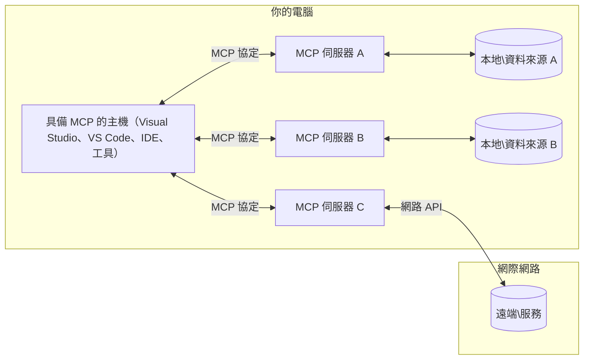

# MCP 核心概念：掌握 AI 整合的模型上下文協議

[](https://youtu.be/earDzWGtE84)

_(點擊上方圖片觀看本課程視頻)_

[模型上下文協議 (MCP)](https://github.com/modelcontextprotocol) 是一套強大且標準化的框架，優化大型語言模型（LLM）與外部工具、應用程式及資料來源之間的溝通。  
本指南將引導你瞭解 MCP 的核心概念。你將學習其客戶端-伺服器架構、重要組件、通訊機制與實作最佳實踐。

- **明確用戶同意**：所有資料存取和操作均需用戶明確批准後方可執行。用戶必須清楚瞭解將存取的資料及將執行的操作，並能細緻控管權限與授權。

- **資料隱私保護**：用戶資料僅在明確同意下揭露，並必須在整個互動生命周期中採用強健的訪問控制保護。實作必須防止未授權資料傳輸及維持嚴格隱私邊界。

- **工具執行安全**：每次工具呼叫均需用戶明確同意，並須清楚瞭解工具功能、參數及潛在影響。堅固的安全邊界可防止非預期、不安全或惡意的工具執行。

- **運輸層安全**：所有通訊管道應使用適當的加密及身份驗證機制。遠端連線應實作安全傳輸協議及妥善的憑證管理。

#### 實作指南：

- **權限管理**：實作細緻的權限系統，讓用戶控制可存取的伺服器、工具與資源  
- **身份驗證與授權**：使用安全的身份驗證方法（OAuth、API 金鑰），並做到妥善的令牌管理與過期處理  
- **輸入驗證**：根據定義的架構驗證所有參數與資料輸入，防止注入攻擊  
- **稽核記錄**：維持全面的操作日誌以利安全監控與合規

## 概述

本課程將探討構成模型上下文協議（MCP）生態系統的基礎架構與元件。你將學習 MCP 的客戶端-伺服器架構、關鍵組件與通訊機制。

## 主要學習目標

完成本課後，你將能：

- 瞭解 MCP 的客戶端-伺服器架構。  
- 辨識主機、客戶端與伺服器的角色與責任。  
- 分析使 MCP 成為彈性整合層的核心功能。  
- 學習 MCP 生態系中資訊如何流動。  
- 透過 .NET、Java、Python 和 JavaScript 的程式範例獲得實務洞見。

## MCP 架構：深入探討

MCP 生態系採用客戶端-伺服器模型。這種模組化結構讓 AI 應用能高效與工具、資料庫、API 以及上下文資源互動。讓我們拆解此架構的核心組件。

MCP 核心是基於客戶端-伺服器架構，主機應用程式可連接多個伺服器：


- **MCP 主機（Hosts）**：像 VSCode、Claude Desktop、IDE 或想透過 MCP 存取資料的 AI 工具  
- **MCP 客戶端（Clients）**：與伺服器維持一對一連線的協議客戶端  
- **MCP 伺服器（Servers）**：輕量程式，透過標準化模型上下文協議暴露特定功能  
- **本地資料來源**：你的電腦檔案、資料庫與 MCP 伺服器可安全存取的服務  
- **遠端服務**：可透過網際網路及 API 連接的外部系統

MCP 協議是一個不斷演進的標準，採用日期版本號 (YYYY-MM-DD 格式)。目前協議版本為 **2025-11-25**，你可查看最新的[協議規範](https://modelcontextprotocol.io/specification/2025-11-25/)

### 1. 主機（Hosts）

在模型上下文協議 (MCP) 中，**主機**是 AI 應用，作為用戶與協議互動的主要介面。主機會協調並管理多個 MCP 伺服器的連線，為每個伺服器創建專屬的 MCP 客戶端。主機範例包括：

- **AI 應用**：Claude Desktop、Visual Studio Code、Claude Code  
- **開發環境**：具 MCP 整合的 IDE 與程式編輯器  
- **客製化應用**：專用 AI 代理與工具

**主機**負責協調 AI 模型交互。它們：

- **協調 AI 模型**：執行或互動 LLM 以生成回應並協調 AI 工作流程  
- **管理客戶端連線**：為每個 MCP 伺服器創建並維持一個 MCP 客戶端  
- **控制用戶介面**：掌控對話流程、用戶互動以及回應展示  
- **強化安全性**：控管權限、安全約束與身份驗證  
- **處理用戶同意**：管理對資料分享與工具執行的用戶批准  

### 2. 客戶端（Clients）

**客戶端**是關鍵元件，維持主機與 MCP 伺服器間專屬的一對一連線。主機為每個特定 MCP 伺服器建立客戶端，確保通訊通道有序且安全。多個客戶端允許主機同時連接多個伺服器。

**客戶端**是主機應用內的連接元件。它們：

- **協議通訊**：以 JSON-RPC 2.0 格式對伺服器發送請求，包含提示與指令  
- **功能協商**：在初始化時與伺服器協商支援的功能與協議版本  
- **工具執行**：管理模型的工具執行請求並處理回應  
- **即時更新**：處理伺服器的通知與即時更新  
- **回應處理**：處理並格式化伺服器回應以呈現給用戶

### 3. 伺服器（Servers）

**伺服器**是提供上下文、工具及功能給 MCP 客戶端的程式。它們可在本地（與主機同機器）或遠端（外部平台）執行，負責處理客戶端請求並提供結構化回應。伺服器透過標準化模型上下文協議暴露特定功能。

**伺服器**是提供上下文與能力的服務。它們：

- **功能註冊**：註冊並向客戶端暴露可用原語（資源、提示、工具）  
- **請求處理**：接收與執行客戶端的工具調用、資源與提示請求  
- **上下文提供**：提供上下文資訊與資料以強化模型回應  
- **狀態管理**：維護會話狀態，必要時處理有狀態的互動  
- **即時通知**：向已連線客戶端傳送功能變更和更新通知

任何人都可開發伺服器以擴展模型功能，支援本地及遠端部署。

### 4. 伺服器原語（Server Primitives）

模型上下文協議（MCP）中的伺服器提供三大核心**原語**，定義客戶端、主機與語言模型間豐富互動的基礎組件。這些原語規範協議中可用的上下文資訊與操作類型。

MCP 伺服器可同時暴露下列三種核心原語的任意組合：

#### 資源（Resources）

**資源**是為 AI 應用提供上下文資訊的資料來源。它們代表靜態或動態內容，以提升模型理解與決策：

- **上下文資料**：供 AI 模型使用的結構化資訊與上下文  
- **知識庫**：文件庫、文章、手冊與研究論文  
- **本地資料來源**：檔案、資料庫與本地系統資訊  
- **外部資料**：API 回應、網路服務與遠端系統資料  
- **動態內容**：根據外部條件而更新的即時資料

資源以 URI 識別，支持透過 `resources/list` 探索與 `resources/read` 讀取：

```text
file://documents/project-spec.md
database://production/users/schema
api://weather/current
```

#### 提示（Prompts）

**提示**是可重用的模板，幫助結構化與語言模型的互動。它們提供標準化的互動模式與模板化工作流程：

- **基於模板的互動**：預先結構化的訊息與對話啟動器  
- **工作流程模板**：常見任務與互動的標準化序列  
- **少量示例**：用於模型指令的範例模板  
- **系統提示**：定義模型行為與上下文的基礎提示  
- **動態模板**：參數化提示，可適應特定上下文

提示支援變數替換，並可透過 `prompts/list` 探索與 `prompts/get` 獲取：

```markdown
Generate a {{task_type}} for {{product}} targeting {{audience}} with the following requirements: {{requirements}}
```

#### 工具（Tools）

**工具**是可執行的函數，AI 模型可呼叫以完成特定操作。它們代表 MCP 生態系的「動詞」，使模型能與外部系統互動：

- **可執行函數**：離散操作，模型可帶特定參數呼叫  
- **外部系統整合**：API 呼叫、資料庫查詢、檔案操作、計算  
- **唯一身份**：每個工具有獨特名稱、描述與參數架構  
- **結構化輸入輸出**：工具接受驗證過的參數並回傳結構化、類型化的回應  
- **行動能力**：使模型能執行實際操作並擷取即時資料

工具以 JSON Schema 定義參數驗證，支援透過 `tools/list` 探索及 `tools/call` 執行。工具還可包含**圖示**作為額外的 UI 呈現元資料。

**工具註解**：工具支援行為註解（例如 `readOnlyHint`、`destructiveHint`），描述工具是否為唯讀或具破壞性，助客戶端於執行時做出明智決策。

工具定義範例如下：

```typescript
server.tool(
  "search_products", 
  {
    query: z.string().describe("Search query for products"),
    category: z.string().optional().describe("Product category filter"),
    max_results: z.number().default(10).describe("Maximum results to return")
  }, 
  async (params) => {
    // 執行搜尋並返回結構化結果
    return await productService.search(params);
  }
);
```

## 客戶端原語（Client Primitives）

在模型上下文協議（MCP）中，**客戶端**可暴露原語，使伺服器向主機應用請求增強功能。這些客戶端端原語允許更豐富且具互動性的伺服器實作，能存取 AI 模型功能與用戶互動。

### 取樣（Sampling）

**取樣**允許伺服器向客戶端的 AI 應用請求語言模型完成。該原語讓伺服器在不須嵌入自身模型依賴的情況下，存取 LLM 能力：

- **模型無關存取**：伺服器可請求完成結果，無須包含 LLM SDK 或管理模型存取  
- **伺服器主導 AI**：讓伺服器能自主使用客戶端的 AI 模型生成內容  
- **遞迴 LLM 互動**：支持伺服器在處理時需 AI 助力的複雜場景  
- **動態內容生成**：使伺服器能利用主機模型創造上下文回應  
- **工具呼叫支援**：伺服器可包含 `tools` 與 `toolChoice` 參數，以啟用客戶端模型在取樣時呼叫工具

取樣透過 `sampling/complete` 方法啟動，伺服器向客戶端發送完成請求。

### 根目錄（Roots）

**根目錄**提供標準化方式，讓客戶端向伺服器展示檔案系統邊界，幫助伺服器明白它們可存取的目錄與檔案：

- **檔案系統邊界**：定義伺服器可操作的檔案系統範圍  
- **存取控制**：協助伺服器瞭解可訪問的目錄與檔案權限  
- **動態更新**：根目錄變動時，客戶端可通知伺服器  
- **基於 URI 識別**：根目錄使用 `file://` URI 識別可訪問的目錄與檔案

根目錄透過 `roots/list` 探索，當根目錄改變時，客戶端發送 `notifications/roots/list_changed`。

### 徵詢（Elicitation）

**徵詢**允許伺服器透過客戶端介面向用戶請求額外資訊或確認：

- **用戶輸入請求**：伺服器在執行工具時可要求補充資訊  
- **確認對話框**：請求用戶批准敏感或關鍵操作  
- **互動工作流程**：支持伺服器創造逐步用戶互動  
- **動態參數收集**：於工具執行時收集缺少或可選的參數

徵詢請求使用 `elicitation/request` 方法，通過客戶端介面收集用戶輸入。

**URL 模式徵詢**：伺服器可請求基於 URL 的用戶互動，引導用戶至外部網頁完成身份驗證、確認或資料輸入。

### 日誌記錄（Logging）

**日誌記錄**允許伺服器向客戶端發送結構化日誌消息，用於除錯、監控與操作可視化：

- **除錯支援**：讓伺服器提供詳細執行日誌以利故障排除  
- **運營監控**：向客戶端發送狀態更新與效能指標  
- **錯誤報告**：提供詳細錯誤脈絡與診斷資訊  
- **稽核軌跡**：建立伺服器操作與決策的完整日誌

日誌訊息用於提升伺服器操作透明度及促進除錯。

## MCP 的資訊流

模型上下文協議 (MCP) 定義主機、客戶端、伺服器與模型之間的結構化資訊流。了解此流程有助清楚認識用戶請求的處理方式，以及外部工具與資料如何整合入模型回應。

- **主機啟動連線**  
  主機應用（如 IDE 或聊天介面）建立與 MCP 伺服器的連線，通常透過 STDIO、WebSocket 或其他支援的傳輸協定。

- **功能協商**  
  客戶端（嵌入主機中）與伺服器交換支援的功能、工具、資源及協議版本資訊。雙方確認會話可用功能。

- **用戶請求**  
  用戶與主機互動（例如輸入提示或指令）。主機蒐集此輸入並傳給客戶端進行處理。

- **資源或工具使用**  
  - 客戶端可能向伺服器請求額外上下文或資源（如檔案、資料庫條目或知識庫文章）以豐富模型理解。  
  - 若模型判斷需使用工具（例如擷取資料、計算或呼叫 API），客戶端會向伺服器發送工具呼叫請求，指定工具名稱與參數。

- **伺服器執行**  

伺服器接收資源或工具請求，執行必要操作（例如執行函式、查詢資料庫或擷取檔案），並以結構化格式將結果回傳給用戶端。

- **回應產生**  
  用戶端將伺服器的回應（資源資料、工具輸出等）整合到持續的模型互動中。模型利用這些資訊產生全面且具上下文關聯的回應。

- **結果呈現**  
  主機接收來自用戶端的最終輸出並將其呈現給使用者，通常包含模型所生成的文字以及任何工具執行或資源查找的結果。

此流程使 MCP 能夠透過無縫連接模型與外部工具及資料來源，支援進階、互動且具情境感知的 AI 應用。

## 協議架構與層次

MCP 包含兩個不同的架構層級，協同運作以提供完整的通訊框架：

### 資料層

**資料層**以 **JSON-RPC 2.0** 為基礎實作 MCP 協議核心。該層定義訊息結構、語意和互動模式：

#### 核心元件：

- **JSON-RPC 2.0 協議**：所有通訊均採用標準化 JSON-RPC 2.0 訊息格式進行方法呼叫、回應與通知
- **生命週期管理**：處理用戶端與伺服器間的連線初始化、能力協商和會話終止
- **伺服器原語**：讓伺服器透過工具、資源及提示提供核心功能
- **用戶端原語**：讓伺服器請求大語言模型（LLM）採樣、引導用戶輸入與傳送日誌訊息
- **即時通知**：支援非同步通知，無需輪詢即可獲取動態更新

#### 主要特性：

- **協議版本協商**：採用日期格式版本控制（YYYY-MM-DD）確保相容性
- **能力發現**：用戶端與伺服器於初始化時交換支援的功能資訊
- **有狀態會話**：在多次互動中維持連線狀態以保持上下文連貫性

### 傳輸層

**傳輸層**負責管理 MCP 參與者間的通訊管道、訊息分幀及驗證：

#### 支援的傳輸機制：

1. **STDIO 傳輸**：
   - 使用標準輸入/輸出流進行直接行程溝通
   - 適用於同一台機器上的本機行程，無網路開銷
   - 常用於本地 MCP 伺服器實作

2. **可串流 HTTP 傳輸**：
   - 以 HTTP POST 傳送用戶端至伺服器的訊息  
   - 可選擇 Server-Sent Events（SSE）實現伺服器至用戶端串流
   - 支援跨網路遠端伺服器溝通
   - 支援標準 HTTP 認證（Bearer Token、API 金鑰、自訂標頭）
   - MCP 建議使用 OAuth 進行安全令牌認證

#### 傳輸抽象：

傳輸層對資料層隱藏通訊細節，使所有傳輸機制皆可使用相同 JSON-RPC 2.0 訊息格式。此抽象允許應用程式無縫切換本地與遠端伺服器。

### 安全考量

MCP 實作必須遵守數項關鍵安全原則，以確保所有協議操作的安全、可信賴與保護：

- **用戶同意與控制**：任何資料存取或操作皆須先獲得用戶明確同意。用戶應清楚掌控資料共享範圍與授權行為，並由直覺化介面輔助審核及批准操作。

- **資料隱私**：用戶資料須在明確同意下接受曝露，並受適當存取控制保護。MCP 實作必須防範未經授權的資料傳送，確保隱私在所有互動中獲得保障。

- **工具安全**：調用任何工具前必須取得用戶明確同意。用戶應充分了解各工具功能，並且須嚴格執行安全邊界，防止非預期或不安全的工具執行。

遵循這些安全原則，MCP 能確保使用者信任、隱私與安全，同時促成強大的 AI 整合能力。

## 程式碼範例：關鍵元件

以下為幾種熱門程式語言的範例代碼，說明如何實作 MCP 伺服器關鍵元件與工具。

### .NET 範例：建立具工具的簡易 MCP 伺服器

以下為實務 .NET 程式碼範例，示範如何實作包含自訂工具的簡易 MCP 伺服器。範例展示如何定義與註冊工具、處理請求及使用模型上下文協議連接伺服器。

```csharp
using System;
using System.Threading.Tasks;
using ModelContextProtocol.Server;
using ModelContextProtocol.Server.Transport;
using ModelContextProtocol.Server.Tools;

public class WeatherServer
{
    public static async Task Main(string[] args)
    {
        // Create an MCP server
        var server = new McpServer(
            name: "Weather MCP Server",
            version: "1.0.0"
        );
        
        // Register our custom weather tool
        server.AddTool<string, WeatherData>("weatherTool", 
            description: "Gets current weather for a location",
            execute: async (location) => {
                // Call weather API (simplified)
                var weatherData = await GetWeatherDataAsync(location);
                return weatherData;
            });
        
        // Connect the server using stdio transport
        var transport = new StdioServerTransport();
        await server.ConnectAsync(transport);
        
        Console.WriteLine("Weather MCP Server started");
        
        // Keep the server running until process is terminated
        await Task.Delay(-1);
    }
    
    private static async Task<WeatherData> GetWeatherDataAsync(string location)
    {
        // This would normally call a weather API
        // Simplified for demonstration
        await Task.Delay(100); // Simulate API call
        return new WeatherData { 
            Temperature = 72.5,
            Conditions = "Sunny",
            Location = location
        };
    }
}

public class WeatherData
{
    public double Temperature { get; set; }
    public string Conditions { get; set; }
    public string Location { get; set; }
}
```

### Java 範例：MCP 伺服器元件

此範例展示與上述 .NET 範例相同的 MCP 伺服器和工具註冊，但以 Java 實作。

```java
import io.modelcontextprotocol.server.McpServer;
import io.modelcontextprotocol.server.McpToolDefinition;
import io.modelcontextprotocol.server.transport.StdioServerTransport;
import io.modelcontextprotocol.server.tool.ToolExecutionContext;
import io.modelcontextprotocol.server.tool.ToolResponse;

public class WeatherMcpServer {
    public static void main(String[] args) throws Exception {
        // 建立 MCP 伺服器
        McpServer server = McpServer.builder()
            .name("Weather MCP Server")
            .version("1.0.0")
            .build();
            
        // 註冊一個天氣工具
        server.registerTool(McpToolDefinition.builder("weatherTool")
            .description("Gets current weather for a location")
            .parameter("location", String.class)
            .execute((ToolExecutionContext ctx) -> {
                String location = ctx.getParameter("location", String.class);
                
                // 取得天氣資料（簡化）
                WeatherData data = getWeatherData(location);
                
                // 回傳格式化的回應
                return ToolResponse.content(
                    String.format("Temperature: %.1f°F, Conditions: %s, Location: %s", 
                    data.getTemperature(), 
                    data.getConditions(), 
                    data.getLocation())
                );
            })
            .build());
        
        // 使用 stdio 傳輸連接伺服器
        try (StdioServerTransport transport = new StdioServerTransport()) {
            server.connect(transport);
            System.out.println("Weather MCP Server started");
            // 保持伺服器運行直到程序終止
            Thread.currentThread().join();
        }
    }
    
    private static WeatherData getWeatherData(String location) {
        // 實作會呼叫天氣 API
        // 為範例目的而簡化
        return new WeatherData(72.5, "Sunny", location);
    }
}

class WeatherData {
    private double temperature;
    private String conditions;
    private String location;
    
    public WeatherData(double temperature, String conditions, String location) {
        this.temperature = temperature;
        this.conditions = conditions;
        this.location = location;
    }
    
    public double getTemperature() {
        return temperature;
    }
    
    public String getConditions() {
        return conditions;
    }
    
    public String getLocation() {
        return location;
    }
}
```

### Python 範例：建置 MCP 伺服器

此範例採用 fastmcp，請先安裝該套件：

```python
pip install fastmcp
```
Code Sample:

```python
#!/usr/bin/env python3
import asyncio
from fastmcp import FastMCP
from fastmcp.transports.stdio import serve_stdio

# 建立一個 FastMCP 伺服器
mcp = FastMCP(
    name="Weather MCP Server",
    version="1.0.0"
)

@mcp.tool()
def get_weather(location: str) -> dict:
    """Gets current weather for a location."""
    return {
        "temperature": 72.5,
        "conditions": "Sunny",
        "location": location
    }

# 使用類別的替代方法
class WeatherTools:
    @mcp.tool()
    def forecast(self, location: str, days: int = 1) -> dict:
        """Gets weather forecast for a location for the specified number of days."""
        return {
            "location": location,
            "forecast": [
                {"day": i+1, "temperature": 70 + i, "conditions": "Partly Cloudy"}
                for i in range(days)
            ]
        }

# 註冊類別工具
weather_tools = WeatherTools()

# 啟動伺服器
if __name__ == "__main__":
    asyncio.run(serve_stdio(mcp))
```

### JavaScript 範例：建立 MCP 伺服器

此範例展示如何用 JavaScript 建立 MCP 伺服器並註冊兩個與天氣相關的工具。

```javascript
// 使用官方的模型上下文協議 SDK
import { McpServer } from "@modelcontextprotocol/sdk/server/mcp.js";
import { StdioServerTransport } from "@modelcontextprotocol/sdk/server/stdio.js";
import { z } from "zod"; // 用於參數驗證

// 創建 MCP 伺服器
const server = new McpServer({
  name: "Weather MCP Server",
  version: "1.0.0"
});

// 定義一個天氣工具
server.tool(
  "weatherTool",
  {
    location: z.string().describe("The location to get weather for")
  },
  async ({ location }) => {
    // 通常會調用天氣 API
    // 為演示而簡化
    const weatherData = await getWeatherData(location);
    
    return {
      content: [
        { 
          type: "text", 
          text: `Temperature: ${weatherData.temperature}°F, Conditions: ${weatherData.conditions}, Location: ${weatherData.location}` 
        }
      ]
    };
  }
);

// 定義一個預報工具
server.tool(
  "forecastTool",
  {
    location: z.string(),
    days: z.number().default(3).describe("Number of days for forecast")
  },
  async ({ location, days }) => {
    // 通常會調用天氣 API
    // 為演示而簡化
    const forecast = await getForecastData(location, days);
    
    return {
      content: [
        { 
          type: "text", 
          text: `${days}-day forecast for ${location}: ${JSON.stringify(forecast)}` 
        }
      ]
    };
  }
);

// 輔助函數
async function getWeatherData(location) {
  // 模擬 API 調用
  return {
    temperature: 72.5,
    conditions: "Sunny",
    location: location
  };
}

async function getForecastData(location, days) {
  // 模擬 API 調用
  return Array.from({ length: days }, (_, i) => ({
    day: i + 1,
    temperature: 70 + Math.floor(Math.random() * 10),
    conditions: i % 2 === 0 ? "Sunny" : "Partly Cloudy"
  }));
}

// 使用 stdio 傳輸連接伺服器
const transport = new StdioServerTransport();
server.connect(transport).catch(console.error);

console.log("Weather MCP Server started");
```

此 JavaScript 範例示範如何建立 MCP 用戶端，連接伺服器、傳送提示，並處理包含工具呼叫在內的回應。

## 安全與授權

MCP 內建多項管理安全和授權的概念與機制，以貫穿協議全程：

1. **工具權限控管**：  
  用戶端可指定模型於會話期間可使用的工具，確保僅可調用明確授權的工具，降低非預期或不安全操作風險。權限可根據用戶偏好、組織政策或互動上下文動態設定。

2. **認證**：  
  伺服器可要求認證方可存取工具、資源或敏感操作，可能包含 API 金鑰、OAuth 令牌或其他認證機制。適當認證確保只有受信用戶端和使用者能調用伺服器端功能。

3. **驗證**：  
  所有工具呼叫都必須通過參數驗證。每個工具定義參數的預期類型、格式和限制，伺服器依此驗證請求。防止格式錯誤或惡意輸入影響工具實作，維持操作完整性。

4. **速率限制**：  
  為防止濫用並確保資源公平使用，MCP 伺服器可對工具呼叫及資源存取實施速率限制。限制可依用戶、會話或全域層級設定，有效防止阻斷服務攻擊或過度資源消耗。

結合這些機制，MCP 提供安全基礎，整合語言模型與外部工具及資料來源，同時賦予使用者與開發者細緻的存取與使用控管。

## 協議訊息與通訊流程

MCP 通訊使用結構化的 **JSON-RPC 2.0** 訊息，以促進主機、用戶端及伺服器間清楚且可靠的互動。協議定義不同操作類型的特定訊息模式：

### 核心訊息類型：

#### **初始化訊息**
- **`initialize` 請求**：建立連線並協商協議版本及能力
- **`initialize` 回應**：確認支援的功能及伺服器資訊  
- **`notifications/initialized`**：表示初始化完成並會話就緒

#### **發現訊息**
- **`tools/list` 請求**：探索伺服器上可用工具
- **`resources/list` 請求**：列出可用資源（資料來源）
- **`prompts/list` 請求**：取得可用提示範本

#### **執行訊息**  
- **`tools/call` 請求**：使用提供參數執行指定工具
- **`resources/read` 請求**：擷取指定資源內容
- **`prompts/get` 請求**：取得提示範本及可選參數

#### **用戶端訊息**
- **`sampling/complete` 請求**：伺服器向用戶端請求 LLM 完成結果
- **`elicitation/request`**：伺服器透過用戶端介面請求用戶輸入
- **日誌訊息**：伺服器送出結構化日誌給用戶端

#### **通知訊息**
- **`notifications/tools/list_changed`**：伺服器通知用戶端工具清單變更
- **`notifications/resources/list_changed`**：伺服器通知用戶端資源清單變更  
- **`notifications/prompts/list_changed`**：伺服器通知用戶端提示清單變更

### 訊息結構：

所有 MCP 訊息遵循 JSON-RPC 2.0 格式，包含：
- **請求訊息**：含 `id`、`method` 及可選 `params`
- **回應訊息**：含 `id` 與 `result` 或 `error`  
- **通知訊息**：含 `method` 及可選 `params`（無 `id`，不需回應）

此結構化通訊確保互動可靠、可追蹤且易於擴展，支援即時更新、工具串接與強健錯誤處理等進階情境。

### 工作任務（實驗性）

**工作任務**是一項實驗性功能，提供持久執行包裝器，使 MCP 請求可延後取得結果並追蹤狀態：

- **長時間運作**：追蹤昂貴運算、工作流程自動化和批次處理
- **延後結果**：輪詢任務狀態並於作業完成後取回結果
- **狀態追蹤**：透過定義生命週期狀態監控任務進度
- **多步驟作業**：支援跨多次互動的複雜工作流程

工作任務將標準 MCP 請求包裝，實現無法即時完成操作的非同步執行模式。

## 主要重點整理

- **架構**：MCP 採用用戶端-伺服器架構，由主機管理多個用戶端與伺服器連線
- **參與者**：生態系包含主機（AI 應用）、用戶端（協議連接器）和伺服器（能力提供者）
- **傳輸機制**：通訊支援 STDIO（本地）及可串流 HTTP，搭配選用 SSE（遠端）
- **核心原語**：伺服器揭露工具（可執行函式）、資源（資料來源）及提示（範本）
- **用戶端原語**：伺服器可請求採樣（支援工具呼叫的 LLM 完成）、引導（用戶輸入含 URL 模式）、根目錄（檔案系統邊界）及日誌
- **實驗功能**：工作任務為長時執行操作提供持久包裝器
- **協議基礎**：基於 JSON-RPC 2.0，採用日期式版本控制（目前版本：2025-11-25）
- **即時能力**：支援即時通知、動態更新及同步
- **安全優先**：明確用戶同意、資料隱私保護與安全傳輸為核心需求

## 練習

設計一個在您的領域中有用的簡單 MCP 工具。定義：
1. 工具名稱
2. 接受的參數
3. 回傳的輸出
4. 模型如何使用此工具解決使用者問題


---

## 下一章節

接下來：[Chapter 2: Security](../02-Security/README.md)

---

<!-- CO-OP TRANSLATOR DISCLAIMER START -->
**免責聲明**：  
本文件係使用 AI 翻譯服務 [Co-op Translator](https://github.com/Azure/co-op-translator) 進行翻譯。雖然我們已盡力確保準確性，但請注意，自動翻譯可能包含錯誤或不準確之處。原始文件之母語版本應被視為權威來源。對於重要資訊，建議尋求專業人工翻譯。本公司不對因使用本翻譯所產生之任何誤解或曲解負責。
<!-- CO-OP TRANSLATOR DISCLAIMER END -->