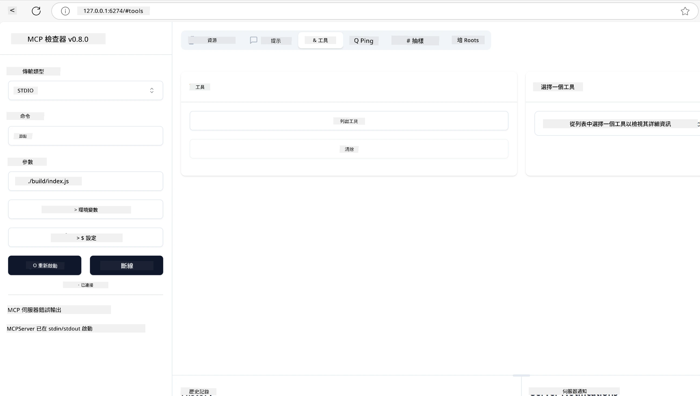
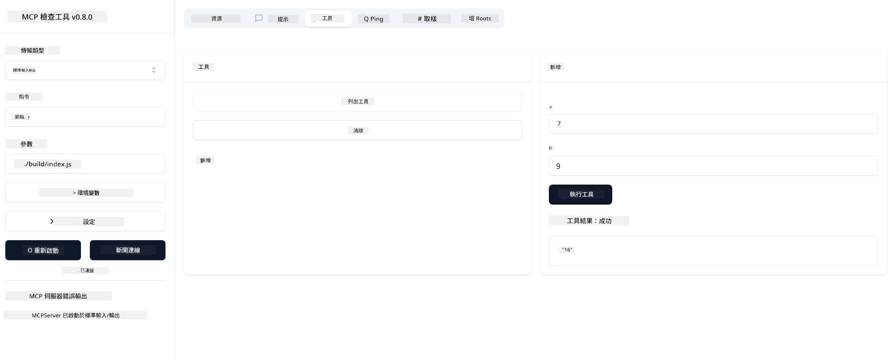

# MCP 入門指南

歡迎開始使用模型上下文協議（Model Context Protocol，MCP）！無論你是 MCP 新手還是想深化理解，本指南將引導你完成基本的設定與開發流程。你將了解 MCP 如何實現 AI 模型與應用程式之間的無縫整合，並學會如何快速準備環境以構建和測試基於 MCP 的解決方案。

> 簡要說明；如果你開發 AI 應用，你會知道可以為大型語言模型（LLM）添加工具和其他資源，使 LLM 更加博學。然而，如果你將這些工具和資源放在伺服器上，該應用和伺服器的功能可以被任何有無 LLM 的客戶端使用。

## 概述

本課程提供實用指導，教你如何設定 MCP 環境並構建你的第一個 MCP 應用。你將學會如何安裝必要的工具和框架、建立基本的 MCP 伺服器、創建主機應用程式，並測試你的實作。

模型上下文協議（MCP）是一個開放協議，標準化應用程式如何向大型語言模型提供上下文。可以把 MCP 想像成 AI 應用的 USB-C 端口——它提供一種標準化方式，將 AI 模型連接到不同的資料來源和工具。

## 學習目標

完成本課程後，你將能夠：

- 為 C#、Java、Python、TypeScript 和 Rust 設定 MCP 開發環境
- 建立並部署具備自訂功能（資源、提示和工具）的基本 MCP 伺服器
- 創建連接 MCP 伺服器的主機應用程式
- 測試和除錯 MCP 實作

## 設定你的 MCP 環境

在開始使用 MCP 之前，準備好開發環境並了解基本工作流程非常重要。本節將引導你完成初始設定步驟，確保你能順利開始 MCP 開發。

### 先決條件

在深入 MCP 開發前，請確保你已具備：

- **開發環境**：選擇的語言（C#、Java、Python、TypeScript 或 Rust）
- **IDE/編輯器**：Visual Studio、Visual Studio Code、IntelliJ、Eclipse、PyCharm 或任何現代程式碼編輯器
- **套件管理工具**：NuGet、Maven/Gradle、pip、npm/yarn 或 Cargo
- **API 金鑰**：用於你計劃在主機應用中使用的任何 AI 服務

## 基本 MCP 伺服器結構

MCP 伺服器通常包含：

- **伺服器設定**：設定埠號、認證及其他設定
- **資源**：提供給 LLM 的資料和上下文
- **工具**：模型可調用的功能
- **提示**：用於生成或結構化文本的範本

以下是 TypeScript 的簡化範例：

```typescript
import { McpServer, ResourceTemplate } from "@modelcontextprotocol/sdk/server/mcp.js";
import { StdioServerTransport } from "@modelcontextprotocol/sdk/server/stdio.js";
import { z } from "zod";

// 建立一個 MCP 伺服器
const server = new McpServer({
  name: "Demo",
  version: "1.0.0"
});

// 新增一個加法工具
server.tool("add",
  { a: z.number(), b: z.number() },
  async ({ a, b }) => ({
    content: [{ type: "text", text: String(a + b) }]
  })
);

// 新增一個動態問候資源
server.resource(
  "file",
  // 'list' 參數控制資源如何列出可用檔案。將其設為 undefined 可停用此資源的列出功能。
  new ResourceTemplate("file://{path}", { list: undefined }),
  async (uri, { path }) => ({
    contents: [{
      uri: uri.href,
      text: `File, ${path}!`
    }]
  })
);

// 新增一個讀取檔案內容的檔案資源
server.resource(
  "file",
  new ResourceTemplate("file://{path}", { list: undefined }),
  async (uri, { path }) => {
    let text;
    try {
      text = await fs.readFile(path, "utf8");
    } catch (err) {
      text = `Error reading file: ${err.message}`;
    }
    return {
      contents: [{
        uri: uri.href,
        text
      }]
    };
  }
);

server.prompt(
  "review-code",
  { code: z.string() },
  ({ code }) => ({
    messages: [{
      role: "user",
      content: {
        type: "text",
        text: `Please review this code:\n\n${code}`
      }
    }]
  })
);

// 開始從 stdin 接收訊息並在 stdout 發送訊息
const transport = new StdioServerTransport();
await server.connect(transport);
```

在上述程式碼中，我們：

- 從 MCP TypeScript SDK 匯入必要的類別。
- 建立並配置新的 MCP 伺服器實例。
- 註冊一個自訂工具（`calculator`）及其處理函式。
- 啟動伺服器以監聽傳入的 MCP 請求。

## 測試與除錯

在開始測試 MCP 伺服器之前，了解可用工具和除錯最佳實踐非常重要。有效的測試能確保伺服器按預期運作，並幫助你快速識別和解決問題。以下章節概述了驗證 MCP 實作的建議方法。

MCP 提供工具幫助你測試和除錯伺服器：

- **Inspector 工具**，這個圖形介面允許你連接伺服器並測試工具、提示和資源。
- **curl**，你也可以使用命令列工具如 curl 或其他能建立並執行 HTTP 命令的客戶端連接伺服器。

### 使用 MCP Inspector

[MCP Inspector](https://github.com/modelcontextprotocol/inspector) 是一款視覺化測試工具，幫助你：

1. **發現伺服器功能**：自動偵測可用的資源、工具和提示
2. **測試工具執行**：嘗試不同參數並即時查看回應
3. **檢視伺服器元資料**：檢查伺服器資訊、結構和設定

```bash
# 例如 TypeScript，安裝並執行 MCP Inspector
npx @modelcontextprotocol/inspector node build/index.js
```

執行上述命令後，MCP Inspector 將在瀏覽器中啟動本地網頁介面。你會看到一個儀表板，顯示你註冊的 MCP 伺服器及其可用的工具、資源和提示。該介面允許你互動式測試工具執行、檢查伺服器元資料並查看即時回應，使你更容易驗證和除錯 MCP 伺服器實作。

以下是介面截圖範例：



## 常見設定問題與解決方案

| 問題 | 可能解決方案 |
|-------|-------------------|
| 連線被拒絕 | 檢查伺服器是否運行及埠號是否正確 |
| 工具執行錯誤 | 檢查參數驗證和錯誤處理 |
| 認證失敗 | 驗證 API 金鑰和權限 |
| 結構驗證錯誤 | 確保參數符合定義的結構 |
| 伺服器無法啟動 | 檢查埠號衝突或缺少依賴 |
| CORS 錯誤 | 配置正確的跨源資源共享標頭 |
| 認證問題 | 驗證令牌有效性和權限 |

## 本地開發

在本地開發和測試時，你可以直接在機器上運行 MCP 伺服器：

1. **啟動伺服器程序**：執行你的 MCP 伺服器應用程式
2. **配置網路**：確保伺服器在預期埠號可訪問
3. **連接客戶端**：使用本地連接 URL，如 `http://localhost:3000`

```bash
# 範例：在本地執行 TypeScript MCP 伺服器
npm run start
# 伺服器運行於 http://localhost:3000
```

## 建立你的第一個 MCP 伺服器

我們在先前課程中已涵蓋[核心概念](/01-CoreConcepts/README.md)，現在是時候將這些知識付諸實踐。

### 伺服器能做什麼

在開始撰寫程式碼前，先回顧伺服器能做的事情：

MCP 伺服器可以：

- 存取本地檔案和資料庫
- 連接遠端 API
- 執行計算
- 整合其他工具和服務
- 提供用戶介面以供互動

很好，既然知道它能做什麼，讓我們開始編碼吧。

## 練習：建立伺服器

建立伺服器需要遵循以下步驟：

- 安裝 MCP SDK。
- 建立專案並設定專案結構。
- 撰寫伺服器程式碼。
- 測試伺服器。

### -1- 建立專案

#### TypeScript

```sh
# 建立專案目錄並初始化 npm 專案
mkdir calculator-server
cd calculator-server
npm init -y
```

#### Python

```sh
# 建立專案資料夾
mkdir calculator-server
cd calculator-server
# 在 Visual Studio Code 中開啟資料夾 - 如果你使用其他 IDE，請跳過此步驟
code .
```

#### .NET

```sh
dotnet new console -n McpCalculatorServer
cd McpCalculatorServer
```

#### Java

Java 請建立 Spring Boot 專案：

```bash
curl https://start.spring.io/starter.zip \
  -d dependencies=web \
  -d javaVersion=21 \
  -d type=maven-project \
  -d groupId=com.example \
  -d artifactId=calculator-server \
  -d name=McpServer \
  -d packageName=com.microsoft.mcp.sample.server \
  -o calculator-server.zip
```

解壓縮 zip 檔案：

```bash
unzip calculator-server.zip -d calculator-server
cd calculator-server
# 可選擇移除未使用的測試
rm -rf src/test/java
```

將以下完整設定加入你的 *pom.xml* 檔案：

```xml
<?xml version="1.0" encoding="UTF-8"?>
<project xmlns="http://maven.apache.org/POM/4.0.0"
    xmlns:xsi="http://www.w3.org/2001/XMLSchema-instance"
    xsi:schemaLocation="http://maven.apache.org/POM/4.0.0 http://maven.apache.org/xsd/maven-4.0.0.xsd">
    <modelVersion>4.0.0</modelVersion>
    
    <!-- Spring Boot parent for dependency management -->
    <parent>
        <groupId>org.springframework.boot</groupId>
        <artifactId>spring-boot-starter-parent</artifactId>
        <version>3.5.0</version>
        <relativePath />
    </parent>

    <!-- Project coordinates -->
    <groupId>com.example</groupId>
    <artifactId>calculator-server</artifactId>
    <version>0.0.1-SNAPSHOT</version>
    <name>Calculator Server</name>
    <description>Basic calculator MCP service for beginners</description>

    <!-- Properties -->
    <properties>
        <java.version>21</java.version>
        <maven.compiler.source>21</maven.compiler.source>
        <maven.compiler.target>21</maven.compiler.target>
    </properties>

    <!-- Spring AI BOM for version management -->
    <dependencyManagement>
        <dependencies>
            <dependency>
                <groupId>org.springframework.ai</groupId>
                <artifactId>spring-ai-bom</artifactId>
                <version>1.0.0-SNAPSHOT</version>
                <type>pom</type>
                <scope>import</scope>
            </dependency>
        </dependencies>
    </dependencyManagement>

    <!-- Dependencies -->
    <dependencies>
        <dependency>
            <groupId>org.springframework.ai</groupId>
            <artifactId>spring-ai-starter-mcp-server-webflux</artifactId>
        </dependency>
        <dependency>
            <groupId>org.springframework.boot</groupId>
            <artifactId>spring-boot-starter-actuator</artifactId>
        </dependency>
        <dependency>
         <groupId>org.springframework.boot</groupId>
         <artifactId>spring-boot-starter-test</artifactId>
         <scope>test</scope>
      </dependency>
    </dependencies>

    <!-- Build configuration -->
    <build>
        <plugins>
            <plugin>
                <groupId>org.springframework.boot</groupId>
                <artifactId>spring-boot-maven-plugin</artifactId>
            </plugin>
            <plugin>
                <groupId>org.apache.maven.plugins</groupId>
                <artifactId>maven-compiler-plugin</artifactId>
                <configuration>
                    <release>21</release>
                </configuration>
            </plugin>
        </plugins>
    </build>

    <!-- Repositories for Spring AI snapshots -->
    <repositories>
        <repository>
            <id>spring-milestones</id>
            <name>Spring Milestones</name>
            <url>https://repo.spring.io/milestone</url>
            <snapshots>
                <enabled>false</enabled>
            </snapshots>
        </repository>
        <repository>
            <id>spring-snapshots</id>
            <name>Spring Snapshots</name>
            <url>https://repo.spring.io/snapshot</url>
            <releases>
                <enabled>false</enabled>
            </releases>
        </repository>
    </repositories>
</project>
```

#### Rust

```sh
mkdir calculator-server
cd calculator-server
cargo init
```

### -2- 新增相依套件

專案建立完成後，接著新增相依套件：

#### TypeScript

```sh
# 如果尚未安裝，請全域安裝 TypeScript
npm install typescript -g

# 安裝 MCP SDK 和 Zod 以進行結構驗證
npm install @modelcontextprotocol/sdk zod
npm install -D @types/node typescript
```

#### Python

```sh
# 建立虛擬環境並安裝相依套件
python -m venv venv
venv\Scripts\activate
pip install "mcp[cli]"
```

#### Java

```bash
cd calculator-server
./mvnw clean install -DskipTests
```

#### Rust

```sh
cargo add rmcp --features server,transport-io
cargo add serde
cargo add tokio --features rt-multi-thread
```

### -3- 建立專案檔案

#### TypeScript

打開 *package.json* 檔案，將內容替換為以下內容，確保你能編譯並執行伺服器：

```json
{
  "name": "calculator-server",
  "version": "1.0.0",
  "main": "index.js",
  "type": "module",
  "scripts": {
    "build": "tsc",
    "start": "npm run build && node ./build/index.js",
  },
  "keywords": [],
  "author": "",
  "license": "ISC",
  "description": "A simple calculator server using Model Context Protocol",
  "dependencies": {
    "@modelcontextprotocol/sdk": "^1.16.0",
    "zod": "^3.25.76"
  },
  "devDependencies": {
    "@types/node": "^24.0.14",
    "typescript": "^5.8.3"
  }
}
```

建立 *tsconfig.json*，內容如下：

```json
{
  "compilerOptions": {
    "target": "ES2022",
    "module": "Node16",
    "moduleResolution": "Node16",
    "outDir": "./build",
    "rootDir": "./src",
    "strict": true,
    "esModuleInterop": true,
    "skipLibCheck": true,
    "forceConsistentCasingInFileNames": true
  },
  "include": ["src/**/*"],
  "exclude": ["node_modules"]
}
```

建立一個目錄用於放置原始碼：

```sh
mkdir src
touch src/index.ts
```

#### Python

建立檔案 *server.py*

```sh
touch server.py
```

#### .NET

安裝所需的 NuGet 套件：

```sh
dotnet add package ModelContextProtocol --prerelease
dotnet add package Microsoft.Extensions.Hosting
```

#### Java

Java Spring Boot 專案的結構會自動建立。

#### Rust

Rust 預設會在執行 `cargo init` 時建立 *src/main.rs* 檔案。打開該檔案並刪除預設程式碼。

### -4- 撰寫伺服器程式碼

#### TypeScript

建立檔案 *index.ts* 並加入以下程式碼：

```typescript
import { McpServer, ResourceTemplate } from "@modelcontextprotocol/sdk/server/mcp.js";
import { StdioServerTransport } from "@modelcontextprotocol/sdk/server/stdio.js";
import { z } from "zod";
 
// 建立一個 MCP 伺服器
const server = new McpServer({
  name: "Calculator MCP Server",
  version: "1.0.0"
});
```

現在你有一個伺服器，但功能不多，讓我們來改進它。

#### Python

```python
# server.py
from mcp.server.fastmcp import FastMCP

# 建立一個 MCP 伺服器
mcp = FastMCP("Demo")
```

#### .NET

```csharp
using Microsoft.Extensions.DependencyInjection;
using Microsoft.Extensions.Hosting;
using Microsoft.Extensions.Logging;
using ModelContextProtocol.Server;
using System.ComponentModel;

var builder = Host.CreateApplicationBuilder(args);
builder.Logging.AddConsole(consoleLogOptions =>
{
    // Configure all logs to go to stderr
    consoleLogOptions.LogToStandardErrorThreshold = LogLevel.Trace;
});

builder.Services
    .AddMcpServer()
    .WithStdioServerTransport()
    .WithToolsFromAssembly();
await builder.Build().RunAsync();

// add features
```

#### Java

Java 請建立核心伺服器元件。首先，修改主應用程式類別：

*src/main/java/com/microsoft/mcp/sample/server/McpServerApplication.java*：

```java
package com.microsoft.mcp.sample.server;

import org.springframework.ai.tool.ToolCallbackProvider;
import org.springframework.ai.tool.method.MethodToolCallbackProvider;
import org.springframework.boot.SpringApplication;
import org.springframework.boot.autoconfigure.SpringBootApplication;
import org.springframework.context.annotation.Bean;
import com.microsoft.mcp.sample.server.service.CalculatorService;

@SpringBootApplication
public class McpServerApplication {

    public static void main(String[] args) {
        SpringApplication.run(McpServerApplication.class, args);
    }
    
    @Bean
    public ToolCallbackProvider calculatorTools(CalculatorService calculator) {
        return MethodToolCallbackProvider.builder().toolObjects(calculator).build();
    }
}
```

建立計算器服務 *src/main/java/com/microsoft/mcp/sample/server/service/CalculatorService.java*：

```java
package com.microsoft.mcp.sample.server.service;

import org.springframework.ai.tool.annotation.Tool;
import org.springframework.stereotype.Service;

/**
 * Service for basic calculator operations.
 * This service provides simple calculator functionality through MCP.
 */
@Service
public class CalculatorService {

    /**
     * Add two numbers
     * @param a The first number
     * @param b The second number
     * @return The sum of the two numbers
     */
    @Tool(description = "Add two numbers together")
    public String add(double a, double b) {
        double result = a + b;
        return formatResult(a, "+", b, result);
    }

    /**
     * Subtract one number from another
     * @param a The number to subtract from
     * @param b The number to subtract
     * @return The result of the subtraction
     */
    @Tool(description = "Subtract the second number from the first number")
    public String subtract(double a, double b) {
        double result = a - b;
        return formatResult(a, "-", b, result);
    }

    /**
     * Multiply two numbers
     * @param a The first number
     * @param b The second number
     * @return The product of the two numbers
     */
    @Tool(description = "Multiply two numbers together")
    public String multiply(double a, double b) {
        double result = a * b;
        return formatResult(a, "*", b, result);
    }

    /**
     * Divide one number by another
     * @param a The numerator
     * @param b The denominator
     * @return The result of the division
     */
    @Tool(description = "Divide the first number by the second number")
    public String divide(double a, double b) {
        if (b == 0) {
            return "Error: Cannot divide by zero";
        }
        double result = a / b;
        return formatResult(a, "/", b, result);
    }

    /**
     * Calculate the power of a number
     * @param base The base number
     * @param exponent The exponent
     * @return The result of raising the base to the exponent
     */
    @Tool(description = "Calculate the power of a number (base raised to an exponent)")
    public String power(double base, double exponent) {
        double result = Math.pow(base, exponent);
        return formatResult(base, "^", exponent, result);
    }

    /**
     * Calculate the square root of a number
     * @param number The number to find the square root of
     * @return The square root of the number
     */
    @Tool(description = "Calculate the square root of a number")
    public String squareRoot(double number) {
        if (number < 0) {
            return "Error: Cannot calculate square root of a negative number";
        }
        double result = Math.sqrt(number);
        return String.format("√%.2f = %.2f", number, result);
    }

    /**
     * Calculate the modulus (remainder) of division
     * @param a The dividend
     * @param b The divisor
     * @return The remainder of the division
     */
    @Tool(description = "Calculate the remainder when one number is divided by another")
    public String modulus(double a, double b) {
        if (b == 0) {
            return "Error: Cannot divide by zero";
        }
        double result = a % b;
        return formatResult(a, "%", b, result);
    }

    /**
     * Calculate the absolute value of a number
     * @param number The number to find the absolute value of
     * @return The absolute value of the number
     */
    @Tool(description = "Calculate the absolute value of a number")
    public String absolute(double number) {
        double result = Math.abs(number);
        return String.format("|%.2f| = %.2f", number, result);
    }

    /**
     * Get help about available calculator operations
     * @return Information about available operations
     */
    @Tool(description = "Get help about available calculator operations")
    public String help() {
        return "Basic Calculator MCP Service\n\n" +
               "Available operations:\n" +
               "1. add(a, b) - Adds two numbers\n" +
               "2. subtract(a, b) - Subtracts the second number from the first\n" +
               "3. multiply(a, b) - Multiplies two numbers\n" +
               "4. divide(a, b) - Divides the first number by the second\n" +
               "5. power(base, exponent) - Raises a number to a power\n" +
               "6. squareRoot(number) - Calculates the square root\n" + 
               "7. modulus(a, b) - Calculates the remainder of division\n" +
               "8. absolute(number) - Calculates the absolute value\n\n" +
               "Example usage: add(5, 3) will return 5 + 3 = 8";
    }

    /**
     * Format the result of a calculation
     */
    private String formatResult(double a, String operator, double b, double result) {
        return String.format("%.2f %s %.2f = %.2f", a, operator, b, result);
    }
}
```

**生產環境服務的可選元件：**

建立啟動設定 *src/main/java/com/microsoft/mcp/sample/server/config/StartupConfig.java*：

```java
package com.microsoft.mcp.sample.server.config;

import org.springframework.boot.CommandLineRunner;
import org.springframework.context.annotation.Bean;
import org.springframework.context.annotation.Configuration;

@Configuration
public class StartupConfig {
    
    @Bean
    public CommandLineRunner startupInfo() {
        return args -> {
            System.out.println("\n" + "=".repeat(60));
            System.out.println("Calculator MCP Server is starting...");
            System.out.println("SSE endpoint: http://localhost:8080/sse");
            System.out.println("Health check: http://localhost:8080/actuator/health");
            System.out.println("=".repeat(60) + "\n");
        };
    }
}
```

建立健康檢查控制器 *src/main/java/com/microsoft/mcp/sample/server/controller/HealthController.java*：

```java
package com.microsoft.mcp.sample.server.controller;

import org.springframework.http.ResponseEntity;
import org.springframework.web.bind.annotation.GetMapping;
import org.springframework.web.bind.annotation.RestController;
import java.time.LocalDateTime;
import java.util.HashMap;
import java.util.Map;

@RestController
public class HealthController {
    
    @GetMapping("/health")
    public ResponseEntity<Map<String, Object>> healthCheck() {
        Map<String, Object> response = new HashMap<>();
        response.put("status", "UP");
        response.put("timestamp", LocalDateTime.now().toString());
        response.put("service", "Calculator MCP Server");
        return ResponseEntity.ok(response);
    }
}
```

建立例外處理器 *src/main/java/com/microsoft/mcp/sample/server/exception/GlobalExceptionHandler.java*：

```java
package com.microsoft.mcp.sample.server.exception;

import org.springframework.http.HttpStatus;
import org.springframework.http.ResponseEntity;
import org.springframework.web.bind.annotation.ExceptionHandler;
import org.springframework.web.bind.annotation.RestControllerAdvice;

@RestControllerAdvice
public class GlobalExceptionHandler {

    @ExceptionHandler(IllegalArgumentException.class)
    public ResponseEntity<ErrorResponse> handleIllegalArgumentException(IllegalArgumentException ex) {
        ErrorResponse error = new ErrorResponse(
            "Invalid_Input", 
            "Invalid input parameter: " + ex.getMessage());
        return new ResponseEntity<>(error, HttpStatus.BAD_REQUEST);
    }

    public static class ErrorResponse {
        private String code;
        private String message;

        public ErrorResponse(String code, String message) {
            this.code = code;
            this.message = message;
        }

        // 取得器
        public String getCode() { return code; }
        public String getMessage() { return message; }
    }
}
```

建立自訂啟動畫面 *src/main/resources/banner.txt*：

```text
_____      _            _       _             
 / ____|    | |          | |     | |            
| |     __ _| | ___ _   _| | __ _| |_ ___  _ __ 
| |    / _` | |/ __| | | | |/ _` | __/ _ \| '__|
| |___| (_| | | (__| |_| | | (_| | || (_) | |   
 \_____\__,_|_|\___|\__,_|_|\__,_|\__\___/|_|   
                                                
Calculator MCP Server v1.0
Spring Boot MCP Application
```

</details>

#### Rust

將以下程式碼加入 *src/main.rs* 檔案頂端。這會匯入 MCP 伺服器所需的函式庫和模組。

```rust
use rmcp::{
    handler::server::{router::tool::ToolRouter, tool::Parameters},
    model::{ServerCapabilities, ServerInfo},
    schemars, tool, tool_handler, tool_router,
    transport::stdio,
    ServerHandler, ServiceExt,
};
use std::error::Error;
```

計算器伺服器將是一個簡單的伺服器，可以將兩個數字相加。讓我們建立一個結構體來表示計算器請求。

```rust
#[derive(Debug, serde::Deserialize, schemars::JsonSchema)]
pub struct CalculatorRequest {
    pub a: f64,
    pub b: f64,
}
```

接著，建立一個結構體來表示計算器伺服器。此結構體將持有工具路由器，用於註冊工具。

```rust
#[derive(Debug, Clone)]
pub struct Calculator {
    tool_router: ToolRouter<Self>,
}
```

現在，我們可以實作 `Calculator` 結構體，建立伺服器新實例並實作伺服器處理器以提供伺服器資訊。

```rust
#[tool_router]
impl Calculator {
    pub fn new() -> Self {
        Self {
            tool_router: Self::tool_router(),
        }
    }
}

#[tool_handler]
impl ServerHandler for Calculator {
    fn get_info(&self) -> ServerInfo {
        ServerInfo {
            instructions: Some("A simple calculator tool".into()),
            capabilities: ServerCapabilities::builder().enable_tools().build(),
            ..Default::default()
        }
    }
}
```

最後，我們需要實作主函式以啟動伺服器。此函式將建立 `Calculator` 結構體實例並透過標準輸入/輸出提供服務。

```rust
#[tokio::main]
async fn main() -> Result<(), Box<dyn Error>> {
    let service = Calculator::new().serve(stdio()).await?;
    service.waiting().await?;
    Ok(())
}
```

伺服器現在已設定為提供基本資訊。接下來，我們將新增一個工具來執行加法。

### -5- 新增工具與資源

透過新增以下程式碼來加入工具和資源：

#### TypeScript

```typescript
server.tool(
  "add",
  { a: z.number(), b: z.number() },
  async ({ a, b }) => ({
    content: [{ type: "text", text: String(a + b) }]
  })
);

server.resource(
  "greeting",
  new ResourceTemplate("greeting://{name}", { list: undefined }),
  async (uri, { name }) => ({
    contents: [{
      uri: uri.href,
      text: `Hello, ${name}!`
    }]
  })
);
```

你的工具接受參數 `a` 和 `b`，並執行一個函式，產生如下形式的回應：

```typescript
{
  contents: [{
    type: "text", content: "some content"
  }]
}
```

你的資源透過字串 "greeting" 存取，接受參數 `name`，並產生與工具類似的回應：

```typescript
{
  uri: "<href>",
  text: "a text"
}
```

#### Python

```python
# 新增一個加法工具
@mcp.tool()
def add(a: int, b: int) -> int:
    """Add two numbers"""
    return a + b


# 新增一個動態問候資源
@mcp.resource("greeting://{name}")
def get_greeting(name: str) -> str:
    """Get a personalized greeting"""
    return f"Hello, {name}!"
```

在上述程式碼中，我們：

- 定義了一個名為 `add` 的工具，接受整數參數 `a` 和 `b`。
- 建立了一個名為 `greeting` 的資源，接受參數 `name`。

#### .NET

將以下程式碼加入你的 Program.cs 檔案：

```csharp
[McpServerToolType]
public static class CalculatorTool
{
    [McpServerTool, Description("Adds two numbers")]
    public static string Add(int a, int b) => $"Sum {a + b}";
}
```

#### Java

工具已在前一步驟建立。

#### Rust

在 `impl Calculator` 區塊內新增一個工具：

```rust
#[tool(description = "Adds a and b")]
async fn add(
    &self,
    Parameters(CalculatorRequest { a, b }): Parameters<CalculatorRequest>,
) -> String {
    (a + b).to_string()
}
```

### -6- 完整程式碼

讓我們加入最後所需的程式碼，使伺服器能啟動：

#### TypeScript

```typescript
// 開始從標準輸入接收訊息並在標準輸出發送訊息
const transport = new StdioServerTransport();
await server.connect(transport);
```

完整程式碼如下：

```typescript
// index.ts
import { McpServer, ResourceTemplate } from "@modelcontextprotocol/sdk/server/mcp.js";
import { StdioServerTransport } from "@modelcontextprotocol/sdk/server/stdio.js";
import { z } from "zod";

// 建立一個 MCP 伺服器
const server = new McpServer({
  name: "Calculator MCP Server",
  version: "1.0.0"
});

// 新增一個加法工具
server.tool(
  "add",
  { a: z.number(), b: z.number() },
  async ({ a, b }) => ({
    content: [{ type: "text", text: String(a + b) }]
  })
);

// 新增一個動態問候資源
server.resource(
  "greeting",
  new ResourceTemplate("greeting://{name}", { list: undefined }),
  async (uri, { name }) => ({
    contents: [{
      uri: uri.href,
      text: `Hello, ${name}!`
    }]
  })
);

// 開始從標準輸入接收訊息並在標準輸出發送訊息
const transport = new StdioServerTransport();
server.connect(transport);
```

#### Python

```python
# server.py
from mcp.server.fastmcp import FastMCP

# 建立一個 MCP 伺服器
mcp = FastMCP("Demo")


# 新增一個加法工具
@mcp.tool()
def add(a: int, b: int) -> int:
    """Add two numbers"""
    return a + b


# 新增一個動態問候資源
@mcp.resource("greeting://{name}")
def get_greeting(name: str) -> str:
    """Get a personalized greeting"""
    return f"Hello, {name}!"

# 主要執行區塊 - 執行伺服器所必需的
if __name__ == "__main__":
    mcp.run()
```

#### .NET

建立 Program.cs 檔案，內容如下：

```csharp
using Microsoft.Extensions.DependencyInjection;
using Microsoft.Extensions.Hosting;
using Microsoft.Extensions.Logging;
using ModelContextProtocol.Server;
using System.ComponentModel;

var builder = Host.CreateApplicationBuilder(args);
builder.Logging.AddConsole(consoleLogOptions =>
{
    // Configure all logs to go to stderr
    consoleLogOptions.LogToStandardErrorThreshold = LogLevel.Trace;
});

builder.Services
    .AddMcpServer()
    .WithStdioServerTransport()
    .WithToolsFromAssembly();
await builder.Build().RunAsync();

[McpServerToolType]
public static class CalculatorTool
{
    [McpServerTool, Description("Adds two numbers")]
    public static string Add(int a, int b) => $"Sum {a + b}";
}
```

#### Java

你的完整主應用程式類別應如下所示：

```java
// McpServerApplication.java
package com.microsoft.mcp.sample.server;

import org.springframework.ai.tool.ToolCallbackProvider;
import org.springframework.ai.tool.method.MethodToolCallbackProvider;
import org.springframework.boot.SpringApplication;
import org.springframework.boot.autoconfigure.SpringBootApplication;
import org.springframework.context.annotation.Bean;
import com.microsoft.mcp.sample.server.service.CalculatorService;

@SpringBootApplication
public class McpServerApplication {

    public static void main(String[] args) {
        SpringApplication.run(McpServerApplication.class, args);
    }
    
    @Bean
    public ToolCallbackProvider calculatorTools(CalculatorService calculator) {
        return MethodToolCallbackProvider.builder().toolObjects(calculator).build();
    }
}
```

#### Rust

Rust 伺服器的最終程式碼應如下：

```rust
use rmcp::{
    ServerHandler, ServiceExt,
    handler::server::{router::tool::ToolRouter, tool::Parameters},
    model::{ServerCapabilities, ServerInfo},
    schemars, tool, tool_handler, tool_router,
    transport::stdio,
};
use std::error::Error;

#[derive(Debug, serde::Deserialize, schemars::JsonSchema)]
pub struct CalculatorRequest {
    pub a: f64,
    pub b: f64,
}

#[derive(Debug, Clone)]
pub struct Calculator {
    tool_router: ToolRouter<Self>,
}

#[tool_router]
impl Calculator {
    pub fn new() -> Self {
        Self {
            tool_router: Self::tool_router(),
        }
    }
    
    #[tool(description = "Adds a and b")]
    async fn add(
        &self,
        Parameters(CalculatorRequest { a, b }): Parameters<CalculatorRequest>,
    ) -> String {
        (a + b).to_string()
    }
}

#[tool_handler]
impl ServerHandler for Calculator {
    fn get_info(&self) -> ServerInfo {
        ServerInfo {
            instructions: Some("A simple calculator tool".into()),
            capabilities: ServerCapabilities::builder().enable_tools().build(),
            ..Default::default()
        }
    }
}

#[tokio::main]
async fn main() -> Result<(), Box<dyn Error>> {
    let service = Calculator::new().serve(stdio()).await?;
    service.waiting().await?;
    Ok(())
}
```

### -7- 測試伺服器

使用以下指令啟動伺服器：

#### TypeScript

```sh
npm run build
```

#### Python

```sh
mcp run server.py
```

> 使用 MCP Inspector，請使用 `mcp dev server.py`，此指令會自動啟動 Inspector 並提供所需的代理會話令牌。若使用 `mcp run server.py`，則需手動啟動 Inspector 並配置連線。

#### .NET

確保你在專案目錄中：

```sh
cd McpCalculatorServer
dotnet run
```

#### Java

```bash
./mvnw clean install -DskipTests
java -jar target/calculator-server-0.0.1-SNAPSHOT.jar
```

#### Rust

執行以下指令格式化並執行伺服器：

```sh
cargo fmt
cargo run
```

### -8- 使用 Inspector 執行

Inspector 是一個很棒的工具，可以啟動你的伺服器並讓你與之互動，方便測試其功能。讓我們啟動它：

> [!NOTE]
> 「命令」欄位中的內容可能會有所不同，因為它包含了使用你特定執行環境執行伺服器的指令。

#### TypeScript

```sh
npx @modelcontextprotocol/inspector node build/index.js
```

或者將其加入你的 *package.json*，如下所示：`"inspector": "npx @modelcontextprotocol/inspector node build/index.js"`，然後執行 `npm run inspector`

#### Python

Python 封裝了一個名為 inspector 的 Node.js 工具。你可以這樣呼叫該工具：

```sh
mcp dev server.py
```

不過，它並未實作該工具的所有方法，因此建議直接執行 Node.js 工具，如下所示：

```sh
npx @modelcontextprotocol/inspector mcp run server.py
```

如果你使用的工具或 IDE 允許你配置執行腳本的命令和參數，
請確保在 `Command` 欄位設定為 `python`，並將 `Arguments` 設為 `server.py`。這樣可以確保腳本正確執行。

#### .NET

請確保你在專案目錄中：

```sh
cd McpCalculatorServer
npx @modelcontextprotocol/inspector dotnet run
```

#### Java

確保你的計算器伺服器正在運行
然後執行檢查器：

```cmd
npx @modelcontextprotocol/inspector
```

在檢查器的網頁介面中：

1. 選擇「SSE」作為傳輸類型
2. 將 URL 設為：`http://localhost:8080/sse`
3. 點擊「Connect」


**你現在已連接到伺服器**
**Java 伺服器測試部分已完成**

下一部分是關於與伺服器互動。

你應該會看到以下使用者介面：


1. 按下 Connect 按鈕連接到伺服器
  連接成功後，你應該會看到以下畫面：

  

1. 選擇「Tools」和「listTools」，你應該會看到「Add」出現，選擇「Add」並填入參數值。

  你應該會看到以下回應，也就是「add」工具的結果：

  

恭喜，你已成功建立並執行你的第一個伺服器！

#### Rust

要使用 MCP Inspector CLI 執行 Rust 伺服器，請使用以下指令：

```sh
npx @modelcontextprotocol/inspector cargo run --cli --method tools/call --tool-name add --tool-arg a=1 b=2
```

### 官方 SDK

MCP 提供多種語言的官方 SDK：

- [C# SDK](https://github.com/modelcontextprotocol/csharp-sdk) - 與 Microsoft 共同維護
- [Java SDK](https://github.com/modelcontextprotocol/java-sdk) - 與 Spring AI 共同維護
- [TypeScript SDK](https://github.com/modelcontextprotocol/typescript-sdk) - 官方 TypeScript 實作
- [Python SDK](https://github.com/modelcontextprotocol/python-sdk) - 官方 Python 實作
- [Kotlin SDK](https://github.com/modelcontextprotocol/kotlin-sdk) - 官方 Kotlin 實作
- [Swift SDK](https://github.com/modelcontextprotocol/swift-sdk) - 與 Loopwork AI 共同維護
- [Rust SDK](https://github.com/modelcontextprotocol/rust-sdk) - 官方 Rust 實作

## 主要重點

- 使用語言專屬 SDK 設定 MCP 開發環境非常簡單
- 建立 MCP 伺服器涉及建立並註冊具有明確結構的工具
- 測試與除錯對於可靠的 MCP 實作至關重要

## 範例

- [Java 計算器](../samples/java/calculator/README.md)
- [.Net 計算器](../../../../03-GettingStarted/samples/csharp)
- [JavaScript 計算器](../samples/javascript/README.md)
- [TypeScript 計算器](../samples/typescript/README.md)
- [Python 計算器](../../../../03-GettingStarted/samples/python)
- [Rust 計算器](../../../../03-GettingStarted/samples/rust)

## 作業

建立一個簡單的 MCP 伺服器並加入你選擇的工具：

1. 使用你偏好的語言 (.NET、Java、Python、TypeScript 或 Rust) 實作該工具。
2. 定義輸入參數與回傳值。
3. 執行檢查器工具以確保伺服器運作正常。
4. 使用各種輸入測試實作。

## 解答

[解答](./solution/README.md)

## 額外資源

- [使用 Model Context Protocol 在 Azure 上建立代理](https://learn.microsoft.com/azure/developer/ai/intro-agents-mcp)
- [使用 Azure Container Apps 遠端 MCP (Node.js/TypeScript/JavaScript)](https://learn.microsoft.com/samples/azure-samples/mcp-container-ts/mcp-container-ts/)
- [.NET OpenAI MCP 代理](https://learn.microsoft.com/samples/azure-samples/openai-mcp-agent-dotnet/openai-mcp-agent-dotnet/)

## 下一步

下一步：[MCP 用戶端入門](../02-client/README.md)

---

<!-- CO-OP TRANSLATOR DISCLAIMER START -->
**免責聲明**：  
本文件係使用 AI 翻譯服務 [Co-op Translator](https://github.com/Azure/co-op-translator) 進行翻譯。雖然我們致力於確保翻譯的準確性，但請注意，自動翻譯可能包含錯誤或不準確之處。原始文件的母語版本應視為權威來源。對於重要資訊，建議採用專業人工翻譯。我們不對因使用本翻譯而產生的任何誤解或誤譯負責。
<!-- CO-OP TRANSLATOR DISCLAIMER END -->