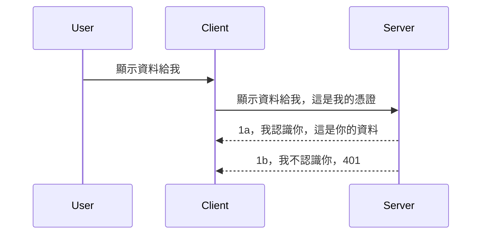

# 簡易驗證

MCP SDK 支援使用 OAuth 2.1，說實話這是一個相當複雜的流程，涉及認證伺服器、資源伺服器、提交憑證、取得代碼、用代碼換取承載者權杖，直到最終取得資源資料。如果你不熟悉 OAuth（這是一項很棒的實作），建議先從某種基礎的驗證層級開始，漸進地提升到更好更安全的機制。這也是本章存在的原因，協助你逐步建立更進階的驗證能力。

## 驗證，我們指的是什麼？

驗證是 authentication 與 authorization 的縮寫。概念是我們需要做兩件事：

- **Authentication**（認證），是確認一個人是否能進入我們的家（是否有權利在「此處」），也就是取得我們的資源伺服器（MCP 伺服器功能所在）的存取權。
- **Authorization**（授權），是判斷特定使用者是否能存取他們所請求的特定資源，例如這些訂單或產品，或者只允許讀取內容但不允許刪除，這是另一例。

## 憑證：我們如何告訴系統我們是誰

大多數網頁開發者會開始思考如何提供憑證給伺服器，通常是一個用來判斷他們是否可以進入的祕密，這就是「Authentication」。這憑證通常是使用 base64 編碼的使用者名稱與密碼，或者是一個唯一識別特定使用者的 API 金鑰。

這涉及透過名為 "Authorization" 的標頭發送，如下：

```json
{ "Authorization": "secret123" }
```
  
這通常被稱為基本驗證（basic authentication）。整體流程如下：


現在我們從流程角度理解了它的運作方式，接著該如何實作呢？大多數網頁伺服器都有一種稱為中介軟體（middleware）的概念，這是當成是請求流程中的一段代碼，可以用來驗證憑證，如果憑證有效就允許請求通過。若請求沒有有效憑證則回傳驗證錯誤。我們來看看如何實作：

**Python**

```python
class AuthMiddleware(BaseHTTPMiddleware):
    async def dispatch(self, request, call_next):

        has_header = request.headers.get("Authorization")
        if not has_header:
            print("-> Missing Authorization header!")
            return Response(status_code=401, content="Unauthorized")

        if not valid_token(has_header):
            print("-> Invalid token!")
            return Response(status_code=403, content="Forbidden")

        print("Valid token, proceeding...")
       
        response = await call_next(request)
        # 新增任何自訂標頭或以某種方式更改回應內容
        return response


starlette_app.add_middleware(CustomHeaderMiddleware)
```
  
這裡我們：

- 建立了一個名為 `AuthMiddleware` 的中介軟體，其 `dispatch` 方法會由網頁伺服器呼叫。
- 將該中介軟體加入網頁伺服器：

    ```python
    starlette_app.add_middleware(AuthMiddleware)
    ```
  
- 撰寫驗證邏輯，檢查是否存在 Authorization 標頭且送出的祕密是否有效：

    ```python
    has_header = request.headers.get("Authorization")
    if not has_header:
        print("-> Missing Authorization header!")
        return Response(status_code=401, content="Unauthorized")

    if not valid_token(has_header):
        print("-> Invalid token!")
        return Response(status_code=403, content="Forbidden")
    ```
  
如果祕密存在且有效，則透過呼叫 `call_next` 讓請求通過，並回應結果。

    ```python
    response = await call_next(request)
    # 在回應中新增任何客戶端標頭或以某種方式更改回應內容
    return response
    ```
  
運作方式是當有網頁請求至伺服器時，會呼叫中介軟體，並根據其實作決定是否放行請求，否則回應錯誤表示用戶端無權繼續。

**TypeScript**

我們用流行框架 Express 建立中介軟體，在請求抵達 MCP 伺服器前攔截。程式碼如下：

```typescript
function isValid(secret) {
    return secret === "secret123";
}

app.use((req, res, next) => {
    // 1. 是否存在授權標頭？
    if(!req.headers["Authorization"]) {
        res.status(401).send('Unauthorized');
    }
    
    let token = req.headers["Authorization"];

    // 2. 檢查有效性。
    if(!isValid(token)) {
        res.status(403).send('Forbidden');
    }

   
    console.log('Middleware executed');
    // 3. 將請求傳遞至請求流程的下一步。
    next();
});
```
  
我們在此：

1. 首先檢查 Authorization 標頭是否存在，沒存在就回傳 401 錯誤。
2. 確認憑證／權杖有效性，若無效則回傳 403 錯誤。
3. 最後將請求繼續往下傳遞，並回傳要求的資源。

## 練習：實作驗證

讓我們用學到的知識嘗試實作。計畫如下：

伺服器

- 建立網頁伺服器與 MCP 實例。
- 為伺服器實作中介軟體。

用戶端

- 透過標頭送出帶有憑證的網頁請求。

### -1- 建立網頁伺服器與 MCP 實例

第一步，我們需要建立網頁伺服器實例與 MCP 伺服器。

**Python**

此處我們建立 MCP 伺服器實例，接著建立 starlette web 應用並使用 uvicorn 主機上架。

```python
# 建立 MCP 伺服器

app = FastMCP(
    name="MCP Resource Server",
    instructions="Resource Server that validates tokens via Authorization Server introspection",
    host=settings["host"],
    port=settings["port"],
    debug=True
)

# 建立 starlette 網頁應用程式
starlette_app = app.streamable_http_app()

# 透過 uvicorn 提供應用程式服務
async def run(starlette_app):
    import uvicorn
    config = uvicorn.Config(
            starlette_app,
            host=app.settings.host,
            port=app.settings.port,
            log_level=app.settings.log_level.lower(),
        )
    server = uvicorn.Server(config)
    await server.serve()

run(starlette_app)
```
  
這段程式做了：

- 建立 MCP 伺服器。
- 從 MCP 伺服器建構 starlette web 應用：`app.streamable_http_app()`。
- 使用 uvicorn 主機與服務網頁應用：`server.serve()`。

**TypeScript**

這裡我們建立 MCP 伺服器實例。

```typescript
const server = new McpServer({
      name: "example-server",
      version: "1.0.0"
    });

    // ... 設置伺服器資源、工具和提示 ...
```
  
由於該 MCP 伺服器實例需要放在我們定義的 POST /mcp 路由內，將上面程式移動如下：

```typescript
import express from "express";
import { randomUUID } from "node:crypto";
import { McpServer } from "@modelcontextprotocol/sdk/server/mcp.js";
import { StreamableHTTPServerTransport } from "@modelcontextprotocol/sdk/server/streamableHttp.js";
import { isInitializeRequest } from "@modelcontextprotocol/sdk/types.js"

const app = express();
app.use(express.json());

// 用於存放會話 ID 對應的傳輸映射
const transports: { [sessionId: string]: StreamableHTTPServerTransport } = {};

// 處理用戶端到伺服器的 POST 請求
app.post('/mcp', async (req, res) => {
  // 檢查是否存在會話 ID
  const sessionId = req.headers['mcp-session-id'] as string | undefined;
  let transport: StreamableHTTPServerTransport;

  if (sessionId && transports[sessionId]) {
    // 重用現有的傳輸
    transport = transports[sessionId];
  } else if (!sessionId && isInitializeRequest(req.body)) {
    // 新的初始化請求
    transport = new StreamableHTTPServerTransport({
      sessionIdGenerator: () => randomUUID(),
      onsessioninitialized: (sessionId) => {
        // 根據會話 ID 存放傳輸
        transports[sessionId] = transport;
      },
      // DNS 重新綁定保護預設為關閉，以維持向後相容。如果您在本地運行此伺服器
      // 請確保設定：
      // enableDnsRebindingProtection: true,
      // allowedHosts: ['127.0.0.1'],
    });

    // 傳輸關閉時清理資源
    transport.onclose = () => {
      if (transport.sessionId) {
        delete transports[transport.sessionId];
      }
    };
    const server = new McpServer({
      name: "example-server",
      version: "1.0.0"
    });

    // ... 設定伺服器資源、工具和提示 ...

    // 連接至 MCP 伺服器
    await server.connect(transport);
  } else {
    // 無效的請求
    res.status(400).json({
      jsonrpc: '2.0',
      error: {
        code: -32000,
        message: 'Bad Request: No valid session ID provided',
      },
      id: null,
    });
    return;
  }

  // 處理請求
  await transport.handleRequest(req, res, req.body);
});

// 可重用的 GET 和 DELETE 請求處理器
const handleSessionRequest = async (req: express.Request, res: express.Response) => {
  const sessionId = req.headers['mcp-session-id'] as string | undefined;
  if (!sessionId || !transports[sessionId]) {
    res.status(400).send('Invalid or missing session ID');
    return;
  }
  
  const transport = transports[sessionId];
  await transport.handleRequest(req, res);
};

// 處理用於伺服器到客戶端 SSE 通知的 GET 請求
app.get('/mcp', handleSessionRequest);

// 處理結束會話的 DELETE 請求
app.delete('/mcp', handleSessionRequest);

app.listen(3000);
```
  
可以看到 MCP 伺服器實例已移至 `app.post("/mcp")` 裡。

接著，我們繼續下一步，建立中介軟體來驗證傳入的憑證。

### -2- 為伺服器實作中介軟體

接下來建立中介軟體，尋找 `Authorization` 標頭裡的憑證並驗證之。若合格，請求就會繼續進行所需操作（例如列出工具、讀取資源或 MCP 客戶端要求的功能）。

**Python**

建立中介軟體需定義繼承自 `BaseHTTPMiddleware` 的類別，有兩項重要物件：

- 請求物件 `request`，從中讀取標頭資料。
- `call_next` 回呼，當用戶端提供接受的憑證時呼叫。

先處理若缺少 `Authorization` 標頭的狀況：

```python
has_header = request.headers.get("Authorization")

# 沒有標頭，回傳 401 失敗，否則繼續。
if not has_header:
    print("-> Missing Authorization header!")
    return Response(status_code=401, content="Unauthorized")
```
  
此處回傳 401 未授權訊息，表示用戶端驗證失敗。

接著若有送出憑證，要檢查其有效性：

```python
 if not valid_token(has_header):
    print("-> Invalid token!")
    return Response(status_code=403, content="Forbidden")
```
  
上面回傳 403 禁止存取訊息。以下為完整中介軟體實作：

```python
class AuthMiddleware(BaseHTTPMiddleware):
    async def dispatch(self, request, call_next):

        has_header = request.headers.get("Authorization")
        if not has_header:
            print("-> Missing Authorization header!")
            return Response(status_code=401, content="Unauthorized")

        if not valid_token(has_header):
            print("-> Invalid token!")
            return Response(status_code=403, content="Forbidden")

        print("Valid token, proceeding...")
        print(f"-> Received {request.method} {request.url}")
        response = await call_next(request)
        response.headers['Custom'] = 'Example'
        return response

```
  
不過 `valid_token` 函式呢？如下：

```python
# 不要用於生產環境 - 請改進它 !!
def valid_token(token: str) -> bool:
    # 移除 "Bearer " 前綴
    if token.startswith("Bearer "):
        token = token[7:]
        return token == "secret-token"
    return False
```
  
顯然這裡還有改進空間。

重要：你絕不該在程式碼裡硬編祕密，理想狀況是從資料源或身份識別服務提供者（IDP）取得比對值，甚至讓 IDP 處理驗證。

**TypeScript**

在 Express 實作中，我們呼叫 `use` 方法註冊中介軟體函式。

我們須：

- 使用請求變數檢查 `Authorization` 屬性中憑證。
- 驗證憑證，若有效則放行，讓 MCP 請求順利運作（如列工具、取資源等）。

此範例先檢查 `Authorization` 標頭是否存在，若無則阻擋請求：

```typescript
if(!req.headers["authorization"]) {
    res.status(401).send('Unauthorized');
    return;
}
```
  
若沒送出標頭，回傳 401。

接著檢查憑證有效性，無效也阻擋請求，但訊息不同：

```typescript
if(!isValid(token)) {
    res.status(403).send('Forbidden');
    return;
} 
```
  
這會回傳 403。

完整版如下：

```typescript
app.use((req, res, next) => {
    console.log('Request received:', req.method, req.url, req.headers);
    console.log('Headers:', req.headers["authorization"]);
    if(!req.headers["authorization"]) {
        res.status(401).send('Unauthorized');
        return;
    }
    
    let token = req.headers["authorization"];

    if(!isValid(token)) {
        res.status(403).send('Forbidden');
        return;
    }  

    console.log('Middleware executed');
    next();
});
```
  
伺服器已設置中介軟體檢查用戶端傳來的憑證。用戶端部分呢？

### -3- 透過標頭送出帶憑證的網頁請求

我們必須確保用戶端能夠把憑證透過標頭送出。既然是用 MCP 用戶端來做，就需知道怎麼實現。

**Python**

用戶端需透過標頭送出憑證，如下：

```python
# 不要硬編碼該值，至少應該放在環境變數或更安全的儲存空間中
token = "secret-token"

async with streamablehttp_client(
        url = f"http://localhost:{port}/mcp",
        headers = {"Authorization": f"Bearer {token}"}
    ) as (
        read_stream,
        write_stream,
        session_callback,
    ):
        async with ClientSession(
            read_stream,
            write_stream
        ) as session:
            await session.initialize()
      
            # 待辦，您希望在客戶端完成的事情，例如列出工具、呼叫工具等。
```
  
這裡看到我們如何設置 `headers` 屬性為：` headers = {"Authorization": f"Bearer {token}"}`。

**TypeScript**

作法兩步：

1. 建構一個包含憑證的設定物件。
2. 將此設定物件傳給傳輸層。

```typescript

// 不要像這裡示範的那樣硬編碼值。至少應該將它設為環境變數並使用 dotenv（在開發模式下）。
let token = "secret123"

// 定義一個客戶端傳輸選項物件
let options: StreamableHTTPClientTransportOptions = {
  sessionId: sessionId,
  requestInit: {
    headers: {
      "Authorization": "secret123"
    }
  }
};

// 將選項物件傳遞給傳輸器
async function main() {
   const transport = new StreamableHTTPClientTransport(
      new URL(serverUrl),
      options
   );
```
  
你看到我們建立 `options` 物件，並把標頭放在 `requestInit` 屬性下。

重要：我們要如何優化這部分呢？目前實作有些問題。首先，如此傳送憑證非常冒險，除非至少是用 HTTPS。即使是，有可能憑證被偷，所以需要有系統能輕鬆撤銷權杖，並加上如地理位置來源、請求頻率（類似機器人行為）等檢查。也就是說，有很多問題需要注意。

不過話說回來，對於非常簡單的 API，且不想讓未驗證的用戶調用 API，我們目前的方式算是好的開始。

說到這，我們來稍微強化安全，使用一種標準化格式：JSON Web Token，也稱為 JWT 或「JOT」權杖。

## JSON Web Tokens，JWT

我們試著從非常簡單的憑證傳送改進。採用 JWT 的即時改進有哪些？

- **安全性提升**。基本認證會將使用者名稱和密碼重複以 base64 編碼傳送（或送 API 金鑰）提升風險。JWT 則是送出使用者名稱與密碼並換取權杖，且權杖是有時間限制會過期的。JWT 支援細緻的存取控制（角色、範圍和許可）。
- **無狀態且可擴充性高**。JWT 是自包含的，攜帶所有用戶資訊，無需伺服器存放 session 資料。也能在本地驗證權杖。
- **互通性與聯合認證**。JWT 是 Open ID Connect 的核心，並被知名身份識別提供者使用（如 Entra ID、Google Identity、Auth0）。可用於單一登入，企業級使用。
- **模組化與彈性**。JWT 可用於 API Gateway（Azure API Management、NGINX 等），並支援使用者認證及伺服器間通訊（含代打及委任場景）。
- **效能與快取**。JWT 解碼後可快取，減少解析次數，有助於高流量應用提升效能並減少基礎架構負載。
- **進階功能**。支援檢視（introspection，檢查是否仍有效）和撤銷（使權杖失效）。

擁有以上好處，接著看看如何升級我們的實作。

## 將基本驗證轉換為 JWT

高層次來看，我們需更動：

- **學習建構 JWT 權杖**，讓客戶端送出此權杖。
- **驗證 JWT 權杖**，並允許存取資源。
- **安全儲存權杖**。
- **路由保護**，保護路由與 MCP 功能。
- **新增刷新權杖**，產生短期存活權杖和長期刷新權杖，當短期權杖過期時可用刷新權杖換取新權杖。並且設置刷新端點與旋轉策略。

### -1- 建構 JWT 權杖

JWT 權杖包含：

- **header**，演算法與權杖類型。
- **payload**，聲明（claims），如 sub（代表使用者或實體，身分識別場景一般為使用者 ID）、exp（過期時間）、role（角色）等。
- **signature**，使用祕密或私鑰簽署。

需要建構 header、payload 以及編碼的權杖。

**Python**

```python

import jwt
import jwt
from jwt.exceptions import ExpiredSignatureError, InvalidTokenError
import datetime

# 用於簽署 JWT 的密鑰
secret_key = 'your-secret-key'

header = {
    "alg": "HS256",
    "typ": "JWT"
}

# 使用者資訊及其聲明和過期時間
payload = {
    "sub": "1234567890",               # 主體（使用者 ID）
    "name": "User Userson",                # 自訂聲明
    "admin": True,                     # 自訂聲明
    "iat": datetime.datetime.utcnow(),# 簽發時間
    "exp": datetime.datetime.utcnow() + datetime.timedelta(hours=1)  # 過期時間
}

# 編碼它
encoded_jwt = jwt.encode(payload, secret_key, algorithm="HS256", headers=header)
```
  
此示範中：

- 定義了使用 HS256 演算法及 JWT 類型的 header。
- 建構 payload，包括主體（使用者 ID）、使用者名稱、角色、發行時間與過期時間，實現前述的時間限制。

**TypeScript**

我們需要一些相依套件輔助建構 JWT。

相依套件：

```sh

npm install jsonwebtoken
npm install --save-dev @types/jsonwebtoken
```
  
確定安裝相依後，開始建立 header、payload，並產生編碼權杖。

```typescript
import jwt from 'jsonwebtoken';

const secretKey = 'your-secret-key'; // 在生產環境中使用環境變數

// 定義有效載荷
const payload = {
  sub: '1234567890',
  name: 'User usersson',
  admin: true,
  iat: Math.floor(Date.now() / 1000), // 發行時間
  exp: Math.floor(Date.now() / 1000) + 60 * 60 // 一小時後過期
};

// 定義標頭（可選，jsonwebtoken 設定預設值）
const header = {
  alg: 'HS256',
  typ: 'JWT'
};

// 創建令牌
const token = jwt.sign(payload, secretKey, {
  algorithm: 'HS256',
  header: header
});

console.log('JWT:', token);
```
  
這個權杖：

使用 HS256 簽署  
有效時間 1 小時  
包含聲明：sub、name、admin、iat、exp。

### -2- 驗證權杖

我們也須驗證權杖，通常在伺服器端執行確保用戶端送出的內容為有效。驗證應涵蓋結構及有效性，也推薦追加檢查確認使用者在系統內且權限正確。

要驗證權杖，我們先解碼它以讀取內容，然後檢查有效性：

**Python**

```python

# 解碼並驗證 JWT
try:
    decoded = jwt.decode(token, secret_key, algorithms=["HS256"])
    print("✅ Token is valid.")
    print("Decoded claims:")
    for key, value in decoded.items():
        print(f"  {key}: {value}")
except ExpiredSignatureError:
    print("❌ Token has expired.")
except InvalidTokenError as e:
    print(f"❌ Invalid token: {e}")

```
  
程式中呼叫 `jwt.decode`，輸入權杖、祕密與演算法。若失敗，會產生錯誤，故透過 try-except 處理。

**TypeScript**

使用 `jwt.verify` 解碼權杖，若失敗表示結構錯誤或權杖無效。

```typescript

try {
  const decoded = jwt.verify(token, secretKey);
  console.log('Decoded Payload:', decoded);
} catch (err) {
  console.error('Token verification failed:', err);
}
```
  
注意：如先前所述，我們還要檢查此權杖所對應的使用者存在於系統中、且該使用者擁有權杖所聲稱的權限。
接下來，我們來看看基於角色的存取控制，也稱為 RBAC。

## 新增基於角色的存取控制

概念是我們希望表達不同角色有不同的權限。例如，我們假設管理員可以做所有事情，普通使用者可以讀寫，訪客只能讀取。以下是一些可能的權限層級：

- Admin.Write  
- User.Read  
- Guest.Read  

讓我們看看如何用中介軟體實作這樣的控制。中介軟體可以針對每條路由新增，也可以用於所有路由。

**Python**

```python
from starlette.middleware.base import BaseHTTPMiddleware
from starlette.responses import JSONResponse
import jwt

# 不要將密鑰寫在程式碼中，這僅供演示用途。請從安全的地方讀取它。
SECRET_KEY = "your-secret-key" # 將此放入環境變數中
REQUIRED_PERMISSION = "User.Read"

class JWTPermissionMiddleware(BaseHTTPMiddleware):
    async def dispatch(self, request, call_next):
        auth_header = request.headers.get("Authorization")
        if not auth_header or not auth_header.startswith("Bearer "):
            return JSONResponse({"error": "Missing or invalid Authorization header"}, status_code=401)

        token = auth_header.split(" ")[1]
        try:
            decoded = jwt.decode(token, SECRET_KEY, algorithms=["HS256"])
        except jwt.ExpiredSignatureError:
            return JSONResponse({"error": "Token expired"}, status_code=401)
        except jwt.InvalidTokenError:
            return JSONResponse({"error": "Invalid token"}, status_code=401)

        permissions = decoded.get("permissions", [])
        if REQUIRED_PERMISSION not in permissions:
            return JSONResponse({"error": "Permission denied"}, status_code=403)

        request.state.user = decoded
        return await call_next(request)


```
  
有幾種不同的方式新增中介軟體，如下：

```python

# 方案 1：在構建 starlette 應用程式時添加中介軟體
middleware = [
    Middleware(JWTPermissionMiddleware)
]

app = Starlette(routes=routes, middleware=middleware)

# 方案 2：在 starlette 應用程式已構建後添加中介軟體
starlette_app.add_middleware(JWTPermissionMiddleware)

# 方案 3：針對每個路由添加中介軟體
routes = [
    Route(
        "/mcp",
        endpoint=..., # 處理器
        middleware=[Middleware(JWTPermissionMiddleware)]
    )
]
```
  
**TypeScript**

我們可以使用 `app.use`，搭配會對所有請求執行的中介軟體。

```typescript
app.use((req, res, next) => {
    console.log('Request received:', req.method, req.url, req.headers);
    console.log('Headers:', req.headers["authorization"]);

    // 1. 檢查是否已經發送授權標頭

    if(!req.headers["authorization"]) {
        res.status(401).send('Unauthorized');
        return;
    }
    
    let token = req.headers["authorization"];

    // 2. 檢查令牌是否有效
    if(!isValid(token)) {
        res.status(403).send('Forbidden');
        return;
    }  

    // 3. 檢查令牌使用者是否存在於我們的系統中
    if(!isExistingUser(token)) {
        res.status(403).send('Forbidden');
        console.log("User does not exist");
        return;
    }
    console.log("User exists");

    // 4. 驗證令牌是否具有正確的權限
    if(!hasScopes(token, ["User.Read"])){
        res.status(403).send('Forbidden - insufficient scopes');
    }

    console.log("User has required scopes");

    console.log('Middleware executed');
    next();
});

```
  
我們可以讓中介軟體做許多事情，而且中介軟體應該要做的有：

1. 檢查是否存在授權標頭  
2. 檢查權杖是否有效，我們呼叫 `isValid`，這是我們撰寫的用來檢查 JWT 權杖完整性與有效性的方法。  
3. 驗證使用者是否存在於系統中，我們應該檢查這點。

   ```typescript
    // 資料庫中的使用者
   const users = [
     "user1",
     "User usersson",
   ]

   function isExistingUser(token) {
     let decodedToken = verifyToken(token);

     // 待辦事項，檢查使用者是否存在於資料庫中
     return users.includes(decodedToken?.name || "");
   }
   ```
  
   上面，我們建立了一個非常簡單的 `users` 清單，當然，實際上它應放在資料庫中。

4. 此外，我們還應該檢查權杖是否具備正確的權限。

   ```typescript
   if(!hasScopes(token, ["User.Read"])){
        res.status(403).send('Forbidden - insufficient scopes');
   }
   ```
  
   在上述中介軟體的程式碼中，我們檢查權杖是否含有 User.Read 權限，如果沒有，則回傳 403 錯誤。下面是 `hasScopes` 輔助方法。

   ```typescript
   function hasScopes(scope: string, requiredScopes: string[]) {
     let decodedToken = verifyToken(scope);
    return requiredScopes.every(scope => decodedToken?.scopes.includes(scope));
  }  
   ```

Have a think which additional checks you should be doing, but these are the absolute minimum of checks you should be doing.

Using Express as a web framework is a common choice. There are helpers library when you use JWT so you can write less code.

- `express-jwt`, helper library that provides a middleware that helps decode your token.
- `express-jwt-permissions`, this provides a middleware `guard` that helps check if a certain permission is on the token.

Here's what these libraries can look like when used:

```typescript
const express = require('express');
const jwt = require('express-jwt');
const guard = require('express-jwt-permissions')();

const app = express();
const secretKey = 'your-secret-key'; // put this in env variable

// Decode JWT and attach to req.user
app.use(jwt({ secret: secretKey, algorithms: ['HS256'] }));

// Check for User.Read permission
app.use(guard.check('User.Read'));

// multiple permissions
// app.use(guard.check(['User.Read', 'Admin.Access']));

app.get('/protected', (req, res) => {
  res.json({ message: `Welcome ${req.user.name}` });
});

// Error handler
app.use((err, req, res, next) => {
  if (err.code === 'permission_denied') {
    return res.status(403).send('Forbidden');
  }
  next(err);
});

```
  
現在你已經看到中介軟體如何同時用於身份驗證和授權，那 MCP 呢？它會改變我們的身份驗證方法嗎？讓我們在下一節來探討。

### -3- 為 MCP 新增 RBAC

到目前為止，你已看到如何透過中介軟體新增 RBAC，但對於 MCP，沒有簡單的方法可以為每個 MCP 功能新增 RBAC，那該怎麼辦？很簡單，我們只需要像這樣新增程式碼，檢查客戶端是否有權限呼叫特定工具：

你有幾種不同的選擇來達成每個功能的 RBAC，以下是幾種做法：

- 在你需要檢查權限的每個工具、資源、提示中新增檢查。

   **python**

   ```python
   @tool()
   def delete_product(id: int):
      try:
          check_permissions(role="Admin.Write", request)
      catch:
        pass # 用戶端授權失敗，觸發授權錯誤
   ```
  
   **typescript**

   ```typescript
   server.registerTool(
    "delete-product",
    {
      title: Delete a product",
      description: "Deletes a product",
      inputSchema: { id: z.number() }
    },
    async ({ id }) => {
      
      try {
        checkPermissions("Admin.Write", request);
        // 待辦事項，將 id 傳送到 productService 和遠程入口
      } catch(Exception e) {
        console.log("Authorization error, you're not allowed");  
      }

      return {
        content: [{ type: "text", text: `Deletected product with id ${id}` }]
      };
    }
   );
   ```
  

- 使用進階伺服器做法和請求處理器，將需要檢查權限的地方減到最少。

   **Python**

   ```python
   
   tool_permission = {
      "create_product": ["User.Write", "Admin.Write"],
      "delete_product": ["Admin.Write"]
   }

   def has_permission(user_permissions, required_permissions) -> bool:
      # 使用者權限：使用者擁有的權限列表
      # 需要的權限：工具所需的權限列表
      return any(perm in user_permissions for perm in required_permissions)

   @server.call_tool()
   async def handle_call_tool(
     name: str, arguments: dict[str, str] | None
   ) -> list[types.TextContent]:
    # 假設 request.user.permissions 是使用者的權限列表
     user_permissions = request.user.permissions
     required_permissions = tool_permission.get(name, [])
     if not has_permission(user_permissions, required_permissions):
        # 拋出錯誤「您沒有權限呼叫工具 {name}」
        raise Exception(f"You don't have permission to call tool {name}")
     # 繼續執行並呼叫工具
     # ...
   ```   
     

   **TypeScript**

   ```typescript
   function hasPermission(userPermissions: string[], requiredPermissions: string[]): boolean {
       if (!Array.isArray(userPermissions) || !Array.isArray(requiredPermissions)) return false;
       // 如果使用者擁有至少一個必要權限，則返回真
       
       return requiredPermissions.some(perm => userPermissions.includes(perm));
   }
  
   server.setRequestHandler(CallToolRequestSchema, async (request) => {
      const { params: { name } } = request;
  
      let permissions = request.user.permissions;
  
      if (!hasPermission(permissions, toolPermissions[name])) {
         return new Error(`You don't have permission to call ${name}`);
      }
  
      // 繼續..
   });
   ```
  
   注意，你需要確保中介軟體把解碼後的權杖指派給請求物件的 user 屬性，這樣以上程式碼才會簡潔。

### 總結

現在我們已經討論如何一般性地新增 RBAC 支持，以及針對 MCP 的方式，是時候嘗試自己實作安全機制，確認你理解所介紹的概念。

## 作業 1：使用基本身份驗證建立 MCP 伺服器與 MCP 用戶端

這裡你會實作如何將認證資料傳送到標頭。

## 解答 1

[解答 1](./code/basic/README.md)

## 作業 2：將作業 1 的解答升級為使用 JWT

拿作業 1 的第一個解答，但這次，我們要改進它。

不用基本驗證了，改用 JWT。

## 解答 2

[解答 2](./solution/jwt-solution/README.md)

## 挑戰

為每個工具新增本章中「為 MCP 新增 RBAC」部分所描述的 RBAC 控制。

## 彙整

希望你在這章學到了許多，從完全沒有安全保護，到基礎安全，再到 JWT，以及如何將它加入 MCP。

我們已經用自訂的 JWT 建立了堅實的基礎，但隨著擴充，我們將轉向基於標準的身份模型。採用像 Entra 或 Keycloak 這樣的身份提供者，可以讓我們將權杖發行、驗證及生命週期管理交給受信任的平台——如此一來，我們就能專注於應用邏輯和使用者體驗。

關於這點，我們有更[進階的 Entra 章節](../../05-AdvancedTopics/mcp-security-entra/README.md)。

## 下一步

- 下一個： [設定 MCP 主機](../12-mcp-hosts/README.md)

---

<!-- CO-OP TRANSLATOR DISCLAIMER START -->
**免責聲明**：
本文件係使用 AI 翻譯服務 [Co-op Translator](https://github.com/Azure/co-op-translator) 進行翻譯。雖然我們致力於確保翻譯的準確性，但請注意，自動翻譯可能包含錯誤或不準確之處。文件原文應視為具權威性的版本。對於重要資訊，建議尋求專業人工翻譯協助。因使用本翻譯所產生的任何誤解或曲解，我們概不負責。
<!-- CO-OP TRANSLATOR DISCLAIMER END -->