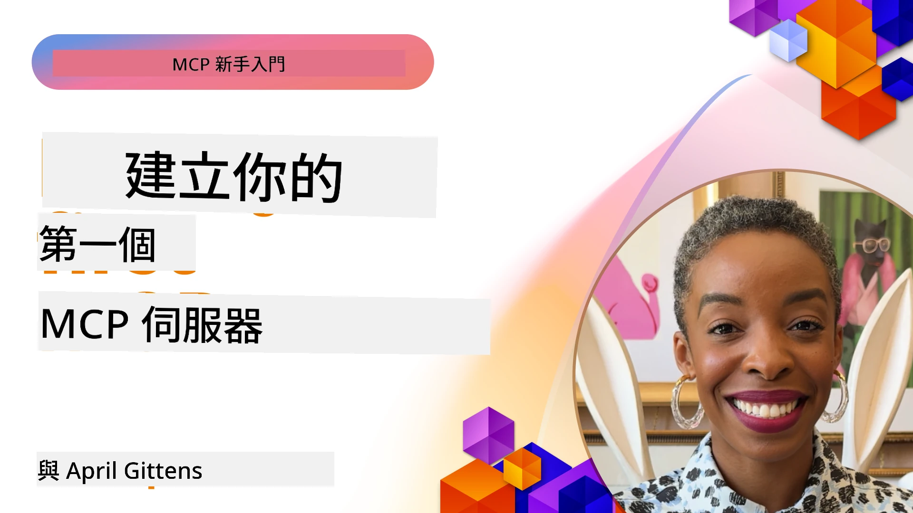

## 開始使用  

_(點擊上方圖片觀看本課程影片)_

本節包含數個課程：

- **1 你的第一個伺服器**，在這第一課中，你將學會如何建立你的第一個伺服器並使用檢查器工具檢視它，這是測試和除錯伺服器的寶貴方式，[至課程](01-first-server/README.md)

- **2 用戶端**，在本課中，你將學會如何撰寫一個可以連接到伺服器的用戶端，[至課程](02-client/README.md)

- **3 帶有 LLM 的用戶端**，更好的用戶端撰寫方式是加入 LLM，使它能與伺服器「協商」該做什麼，[至課程](03-llm-client/README.md)

- **4 在 Visual Studio Code 中使用 GitHub Copilot Agent 模式使用伺服器**。此處我們探討如何在 Visual Studio Code 裡運行我們的 MCP 伺服器，[至課程](04-vscode/README.md)

- **5 stdio 傳輸伺服器**，stdio 傳輸是本地 MCP 伺服器到用戶端通信的推薦標準，提供安全的子程序通信，並具內建進程隔離，[至課程](05-stdio-server/README.md)

- **6 使用 MCP 的 HTTP 流式傳輸（可串流 HTTP）**。了解現代 HTTP 流式傳輸（根據 [MCP 規範 2025-11-25](https://spec.modelcontextprotocol.io/specification/2025-11-25/basic/transports/#streamable-http) 推薦的遠端 MCP 伺服器方式）、進度通知，以及如何利用可串流 HTTP 實作可擴展的即時 MCP 伺服器與用戶端，[至課程](06-http-streaming/README.md)

- **7 利用 VSCode 的 AI 工具包** 來使用和測試你的 MCP 用戶端和伺服器，[至課程](07-aitk/README.md)

- **8 測試**。此處特別聚焦於如何以不同方式測試伺服器和用戶端，[至課程](08-testing/README.md)

- **9 部署**。本章將探討部署 MCP 解決方案的多種方式，[至課程](09-deployment/README.md)

- **10 進階伺服器使用**。本章介紹進階的伺服器使用方式，[至課程](./10-advanced/README.md)

- **11 認證**。本章涵蓋如何新增簡易認證，從基本認證到 JWT 和 RBAC。建議你先從此處開始，然後參考第五章的進階主題及第二章的安全強化建議，[至課程](./11-simple-auth/README.md)

- **12 MCP 主機**。設定和使用流行的 MCP 主機用戶端，包括 Claude Desktop、Cursor、Cline 和 Windsurf。學習傳輸類型與疑難排解，[至課程](./12-mcp-hosts/README.md)

- **13 MCP 檢查器**。使用 MCP 檢查器工具互動式除錯和測試你的 MCP 伺服器。學習疑難排解工具、資源和協定訊息，[至課程](./13-mcp-inspector/README.md)

Model Context Protocol (MCP) 是一個開放協定，標準化應用程式如何為大型語言模型 (LLM) 提供上下文。可以把 MCP 想像成 AI 應用的 USB-C 連接埠——提供一個標準方式將 AI 模型連接到不同的資料來源及工具。

## 學習目標

完成本課後，你將能：

- 設置 C#、Java、Python、TypeScript 及 JavaScript 的 MCP 開發環境
- 建立並部署具自訂功能（資源、提示、工具）的基本 MCP 伺服器
- 創建可連接 MCP 伺服器的主機應用程式
- 測試及除錯 MCP 實作
- 理解常見的設置挑戰及解決方案
- 連接 MCP 實作至流行的 LLM 服務

## 設置你的 MCP 環境

在開始使用 MCP 之前，重要的是準備開發環境並了解基本工作流程。本節將引導你完成初始設置步驟，確保 MCP 使用順暢。

### 先決條件

啟動 MCP 開發前，請確保你已具備：

- **開發環境**：對應你選擇的語言（C#、Java、Python、TypeScript、JavaScript）
- **IDE/編輯器**：Visual Studio、Visual Studio Code、IntelliJ、Eclipse、PyCharm 或任何現代程式碼編輯器
- **封裝管理員**：NuGet、Maven/Gradle、pip 或 npm/yarn
- **API 金鑰**：用於你計畫在主機應用中使用的 AI 服務

### 官方 SDK

在接下來各章你將看到使用 Python、TypeScript、Java 及 .NET 建構的解決方案。以下是所有官方支援的 SDK。

MCP 提供多語言官方 SDK（與 [MCP 規範 2025-11-25](https://spec.modelcontextprotocol.io/specification/2025-11-25/) 保持一致）：
- [C# SDK](https://github.com/modelcontextprotocol/csharp-sdk) - 與 Microsoft 共同維護
- [Java SDK](https://github.com/modelcontextprotocol/java-sdk) - 與 Spring AI 共同維護
- [TypeScript SDK](https://github.com/modelcontextprotocol/typescript-sdk) - 官方 TypeScript 實作
- [Python SDK](https://github.com/modelcontextprotocol/python-sdk) - 官方 Python 實作（FastMCP）
- [Kotlin SDK](https://github.com/modelcontextprotocol/kotlin-sdk) - 官方 Kotlin 實作
- [Swift SDK](https://github.com/modelcontextprotocol/swift-sdk) - 與 Loopwork AI 共同維護
- [Rust SDK](https://github.com/modelcontextprotocol/rust-sdk) - 官方 Rust 實作
- [Go SDK](https://github.com/modelcontextprotocol/go-sdk) - 官方 Go 實作

## 主要收獲

- 利用語言專屬 SDK 輕鬆設置 MCP 開發環境
- 建立 MCP 伺服器包括創建並註冊具明確結構的工具
- MCP 用戶端可連接伺服器和模型以發揮擴充功能
- 測試與除錯對可靠的 MCP 實作至關重要
- 部署方案涵蓋從本地開發到雲端解決方案多種選擇

## 練習

我們提供一組範例，輔助你完成本節所有章節中的練習。此外，每章也附有各自的練習和作業。

- [Java 計算機](./samples/java/calculator/README.md)
- [.Net 計算機](../../../03-GettingStarted/samples/csharp)
- [JavaScript 計算機](./samples/javascript/README.md)
- [TypeScript 計算機](./samples/typescript/README.md)
- [Python 計算機](../../../03-GettingStarted/samples/python)

## 額外資源

- [使用 Model Context Protocol 在 Azure 上建立 Agent](https://learn.microsoft.com/azure/developer/ai/intro-agents-mcp)
- [遠端 MCP 於 Azure Container Apps (Node.js/TypeScript/JavaScript)](https://learn.microsoft.com/samples/azure-samples/mcp-container-ts/mcp-container-ts/)
- [.NET OpenAI MCP Agent](https://learn.microsoft.com/samples/azure-samples/openai-mcp-agent-dotnet/openai-mcp-agent-dotnet/)

## 接下來做什麼

從第一課開始：[建立你的第一個 MCP 伺服器](01-first-server/README.md)

完成本模組後，繼續學習：[模組 4：實務實作](../04-PracticalImplementation/README.md)

---

<!-- CO-OP TRANSLATOR DISCLAIMER START -->
**免責聲明**：  
本文件由 AI 翻譯服務 [Co-op Translator](https://github.com/Azure/co-op-translator) 進行翻譯。雖然我們致力於提供準確的翻譯，但請注意自動翻譯可能包含錯誤或不準確之處。文件原文所使用的原始語言版本應被視為權威來源。對於重要資訊，建議使用專業人工翻譯。我們不對因使用本翻譯而產生的任何誤解或誤譯負責。
<!-- CO-OP TRANSLATOR DISCLAIMER END -->