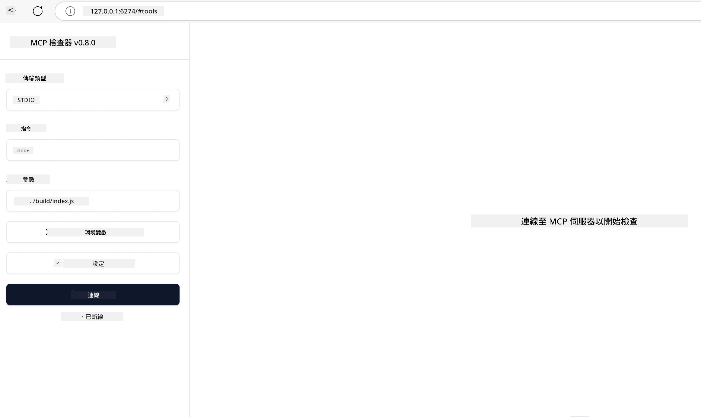

# 實務實作

[](https://youtu.be/vCN9-mKBDfQ)

_(點擊上方圖片觀看本課程的影片)_

實務實作是使模型上下文協定（MCP）威力具象化的關鍵。雖然理解 MCP 背後的理論與架構很重要，但真正的價值在於你如何應用這些概念來建構、測試和部署解決實際問題的方案。本章節搭起概念知識與動手開發的橋樑，帶領你透過流程將 MCP 為基礎的應用程式付諸實現。

無論你是開發智慧助理、將 AI 整合進商業工作流程，或是打造資料處理的自訂工具，MCP 都提供靈活的基礎。它的語言無關設計以及針對熱門程式語言提供的官方 SDK，使不同開發者皆能輕易使用。透過這些 SDK，你可以快速製作原型、持續迭代，並在不同平台與環境中擴大規模。

接下來的章節中，你會找到實務範例、範例程式碼與部署策略，示範如何使用 C#、Java（Spring）、TypeScript、JavaScript 與 Python 實作 MCP。你還會學習如何除錯與測試 MCP 伺服器、管理 API，以及使用 Azure 部署雲端解決方案。這些動手資源旨在加速你的學習，讓你自信地建置健全且可投入生產的 MCP 應用程式。

## 概覽

本課程聚焦於多種程式語言 MCP 實作的實務面。將探索如何使用 C#、Java（搭配 Spring）、TypeScript、JavaScript 與 Python 的 MCP SDK 來建立強健的應用程式，除錯與測試 MCP 伺服器，並創建可重複使用的資源、提示與工具。

## 學習目標

完成本課程後，你將能夠：

- 使用官方 SDK 在各種程式語言中實作 MCP 解決方案
- 系統性除錯及測試 MCP 伺服器
- 創建並使用伺服器功能（資源、提示與工具）
- 設計複雜任務的有效 MCP 工作流程
- 優化 MCP 實作的效能與可靠性

## 官方 SDK 資源

模型上下文協定提供多種語言的官方 SDK（符合 [MCP 規範 2025-11-25](https://spec.modelcontextprotocol.io/specification/2025-11-25/)）：

- [C# SDK](https://github.com/modelcontextprotocol/csharp-sdk)
- [Java 搭配 Spring SDK](https://github.com/modelcontextprotocol/java-sdk) **注意：** 需要依賴 [Project Reactor](https://projectreactor.io)。（請參閱 [討論議題 246](https://github.com/orgs/modelcontextprotocol/discussions/246)。）
- [TypeScript SDK](https://github.com/modelcontextprotocol/typescript-sdk)
- [Python SDK](https://github.com/modelcontextprotocol/python-sdk)
- [Kotlin SDK](https://github.com/modelcontextprotocol/kotlin-sdk)
- [Go SDK](https://github.com/modelcontextprotocol/go-sdk)

## 使用 MCP SDK

本節提供跨多種程式語言 MCP 實作的實務範例。你可在 `samples` 目錄中依語言找到範例程式碼。

### 可用範例

此儲存庫包含以下語言的 [範例實作](../../../04-PracticalImplementation/samples)：

- [C#](./samples/csharp/README.md)
- [Java 搭配 Spring](./samples/java/containerapp/README.md)
- [TypeScript](./samples/typescript/README.md)
- [JavaScript](./samples/javascript/README.md)
- [Python](./samples/python/README.md)

每個範例展示該語言及生態系中的 MCP 核心概念與實作模式。

### 實務指南

更多實務 MCP 實作指南：

- [分頁與大量結果集](./pagination/README.md) - 處理工具、資源與大量資料集的游標式分頁

## 核心伺服器功能

MCP 伺服器可實作以下功能的任意組合：

### 資源

資源為使用者或 AI 模型提供情境與資料：

- 文件庫
- 知識庫
- 結構化資料來源
- 檔案系統

### 提示

提示是對使用者的範本訊息和工作流程：

- 預先定義的對話範本
- 引導式互動模式
- 專門設計的對話結構

### 工具

工具是 AI 模型執行的功能：

- 資料處理工具
- 外部 API 整合
- 計算功能
- 搜尋功能

## 範例實作：C# 實作

官方 C# SDK 儲存庫包含數個範例實作，示範 MCP 不同面向：

- **基礎 MCP 用戶端**：展示如何建立 MCP 用戶端並呼叫工具的簡單範例
- **基礎 MCP 伺服器**：註冊基礎工具的最小伺服器實作
- **進階 MCP 伺服器**：具備工具註冊、驗證與錯誤處理的完整伺服器
- **ASP.NET 整合**：展示與 ASP.NET Core 整合的範例
- **工具實作模式**：不同複雜度層級工具的多種實作模式

MCP C# SDK 目前處於預覽階段，API 可能會變更。隨著 SDK 演進，我們將持續更新本部落格。

### 主要特色

- [C# MCP Nuget ModelContextProtocol](https://www.nuget.org/packages/ModelContextProtocol)
- 建置你的 [第一個 MCP 伺服器](https://devblogs.microsoft.com/dotnet/build-a-model-context-protocol-mcp-server-in-csharp/)。

欲取得完整 C# 實作範例，請造訪 [官方 C# SDK 範例儲存庫](https://github.com/modelcontextprotocol/csharp-sdk)

## 範例實作：Java 搭配 Spring 實作

Java 搭配 Spring SDK 提供企業級功能的穩健 MCP 實作選項。

### 主要特色

- Spring Framework 整合
- 強型別安全
- 響應式程式設計支援
- 完整錯誤處理

完整 Java 搭配 Spring 實作範例請參閱 samples 目錄下的 [Java 搭配 Spring 範例](samples/java/containerapp/README.md)。

## 範例實作：JavaScript 實作

JavaScript SDK 提供輕量且靈活的 MCP 實作方式。

### 主要特色

- 支援 Node.js 與瀏覽器
- 基於 Promise 的 API
- 易於與 Express 等框架整合
- 支援 WebSocket 串流

完整 JavaScript 實作範例請參閱 samples 目錄下的 [JavaScript 範例](samples/javascript/README.md)。

## 範例實作：Python 實作

Python SDK 提供 Python 化的 MCP 實作方式，與優秀的機器學習框架整合。

### 主要特色

- 使用 asyncio 的 Async/Await 支援
- FastAPI 整合
- 簡單的工具註冊
- 原生整合熱門機器學習函式庫

完整 Python 實作範例請參閱 samples 目錄下的 [Python 範例](samples/python/README.md)。

## API 管理

Azure API 管理是保護 MCP 伺服器的絕佳方案。主要想法是將 Azure API 管理放在 MCP 伺服器前端，並讓它處理你可能需要的功能，如：

- 速率限制
- 令牌管理
- 監控
- 負載平衡
- 安全性

### Azure 範例

以下是 Azure 範例，做的正是這件事，即[建立 MCP 伺服器並使用 Azure API 管理保護](https://github.com/Azure-Samples/remote-mcp-apim-functions-python)。

請看以下圖片了解授權流程：


上述圖片中發生了以下過程：

- 使用 Microsoft Entra 進行身份驗證/授權。
- Azure API 管理作為閘道並使用政策來導引和管理流量。
- Azure 監控記錄所有請求以供後續分析。

#### 授權流程

讓我們更詳細看看授權流程：


#### MCP 授權規範

深入瞭解[ MCP 授權規範](https://spec.modelcontextprotocol.io/specification/2025-11-25/basic/authorization/)

## 部署遠端 MCP 伺服器至 Azure

讓我們來看看能否部署前面提到的範例：

1. 複製程式碼庫

    ```bash
    git clone https://github.com/Azure-Samples/remote-mcp-apim-functions-python.git
    cd remote-mcp-apim-functions-python
    ```

1. 註冊 `Microsoft.App` 資源提供者。

   - 如果你使用 Azure CLI，請執行 `az provider register --namespace Microsoft.App --wait`。
   - 如果你使用 Azure PowerShell，請執行 `Register-AzResourceProvider -ProviderNamespace Microsoft.App`。並在稍後執行 `(Get-AzResourceProvider -ProviderNamespace Microsoft.App).RegistrationState` 來檢查註冊是否完成。

1. 執行此 [azd](https://aka.ms/azd) 命令來建立 API 管理服務、Function App（含程式碼）和所有其他所需的 Azure 資源

    ```shell
    azd up
    ```

    此命令應會將所需的所有雲端資源部署到 Azure

### 使用 MCP Inspector 測試你的伺服器

1. 在 **新終端視窗** 中，安裝並執行 MCP Inspector

    ```shell
    npx @modelcontextprotocol/inspector
    ```

    你應該會看到類似以下介面：

    

1. 按住 CTRL 點擊由應用程式顯示的 URL 以載入 MCP Inspector 網頁應用程式 （例如 [http://127.0.0.1:6274/#resources](http://127.0.0.1:6274/#resources)）
1. 設定傳輸類型為 `SSE`
1. 設定 URL 為你執行中 API 管理 SSE 端點，此端點會在執行 `azd up` 後顯示，然後點選 **Connect**：

    ```shell
    https://<apim-servicename-from-azd-output>.azure-api.net/mcp/sse
    ```

1. **列出工具**。點擊一個工具並 **執行工具**。  

若所有步驟執行成功，現在你應已連線至 MCP 伺服器並成功呼叫工具。

## Azure 用 MCP 伺服器

[Remote-mcp-functions](https://github.com/Azure-Samples/remote-mcp-functions-dotnet)：此系列儲存庫提供使用 Azure Functions 與 Python、C# .NET 或 Node/TypeScript 快速建置與部署自訂遠端 MCP（模型上下文協定）伺服器的範本。

範例提供完整解決方案，使開發者能：

- 本機建立與執行：在本機端開發與除錯 MCP 伺服器
- 部署至 Azure：使用簡易的 azd up 指令輕鬆部署雲端
- 來自用戶端的連線：支援從多種用戶端連線 MCP 伺服器，包括 VS Code 的 Copilot 代理模式與 MCP Inspector 工具

### 主要特色

- 以安全為設計核心：MCP 伺服器透過金鑰與 HTTPS 保護
- 認證選項：支援使用內建認證和/或 API 管理的 OAuth
- 網路隔離：支援使用 Azure 虛擬網路（VNET）進行網路隔離
- 無伺服器架構：運用 Azure Functions 以實現可擴充的事件驅動執行
- 本地開發：提供完整本機開發和除錯支持
- 簡易部署：簡化的 Azure 部署流程

此儲存庫包含所有必要的設定檔、原始碼和基礎架構定義，可快速啟動生產級 MCP 伺服器實作。

- [Azure Remote MCP Functions Python](https://github.com/Azure-Samples/remote-mcp-functions-python) - 使用 Azure Functions 與 Python 實作 MCP 的範例

- [Azure Remote MCP Functions .NET](https://github.com/Azure-Samples/remote-mcp-functions-dotnet) - 使用 Azure Functions 與 C# .NET 實作 MCP 的範例

- [Azure Remote MCP Functions Node/Typescript](https://github.com/Azure-Samples/remote-mcp-functions-typescript) - 使用 Azure Functions 與 Node/TypeScript 實作 MCP 的範例。

## 主要重點

- MCP SDK 提供語言專屬工具以實作健全的 MCP 解決方案
- 除錯與測試流程對可靠的 MCP 應用至關重要
- 可重複使用的提示範本促進一致性的 AI 互動
- 精心設計的工作流程可編排多工具以完成複雜任務
- 實作 MCP 解決方案需考慮安全性、效能與錯誤處理

## 練習

設計一個符合你領域真實問題的實務 MCP 工作流程：

1. 辨識 3-4 個對解決此問題有用的工具
2. 繪製工作流程圖，顯示這些工具如何互動
3. 使用你偏好的語言實作其中一個工具的基本版本
4. 建立一個提示範本以協助模型有效使用你的工具

## 其他資源

---

## 接下來

下一節：[進階主題](../05-AdvancedTopics/README.md)

---

<!-- CO-OP TRANSLATOR DISCLAIMER START -->
**免責聲明**：  
本文件係使用 AI 翻譯服務 [Co-op Translator](https://github.com/Azure/co-op-translator) 進行翻譯。雖然我們努力確保翻譯的準確性，但請注意，自動翻譯可能包含錯誤或不準確之處。原始文件之原文版本應視為具權威性的主要來源。對於重要資訊，建議採用專業人工翻譯。我們不對因使用本翻譯而導致之任何誤解或錯誤詮釋負責。
<!-- CO-OP TRANSLATOR DISCLAIMER END -->