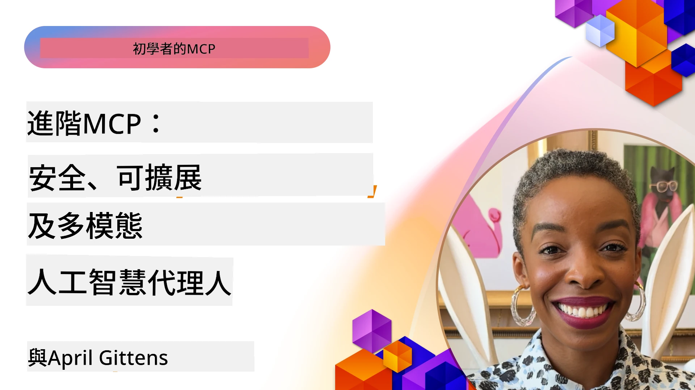

# MCP 進階主題

_(點擊上方圖片觀看本課程影片)_

本章節涵蓋 Model Context Protocol (MCP) 實作的一系列進階主題，包括多模態整合、可擴展性、安全最佳實務及企業整合。這些主題對構建健全且可投入生產的 MCP 應用至關重要，以滿足現代 AI 系統的需求。

## 概覽

本課程探討 Model Context Protocol 實作的進階概念，聚焦多模態整合、可擴展性、安全最佳實務及企業整合。這些主題對於建立可應對企業環境中複雜需求的生產等級 MCP 應用至關重要。

## 學習目標

完成本課程後，您將能夠：

- 在 MCP 框架中實現多模態功能
- 設計可擴展的 MCP 架構以應對高需求情境
- 應用符合 MCP 安全原則的安全最佳實務
- 將 MCP 與企業 AI 系統及框架整合
- 優化生產環境中的效能與可靠性

## 課程與範例專案

| 連結 | 標題 | 說明 |
|------|-------|-------------|
| [5.1 Integration with Azure](./mcp-integration/README.md) | 與 Azure 整合 | 學習如何在 Azure 上整合 MCP Server |
| [5.2 Multi modal sample](./mcp-multi-modality/README.md) | MCP 多模態範例 | 音訊、影像及多模態回應範例 |
| [5.3 MCP OAuth2 sample](../../../05-AdvancedTopics/mcp-oauth2-demo) | MCP OAuth2 範例 | 最小化 Spring Boot 應用示範 MCP 的 OAuth2，包含授權與資源伺服器。展示安全令牌發放、受保護端點、Azure Container Apps 部署，以及 API 管理整合。 |
| [5.4 Root Contexts](./mcp-root-contexts/README.md) | 根上下文 | 深入了解根上下文及其實作方式 |
| [5.5 Routing](./mcp-routing/README.md) | 路由 | 學習各種類型的路由 |
| [5.6 Sampling](./mcp-sampling/README.md) | 採樣 | 學習如何使用採樣 |
| [5.7 Scaling](./mcp-scaling/README.md) | 擴展 | 了解擴展相關內容 |
| [5.8 Security](./mcp-security/README.md) | 安全 | 保護您的 MCP Server |
| [5.9 Web Search sample](./web-search-mcp/README.md) | Web 搜尋 MCP | Python MCP 伺服器與用戶端整合 SerpAPI，用於即時網頁、新聞、商品搜尋及問答。演示多工具協調、外部 API 整合及強健錯誤處理。 |
| [5.10 Realtime Streaming](./mcp-realtimestreaming/README.md) | 串流 | 即時資料串流在當今數據驅動的世界中已不可或缺，協助企業與應用程式即時取得資訊以做出即時決策。 |
| [5.11 Realtime Web Search](./mcp-realtimesearch/README.md) | 即時網頁搜尋 | MCP 如何透過提供跨 AI 模型、搜尋引擎及應用的標準化上下文管理方式，轉變即時網頁搜尋。 |
| [5.12  Entra ID Authentication for Model Context Protocol Servers](./mcp-security-entra/README.md) | Entra ID 驗證 | Microsoft Entra ID 提供強大的雲端身份及存取管理解決方案，確保只有授權用戶與應用程式能與您的 MCP 伺服器互動。 |
| [5.13 Azure AI Foundry Agent Integration](./mcp-foundry-agent-integration/README.md) | Azure AI Foundry 整合 | 學習如何將 Model Context Protocol 伺服器與 Azure AI Foundry 代理整合，實現強大的工具協調及標準化外部資料來源連接的企業 AI 能力。 |
| [5.14 Context Engineering](./mcp-contextengineering/README.md) | 上下文工程 | MCP 伺服器未來上下文工程技術機會，包括上下文優化、動態上下文管理，及 MCP 框架內有效提示工程策略。 |
| [5.15 MCP Custom Transport](./mcp-transport/README.md) | 自訂傳輸 | 學習如何為特殊 MCP 通訊情境實作自訂傳輸機制。 |
| [5.16 Protocol Features Deep Dive](./mcp-protocol-features/README.md) | 協議功能 | 精通進階協議功能，包括進度通知、請求取消、資源模板及錯誤處理模式。 |

> **MCP 規範 2025-11-25 新增**：規範現包括實驗性支援 **任務**（具進度追蹤的長時間運作）、**工具註解**（工具行為的安全元資料）、**URL 模式引導**（請求用戶端提供特定 URL 內容）、及增強的 **根**（工作區上下文管理）。詳情請參閱 [MCP 規範變更紀錄](https://spec.modelcontextprotocol.io/)。

## 其他參考資源

欲獲取最新的 MCP 進階主題資訊，請參考：
- [MCP 文件](https://modelcontextprotocol.io/)
- [MCP 規範 (2025-11-25)](https://spec.modelcontextprotocol.io/specification/2025-11-25/)
- [GitHub 倉庫](https://github.com/modelcontextprotocol)
- [OWASP MCP 十大問題](https://microsoft.github.io/mcp-azure-security-guide/mcp/) - 安全風險與緩解措施
- [MCP 安全高峰工作坊 (Sherpa)](https://azure-samples.github.io/sherpa/) - 實務安全訓練

## 重要重點

- 多模態 MCP 實作擴展 AI 能力，超越純文本處理
- 可擴展性為企業佈署關鍵，透過水平與垂直擴展加以因應
- 全方位安全措施保護資料並確保適當存取控制
- 與 Azure OpenAI 及 Microsoft AI Foundry 等平台的企業整合，提升 MCP 功能
- 進階 MCP 實作受益於優化的架構與謹慎的資源管理

## 練習

為特定使用案例設計企業級 MCP 實作：

1. 定義您的多模態需求
2. 列出保護敏感資料所需的安全控制
3. 設計可應對變動負載的可擴展架構
4. 規劃與企業 AI 系統的整合點
5. 文件化潛在效能瓶頸與緩解策略

## 附加資源

- [Azure OpenAI 文件](https://learn.microsoft.com/en-us/azure/ai-services/openai/)
- [Microsoft AI Foundry 文件](https://learn.microsoft.com/en-us/ai-services/)

---

## 下一步

從本模組的課程開始探索：[5.1 MCP Integration](./mcp-integration/README.md)

完成本模組後，請繼續學習：[模組 6：社群貢獻](../06-CommunityContributions/README.md)

---

<!-- CO-OP TRANSLATOR DISCLAIMER START -->
**免責聲明**：
本文件係使用 AI 翻譯服務 [Co-op Translator](https://github.com/Azure/co-op-translator) 所翻譯。雖然我們力求準確，但請注意，自動翻譯可能包含錯誤或不準確之處。原文文件應視為權威來源。對於重要資訊，建議採用專業人工翻譯。本公司對因使用本翻譯而產生之任何誤解或錯誤詮釋不負任何責任。
<!-- CO-OP TRANSLATOR DISCLAIMER END -->