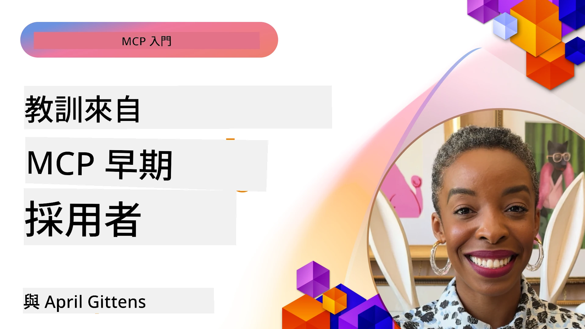

# 🌟 早期採用者的經驗教訓

[](https://youtu.be/jds7dSmNptE)

_(點擊上方圖片觀看本課程影片)_

## 🎯 本單元涵蓋內容

本單元探討真實組織與開發者如何利用 Model Context Protocol (MCP) 解決實際挑戰並推動創新。透過詳細案例研究、實作專案與實用範例，您將發現 MCP 如何實現安全、可擴展的 AI 整合，將語言模型、工具與企業資料串聯起來。

### 📚 觀看 MCP 實際運作

想看這些原則如何應用於生產就緒的工具嗎？請參閱我們的[**10 個正在轉變開發者生產力的 Microsoft MCP 伺服器**](microsoft-mcp-servers.md)，展示您今天就能使用的 Microsoft MCP 伺服器。

## 概述

本課程探討早期採用者如何利用 Model Context Protocol (MCP) 解決真實世界挑戰，並推動產業創新。透過詳細的案例研究和實作專案，您將看到 MCP 如何實現標準化、安全、可擴展的 AI 整合，將大型語言模型、工具與企業資料在統一框架中串聯。您將獲得設計與建置基於 MCP 的解決方案的實務經驗，學習經驗證的實作模式，發掘在生產環境中部署 MCP 的最佳實務。課程也將強調新興趨勢、未來方向與開源資源，助您保持在 MCP 技術及其不斷演進的生態系最前沿。

## 學習目標

- 分析來自不同行業的真實 MCP 實作案例
- 設計並建置完整的 MCP 應用程式
- 探索 MCP 技術的新興趨勢與未來方向
- 在實際開發情境中應用最佳實務

## 真實 MCP 實作案例

### 案例研究 1：企業客戶支援自動化

某跨國企業導入 MCP 解決方案，標準化整合其客戶支援系統中的 AI 互動。此舉使他們能夠：

- 建立多家大型語言模型供應商的統一介面
- 跨部門維持一致的提示管理
- 實施嚴謹的安全與合規控管
- 根據需求輕鬆切換不同 AI 模型

**技術實作：**

```python
# Python MCP 伺服器實作，用於客戶支援
import logging
import asyncio
from modelcontextprotocol import create_server, ServerConfig
from modelcontextprotocol.server import MCPServer
from modelcontextprotocol.transports import create_http_transport
from modelcontextprotocol.resources import ResourceDefinition
from modelcontextprotocol.prompts import PromptDefinition
from modelcontextprotocol.tool import ToolDefinition

# 設定日誌記錄
logging.basicConfig(level=logging.INFO)

async def main():
    # 建立伺服器配置
    config = ServerConfig(
        name="Enterprise Customer Support Server",
        version="1.0.0",
        description="MCP server for handling customer support inquiries"
    )
    
    # 初始化 MCP 伺服器
    server = create_server(config)
    
    # 註冊知識庫資源
    server.resources.register(
        ResourceDefinition(
            name="customer_kb",
            description="Customer knowledge base documentation"
        ),
        lambda params: get_customer_documentation(params)
    )
    
    # 註冊提示模板
    server.prompts.register(
        PromptDefinition(
            name="support_template",
            description="Templates for customer support responses"
        ),
        lambda params: get_support_templates(params)
    )
    
    # 註冊支援工具
    server.tools.register(
        ToolDefinition(
            name="ticketing",
            description="Create and update support tickets"
        ),
        handle_ticketing_operations
    )
    
    # 使用 HTTP 傳輸啟動伺服器
    transport = create_http_transport(port=8080)
    await server.run(transport)

if __name__ == "__main__":
    asyncio.run(main())
```
  
**成果：**模型成本降低 30%，回應一致性提升 45%，並強化全球運作的合規性。

### 案例研究 2：醫療診斷助理

某醫療機構建置 MCP 架構，整合多個專業醫療 AI 模型，同時確保敏感病患資料獲得保護：

- 在通用與專業醫療模型間無縫切換
- 嚴格的隱私控管與稽核紀錄
- 與現有電子病歷 (EHR) 系統整合
- 醫療術語的一致提示設計

**技術實作：**

```csharp
// C# MCP host application implementation in healthcare application
using Microsoft.Extensions.DependencyInjection;
using ModelContextProtocol.SDK.Client;
using ModelContextProtocol.SDK.Security;
using ModelContextProtocol.SDK.Resources;

public class DiagnosticAssistant
{
    private readonly MCPHostClient _mcpClient;
    private readonly PatientContext _patientContext;
    
    public DiagnosticAssistant(PatientContext patientContext)
    {
        _patientContext = patientContext;
        
        // Configure MCP client with healthcare-specific settings
        var clientOptions = new ClientOptions
        {
            Name = "Healthcare Diagnostic Assistant",
            Version = "1.0.0",
            Security = new SecurityOptions
            {
                Encryption = EncryptionLevel.Medical,
                AuditEnabled = true
            }
        };
        
        _mcpClient = new MCPHostClientBuilder()
            .WithOptions(clientOptions)
            .WithTransport(new HttpTransport("https://healthcare-mcp.example.org"))
            .WithAuthentication(new HIPAACompliantAuthProvider())
            .Build();
    }
    
    public async Task<DiagnosticSuggestion> GetDiagnosticAssistance(
        string symptoms, string patientHistory)
    {
        // Create request with appropriate resources and tool access
        var resourceRequest = new ResourceRequest
        {
            Name = "patient_records",
            Parameters = new Dictionary<string, object>
            {
                ["patientId"] = _patientContext.PatientId,
                ["requestingProvider"] = _patientContext.ProviderId
            }
        };
        
        // Request diagnostic assistance using appropriate prompt
        var response = await _mcpClient.SendPromptRequestAsync(
            promptName: "diagnostic_assistance",
            parameters: new Dictionary<string, object>
            {
                ["symptoms"] = symptoms,
                patientHistory = patientHistory,
                relevantGuidelines = _patientContext.GetRelevantGuidelines()
            });
            
        return DiagnosticSuggestion.FromMCPResponse(response);
    }
}
```
  
**成果：**提升醫師診斷建議品質，達成 HIPAA 完全合規，並大幅減少系統切換時的上下文轉換。

### 案例研究 3：金融服務風險分析

某金融機構導入 MCP，標準化跨部門的風險分析流程：

- 建立信用風險、詐欺偵測與投資風險模型的統一介面
- 執行嚴格存取控管與模型版本管理
- 確保所有 AI 推薦具備稽核追蹤能力
- 各系統間維持一致的資料格式

**技術實作：**

```java
// 用於金融風險評估的 Java MCP 伺服器
import org.mcp.server.*;
import org.mcp.security.*;

public class FinancialRiskMCPServer {
    public static void main(String[] args) {
        // 建立具有金融合規功能的 MCP 伺服器
        MCPServer server = new MCPServerBuilder()
            .withModelProviders(
                new ModelProvider("risk-assessment-primary", new AzureOpenAIProvider()),
                new ModelProvider("risk-assessment-audit", new LocalLlamaProvider())
            )
            .withPromptTemplateDirectory("./compliance/templates")
            .withAccessControls(new SOCCompliantAccessControl())
            .withDataEncryption(EncryptionStandard.FINANCIAL_GRADE)
            .withVersionControl(true)
            .withAuditLogging(new DatabaseAuditLogger())
            .build();
            
        server.addRequestValidator(new FinancialDataValidator());
        server.addResponseFilter(new PII_RedactionFilter());
        
        server.start(9000);
        
        System.out.println("Financial Risk MCP Server running on port 9000");
    }
}
```
  
**成果：**增強法規遵循，模型部署週期縮短 40%，跨部門風險評估一致性提升。

### 案例研究 4：Microsoft Playwright MCP 伺服器用於瀏覽器自動化

微軟開發了[Playwright MCP 伺服器](https://github.com/microsoft/playwright-mcp)，利用 Model Context Protocol 實現安全、標準化的瀏覽器自動化。這個生產就緒伺服器讓 AI 代理與大型語言模型得以以受控、可稽核且可擴展的方式與網頁瀏覽器交互，實現自動化網頁測試、資料擷取及端對端工作流程。

> **🎯 生產就緒工具**  
>  
> 本案例展示您現在就可使用的真實 MCP 伺服器！深入了解 Playwright MCP 伺服器與另外 9 個生產就緒的 Microsoft MCP 伺服器，請參閱我們的[**Microsoft MCP 伺服器指南**](microsoft-mcp-servers.md#8--playwright-mcp-server)。

**主要特點：**  
- 將瀏覽器自動化功能（導航、表單填寫、螢幕擷取等）以 MCP 工具形式開放  
- 遵循嚴格存取控管與沙盒機制，防止未授權操作  
- 提供詳細瀏覽器互動的稽核日誌  
- 支援與 Azure OpenAI 及其他大型語言模型供應商整合，以實現代理自動化  
- 支援 GitHub Copilot 的程式碼代理具備網頁瀏覽功能  

**技術實作：**

```typescript
// TypeScript：在 MCP 伺服器中註冊 Playwright 瀏覽器自動化工具
import { createServer, ToolDefinition } from 'modelcontextprotocol';
import { launch } from 'playwright';

const server = createServer({
  name: 'Playwright MCP Server',
  version: '1.0.0',
  description: 'MCP server for browser automation using Playwright'
});

// 註冊一個用於導航到 URL 並擷取螢幕截圖的工具
server.tools.register(
  new ToolDefinition({
    name: 'navigate_and_screenshot',
    description: 'Navigate to a URL and capture a screenshot',
    parameters: {
      url: { type: 'string', description: 'The URL to visit' }
    }
  }),
  async ({ url }) => {
    const browser = await launch();
    const page = await browser.newPage();
    await page.goto(url);
    const screenshot = await page.screenshot();
    await browser.close();
    return { screenshot };
  }
);

// 啟動 MCP 伺服器
server.listen(8080);
```
  
**成果：**  
- 使 AI 代理與大型語言模型擁有安全、可程式化的瀏覽器自動化能力  
- 減少人工測試作業並提升網頁應用測試覆蓋率  
- 提供企業環境重用且可擴展的瀏覽器工具整合架構  
- 支援 GitHub Copilot 的網頁瀏覽能力  

**參考：**  
- [Playwright MCP 伺服器 GitHub 倉庫](https://github.com/microsoft/playwright-mcp)  
- [Microsoft AI 與自動化解決方案](https://azure.microsoft.com/en-us/products/ai-services/)

### 案例研究 5：Azure MCP – 企業級 Model Context Protocol 服務

Azure MCP 伺服器 ([https://aka.ms/azmcp](https://aka.ms/azmcp)) 是微軟所提供的托管企業級 Model Context Protocol 實作，設計為可擴展、安全且合規的 MCP 伺服器雲端服務。Azure MCP 幫助組織快速部署、管理並整合 MCP 伺服器與 Azure AI、資料和安全服務，降低營運成本、加速 AI 採用。

> **🎯 生產就緒工具**  
>  
> 這是您現在就可使用的真實 MCP 伺服器！深入了解 Azure AI Foundry MCP 伺服器，請參閱我們的[**Microsoft MCP 伺服器指南**](microsoft-mcp-servers.md)。

- 全託管 MCP 伺服器主機，內建彈性擴充、監控及安全性  
- 原生整合 Azure OpenAI、Azure AI Search 及其他 Azure 服務  
- 企業級認證與授權，採用 Microsoft Entra ID  
- 支援自訂工具、提示範本與資源連接器  
- 符合企業安全與法規要求  

**技術實作：**

```yaml
# Example: Azure MCP server deployment configuration (YAML)
apiVersion: mcp.microsoft.com/v1
kind: McpServer
metadata:
  name: enterprise-mcp-server
spec:
  modelProviders:
    - name: azure-openai
      type: AzureOpenAI
      endpoint: https://<your-openai-resource>.openai.azure.com/
      apiKeySecret: <your-azure-keyvault-secret>
  tools:
    - name: document_search
      type: AzureAISearch
      endpoint: https://<your-search-resource>.search.windows.net/
      apiKeySecret: <your-azure-keyvault-secret>
  authentication:
    type: EntraID
    tenantId: <your-tenant-id>
  monitoring:
    enabled: true
    logAnalyticsWorkspace: <your-log-analytics-id>
```
  
**成果：**  
- 提供現成且合規的 MCP 平台，縮短企業 AI 專案價值實現時間  
- 簡化大型語言模型、工具與企業資料源的整合  
- 強化 MCP 工作負載的安全性、可觀察性及營運效率  
- 使用 Azure SDK 最佳實務與最新認證模式提升程式碼品質  

**參考資料：**  
- [Azure MCP 文件](https://aka.ms/azmcp)  
- [Azure MCP 伺服器 GitHub 倉庫](https://github.com/Azure/azure-mcp)  
- [Azure AI 服務](https://azure.microsoft.com/en-us/products/ai-services/)  
- [Microsoft MCP 中心](https://mcp.azure.com)

## 案例研究 6：NLWeb  
MCP (Model Context Protocol) 是一個新興協定，賦能聊天機器人與 AI 助理與工具互動。每個 NLWeb 節點同時也是一個 MCP 伺服器，支援一個核心方法 ask，可用自然語言向網站提問。回傳的回應採用 schema.org 統一詞彙描述網頁資料。大致而言，MCP 就像 NLWeb 之於 Http 是對 HTML。NLWeb 結合協定、Schema.org 格式與示範程式碼，幫助網站快速建立這類端點，既讓人類使用對話介面，也促進機器間自然代理互動。

NLWeb 包含兩部分：  
- 一套簡易協定，用自然語言與網站介面溝通，利用 json 與 schema.org 格式返回答案。詳見 REST API 文件。  
- 一個基於 (1) 的簡易實作，利用現有標記，適用於可抽象為物品清單的網站（產品、食譜、景點、評論等）。搭配使用者介面元件，輕鬆提供內容對話介面。詳見 Life of a chat query 文件說明其運作。  

**參考資料：**  
- [Azure MCP 文件](https://aka.ms/azmcp)  
- [NLWeb](https://github.com/microsoft/NlWeb)

### 案例研究 7：Azure AI Foundry MCP 伺服器 – 企業 AI 代理整合

Azure AI Foundry MCP 伺服器展示 MCP 如何調度及管理企業環境中的 AI 代理與工作流程。透過與 Azure AI Foundry 整合，組織能標準化代理互動，利用 Foundry 的工作流程管理，並確保安全、可擴展部署。

> **🎯 生產就緒工具**  
>  
> 這是您現在就可使用的真實 MCP 伺服器！深入了解 Azure AI Foundry MCP 伺服器，請參閱我們的[**Microsoft MCP 伺服器指南**](microsoft-mcp-servers.md#9--azure-ai-foundry-mcp-server)。

**主要特點：**  
- 全方位接入 Azure AI 生態系，涵蓋模型目錄與部署管理  
- 使用 Azure AI Search 進行知識索引，支援 RAG 應用  
- AI 模型效能與品質評估工具  
- 與 Azure AI Foundry 目錄與實驗室整合，接軌前沿研究模型  
- 生產環境用代理管理與評估能力  

**成果：**  
- 快速原型設計並具健全監控的 AI 代理工作流程  
- 與 Azure AI 服務無縫整合，支援進階應用  
- 建置、部署與監控代理流程的統一介面  
- 改善企業安全、合規及營運效率  
- 加速 AI 採用，同時維持對複雜代理流程的掌控

**參考：**  
- [Azure AI Foundry MCP 伺服器 GitHub 倉庫](https://github.com/azure-ai-foundry/mcp-foundry)  
- [使用 MCP 整合 Azure AI 代理 (Microsoft Foundry Blog)](https://devblogs.microsoft.com/foundry/integrating-azure-ai-agents-mcp/)

### 案例研究 8：Foundry MCP Playground – 實驗與原型開發

Foundry MCP Playground 提供一個可即時使用的環境，用於 MCP 伺服器與 Azure AI Foundry 整合的實驗。開發者能快速對 AI 模型與代理工作流程進行原型設計、測試與評估。該平台簡化設置，提供範例專案，支援協作開發，輕鬆探索最佳實務與新場景，降低複雜基礎建設門檻。特別適合團隊驗證概念、分享實驗並加速學習，有助促進 MCP 與 Azure AI Foundry 生態系統的創新與社群貢獻。

**參考：**  
- [Foundry MCP Playground GitHub 倉庫](https://github.com/azure-ai-foundry/foundry-mcp-playground)

### 案例研究 9：Microsoft Learn Docs MCP 伺服器 – AI 驅動的文件存取

Microsoft Learn Docs MCP 伺服器是一項雲端服務，透過 Model Context Protocol 為 AI 助理提供即時存取官方 Microsoft 文件的能力。此生產就緒伺服器連接完整的 Microsoft Learn 生態系，實現跨所有官方 Microsoft 資源的語義搜尋。

> **🎯 生產就緒工具**  
>  
> 這是您現在就可使用的真實 MCP 伺服器！深入了解 Microsoft Learn Docs MCP 伺服器，請參閱我們的[**Microsoft MCP 伺服器指南**](microsoft-mcp-servers.md#1--microsoft-learn-docs-mcp-server)。

**主要特點：**  
- 即時存取官方 Microsoft 文件、Azure 文件及 Microsoft 365 文件  
- 先進語義搜尋，理解上下文與意圖  
- Microsoft Learn 內容即時更新確保資訊時效  
- 涵蓋 Microsoft Learn、Azure 文件及 Microsoft 365 全面內容  
- 回傳多達 10 個高品質內容段落，附文章標題與網址  

**重要性說明：**  
- 解決 Microsoft 技術 AI 知識過時問題  
- 確保 AI 助理能存取最新 .NET、C#、Azure 與 Microsoft 365 功能  
- 提供權威、一手資訊以確保程式碼生成正確性  
- 對使用快速演進 Microsoft 技術的開發者至關重要  

**成果：**  
- 大幅提升 Microsoft 技術 AI 生成程式碼的準確度  
- 降低尋找最新文件與最佳實務的時間成本  
- 強化開發者生產力與上下文感知的文件檢索能力  
- 無縫整合開發工作流程，不必離開 IDE  

**參考：**  
- [Microsoft Learn Docs MCP 伺服器 GitHub 倉庫](https://github.com/MicrosoftDocs/mcp)  
- [Microsoft Learn 文件](https://learn.microsoft.com/)

## 實作專案

### 專案 1：建置多供應商 MCP 伺服器

**目標：** 建立一個 MCP 伺服器，能根據特定條件將請求路由至多個 AI 模型供應商。

**需求：**

- 支援至少三個不同模型供應商（如 OpenAI、Anthropic、本地模型）  
- 根據請求元資料實作路由機制  
- 建立供應商憑證管理的設定系統  
- 加入快取以優化效能與成本  
- 建置監控儀表板以監測使用情況

**實作步驟：**

1. 建立基礎 MCP 伺服器架構  
2. 為各 AI 模型服務實作供應商適配器  
3. 依請求屬性建立路由邏輯  
4. 新增常用請求快取機制  
5. 開發監控儀表板  
6. 以多種請求模式測試  

**技術選擇：** 可使用 Python (.NET/Java/Python 按照偏好)、Redis 快取與簡易網頁框架開發儀表板。

### 專案 2：企業提示管理系統
**目標：** 開發一個基於 MCP 的系統，用於管理、版本控制和部署整個組織的提示模板。

**需求：**

- 建立提示模板的集中式庫存
- 實現版本控制和審核工作流程
- 建立帶有範例輸入的模板測試功能
- 開發基於角色的存取控制
- 創建用於模板檢索和部署的 API

**實施步驟：**

1. 設計模板存儲的資料庫結構
2. 創建模板 CRUD 操作的核心 API
3. 實現版本控制系統
4. 建立審核工作流程
5. 開發測試框架
6. 創建簡易的管理網頁介面
7. 與 MCP 伺服器整合

**技術：** 選擇您偏好的後端框架、SQL 或 NoSQL 資料庫，以及用於管理介面的前端框架。

### 專案 3：基於 MCP 的內容生成平台

**目標：** 建立一個利用 MCP 提供不同內容類型一致結果的內容生成平台。

**需求：**

- 支援多種內容格式（部落格文章、社群媒體、行銷文案）
- 實現基於模板的生成並提供自訂選項
- 建立內容審查與回饋系統
- 追蹤內容效能指標
- 支援內容版本控制與迭代

**實施步驟：**

1. 建立 MCP 用戶端基礎架構
2. 創建不同內容類型的模板
3. 建構內容生成管線
4. 實施審查系統
5. 開發效能指標追蹤系統
6. 創建模板管理和內容生成的用戶介面

**技術：** 您偏好的程式語言、網頁框架及資料庫系統。

## MCP 技術的未來方向

### 新興趨勢

1. **多模態 MCP**
   - 擴展 MCP 以標準化與影像、音訊及影片模型的互動
   - 發展跨模態推理能力
   - 針對不同模態的標準化提示格式

2. **聯邦 MCP 基礎架構**
   - 可在組織間共享資源的分散式 MCP 網路
   - 安全模型共享的標準化協議
   - 隱私保護計算技術

3. **MCP 市場平台**
   - 分享及貨幣化 MCP 模板和插件的生態系統
   - 品質保證及認證流程
   - 與模型市場整合

4. **邊緣運算的 MCP**
   - 適用於資源有限邊緣設備的 MCP 標準調整
   - 低頻寬環境優化協議
   - 物聯網生態系專用 MCP 實作

5. **監管框架**
   - 為監管合規開發 MCP 擴展
   - 標準化稽核追蹤與解釋介面
   - 與新興的 AI 治理框架整合

### 來自微軟的 MCP 解決方案

微軟和 Azure 開發了幾個開源資源庫，幫助開發者在各種場景下實作 MCP：

#### Microsoft 組織

1. [playwright-mcp](https://github.com/microsoft/playwright-mcp) - 用於瀏覽器自動化與測試的 Playwright MCP 伺服器
2. [files-mcp-server](https://github.com/microsoft/files-mcp-server) - OneDrive MCP 伺服器實作，用於本地測試與社群貢獻
3. [NLWeb](https://github.com/microsoft/NlWeb) - NLWeb 收錄開放協定與相關開源工具，重點建立 AI 網路的基礎層

#### Azure-Samples 組織

1. [mcp](https://github.com/Azure-Samples/mcp) - 多語言版本 Azure MCP 伺服器建置與整合範例、工具及資源
2. [mcp-auth-servers](https://github.com/Azure-Samples/mcp-auth-servers) - 展示基於當前模型上下文協定規範的驗證 MCP 伺服器參考範例
3. [remote-mcp-functions](https://github.com/Azure-Samples/remote-mcp-functions) - Azure Functions 上遠端 MCP 伺服器實作入口頁，附語言專屬庫連結
4. [remote-mcp-functions-python](https://github.com/Azure-Samples/remote-mcp-functions-python) - 使用 Python 於 Azure Functions 快速建置和部署自訂遠端 MCP 伺服器模板
5. [remote-mcp-functions-dotnet](https://github.com/Azure-Samples/remote-mcp-functions-dotnet) - 使用 .NET/C# 於 Azure Functions 快速建置和部署自訂遠端 MCP 伺服器模板
6. [remote-mcp-functions-typescript](https://github.com/Azure-Samples/remote-mcp-functions-typescript) - 使用 TypeScript 於 Azure Functions 快速建置和部署自訂遠端 MCP 伺服器模板
7. [remote-mcp-apim-functions-python](https://github.com/Azure-Samples/remote-mcp-apim-functions-python) - 以 Python 利用 Azure API 管理作為遠端 MCP 伺服器的 AI 閘道
8. [AI-Gateway](https://github.com/Azure-Samples/AI-Gateway) - 包含 MCP 功能的 APIM ❤️ AI 實驗，整合 Azure OpenAI 和 AI Foundry

這些資源庫涵蓋了跨不同程式語言與 Azure 服務的 MCP 實作、範本及資源，支援從基礎伺服器建置、身份驗證、雲端部署到企業整合等多種使用情境。

#### MCP 資源目錄

官方 Microsoft MCP 倉庫中的 [MCP Resources directory](https://github.com/microsoft/mcp/tree/main/Resources) 提供精選的範本資源、提示模板及工具定義，用以搭配模型上下文協定伺服器使用。此目錄旨在幫助開發者快速上手 MCP，並提供可重用元件和最佳實踐範例，包括：

- **提示模板：** 可直接使用的常見 AI 任務與場景提示模板，可依需求修改用於自家 MCP 伺服器實作。
- **工具定義：** 範例工具 schema 與元資料，標準化不同 MCP 伺服器間的工具整合與調用。
- **資源範例：** 用於連結資料來源、API 與外部服務的資源定義樣例，適用 MCP 架構。
- **參考實作：** 實務範例展示如何在真實 MCP 專案中結構化資源、提示與工具。

這些資源促進開發加速、推動標準化，並有助於建置及部署 MCP 解決方案時遵循最佳實務。

#### MCP 資源目錄

- [MCP 資源 (範例提示、工具與資源定義)](https://github.com/microsoft/mcp/tree/main/Resources)

### 研究機會

- MCP 框架中的高效提示優化技巧
- 多租戶 MCP 部署的安全模型
- 不同 MCP 實作間的效能基準測試
- MCP 伺服器形式化驗證方法

## 結論

模型上下文協議（MCP）正在迅速塑造標準化、安全且可互操作的 AI 整合未來。透過本課程的案例研究與實作專案，您已見識到包括微軟與 Azure 等早期採用者，如何利用 MCP 解決真實世界問題，加速 AI 採用，並確保合規、安全與擴展性。MCP 的模組化設計使組織能夠在統一且可審計架構內，串聯大型語言模型、工具及企業數據。隨著 MCP 持續演進，積極參與社群、探索開源資源、應用最佳實務，將成為建構堅韌、面向未來 AI 解決方案的關鍵。

## 其他資源

- [MCP Foundry GitHub 倉庫](https://github.com/azure-ai-foundry/mcp-foundry)
- [Foundry MCP Playground](https://github.com/azure-ai-foundry/foundry-mcp-playground)
- [Azure AI Agents 與 MCP 整合 (Microsoft Foundry 部落格)](https://devblogs.microsoft.com/foundry/integrating-azure-ai-agents-mcp/)
- [MCP GitHub 倉庫 (Microsoft)](https://github.com/microsoft/mcp)
- [MCP 資源目錄 (範例提示、工具與資源定義)](https://github.com/microsoft/mcp/tree/main/Resources)
- [MCP 社群與文件](https://modelcontextprotocol.io/introduction)
- [MCP 規範 (2025-11-25)](https://spec.modelcontextprotocol.io/specification/2025-11-25/)
- [Azure MCP 文件](https://aka.ms/azmcp)
- [OWASP MCP 十大](https://microsoft.github.io/mcp-azure-security-guide/mcp/) - 安全最佳實務
- [Playwright MCP Server GitHub 倉庫](https://github.com/microsoft/playwright-mcp)
- [Files MCP Server (OneDrive)](https://github.com/microsoft/files-mcp-server)
- [Azure-Samples MCP](https://github.com/Azure-Samples/mcp)
- [MCP Auth Servers (Azure-Samples)](https://github.com/Azure-Samples/mcp-auth-servers)
- [Remote MCP Functions (Azure-Samples)](https://github.com/Azure-Samples/remote-mcp-functions)
- [Remote MCP Functions Python (Azure-Samples)](https://github.com/Azure-Samples/remote-mcp-functions-python)
- [Remote MCP Functions .NET (Azure-Samples)](https://github.com/Azure-Samples/remote-mcp-functions-dotnet)
- [Remote MCP Functions TypeScript (Azure-Samples)](https://github.com/Azure-Samples/remote-mcp-functions-typescript)
- [Remote MCP APIM Functions Python (Azure-Samples)](https://github.com/Azure-Samples/remote-mcp-apim-functions-python)
- [AI-Gateway (Azure-Samples)](https://github.com/Azure-Samples/AI-Gateway)
- [微軟 AI 與自動化解決方案](https://azure.microsoft.com/en-us/products/ai-services/)

## 練習題

1. 分析其中一個案例研究並提出替代的實作方式。
2. 選擇一個專案構想並制定詳細的技術規格。
3. 研究案例研究中未涵蓋的產業，並概述 MCP 如何解決其特有挑戰。
4. 探索未來方向之一，並為其創建新的 MCP 擴展概念。

## 接下來

探索更多內容：[Microsoft MCP Servers](./microsoft-mcp-servers.md)

繼續學習：[Module 8: Best Practices](../08-BestPractices/README.md)

---

<!-- CO-OP TRANSLATOR DISCLAIMER START -->
**免責聲明**：  
本文件係使用 AI 翻譯服務 [Co-op Translator](https://github.com/Azure/co-op-translator) 進行翻譯。雖然我們致力於保持準確性，但請注意自動翻譯可能包含錯誤或不準確之處。原始語言文件應被視為權威來源。對於重要資訊，建議採用專業人工翻譯。因使用本翻譯而產生的任何誤解或誤譯，我們不承擔任何責任。
<!-- CO-OP TRANSLATOR DISCLAIMER END -->