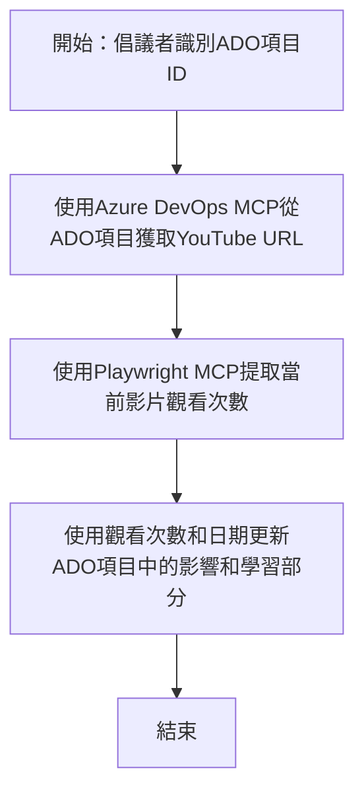

# 個案研究：使用 MCP 從 YouTube 數據更新 Azure DevOps 項目

> **免責聲明：** 市面上已有現成的線上工具和報告，可以自動化地使用像 YouTube 這樣的平台數據更新 Azure DevOps 項目。以下場景純粹作為示範用例，說明如何應用 MCP 工具進行自動化和整合任務。

## 概述

本個案研究示範如何使用模型上下文協議（MCP）及其工具，自動化從線上平台如 YouTube 擷取資訊並更新 Azure DevOps（ADO）工作項目的流程。所描述的場景僅是這些工具廣泛功能的一個例子，這些工具能被調整運用於類似的自動化需求。

在此範例中，一位倡導者使用 ADO 項目追蹤線上會議，每項目包含 YouTube 影片 URL。透過 MCP 工具，倡導者可以以可重複且自動的方式，將最新的影片指標（如觀看次數）更新至 ADO 項目。此方法可推廣至其他需要將線上資訊整合至 ADO 或其他系統的案例。

## 場景

一位倡導者負責追蹤線上會議和社群互動的影響力。每場會議皆記錄為 'DevRel' 專案中的 ADO 工作項目，此工作項目含有 YouTube 影片 URL 欄位。為正確報告會議的傳播範圍，倡導者需將 ADO 項目更新為最新的影片觀看數與資訊擷取日期。

## 使用工具

- [Azure DevOps MCP](https://github.com/microsoft/azure-devops-mcp)：透過 MCP 實現對 ADO 工作項目的程式化存取與更新。
- [Playwright MCP](https://github.com/microsoft/playwright-mcp)：自動化瀏覽器操作，擷取網頁（如 YouTube 影片統計）的即時資料。

## 逐步工作流程

1. **識別 ADO 項目**：從 'DevRel' 專案的 ADO 工作項目 ID（例如 1234）開始。
2. **擷取 YouTube URL**：使用 Azure DevOps MCP 工具從工作項目取得 YouTube URL。
3. **擷取觀看次數**：使用 Playwright MCP 工具瀏覽 YouTube URL，擷取影片當前觀看數。
4. **更新 ADO 項目**：使用 Azure DevOps MCP 工具，將最新觀看數和擷取日期寫入 ADO 工作項目的「影響與學習」區段。

## 範例提示

```bash
- Work with the ADO Item ID: 1234
- The project is '2025-Awesome'
- Get the YouTube URL for the ADO item
- Use Playwright to get the current views from the YouTube video
- Update the ADO item with the current video views and the updated date of the information
```

## Mermaid 流程圖


## 技術實作

- **MCP 協調**：此工作流程由 MCP 伺服器協調，整合 Azure DevOps MCP 與 Playwright MCP 工具的使用。
- **自動化**：流程可手動觸發，也可排定定期執行，以保持 ADO 項目資料最新。
- **可擴充性**：相同模式可擴展用以更新 ADO 項目其他線上指標（如點讚、評論）或其他平台數據。

## 成果與影響

- **效率**：減少倡導者的手動操作，自動擷取並更新影片指標。
- **準確性**：確保 ADO 項目反映線上來源的最新資料。
- **可重複性**：提供類似場景下，可重複使用的工作流程以整合其他數據來源或指標。

## 相關連結

- [Azure DevOps MCP](https://github.com/microsoft/azure-devops-mcp)
- [Playwright MCP](https://github.com/microsoft/playwright-mcp)
- [模型上下文協議（MCP）](https://modelcontextprotocol.io/)

## 接下來的步驟

- 返回：[個案研究總覽](./README.md)
- 下一步：[使用 MCP 的即時文件擷取](./docs-mcp/README.md)

---

<!-- CO-OP TRANSLATOR DISCLAIMER START -->
**免責聲明**：
本文件使用 AI 翻譯服務 [Co-op Translator](https://github.com/Azure/co-op-translator) 進行翻譯。雖然我們力求準確，但請注意，自動翻譯可能包含錯誤或不準確之處。原始文件的母語版本應被視為權威來源。對於重要資訊，建議採用專業人工翻譯。我們不對因使用此翻譯導致的任何誤解或誤釋負責。
<!-- CO-OP TRANSLATOR DISCLAIMER END -->