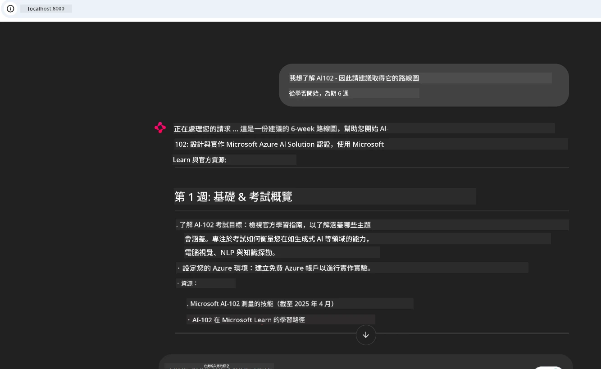
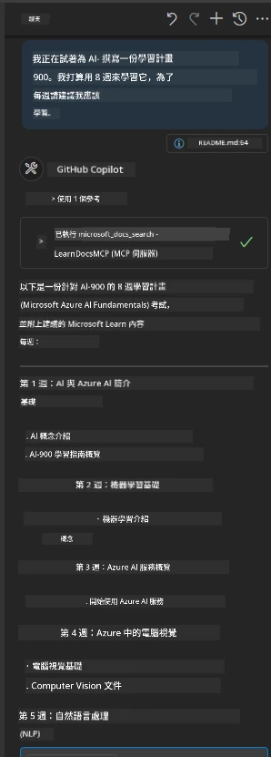

# 案例研究：從用戶端連接到 Microsoft Learn Docs MCP 伺服器

你是否曾同時切換在文件網站、Stack Overflow 與無數的搜尋引擎分頁之間，試圖解決程式碼中遇到的問題？也許你會專門準備第二個螢幕來看文件，或不停地在 IDE 和瀏覽器之間 Alt + Tab 切換。如果能將文件直接整合進你的工作流程——整合進你的應用程式、IDE，甚至是你自訂的工具，會不會更好？在本案例研究中，我們將探索如何從你自己的客戶端應用程式直接連接到 Microsoft Learn Docs MCP 伺服器，實現這樣的功能。

## 概述

現代開發不僅是寫程式碼——更是要在正確的時間取得正確的資訊。文件隨處可得，但很少會出現在你最需要的地方：你的工具和工作流程中。藉由將文件擷取功能直接整合進你的應用程式，你可以節省時間、減少切換上下文的頻率、提升生產力。在本節中，我們將示範如何連接客戶端到 Microsoft Learn Docs MCP 伺服器，讓你能夠在不離開應用程式的情況下取得即時且具上下文關聯性的文件。

我們會帶你一步步建立連線、發送請求，並有效處理串流回應。這種方法不僅簡化工作流程，也為打造更智能、更有幫助的開發者工具開啟了大門。

## 學習目標

為什麼要這樣做？因為最好的開發者體驗就是能消除阻礙。想像你的程式碼編輯器、聊天機器人或網頁應用能即時回答你的文件問題，並使用 Microsoft Learn 中的最新內容。讀完本章後，你將能夠：

- 了解用於文件的 MCP 伺服器與客戶端通訊基礎
- 實作一個用於連接 Microsoft Learn Docs MCP 伺服器的主控台或網頁應用程式
- 使用串流 HTTP 客戶端進行即時文件擷取
- 在應用程式中記錄與解析文件回應

你將知道如何建構不僅能被動回應，而是真正互動且具上下文感知的工具。

## 情境 1 - 使用 MCP 的即時文件擷取

此情境將示範如何連接客戶端到 Microsoft Learn Docs MCP 伺服器，讓你在不離開應用程式的狀況下，取得即時且具上下文感知的文件。

開始實作吧。你的任務是撰寫一個應用程式，連接到 Microsoft Learn Docs MCP 伺服器，呼叫 `microsoft_docs_search` 工具，並將串流回應記錄到主控台。

### 為什麼選擇這種方式？
因為它是打造更進階整合的基礎——無論你想為聊天機器人、IDE 延伸功能或是網頁儀表板供能。

你可在本案例研究的 [`solution`](./solution/README.md) 資料夾中找到此情境的程式碼與操作說明。步驟會指導你完成連線設定：
- 使用官方 MCP SDK 及可串流的 HTTP 客戶端連線
- 使用查詢參數呼叫 `microsoft_docs_search` 工具以擷取文件
- 實作適當的記錄與錯誤處理
- 建立互動式主控台介面，允許使用者輸入多重查詢

此情境示範動作包括：
- 連接至 Docs MCP 伺服器
- 發送查詢
- 解析並印出結果

以下是解決方案可能執行的樣貌：

```
Prompt> What is Azure Key Vault?
Answer> Azure Key Vault is a cloud service for securely storing and accessing secrets. ...
```

以下為最簡版本的範例解決方案。完整程式碼與細節請參考解決方案資料夾。

<details>
<summary>Python</summary>

```python
import asyncio
from mcp.client.streamable_http import streamablehttp_client
from mcp import ClientSession

async def main():
    async with streamablehttp_client("https://learn.microsoft.com/api/mcp") as (read_stream, write_stream, _):
        async with ClientSession(read_stream, write_stream) as session:
            await session.initialize()
            result = await session.call_tool("microsoft_docs_search", {"query": "Azure Functions best practices"})
            print(result.content)

if __name__ == "__main__":
    asyncio.run(main())
```

- 完整的實作與記錄請參考 [`scenario1.py`](../../../../09-CaseStudy/docs-mcp/solution/python/scenario1.py)。
- 安裝與使用說明請參考同資料夾中的 [`README.md`](./solution/python/README.md)。
</details>


## 情境 2 - 使用 MCP 的互動式學習計劃產生器網頁應用

在此情境中，你將學習如何將 Docs MCP 整合到網頁開發專案。目標是讓使用者能直接在網頁介面搜尋 Microsoft Learn 文件，讓文件即刻在應用程式或網站內可被取得。

你將學到如何：
- 設置網頁應用
- 連接到 Docs MCP 伺服器
- 處理使用者輸入並顯示結果

以下是解決方案可能執行的樣貌：

```
User> I want to learn about AI102 - so suggest the roadmap to get it started from learn for 6 weeks

Assistant> Here’s a detailed 6-week roadmap to start your preparation for the AI-102: Designing and Implementing a Microsoft Azure AI Solution certification, using official Microsoft resources and focusing on exam skills areas:

---
## Week 1: Introduction & Fundamentals
- **Understand the Exam**: Review the [AI-102 exam skills outline](https://learn.microsoft.com/en-us/credentials/certifications/exams/ai-102/).
- **Set up Azure**: Sign up for a free Azure account if you don't have one.
- **Learning Path**: [Introduction to Azure AI services](https://learn.microsoft.com/en-us/training/modules/intro-to-azure-ai/)
- **Focus**: Get familiar with Azure portal, AI capabilities, and necessary tools.

....more weeks of the roadmap...

Let me know if you want module-specific recommendations or need more customized weekly tasks!
```

以下為最簡版本的範例解決方案。完整程式碼與細節請參考解決方案資料夾。



<details>
<summary>Python (Chainlit)</summary>

Chainlit 是一個用於構建對話式 AI 網頁應用的框架。它使建立互動式聊天機器人和助理變得容易，能呼叫 MCP 工具並即時顯示結果。適合快速原型開發及用戶友善介面。

```python
import chainlit as cl
import requests

MCP_URL = "https://learn.microsoft.com/api/mcp"

@cl.on_message
def handle_message(message):
    query = {"question": message}
    response = requests.post(MCP_URL, json=query)
    if response.ok:
        result = response.json()
        cl.Message(content=result.get("answer", "No answer found.")).send()
    else:
        cl.Message(content="Error: " + response.text).send()
```

- 完整實作請參考 [`scenario2.py`](../../../../09-CaseStudy/docs-mcp/solution/python/scenario2.py)。
- 設定及執行說明請參考 [`README.md`](./solution/python/README.md)。
</details>


## 情境 3：在 VS Code 中透過 MCP 伺服器取得編輯器內文件

如果你想直接在 VS Code 中取得 Microsoft Learn Docs（而非切換到瀏覽器分頁），你可以於編輯器中使用 MCP 伺服器。這能讓你：
- 在 VS Code 中搜尋與閱讀文件，無需離開程式碼工作環境
- 直接參照文件並插入連結到 README 或課程檔
- 結合 GitHub Copilot 與 MCP，打造無縫的 AI 助力文件工作流程

**你將學會如何：**
- 在工作區根目錄新增有效的 `.vscode/mcp.json` 檔案（如下範例）。
- 開啟 MCP 面板或使用 VS Code 指令面板以搜尋並插入文件內容。
- 在編輯 Markdown 檔案時直接參考文件說明。
- 將此工作流程與 GitHub Copilot 結合以提升生產力。

以下為 VS Code 中設定 MCP 伺服器的範例：

```json
{
  "servers": {
    "LearnDocsMCP": {
      "url": "https://learn.microsoft.com/api/mcp"
    }
  }
}
```

</details>

> 詳細的逐步教學與截圖，請參閱 [`README.md`](./solution/scenario3/README.md)。



此方法非常適合正在建立技術課程、撰寫文件或經常查閱參考資料的開發者。

## 主要重點

將文件直接整合進工具中，不僅方便，更是提升生產力的關鍵。透過從客戶端連接到 Microsoft Learn Docs MCP 伺服器，你可以：

- 消除在程式碼與文件之間切換的阻礙
- 即時取得最新且具上下文感知的文件
- 建立更智能、更互動的開發者工具

這些技能將幫助你打造不僅高效，同時令人愉快使用的解決方案。

## 其他資源

為了加深理解，請探索以下官方資源：

- [Microsoft Learn Docs MCP Server (GitHub)](https://github.com/MicrosoftDocs/mcp)
- [使用 Azure MCP Server 入門 (mcp-python)](https://learn.microsoft.com/en-us/azure/developer/azure-mcp-server/get-started#create-the-python-app)
- [什麼是 Azure MCP Server？](https://learn.microsoft.com/en-us/azure/developer/azure-mcp-server/)
- [Model Context Protocol (MCP) 介紹](https://modelcontextprotocol.io/introduction)
- [從 MCP 伺服器新增插件（Python）](https://learn.microsoft.com/en-us/semantic-kernel/concepts/plugins/adding-mcp-plugins)

## 接下來的步驟

- 回到：[案例研究總覽](../README.md)
- 繼續前往：[模組 10：使用 AI Toolkit 精簡 AI 工作流程](../../10-StreamliningAIWorkflowsBuildingAnMCPServerWithAIToolkit/README.md)

---

<!-- CO-OP TRANSLATOR DISCLAIMER START -->
**免責聲明**：  
本文件由 AI 翻譯服務 [Co-op Translator](https://github.com/Azure/co-op-translator) 進行翻譯。雖然我們力求準確，但請注意自動翻譯可能包含錯誤或不準確之處。原始文件的原文版本應視為權威來源。對於重要資訊，建議尋求專業人工翻譯。我們不對因使用此翻譯而導致的任何誤解或誤譯承擔責任。
<!-- CO-OP TRANSLATOR DISCLAIMER END -->