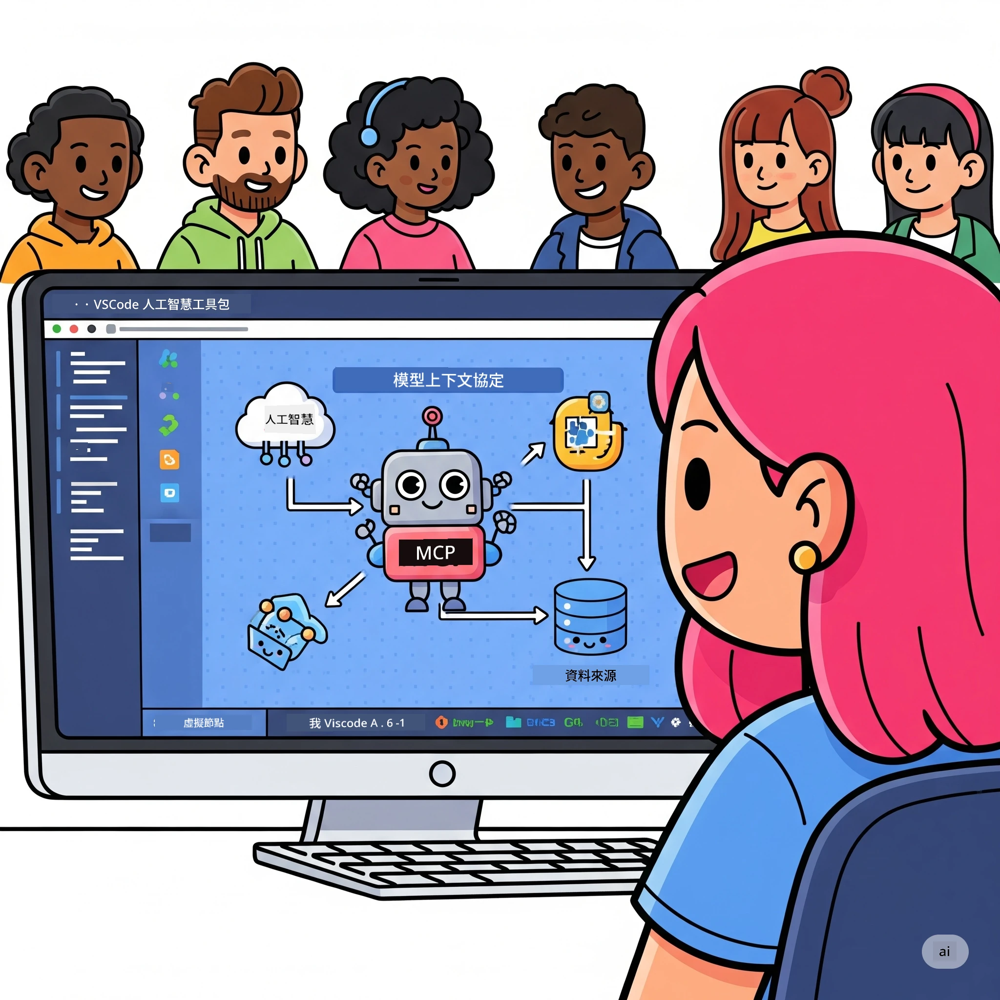
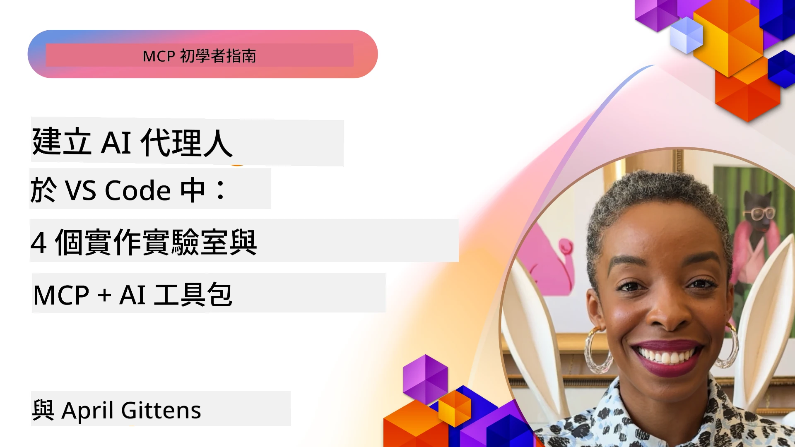

# 簡化 AI 工作流程：使用 AI Toolkit 建立 MCP 伺服器

## 🎯 概覽

_(點擊上方圖片觀看本課程影片)_

歡迎來到 **Model Context Protocol (MCP) 工作坊**！這個完整的實作工作坊結合了兩種最尖端技術，徹底改變 AI 應用開發：

- **🔗 Model Context Protocol (MCP)**：無縫 AI 工具整合的開放標準
- **🛠️ Visual Studio Code AI Toolkit (AITK)**：微軟強大的 AI 開發擴充套件

### 🎓 你將學到

完成本工作坊後，你將掌握打造智能應用的技巧，將 AI 模型與現實世界的工具和服務銜接起來。從自動化測試到客製化 API 整合，你將獲得解決複雜商業挑戰的實務技能。

## 🏗️ 技術堆疊

### 🔌 Model Context Protocol (MCP)

MCP 是 AI 的 **「USB-C」** — 一個連接 AI 模型與外部工具和資料來源的通用標準。

**✨ 主要特點：**

- 🔄 **標準化整合**：AI 與工具的通用界面
- 🏛️ **靈活架構**：支援本地及遠端伺服器，使用 stdio/SSE 傳輸
- 🧰 **豐富生態系**：工具、提示詞和資源整合於同一協定
- 🔒 **企業級**：內建安全性與可靠性

**🎯 MCP 的重要性：**  
就像 USB-C 解決混亂的連接線，MCP 簡化 AI 整合的複雜度。一個協定，無限可能。

### 🤖 Visual Studio Code AI Toolkit (AITK)

微軟的旗艦 AI 開發擴充功能，將 VS Code 轉變成 AI 強大工作站。

**🚀 核心功能：**

- 📦 **模型目錄**：存取 Azure AI、GitHub、Hugging Face、Ollama 等模型
- ⚡ **本地推理**：ONNX 最佳化的 CPU/GPU/NPU 執行
- 🏗️ **代理建構器**：視覺化 AI 代理開發並集成 MCP
- 🎭 **多模態支持**：文字、影像及結構化輸出

**💡 開發優勢：**

- 零設定模型部署
- 視覺化提示詞設計
- 即時測試遊樂場
- 無縫 MCP 伺服器整合

## 📚 學習旅程

### [🚀 模組 1：AI Toolkit 基礎](./lab1/README.md)

**時長**：15 分鐘

- 🛠️ 安裝與設定 VS Code AI Toolkit
- 🗂️ 探索模型目錄（超過 100 個來自 GitHub、ONNX、OpenAI、Anthropic、Google 的模型）
- 🎮 掌握交互式遊樂場，進行即時模型測試
- 🤖 使用代理建構器打造第一個 AI 代理
- 📊 利用內建指標評估模型表現（F1、相關性、相似度、一致性）
- ⚡ 學習批次處理與多模態支持功能

**🎯 學習成果**：建立功能完善的 AI 代理，全面理解 AITK 功能

### [🌐 模組 2：MCP 與 AI Toolkit 基礎](./lab2/README.md)

**時長**：20 分鐘

- 🧠 掌握 Model Context Protocol (MCP) 架構與概念
- 🌐 探索微軟 MCP 伺服器生態系
- 🤖 使用 Playwright MCP 伺服器建立瀏覽器自動化代理
- 🔧 結合 MCP 伺服器與 AI Toolkit 代理建構器
- 📊 在代理中配置並測試 MCP 工具
- 🚀 匯出並部署搭載 MCP 的 AI 代理於生產環境

**🎯 學習成果**：部署能夠透過外部工具強化的 AI 代理

### [🔧 模組 3：使用 AI Toolkit 進階 MCP 開發](./lab3/README.md)

**時長**：20 分鐘

- 💻 使用 AI Toolkit 建立自訂 MCP 伺服器
- 🐍 設定並使用最新 MCP Python SDK (v1.9.3)
- 🔍 安裝與使用 MCP 檢視器進行除錯
- 🛠️ 建置帶有專業除錯流程的天氣 MCP 伺服器
- 🧪 在代理建構器與檢視器中調試 MCP 伺服器

**🎯 學習成果**：運用現代工具開發與除錯自訂 MCP 伺服器

### [🐙 模組 4：實務 MCP 開發 - 客製化 GitHub Clone 伺服器](./lab4/README.md)

**時長**：30 分鐘

- 🏗️ 建立真實世界開發工作流程的 GitHub Clone MCP 伺服器
- 🔄 實作智能倉庫克隆，包含驗證與錯誤處理
- 📁 打造智慧目錄管理與 VS Code 整合
- 🤖 使用 GitHub Copilot 代理模式與自訂 MCP 工具
- 🛡️ 應用生產級可靠性與跨平台相容性

**🎯 學習成果**：部署實務且生產就緒的 MCP 伺服器，簡化真實開發流程

## 💡 真實世界應用與影響

### 🏢 企業用例

#### 🔄 DevOps 自動化

利用智慧自動化轉變開發流程：

- **智慧倉庫管理**：AI 驅動代碼審查與合併決策
- **智能 CI/CD**：依代碼變更自動優化流程
- **問題分派**：自動錯誤分類與指派

#### 🧪 品質保證革新

以 AI 驅動的自動化提升測試：

- **智慧測試生成**：自動建立完整測試套件
- **視覺回歸測試**：AI 支持的 UI 變動檢測
- **效能監控**：主動識別與解決問題

#### 📊 資料流程智慧化

建構更智慧的資料處理流程：

- **自適應 ETL 流程**：自我優化的資料轉換
- **異常檢測**：即時資料品質監控
- **智慧路由**：聰明的資料流管理

#### 🎧 客戶體驗提升

創造卓越的客戶互動：

- **情境感知支援**：AI 代理可存取客戶歷史紀錄
- **主動問題解決**：預測式客戶服務
- **多通路整合**：跨平台統一的 AI 體驗

## 🛠️ 預備條件與設定

### 💻 系統需求

| 元件 | 需求 | 備註 |
|-----------|-------------|-------|
| **作業系統** | Windows 10+、macOS 10.15+、Linux | 任一現代作業系統 |
| **Visual Studio Code** | 最新穩定版 | AITK 必備 |
| **Node.js** | v18.0+ 與 npm | 用於 MCP 伺服器開發 |
| **Python** | 3.10+ | Python MCP 伺服器選用 |
| **記憶體** | 最低 8GB RAM | 本地模型建議 16GB |

### 🔧 開發環境

#### 推薦 VS Code 擴充套件

- **AI Toolkit** (ms-windows-ai-studio.windows-ai-studio)
- **Python** (ms-python.python)
- **Python 除錯器** (ms-python.debugpy)
- **GitHub Copilot** (GitHub.copilot) - 選用但有幫助

#### 選用工具

- **uv**：現代 Python 套件管理器
- **MCP Inspector**：MCP 伺服器視覺化除錯工具
- **Playwright**：網頁自動化範例

## 🎖️ 學習成果與認證路徑

### 🏆 技能掌握檢查表

完成本工作坊，你將達成以下精通：

#### 🎯 核心能力

- [ ] **MCP 協議精通**：深入理解架構與實作模式
- [ ] **AITK 精通**：熟練運用 AI Toolkit 快速開發
- [ ] **自訂伺服器開發**：建置、部署及維護生產級 MCP 伺服器
- [ ] **工具整合卓越**：將 AI 無縫接軌現有開發流程
- [ ] **問題解決應用**：將技能運用於實際商業挑戰

#### 🔧 技術技能

- [ ] 設定及配置 VS Code 上的 AI Toolkit
- [ ] 設計與實作自訂 MCP 伺服器
- [ ] 整合 GitHub 模型與 MCP 架構
- [ ] 使用 Playwright 建立自動化測試流程
- [ ] 部署 AI 代理於生產環境
- [ ] 除錯與優化 MCP 伺服器效能

#### 🚀 進階能力

- [ ] 架構企業級 AI 整合方案
- [ ] 實踐 AI 應用的安全最佳實務
- [ ] 設計可擴展的 MCP 伺服器架構
- [ ] 創建特定領域的自訂工具鏈
- [ ] 指導他人進行 AI 本地化開發

## 📖 額外資源

- [MCP 規範 (2025-11-25)](https://spec.modelcontextprotocol.io/specification/2025-11-25/)
- [AI Toolkit GitHub 儲存庫](https://github.com/microsoft/vscode-ai-toolkit)
- [範例 MCP 伺服器集合](https://github.com/modelcontextprotocol/servers)
- [最佳實務指南](https://modelcontextprotocol.io/docs/best-practices)
- [OWASP MCP Top 10](https://microsoft.github.io/mcp-azure-security-guide/mcp/) - 安全最佳實務

---

**🚀 準備好革新你的 AI 開發工作流程了嗎？**

讓我們攜手利用 MCP 和 AI Toolkit 共創智能應用的未來！

## 接下來

繼續前往：[模組 11：MCP 伺服器實作工作坊](../11-MCPServerHandsOnLabs/README.md)

---

<!-- CO-OP TRANSLATOR DISCLAIMER START -->
**免責聲明**：  
本文件係使用 AI 翻譯服務 [Co-op Translator](https://github.com/Azure/co-op-translator) 所翻譯。雖然我們致力於準確性，但請注意，機器翻譯可能包含錯誤或不準確之處。原始文件的母語版本應視為權威來源。對於重要資訊，建議使用專業人工翻譯。我們不對因使用本翻譯而產生的任何誤解或誤釋負責。
<!-- CO-OP TRANSLATOR DISCLAIMER END -->