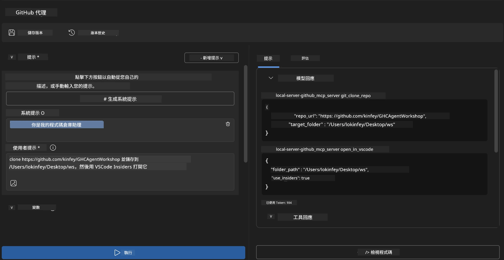
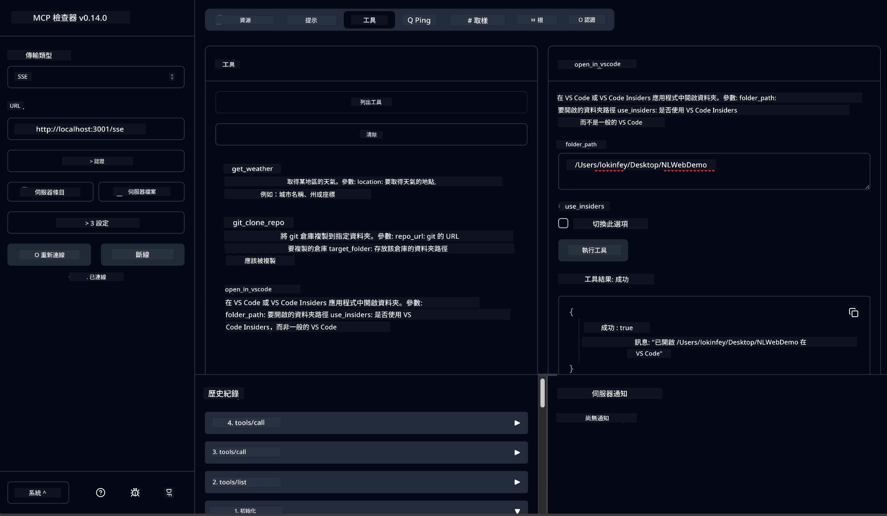

# 🐙 模組 4：實用 MCP 開發 - 自定義 GitHub 克隆伺服器


> **⚡ 快速開始：** 在 30 分鐘內建立一個生產就緒的 MCP 伺服器，自動化 GitHub 儲存庫克隆與 VS Code 整合！

## 🎯 學習目標

完成本實驗後，您將能夠：

- ✅ 為現實開發工作流程創建自定義 MCP 伺服器
- ✅ 通過 MCP 實現 GitHub 儲存庫克隆功能
- ✅ 整合自定義 MCP 伺服器與 VS Code 及 Agent Builder
- ✅ 使用 GitHub Copilot 代理模式搭配自定義 MCP 工具
- ✅ 在生產環境中測試和部署自定義 MCP 伺服器

## 📋 先決條件

- 完成本實驗室 1-3（MCP 基礎和進階開發）
- GitHub Copilot 訂閱（[可免費註冊](https://github.com/github-copilot/signup)）
- 安裝並啟用 AI Toolkit 和 GitHub Copilot 擴充的 VS Code
- 已配置好的 Git CLI

## 🏗️ 專案概覽

### **現實開發挑戰**
作為開發者，我們經常使用 GitHub 克隆儲存庫，並在 VS Code 或 VS Code Insiders 中打開。這個手動流程包含：
1. 開啟終端機或命令提示字元
2. 切換到目標目錄
3. 執行 `git clone` 命令
4. 在克隆的目錄中開啟 VS Code

**我們的 MCP 解決方案將此流程簡化為一條智慧命令！**

### **您將建立的內容**
一個提供以下功能的 **GitHub 克隆 MCP 伺服器** (`git_mcp_server`)：

| 功能 | 說明 | 好處 |
|---------|-------------|---------|
| 🔄 **智慧儲存庫克隆** | 帶驗證的 GitHub 儲存庫克隆 | 自動錯誤檢查 |
| 📁 **智慧目錄管理** | 安全檢查並建立目錄 | 避免覆蓋 |
| 🚀 **跨平台 VS Code 整合** | 在 VS Code/Insiders 中開啟專案 | 流程無縫銜接 |
| 🛡️ **健全的錯誤處理** | 處理網路、權限及路徑問題 | 生產就緒穩定性 |

---

## 📖 實作步驟詳解

### 第一步：在 Agent Builder 中建立 GitHub 代理

1. 透過 AI Toolkit 擴充啟動 Agent Builder
2. 使用以下配置 **建立新代理**：
   ```
   Agent Name: GitHubAgent
   ```

3. **初始化自定 MCP 伺服器：**
   - 進入 **Tools** → **Add Tool** → **MCP Server**
   - 選擇 **“Create A new MCP Server”**
   - 選擇 **Python 範本** 以獲得最大彈性
   - **伺服器名稱：** `git_mcp_server`

### 第二步：配置 GitHub Copilot 代理模式

1. 在 VS Code 開啟 GitHub Copilot（Ctrl/Cmd + Shift + P → "GitHub Copilot: Open"）
2. 在 Copilot 介面選擇代理模型
3. 選擇 Claude 3.7 模型以強化推理能力
4. 啟用 MCP 整合以訪問工具

> **💡 專家提示：** Claude 3.7 對開發工作流程與錯誤處理模式有優異理解。

### 第三步：實作核心 MCP 伺服器功能

**使用以下 GitHub Copilot 代理模式詳細提示：**

```
Create two MCP tools with the following comprehensive requirements:

🔧 TOOL A: clone_repository
Requirements:
- Clone any GitHub repository to a specified local folder
- Return the absolute path of the successfully cloned project
- Implement comprehensive validation:
  ✓ Check if target directory already exists (return error if exists)
  ✓ Validate GitHub URL format (https://github.com/user/repo)
  ✓ Verify git command availability (prompt installation if missing)
  ✓ Handle network connectivity issues
  ✓ Provide clear error messages for all failure scenarios

🚀 TOOL B: open_in_vscode
Requirements:
- Open specified folder in VS Code or VS Code Insiders
- Cross-platform compatibility (Windows/Linux/macOS)
- Use direct application launch (not terminal commands)
- Auto-detect available VS Code installations
- Handle cases where VS Code is not installed
- Provide user-friendly error messages

Additional Requirements:
- Follow MCP 1.9.3 best practices
- Include proper type hints and documentation
- Implement logging for debugging purposes
- Add input validation for all parameters
- Include comprehensive error handling
```

### 第四步：測試您的 MCP 伺服器

#### 4a. 在 Agent Builder 中測試

1. 啟動 Agent Builder 的除錯設定
2. 使用以下系統提示設定您的代理：

```
SYSTEM_PROMPT:
You are my intelligent coding repository assistant. You help developers efficiently clone GitHub repositories and set up their development environment. Always provide clear feedback about operations and handle errors gracefully.
```

3. 用真實使用者案例測試：

```
USER_PROMPT EXAMPLES:

Scenario : Basic Clone and Open
"Clone {Your GitHub Repo link such as https://github.com/kinfey/GHCAgentWorkshop
 } and save to {The global path you specify}, then open it with VS Code Insiders"
```



**預期結果：**
- ✅ 成功克隆並確認路徑
- ✅ 自動啟動 VS Code
- ✅ 針對無效情境顯示清晰錯誤訊息
- ✅ 正確處理邊緣情況

#### 4b. 在 MCP Inspector 中測試




---


**🎉 恭喜！** 您已成功建立一個實用、具生產力的 MCP 伺服器，解決真實開發工作流程問題。您的自定 GitHub 克隆伺服器展示了 MCP 在自動化與提升開發者生產力的強大力量。

### 🏆 成就解鎖：
- ✅ **MCP 開發者** - 建立自定 MCP 伺服器
- ✅ **工作流程自動化者** - 精簡開發流程  
- ✅ **整合專家** - 連接多種開發工具
- ✅ **生產就緒** - 架設可部署的解決方案

---

## 🎓 工作坊完成：您的 Model Context Protocol 旅程

**親愛的工作坊參與者，**

恭喜您完成 Model Context Protocol 工作坊的所有四個模組！您已從理解 AI Toolkit 基礎概念，逐步建立生產級 MCP 伺服器，解決真實世界開發挑戰。

### 🚀 您的學習軌跡回顧：

**[模組 1](../lab1/README.md)**：開始探索 AI Toolkit 基礎、模型測試與首個 AI 代理的建立。

**[模組 2](../lab2/README.md)**：學習 MCP 架構，整合 Playwright MCP，並打造第一個瀏覽器自動化代理。

**[模組 3](../lab3/README.md)**：進階至自定義 MCP 伺服器開發，使用 Weather MCP 伺服器並精通除錯工具。

**[模組 4](../lab4/README.md)**：將所學整合，建立一個實用的 GitHub 儲存庫工作流程自動化工具。

### 🌟 您已精通：

- ✅ **AI Toolkit 生態系統**：模型、代理及整合模式
- ✅ **MCP 架構**：用戶端-伺服器設計、傳輸協議與安全性
- ✅ **開發工具**：從 Playground 到 Inspector 再到生產環境部署
- ✅ **自定開發**：建立、測試及部署自有 MCP 伺服器
- ✅ **實務應用**：利用 AI 解決真實工作流程問題

### 🔮 您的下一步：

1. **建立您自己的 MCP 伺服器**：運用所學自動化您的獨特流程
2. **加入 MCP 社群**：分享您的創作並向他人學習
3. **探索進階整合**：將 MCP 伺服器連結企業系統
4. **參與開源貢獻**：協助改善 MCP 工具與文件

請記住，這個工作坊只是開始。Model Context Protocol 生態系快速演進，您已具備在 AI 助力開發工具領域領先的能力。

**感謝您的參與與學習投入！**

我們期待這個工作坊啟發您，改變您在開發旅程中如何構建並互動 AI 工具。

**祝您編碼愉快！**

---

## 接下來是

恭喜完成模組 10 所有實驗課程！

- 返回： [模組 10 概覽](../README.md)
- 繼續至：[模組 11：MCP 伺服器實作實驗](../../11-MCPServerHandsOnLabs/README.md)

---

<!-- CO-OP TRANSLATOR DISCLAIMER START -->
**免責聲明**：  
本文件係使用 AI 翻譯服務 [Co-op Translator](https://github.com/Azure/co-op-translator) 進行翻譯。雖然我們力求準確，但請注意自動翻譯可能包含錯誤或不準確之處。原始文件的母語版本應被視為權威來源。對於重要資訊，建議採用專業人工翻譯。我們不對因使用本翻譯內容所產生之任何誤解或誤譯承擔責任。
<!-- CO-OP TRANSLATOR DISCLAIMER END -->