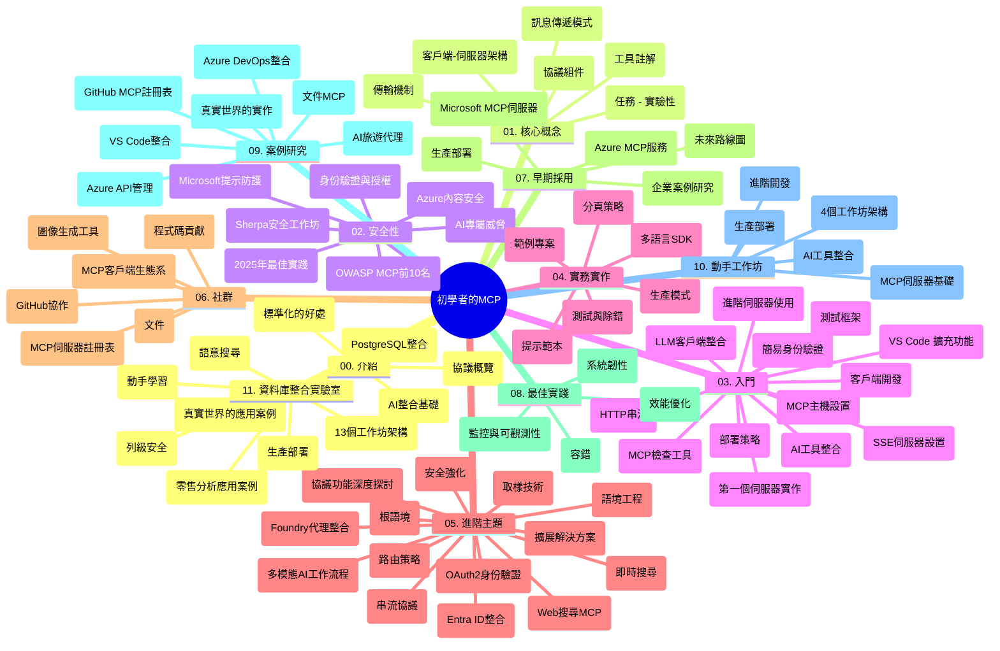

# 初學者模型上下文協議 (MCP) - 學習指南

本學習指南提供「初學者模型上下文協議 (MCP)」課程之倉儲結構與內容概覽。請使用此指南高效瀏覽倉儲並充分利用現有資源。

## 倉儲概覽

模型上下文協議 (MCP) 是 AI 模型與客戶端應用之間互動的標準化框架。MCP 最初由 Anthropic 創建，現由官方 GitHub 組織的廣泛 MCP 社群共同維護。本倉儲提供完整課程，附 C#、Java、JavaScript、Python 及 TypeScript 的實務程式碼範例，適合 AI 開發者、系統架構師及軟體工程師。

## 視覺課程地圖

## 倉儲結構

倉儲分為十一個主要部分，每部分聚焦 MCP 的不同面向：

1. **介紹 (00-Introduction/)**
   - 模型上下文協議概述
   - AI 流程中標準化的重要性
   - 實際應用案例與效益

2. **核心概念 (01-CoreConcepts/)**
   - 客戶端-伺服器架構
   - 協議關鍵元件
   - MCP 中的訊息模式

3. **安全性 (02-Security/)**
   - MCP 系統中的安全威脅
   - 安全實作最佳實務
   - 認證與授權策略
   - **完整安全文件**:
     - MCP 2025 年安全最佳實務
     - Azure 內容安全實作指南
     - MCP 安全控管與技術
     - MCP 最佳實務快速參考
   - **關鍵安全主題**：
     - 提示注入與工具中毒攻擊
     - 會話劫持與混淆代理問題
     - 令牌轉送漏洞
     - 過度權限與存取控制
     - AI 元件供應鏈安全
     - 微軟提示防護整合

4. **入門指南 (03-GettingStarted/)**
   - 環境設定與配置
   - 建立基本 MCP 伺服器與客戶端
   - 與現有應用整合
   - 包含主題：
     - 首個伺服器實作
     - 客戶端開發
     - 大型語言模型客戶端整合
     - VS Code 整合
     - 伺服器推送事件 (SSE) 伺服器
     - 進階伺服器使用
     - HTTP 串流
     - AI 工具套件整合
     - 測試策略
     - 部署指導

5. **實務實作 (04-PracticalImplementation/)**
   - 多程式語言 SDK 使用
   - 除錯、測試與驗證技巧
   - 製作可重用的提示模板及工作流程
   - 範例專案與實作案例

6. **進階主題 (05-AdvancedTopics/)**
   - 上下文工程技術
   - Foundry 代理整合
   - 多模態 AI 工作流程
   - OAuth2 認證示範
   - 即時搜尋功能
   - 即時串流
   - 根上下文實作
   - 路由策略
   - 取樣技術
   - 擴展方法
   - 安全考量
   - Entra ID 安全整合
   - 網路搜尋整合

7. **社群貢獻 (06-CommunityContributions/)**
   - 如何貢獻程式碼與文件
   - GitHub 協作流程
   - 社群驅動的改良與回饋
   - 使用多種 MCP 客戶端 (Claude Desktop、Cline、VSCode)
   - 與熱門 MCP 伺服器合作，包括圖像生成伺服器

8. **早期採用經驗 (07-LessonsfromEarlyAdoption/)**
   - 實務案例與成功故事
   - MCP 方案建置與部署
   - 趨勢與未來規劃
   - **微軟 MCP 伺服器指南**：涵蓋 10 個生產環境可用的微軟 MCP 伺服器，包括：
     - Microsoft Learn Docs MCP 伺服器
     - Azure MCP 伺服器（15+ 專用連接器）
     - GitHub MCP 伺服器
     - Azure DevOps MCP 伺服器
     - MarkItDown MCP 伺服器
     - SQL Server MCP 伺服器
     - Playwright MCP 伺服器
     - Dev Box MCP 伺服器
     - Azure AI Foundry MCP 伺服器
     - Microsoft 365 Agents Toolkit MCP 伺服器

9. **最佳實務 (08-BestPractices/)**
   - 效能調校與優化
   - 設計容錯 MCP 系統
   - 測試與韌性策略

10. **案例研究 (09-CaseStudy/)**
    - **七個全面案例研究** 展示 MCP 在多樣場景的彈性：
    - **Azure AI 旅遊代理**：使用 Azure OpenAI 與 AI 搜尋的多代理編排
    - **Azure DevOps 整合**：自動化工作流程及 YouTube 資料更新
    - **即時文件檢索**：Python 命令列客戶端搭配串流 HTTP
    - **互動學習計畫生成器**：Chainlit 網頁應用與對話式 AI
    - **編輯器內文件**：VS Code 與 GitHub Copilot 工作流程整合
    - **Azure API 管理**：企業 API 與 MCP 伺服器創建
    - **GitHub MCP 註冊中心**：生態系發展與代理平台整合
    - 實作示例涵蓋企業整合、開發人員生產力與生態系建設

11. **實務工作坊 (10-StreamliningAIWorkflowsBuildingAnMCPServerWithAIToolkit/)**
    - 結合 MCP 與 AI 工具套件的完整實務工作坊
    - 打造連結 AI 模型與現實工具的智慧應用程式
    - 實務模塊涵蓋基礎、客製化伺服器開發與生產部署策略
    - **實驗室結構**：
      - 實驗室 1：MCP 伺服器基礎
      - 實驗室 2：進階 MCP 伺服器開發
      - 實驗室 3：AI 工具套件整合
      - 實驗室 4：生產部署與擴展
    - 逐步指導的實驗室式學習方法

12. **MCP 伺服器資料庫整合實驗室 (11-MCPServerHandsOnLabs/)**
    - **完整 13 實驗室學習路徑**，以 PostgreSQL 整合打造生產級 MCP 伺服器
    - **真實零售分析案例**：以 Zava Retail 作業實例
    - **企業級模式** 包含列級安全 (RLS)、語義搜尋與多租戶資料存取
    - **完整實驗室結構**：
      - **實驗室 00-03：基礎** - 介紹、架構、安全、環境設定
      - **實驗室 04-06：建置 MCP 伺服器** - 資料庫設計、MCP 伺服器實作、工具開發
      - **實驗室 07-09：進階功能** - 語義搜尋、測試與除錯、VS Code 整合
      - **實驗室 10-12：生產與最佳實務** - 部署、監控、優化
    - **涵蓋技術**：FastMCP 框架、PostgreSQL、Azure OpenAI、Azure 容器應用、應用洞察
    - **學習成果**：生產級 MCP 伺服器、資料庫整合模式、AI 驅動分析、企業安全

## 附加資源

倉儲包含輔助資源：

- **Images 資料夾**：課程中使用的圖表與插圖
- **多語言翻譯**：文件自動多語言支援
- **官方 MCP 資源**：
  - [MCP 文件](https://modelcontextprotocol.io/)
  - [MCP 規格](https://spec.modelcontextprotocol.io/)
  - [MCP GitHub 倉儲](https://github.com/modelcontextprotocol)

## 如何使用此倉儲

1. **循序學習**：依序閱讀章節 (00 到 11)，享受有系統的學習體驗。
2. **語言專注**：針對特定程式語言，瀏覽相應 samples 目錄中的範例實作。
3. **實務操作**：從「入門指南」開始，設定環境並建立首個 MCP 伺服器與客戶端。
4. **進階探索**：熟悉基礎後，可深入進階主題擴展知識。
5. **社群互動**：透過 GitHub 討論與 Discord 頻道與專家和開發者交流。

## MCP 客戶端與工具

課程涵蓋多種 MCP 客戶端與工具：

1. **官方客戶端**：
   - Visual Studio Code
   - MCP Visual Studio Code 外掛
   - Claude 桌面版
   - Claude VSCode 外掛
   - Claude API

2. **社群客戶端**：
   - Cline（終端機版）
   - Cursor（程式碼編輯器）
   - ChatMCP
   - Windsurf

3. **MCP 管理工具**：
   - MCP CLI
   - MCP Manager
   - MCP Linker
   - MCP Router

## 熱門 MCP 伺服器

倉儲介紹多款 MCP 伺服器，包括：

1. **官方微軟 MCP 伺服器**：
   - Microsoft Learn Docs MCP 伺服器
   - Azure MCP 伺服器（15+ 專用連接器）
   - GitHub MCP 伺服器
   - Azure DevOps MCP 伺服器
   - MarkItDown MCP 伺服器
   - SQL Server MCP 伺服器
   - Playwright MCP 伺服器
   - Dev Box MCP 伺服器
   - Azure AI Foundry MCP 伺服器
   - Microsoft 365 Agents Toolkit MCP 伺服器

2. **官方參考伺服器**：
   - 文件系統
   - Fetch
   - 記憶體
   - 連續思考

3. **圖像生成**：
   - Azure OpenAI DALL-E 3
   - Stable Diffusion WebUI
   - Replicate

4. **開發工具**：
   - Git MCP
   - 終端控制
   - 程式碼助理

5. **專用伺服器**：
   - Salesforce
   - Microsoft Teams
   - Jira 與 Confluence

## 貢獻指南

本倉儲歡迎社群貢獻。請參閱「社群貢獻」章節了解如何有效參與 MCP 生態系。

----

*本學習指南最後更新於 2026 年 2 月 5 日，反映最新 MCP 規格 2025-11-25，並提供該日期的倉儲概覽。倉儲內容可能在此日期後持續更新。*

---

<!-- CO-OP TRANSLATOR DISCLAIMER START -->
**免責聲明**：
本文件是使用 AI 翻譯服務 [Co-op Translator](https://github.com/Azure/co-op-translator) 進行翻譯的。雖然我們力求準確，但請注意自動翻譯可能包含錯誤或不準確之處。原文文件應視為具權威性的資料來源。對於重要資訊，建議採用專業人工翻譯。本公司不對因使用本翻譯所產生的任何誤解或誤釋負責。
<!-- CO-OP TRANSLATOR DISCLAIMER END -->